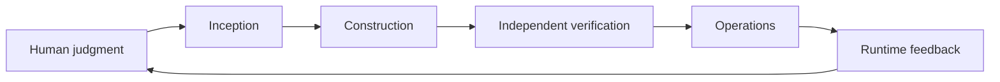

<p align="center">
  
</p>

<h1 align="center">Deep Understanding AI-DLC</h1>

<p align="center">
  <strong>Open-source AI-DLC book for deterministic, team-scale software delivery.</strong>
</p>

<p align="center">
  <a href="README.md"><strong>中文 README</strong></a>
</p>

<p align="center">
  <a href="https://github.com/mancbj/aidlc-book-baojun/actions/workflows/validate.yml"></a>
  <a href="https://github.com/mancbj/aidlc-book-baojun/releases/latest"></a>
  <a href="LICENSE"></a>
  <a href="https://github.com/mancbj/aidlc-book-baojun/stargazers"></a>
  <a href="https://github.com/mancbj/aidlc-book-baojun/commits/main"></a>
</p>

AI can generate code quickly, but speed alone does not make delivery correct, auditable, or recoverable. This book is for engineering leaders, architects, and senior developers who are upgrading AI from a personal assistant into team-scale engineering capability. It provides a full **Inception → Construction → Operations** method, 30 reproducible experiments, and continuous verification.

<p align="center">
  <a href="#get-started-in-3-minutes"><strong>Start reading</strong></a>
  ·
  <a href="https://mancbj.github.io/aidlc-book-baojun/book-site/index.html"><strong>Online reader (Pages)</strong></a>
  ·
  <a href="https://github.com/mancbj/aidlc-book-baojun/releases/latest"><strong>Download latest release</strong></a>
  ·
  <a href="https://mancbj.github.io/aidlc-book-baojun/site/index.html"><strong>Open project dashboard</strong></a>
</p>

<p align="center">
  <a href="https://github.com/mancbj/aidlc-book-baojun">
    
  </a>
</p>

## Get started in 3 minutes

### Read only

1. Open the **[Carbon reader](https://mancbj.github.io/aidlc-book-baojun/book-site/index.html)** (GitHub Pages; build hash aligned with Release as of v0.9.008—do not use repo-relative `book-site/` links on github.com; they open raw HTML source).
2. Spend 10 minutes on [Part 00 · AI-DLC overview](book/en/part-00-overview.md) or the [Chinese Part 00](book/part-00-overview.md).
3. Download PDF or HTML from the [latest release](https://github.com/mancbj/aidlc-book-baojun/releases/latest) (from **v0.9.005**, zh/en HTML + PDF — four files; English full book since **v0.9.004**).
4. Pick a path in the [reader guide](docs/READER-GUIDE.md): leader, system designer, or hands-on practitioner.

### Reproduce experiments or contribute

Requires Python 3.10+. No database or remote service required.

English book spine (Part 0): see [Book locales](docs/BOOK-LOCALES.md) and `python3 scripts/build_book.py --locale en`.

Full English chapters ship in **v0.9.004**; build with `python3 scripts/build_release_book.py --locale en --format all`.

```bash
git clone https://github.com/mancbj/aidlc-book-baojun.git
cd aidlc-book-baojun
python3 experiments/exp-01-01/quickstart.py --sample
python3 scripts/ci_check.py --budget-seconds 60
```

## Official sources and two paths

`𝓔 = Engineering with Exsecutio` is **this book’s explanatory framework**. AWS’s published AI-DLC method definition and the community **aidlc-workflows** repo are **alignable method sources and operational references**—not interchangeable with the book framework.

| Source | Role | Link |
| --- | --- | --- |
| AWS AI-DLC method definition (whitepaper SPA) | Ten principles, Intent/Unit/Bolt, three phases, Green/Brown-field walkthroughs | [Amplify entry](https://prod.d13rzhkk8cj2z0.amplifyapp.com) |
| AWS DevOps blog post | AI-Driven positioning, Mob rituals, persisted artifacts, adoption pointers | [AI-Driven Development Life Cycle](https://aws.amazon.com/cn/blogs/devops/ai-driven-development-life-cycle/) |
| aidlc-workflows | Question→Doc→Approval, phase gates, two-phase Construction | [WORKING-WITH-AIDLC.md](https://github.com/mancbj/aidlc-workflows/blob/main/docs/WORKING-WITH-AIDLC.md) |

**Read the book**: start with [Part 00](book/part-00-overview.md) and the [table of contents](book/toc.md); download PDF/HTML from the [latest release](https://github.com/mancbj/aidlc-book-baojun/releases/latest).

**Run a workflow**: follow [WORKING-WITH-AIDLC](https://github.com/mancbj/aidlc-workflows/blob/main/docs/WORKING-WITH-AIDLC.md) in your repo; Chapters 3–6 plus the [operation map](docs/WORKING-WITH-AIDLC-MAP.md) connect concepts to that guide.

<details>
<summary><strong>Terminology quick reference</strong></summary>

| Term | One line |
| --- | --- |
| **Intent** | High-level purpose statement—not an implementation plan |
| **Unit** | Independently deliverable, loosely coupled capability block |
| **Bolt** | Hours-to-days iteration unit (AI-era rename of the Sprint idea) |
| **Mob Elaboration** | Inception ritual: shared screen; AI proposes decomposition; mob validates |
| **Question–Doc–Approval** | Clarify → persist in markdown → human approval before execution |

</details>

## What you get

- **Stop treating one generation as delivery** — build evidence chains with independent verification, fix–retest loops, and walkthroughs.
- **Stop letting AI guess goals and boundaries** — connect Intent, Requirements, Stories, and human judgment points.
- **Stop recovering context from chat logs** — use Memory Bank, Standards, and versioned fact sources.
- **Stop using one process for every task** — choose Simple, FIRE, or AI-DLC by complexity, risk, and reversibility.
- **More than methodology talk** — 30 experiments with contract tests, sample outputs, and explicit evidence bounds.
- **Do not stop before deploy** — close the loop with Build, Deploy, Runtime Verify, Monitor, and recovery.

## Core formula

> **AI-DLC = 𝓔 (human judgment + AI capability)**  
> **𝓔 = Engineering with Exsecutio**

In one line: **humans set direction, AI adds acceleration, engineering execution ensures delivery.**

Exsecutio means carrying proposals through to completion: pushing probabilistic AI output along an engineering path into systems that are verifiable, reproducible, traceable, recoverable, and evolvable. See the [manifesto](book/manifesto.md) for scope and boundaries.

## Lifecycle and reading paths



| If you are… | Suggested path | You will address |
| --- | --- | --- |
| Engineering leader / manager | Part 0 → Ch. 1, 2, 9, 10 | Accountability, flow choice, org metrics |
| Architect / platform owner | Part 0 → Ch. 3–8 | Context, execution, verification, operations |
| Practitioner running a minimal loop | Part 0 → Ch. 3, 4, 5, 6, 7, 8 | Intent to verified, runnable delivery |

<details>
<summary><strong>Full structure (Part 0 + 10 chapters)</strong></summary>

| Part | Content |
| --- | --- |
| Part 0 · Overview | Core formula, lifecycle, reading map |
| Part 1 · Human judgment | Ch. 1–2: SDLC rethink, accountability, reverse dialogue |
| Part 2 · AI capability | Ch. 3–4: Inception, Memory Bank, Standards |
| Part 3 · Engineering × Exsecutio | Ch. 5–6: Bolt selection and execution loop |
| Part 4 · Verification feedback | Ch. 7–8: Independent verification and Operations |
| Part 5 · Scale | Ch. 9–10: Adaptive engineering, organization, metrics |

</details>

Each chapter has one core question, reader outcomes, experiments, and evidence bounds. See the [full table of contents](book/toc.md) and [reader guide](docs/READER-GUIDE.md).

## Experiments and evidence

Claims that affect practice must be backed by runnable experiments, pinned external references, figures, or reader exercises. All **30 experiments are `verified`** and run through unified contract tests:

- **18 × SHIP** — minimal runnable implementations in this repository.
- **10 × KEEP-EXT** — pinned external references with explicit evidence bounds.
- **2 × ALREADY** — reuse of existing, verifiable implementations in the repo.

Each experiment states what it proves and what it does not prove. See [experiment facts](progress/experiments.json), [triage rules](EXPERIMENT_TRIAGE.md), and [sample outputs](experiments/).

## Current status

| Signal | Current fact | View |
| --- | --- | --- |
| Book manuscript | Part 0 + 10 chapters | [Book tree](book/) |
| Chapter pipeline | 10 / 10 six-stage complete | [Chapter facts](progress/chapters.json) |
| Reproducible experiments | 30 / 30 verified | [Experiment facts](progress/experiments.json) |
| Automation gates | facts, tests, links, generation, experiment contracts | [CI workflow](.github/workflows/validate.yml) |
| Downloadable builds | PDF, single-page HTML, site zip | [Latest release](https://github.com/mancbj/aidlc-book-baojun/releases/latest) |

Completion rates are not edited by hand in this README. Authoritative numbers come from versioned fact sources and project to the [dashboard](https://mancbj.github.io/aidlc-book-baojun/site/index.html), [detail drill-down](https://mancbj.github.io/aidlc-book-baojun/site/details.html), and [text summary](progress/generated/current.md). See the [repository guide](docs/REPOSITORY-GUIDE.md).

## Maintainer verification

After changing manuscript, experiments, or fact sources, run in order:

```bash
python3 scripts/validate_project.py
python3 scripts/generate_progress.py --dry-run --actor readme
python3 scripts/ci_check.py --budget-seconds 60
```

Full CI checks fact consistency, unit tests, all 30 experiment contracts, internal links, and generated projections.

## AI Agent / Cursor usage

This README, Part 0, and machine-readable fact sources give agents a structured entry point. In Cursor, Claude Code, or other repo-level agents:

```text
Read @README.en.md and @book/part-00-overview.md,
summarize current status from @progress/generated/current.json,
then suggest a reading path or a reproducible experiment.
```

For contributions, also load [`docs/REPOSITORY-GUIDE.md`](docs/REPOSITORY-GUIDE.md) and [`docs/GITHUB-COLLABORATION.md`](docs/GITHUB-COLLABORATION.md), and run full CI before opening a PR.

## Contributing

Corrections to prose, experiment reproduction, diagrams, and automation are welcome. Read [collaboration docs](docs/GITHUB-COLLABORATION.md), use [Issue templates](.github/ISSUE_TEMPLATE/) or the [Pull Request template](.github/pull_request_template.md), and include Task ID, artifacts, and verification results.

## Community and support

- **Reading feedback** — [Feedback issue](.github/ISSUE_TEMPLATE/feedback.yml) for clarity, paths, or exercises.
- **Content and experiments** — [Writing](.github/ISSUE_TEMPLATE/writing.yml) or [experiment](.github/ISSUE_TEMPLATE/experiment.yml) issues.
- **Build problems** — [Bug issue](.github/ISSUE_TEMPLATE/bug.yml) for build, dashboard, or automation failures.
- **Stay updated** — [Star the repo](https://github.com/mancbj/aidlc-book-baojun) and watch [releases](https://github.com/mancbj/aidlc-book-baojun/releases/latest).

## License

This project is licensed under the [Apache License 2.0](LICENSE). Copyright `Copyright 2026 mancbj`. You may use, modify, and distribute under the license terms; retain the license and required notices. Third-party materials with separate licenses remain under their original terms.

## Acknowledgments

Two upstream projects helped early on:

1. **[ai-agent-book](https://github.com/bojieli/ai-agent-book)** — reference for writing an open-source book.
2. **[specs.md](https://specs.md)** — AI-DLC skills and methodology that supported planning and the first readable release (`v0.2`).

<details>
<summary><strong>Research, fact sources, and security boundaries</strong></summary>

- External references are not automatic conclusions or build dependencies; verify claims at the source.
- GitHub Issues and Projects are collaboration projections and must not silently overwrite repository fact sources.
- Do not commit tokens, cookies, API keys, `.env`, personal contact data, or private text without permission.
- See [repository guide](docs/REPOSITORY-GUIDE.md) and [progress automation](docs/PROGRESS-AUTOMATION.md).

</details>

## Star History

[](https://star-history.com/#mancbj/aidlc-book-baojun&Date)

---

**The goal of AI-DLC is not to generate faster, but to deliver correctly, faster.**
