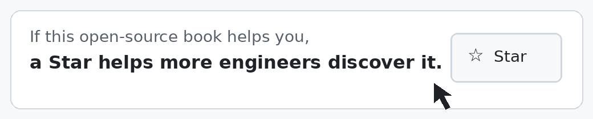
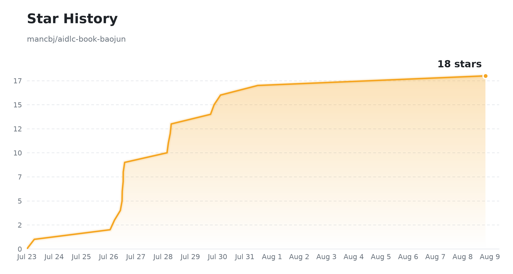

<p align="center">
  
</p>

<h1 align="center">深入理解 AI-DLC</h1>

<p align="center">
  <strong>Open-source AI-DLC book for deterministic, team-scale software delivery.</strong><br>
  从概率智能到确定性交付：面向研发团队的 AI-DLC 开源工程书。
</p>

<p align="center">
  <a href="README.en.md"><strong>English README</strong></a>
</p>

<p align="center">
  <a href="https://github.com/mancbj/aidlc-book-baojun/actions/workflows/validate.yml"></a>
  <a href="https://github.com/mancbj/aidlc-book-baojun/releases/latest"></a>
  <a href="LICENSE"></a>
  <a href="https://github.com/mancbj/aidlc-book-baojun/stargazers"></a>
  <a href="https://github.com/mancbj/aidlc-book-baojun/commits/main"></a>
</p>

AI 可以快速生成代码，却不会自动带来正确、可审计、可恢复的交付。本书面向正在把 AI 从个人助手升级为团队级工程能力的研发负责人、架构师和资深开发者，给出从 **Inception → Construction → Operations** 的完整方法、30 项可复现实验与持续验证机制。

AI can generate code quickly, but speed alone does not make delivery correct, auditable, or recoverable. This book turns AI-assisted development into an engineering lifecycle with explicit human judgment, executable evidence, and production feedback.

<p align="center">
  <a href="#3-分钟开始"><strong>立即开始阅读</strong></a>
  ·
  <a href="https://mancbj.github.io/aidlc-book-baojun/book-site/index.html"><strong>在线可视化阅读（Pages）</strong></a>
  ·
  <a href="https://github.com/mancbj/aidlc-book-baojun/releases/latest"><strong>下载最新版</strong></a>
  ·
  <a href="https://mancbj.github.io/aidlc-book-baojun/site/index.html"><strong>查看项目驾驶舱</strong></a>
</p>

<p align="center">
  <a href="https://github.com/mancbj/aidlc-book-baojun">
    
  </a>
</p>

## 最新版下载

<!-- RELEASE-DOWNLOADS-BEGIN -->
当前版本：**[v0.9.006](https://github.com/mancbj/aidlc-book-baojun/releases/tag/v0.9.006)** · [查看全部 Release 资产](https://github.com/mancbj/aidlc-book-baojun/releases/latest)

| 语言 | PDF | 单页 HTML | Markdown 全书 |
| --- | --- | --- | --- |
| 中文 | [下载](https://github.com/mancbj/aidlc-book-baojun/releases/download/v0.9.006/aidlc-book-v0.9.006.pdf) | [下载](https://github.com/mancbj/aidlc-book-baojun/releases/download/v0.9.006/aidlc-book-v0.9.006-book.html) | [下载](https://github.com/mancbj/aidlc-book-baojun/releases/download/v0.9.006/aidlc-book-v0.9.006-book.md) |
| English | [Download](https://github.com/mancbj/aidlc-book-baojun/releases/download/v0.9.006/aidlc-book-v0.9.006-en.pdf) | [Download](https://github.com/mancbj/aidlc-book-baojun/releases/download/v0.9.006/aidlc-book-v0.9.006-en-book.html) | [Download](https://github.com/mancbj/aidlc-book-baojun/releases/download/v0.9.006/aidlc-book-v0.9.006-en-book.md) |
<!-- RELEASE-DOWNLOADS-END -->

<a id="3-分钟开始"></a>
<details>
<summary><strong>3 分钟开始</strong></summary>

<details>
<summary><strong>只想读书</strong></summary>

1. 打开 **[可视化阅读站](https://mancbj.github.io/aidlc-book-baojun/book-site/index.html)**（GitHub Pages 默认可浏览面；勿在仓库页点相对路径 `book-site/`，会显示 HTML 源码）。
2. 用 10 分钟阅读 [Part 00 · 鸟瞰 AI-DLC](book/part-00-overview.md)。
3. 离线阅读请用上方 **[最新版下载](#最新版下载)** 表格中的 PDF / HTML / Markdown。
4. 按你的目标选择[管理者、研发系统设计者或实践者路线](docs/READER-GUIDE.md)。

</details>

<details>
<summary><strong>想复现实验或参与写作</strong></summary>

需要 Python 3.10+；无需数据库或远程服务。

```bash
git clone https://github.com/mancbj/aidlc-book-baojun.git
cd aidlc-book-baojun
python3 experiments/exp-01-01/quickstart.py --sample
python3 scripts/ci_check.py --budget-seconds 60
```

</details>

</details>

<details>
<summary><strong>官方来源与两条路径</strong></summary>

本书的 `𝓔 = Engineering with Exsecutio` 是**解释框架**；AWS 公布的 AI-DLC 方法定义与社区 workflow 是**可对齐的方法来源与操作参考**，三者不应混为一谈。

| 来源 | 用途 | 链接 |
| --- | --- | --- |
| AWS AI-DLC 方法定义（白皮书 SPA） | 十条原则、Intent/Unit/Bolt、三阶段仪式、Green/Brown-field  walkthrough | [Amplify 入口](https://prod.d13rzhkk8cj2z0.amplifyapp.com) |
| AWS DevOps 博文 | 中文语境下的 AI-Driven 定位、Mob、持久化工件与 adoption 入口 | [AI-Driven Development Life Cycle](https://aws.amazon.com/cn/blogs/devops/ai-driven-development-life-cycle/) |
| aidlc-workflows | Question→Doc→Approval、阶段门控、Construction 两段式等**操作级**约定 | [WORKING-WITH-AIDLC.md](https://github.com/mancbj/aidlc-workflows/blob/main/docs/WORKING-WITH-AIDLC.md) |

**读书**：从 [Part 00](book/part-00-overview.md) 与 [目录](book/toc.md) 进入十章；离线包见 **[最新版下载](#最新版下载)**。

**跑 workflow**：在真实仓库里按 [WORKING-WITH-AIDLC](https://github.com/mancbj/aidlc-workflows/blob/main/docs/WORKING-WITH-AIDLC.md) 组织 `aidlc-docs/` 与门控；本书第 3–6 章与[操作映射表](docs/WORKING-WITH-AIDLC-MAP.md)说明概念如何落到该指南。

<details>
<summary><strong>术语快查（与 AWS / specs.md 对齐）</strong></summary>

| 术语 | 一句话 |
| --- | --- |
| **Intent** | 高层目的陈述，是 AI 分解的起点，不是实现方案 |
| **Unit** | 可独立交付、松耦合的能力块（类似 DDD 子域或 Epic） |
| **Bolt** | 小时到天级迭代单元，对应传统 Sprint 的 AI 时代重命名 |
| **Mob Elaboration** | Inception 仪式：同室共屏，AI 先提议分解，mob 验证与修正 |
| **Question–Doc–Approval** | 先澄清→写入 md 工件→人批准后再执行，避免「Vibe Code」 |

</details>

</details>

## 你会得到什么

- **不再把一次生成当成交付** —— 用独立验证、失败—修复—复测和 Walkthrough 形成证据链。
- **不再让 AI 猜目标和边界** —— 把 Intent、Requirements、Stories 与人的判断点连接起来。
- **不再靠聊天记录恢复上下文** —— 用 Memory Bank、Standards 和版本化事实源接续工作。
- **不再用同一种流程处理所有任务** —— 按复杂度、风险和可逆性选择 Simple、FIRE 或 AI-DLC。
- **不止讨论方法论** —— 30 项实验均有确定性合同测试、样例输出与明确的证据边界。
- **不在部署前结束** —— 把 Build、Deploy、Runtime Verify、Monitor 和恢复纳入交付闭环。

## 核心公式

> **AI-DLC = 𝓔（人的判断 + AI 能力）**  
> **𝓔 = Engineering with Exsecutio**

一句话复述：**人定方向，AI 加速度，工程化执行保交付。**

这里的 Exsecutio 表达“贯彻到底”：将 AI 的概率性生成沿工程路径持续推进，转化为可验证、可复现、可追溯、可恢复并可持续演进的软件系统。完整解释与范围边界见[核心宣言](book/manifesto.md)。

## 生命周期与阅读路径


| 如果你是… | 建议路径 | 你将解决 |
| --- | --- | --- |
| 研发负责人 / 管理者 | Part 0 → 第 1、2、9、10 章 | 责任边界、Flow 选型、组织与度量 |
| 架构师 / 平台负责人 | Part 0 → 第 3–8 章 | 上下文、执行、验证与运行闭环 |
| 想跑最小闭环的实践者 | Part 0 → 第 3、4、5、6、7、8 章 | 从 Intent 到可验证、可运行交付 |

<details>
<summary><strong>展开全书结构（Part 0 + 10 章）</strong></summary>

| 部分 | 内容 |
| --- | --- |
| Part 0 · 鸟瞰 | 核心公式、生命周期和阅读地图 |
| Part 1 · 人的判断 | 第 1–2 章：SDLC 重构、人的责任与反向对话 |
| Part 2 · AI 能力 | 第 3–4 章：Inception、Memory Bank 与 Standards |
| Part 3 · Engineering × Exsecutio | 第 5–6 章：Bolt 选型与执行闭环 |
| Part 4 · 验证反馈 | 第 7–8 章：独立验证与 Operations |
| Part 5 · 规模化 | 第 9–10 章：适配性工程、组织与度量 |

</details>

每章都有唯一问题、读者结果、实验和证据边界。详见[完整目录](book/toc.md)与[读者指南](docs/READER-GUIDE.md)。

<details>
<summary><strong>实验与证据</strong></summary>

本书不是只靠观点成立。当前 30 项实验均为 `verified`，并进入统一合同测试：

- **18 × SHIP** —— 仓库内提供最小可运行实现。
- **10 × KEEP-EXT** —— 对外部参考固定版本、配置与证据边界。
- **2 × ALREADY** —— 复用仓库中已存在且可验证的实现。

每项实验都说明“证明什么”与“不能证明什么”，避免把冻结样例、外部参考或模型评审写成普遍结论。查看[实验事实源](progress/experiments.json)、[治理规则](EXPERIMENT_TRIAGE.md)与[样例输出](experiments/)。

</details>

<details>
<summary><strong>当前状态</strong></summary>

| 信号 | 当前事实 | 查看 |
| --- | --- | --- |
| 正式书稿 | Part 0 + 10 章 | [书稿目录](book/) |
| 章节生产线 | 10 / 10 完成六阶段 | [章节事实](progress/chapters.json) |
| 可复现实验 | 30 / 30 verified | [实验事实](progress/experiments.json) |
| 自动化门禁 | facts、tests、links、generation、实验合同 | [CI workflow](.github/workflows/validate.yml) |
| 可下载版本 | PDF、HTML、Markdown、站点 zip | [最新版下载](#最新版下载) |

完成率不在 README 手工维护；权威数字来自版本化事实源并投影到[鸟瞰驾驶舱](https://mancbj.github.io/aidlc-book-baojun/site/index.html)、[对象下钻](https://mancbj.github.io/aidlc-book-baojun/site/details.html)和[文字摘要](progress/generated/current.md)。事实源边界见[仓库指南](docs/REPOSITORY-GUIDE.md)。

</details>

<details>
<summary><strong>维护者验证</strong></summary>

修改书稿、实验或事实源后，按以下顺序验证：

```bash
python3 scripts/validate_project.py
python3 scripts/generate_progress.py --dry-run --actor readme
python3 scripts/ci_check.py --budget-seconds 60
```

完整门禁会检查事实一致性、单元测试、30 项实验合同、内部链接和生成投影。

</details>

<details>
<summary><strong>AI Agent / Cursor 使用</strong></summary>

README、Part 0 和机器可读事实源为 AI Agent 提供了结构化入口。在 Cursor、Claude Code 或其他仓库级 Agent 中，可以直接使用：

```text
阅读 @README.md 与 @book/part-00-overview.md，
根据 @progress/generated/current.json 说明项目当前状态，
再为我选择一条阅读路径或一个可复现实验。
```

若要贡献代码或书稿，继续要求 Agent 读取 [`docs/REPOSITORY-GUIDE.md`](docs/REPOSITORY-GUIDE.md) 和 [`docs/GITHUB-COLLABORATION.md`](docs/GITHUB-COLLABORATION.md)，并在提交前运行完整 CI。结构化标题、表格、命令与 JSON 事实源也便于 AI 系统准确引用，而不需要猜测项目状态。

</details>

## 贡献

欢迎修正文稿、复现实验、改进图示或完善自动化。提交前请阅读[协作说明](docs/GITHUB-COLLABORATION.md)，使用仓库的 [Issue 模板](.github/ISSUE_TEMPLATE/)或 [Pull Request 模板](.github/pull_request_template.md)，并附上 Task ID、产物和验证结果。

## 社区与支持

- **阅读反馈** —— 使用[反馈 Issue](.github/ISSUE_TEMPLATE/feedback.yml)报告理解障碍、阅读路径或练习体验。
- **内容与实验** —— 使用[写作 Issue](.github/ISSUE_TEMPLATE/writing.yml)或[实验 Issue](.github/ISSUE_TEMPLATE/experiment.yml)提出改进。
- **构建问题** —— 使用 [Bug Issue](.github/ISSUE_TEMPLATE/bug.yml)报告构建、Dashboard 或自动化故障。
- **持续关注** —— [Star 本仓库](https://github.com/mancbj/aidlc-book-baojun)并查看[最新 Release](https://github.com/mancbj/aidlc-book-baojun/releases/latest)。

## 许可

本项目采用 [Apache License 2.0](LICENSE)，版权声明为 `Copyright 2026 mancbj`。你可以在许可证条款下使用、修改和分发本项目内容；请保留许可证与必要声明。仓库中另有来源或单独许可说明的第三方材料，仍以其原始许可条款为准。

## 致谢

本开源书在起步阶段受益于两个先行项目，特此致谢：

1. **[ai-agent-book](https://github.com/bojieli/ai-agent-book)** —— 为如何写一本开源书提供了高度参考与借鉴。
2. **[specs.md](https://specs.md)** —— 其 skill 与 AI-DLC 方法论，为本项目的计划与初版（`v0.2` 完成）提供了理论与实践支持。

<details>
<summary><strong>研究、事实源与安全边界</strong></summary>

- 外部参考不会自动成为结论或公开构建依赖；效率数字、工具能力和竞争性结论必须回到原始来源核验。
- GitHub Issues 与 Projects 是协作投影，不能静默覆盖仓库事实源。
- 不提交 Token、Cookie、API Key、`.env`、个人联系方式或未经许可的私密原文。
- 详见[仓库指南](docs/REPOSITORY-GUIDE.md)与[自动记录规则](docs/PROGRESS-AUTOMATION.md)。

</details>

## Star History

<a href="https://star-history.com/#mancbj/aidlc-book-baojun&Date">
  <picture>
    <source media="(prefers-color-scheme: dark)" srcset="assets/star-history-dark.png">
    
  </picture>
</a>

<p align="center"><sub>每日由 GitHub Actions 更新 · <code>scripts/gen_star_history.py</code></sub></p>

---

**AI-DLC 的目标不是“生成得更快”，而是“更快地交付正确”。**
