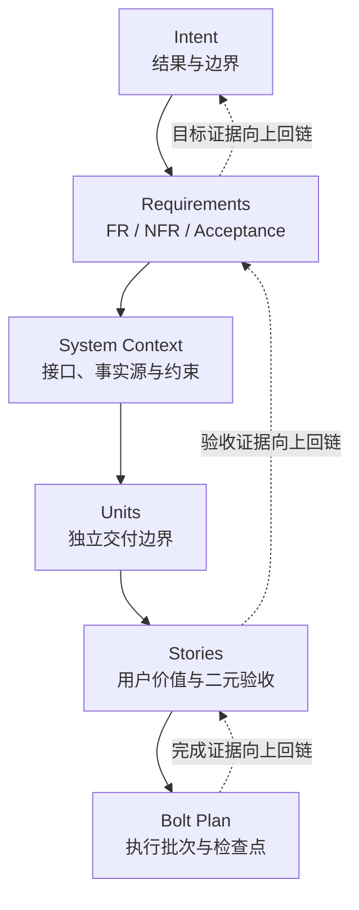

# 第 3 章 · Inception：从 Intent 到可执行计划

## Metadata

| Field | Value |
|-------|-------|
| Chapter ID | CH-03 |
| Status Source | `progress/chapters.json` |
| Writing Sprint Card | D17-T03 · 完成章节审校与证据对齐 |
| Draft Completeness | 正式十章生产线可读稿；D17-T03 五类审校已完成 |
| Primary Question | AI 如何把一个高层 Intent 分解成可独立交付的 Unit、可验收的 Story 和可执行的 Bolt，而不丢失人的目标与边界？ |
| Reader Outcome | 能够完成 Intent、Requirements、System Context、Unit、Story 与 Bolt Plan 的可追溯分解 |
| Related Experiments | `EXP-03-01`、`EXP-03-02` |

## 01 · Question：为什么 Intent 不能直接交给 AI 执行

很多人第一次把 AI 接入开发流程时，最自然的动作是把一句话扔给模型：“帮我做一个能持续写书、自动记录进度、两周发布 v0.1 的 GitHub 写作系统。”模型往往能立即给出目录、文件、脚本，甚至一口气写出若干页面。问题也正是在这里开始的：它看起来已经在工作，但我们还不知道它究竟在替谁工作、为哪个目标工作、哪些东西必须公开、哪些东西必须留在本地、哪些结果才算完成。

这就是 Inception 要处理的核心矛盾。AI 的生成速度足够快，但高层 Intent 本身并不是可执行单位。Intent 里面混合了结果、时间、边界、质量要求、读者对象和隐含风险。如果直接从 Intent 跳到代码，常见后果有三个。

第一，目标和方案缠在一起。模型会提前选择技术路径，却没有证明这个路径服务于原始目的。第二，任务之间没有依赖图。一个页面可以先做出来，但如果任务事实源、事件模型和验收规则还没有定义，页面上的进度数字就只能靠手工维护。第三，人的判断点太晚。等几十个文件生成完以后再发现“这不是我要的 v0.1”，返工成本已经很高。

AI-DLC 的 Inception 不把“写更多提示词”当作解决方案。它要做的是把一句高层 Intent 变成一条可追踪、可验收、可执行的工件链：

```text
Intent
  → Requirements
  → System Context
  → Units
  → Stories
  → Bolt Plan
  → Human Checkpoints
```

本章只回答一个问题：如何完成这条不失真的分解链。它不展开 Bolt 内部的执行阶段，也不讨论跨会话 Memory Bank 的完整设计，更不讨论部署和监控。读完本章，读者应当能拿自己的一个项目 Intent，分解出 2 个 Unit、3 到 5 个 Story，并能解释每个 Story 服务于哪个上游目标、由哪个验收条件结束。

## 02 · Framework：七级分解链

Inception 的工作不是把大任务拆成小任务那么简单。普通拆分只回答“做哪些事”，AI-DLC 的拆分还必须回答“为什么这些事存在、怎样证明它们做完、谁在什么位置判断方向是否偏了”。

### 七级分解链

**Intent** 是目的地。它描述要达到的结果，而不是预先指定实现。例如“建立一套能在 GitHub 持续写作、两周形成可发布 v0.1、每次关键更新自动可视化留痕的系统”，这里包含结果、地点、节奏和可见性要求，但还不是任务列表。

**Requirements** 把 Intent 变成可检查的功能与非功能要求。功能要求回答系统必须提供什么能力；非功能要求回答质量、边界、安全、可追溯性和运行约束。一个只写功能要求的 Inception 往往会遗漏“不要上传本地工作资料”“状态变化必须自动留痕”这类真正影响交付可信度的约束。

**System Context** 说明系统与外界如何相接。它需要写明事实源在哪里、哪些目录进入公开仓库、哪些目录不进入、谁是主要读者、哪些工具可以假定存在、哪些东西不能联网或不能依赖密钥。Context 的作用是让后续 Agent 不靠聊天记忆猜边界。

**Units** 是可独立交付的能力边界。一个 Unit 不是随手分出来的文件夹，而是有输入、输出、职责和依赖的交付单位。边界清楚以后，AI 才能并行或分阶段执行，而不在同一轮里把事实源、驾驶舱、发布工作流和反馈系统混成一团。

**Stories** 把 Unit 里的能力写成用户价值与二元验收。好的 Story 不只是“实现任务模型”，还要说明谁需要它、它服务于哪个 Requirement、什么证据让它进入 done。二元验收不是文学评价，而是可以判断真假的门槛。

**Bolt Plan** 把 Stories 编排成小时到天级的执行批次。Bolt 的价值在于控制风险传播：先建事实源和校验，再建可视化；先跑最小构建，再谈发布候选。每个 Bolt 都应有阶段、产物和检查点。

**Human Checkpoints** 是防止 AI 高速偏航的判断闸口。人不需要检查每一行生成物，但必须在目标边界、架构取舍、样章质量、发布门禁这类位置保留决定权。

### 四条不变量

Inception 是否可靠，可以用四条不变量检查。

第一，结果先于方案。Intent 应该先说“要让谁获得什么结果”，不要一开始就锁死具体脚本、框架或页面样式。第二，边界先于并行。没有边界的并行会制造冲突，有边界的并行才会形成工程速度。第三，验收先于生成。没有验收的 Story 会变成“看起来写了很多”，但永远无法稳定进入 done。第四，检查点先于失控。人的判断应该出现在错误仍局部、可逆的时候。

这四条也解释了本书的核心公式：

`𝓔 = Engineering with Exsecutio`

在 Inception 阶段，Engineering 指的是把意图、边界、依赖、验收和证据显式化；Exsecutio 的前提是形成一条 AI 能沿着贯彻、而人仍能验证和纠偏的执行轨道。没有 Inception，执行越快，偏差可能越快扩大。

## 03 · Example：本书项目的 Inception 分解

我们用本书项目自身作为例子。原始 Intent 可以写成一句话：

> 从零建立一套在 GitHub 上写作和持续更新《深入理解 AI-DLC》的系统，两周形成可发布 v0.1，所有关键更新自动记录并可视化。

这句话里至少有四类信息。结果是“能持续写作和更新”；时间边界是“两周形成 v0.1”；事实源边界是“GitHub 上”；质量要求是“关键更新自动记录并可视化”。如果直接要求 AI 创建页面，最容易先得到一个漂亮页面，却没有任务模型、事件账本和 Release 门禁。

更稳的做法是先把它变成 Requirements。例如：

- FR-001：提供可读样章。
- FR-002：提供可运行实验。
- FR-003：提供进度驾驶舱。
- NFR-001：所有进度可追溯。
- NFR-002：公开仓库不包含本地工作资料。
- NFR-003：发布状态不得手工伪造。

接着，System Context 约束项目边界：Git 仓库是事实源；`progress/tasks.json`、`progress/chapters.json`、`progress/experiments.json` 是主要事实文件；`specs.md-portal/` 和 `github_repo_reference_ai-agent-book-main/` 不进入后续 GitHub 仓库对象；书稿构建产物进入 `.artifacts/`；真实 v0.1 发布必须由 GitHub `release.published` 事件证明。

Unit 进一步收束职责。当前项目把“GitHub 写作系统 UI / 事实源 / 自动化”作为一个主要 Unit。这个 Unit 的职责不是“做一个网页”，而是维护书稿、实验、进度事实源、静态驾驶舱和发布证据之间的一致性。

Story 再把 Unit 里的能力变成可验收片段。例如，`D02-T03 · 定义任务模型` 的价值不是“写一个 JSON 文件”，而是让后续任务都有稳定状态、依赖、产物和验收字段，进而能被聚合、校验和可视化。这个 Story 服务于 FR-003 和 NFR-001。它的完成证据包括 `progress/schemas/task-schema.md`、`progress/tasks.json`、验证脚本和通过状态。

最后进入 Bolt Plan。这个项目没有先做 Release 工作流，而是先从事实源、样章、实验、进度聚合和核心图开始。这个顺序很重要：没有事实源，驾驶舱只能展示幻觉；没有实验证据，样章的实践观点只是观点；没有构建脚本，内部书稿无法形成可复现候选。

一个错误分解可以这样写：

```text
Task: 做一个很棒的发布页面
Acceptance: 页面看起来不错
Artifact: site/index.html
```

它的问题不在于页面不重要，而在于“很棒”和“看起来不错”不可二元判断；它也没有说明页面数字来自哪里、是否依赖前置事实源、如何证明更新自动留痕。修正后的任务应该绑定事实源、依赖和验收：

```text
Task: 渲染驾驶舱核心指标
Depends on: 任务模型、实验池、进度聚合
Artifact: site/index.html
Acceptance: 核心数字来自 progress/generated/current.json，且无 JS 时仍可读
```

这样，任务才从愿望变成可执行对象。

## 04 · Experiment：结构追踪性检查

本章的实践证据来自 `EXP-03-01 · Intent 到 Story 追踪链生成器`。它不调用模型，不联网，也不试图判断业务语义。它只检查一份候选 Inception 分解是否满足结构追踪性：Requirement 是否有下游 Unit 和 Story，Story 是否有上游目标，验收是否存在，引用是否有效。

从仓库根目录运行：

```bash
python3 experiments/sample/quickstart.py \
  --input experiments/sample/samples/input.json \
  --output experiments/sample/output/sample.json
```

合法样例的当前输出位于 `experiments/sample/output/sample.json`。关键指标为：

| Metric | Current Result | Meaning |
|---|---:|---|
| requirement_coverage_percent | 100.0 | 每条 Requirement 都能追到 Unit 和 Story |
| orphan_story_count | 0 | 没有失去上游目标的 Story |
| acceptance_completeness_percent | 100.0 | 每个 Story 都有非空验收 |
| invalid_reference_count | 0 | 没有指向未知对象的引用 |

这四个数字只证明结构，不证明语义。即使 `valid: true`，人仍要判断“可读样章”这个 Requirement 是否足够具体、Story 的验收是否真的代表读者价值。AI-DLC 需要这种分工：机器负责确定性结构检查，人负责目标与意义判断。

失败样例同样重要。`experiments/sample/samples/invalid/` 中保存了五类坏输入：缺少非功能需求、重复 ID、未知引用、孤立 Story、空验收。它们分别触发稳定错误代码 `E_MISSING_NFR`、`E_DUPLICATE_ID`、`E_UNKNOWN_REF`、`E_ORPHAN_STORY` 和 `E_ACCEPTANCE`。这让“分解质量”不再只是主观感觉，而能进入自动测试和发布门禁。

测试入口为：

```bash
python3 -m unittest discover \
  -s experiments/sample/tests \
  -p 'test_*.py'
```

这个实验可以被读者改造成自己的检查器。最小练习是：写一个自己的 Intent，列出 2 条 Requirement、1 个 Unit 和 3 个 Story，然后运行类似检查，观察是否有 Story 没有上游目标，是否有 Requirement 从未被实现路径覆盖。

### `EXP-03-02` · Unit 与 Bolt 依赖 DAG 校验器

`EXP-03-02` 继续检查下一层结构：Unit、Story 与 Bolt 的依赖图是否可执行。它输出依赖图，并计数循环依赖、跨 Unit 耦合边和未满足前置。运行入口：

```bash
python3 experiments/exp-03-02/quickstart.py --sample
```

样例报告在 `experiments/exp-03-02/output/sample.json`。它证明依赖清单可以被机器复核；它不证明计划最优，也不把跨 Unit 耦合自动判为错误——后者会以警告计数，留给人确认。

## 05 · Figure：向下分解与向上追踪

本章的图应当帮助读者看见两个方向：向下分解，向上追踪。



当前 v0.1 书稿已包含全书核心图 `book/images/fig0-1.svg`。它解释 AI-DLC 的总结构：人的判断、AI 能力与 Engineering with Exsecutio 如何共同走向确定性交付。本章样章中的 Intent-to-Bolt 图是它的局部展开：把“总结构”落到 Inception 的分解链上。

为了让图不变成装饰，正文中的每个节点都要有证据路径：

| Node | Evidence Entry |
|---|---|
| Intent | `memory-bank/intents/001-github-writing-system/requirements.md` |
| Requirements | `planning/sample-experiment.md` 与 `experiments/sample/samples/input.json` |
| Units | `memory-bank/intents/001-github-writing-system/units.md` |
| Stories | `memory-bank/story-index.md` |
| Bolt Plan | `memory-bank/bolts/001-github-writing-system-ui/bolt.md` |
| Progress Events | `progress/events/events.jsonl` |

图的生成规则应延续本书 SVG 规约：宽屏优先、严格网格、白色卡片、浅灰边框、语义色竖线、可编辑文本、无外围装饰边框。后续如果为本章单独生成 `book/images/ch03-intent-to-bolt.svg`，必须保留源文件和可再生方法。

## 06 · Review：可读稿自检与后续审校入口

本章已从 v0.1 样章迁移为正式十章生产线的 CH-03 可读稿。旧样章 `book/chapters/sample.md` 继续作为 v0.1 发布证据保留；本文件从 D17-T02 起作为书稿构建入口和后续审校对象。D17-T03 正式审校记录见 `planning/reviews/ch-03-writing-review.md`。

第一轮五类审校记录见 `planning/reviews/sample-chapter.md`。后续公开前仍可继续做语言润色和图示增强，但既有审校已确认它具备进入 v0.1 候选门禁的基本证据链。

第一，技术正确性：本章必须持续区分三件事。AI-DLC 是本书方法框架；specs.md 是参考实现；`EXP-03-01` 是结构追踪实验。不能把结构合法写成业务正确，也不能把一个本地实验写成普遍定律。

第二，重复与边界：本章只讲 Intent 到 Bolt Plan 的形成，不展开 CH-04 的跨会话 Memory Bank，也不展开 CH-06 的 Bolt 运行细节。读者读完应知道“计划怎样产生”，但不必在本章学完全部执行机制。

第三，结构连贯性：开头提出的三个问题必须在正文中闭环。目标和方案混杂的问题由 Requirements 与 Context 解决；依赖图缺失的问题由 Units、Stories 与 Bolt Plan 解决；人的判断过晚的问题由 Human Checkpoints 解决。

第四，术语一致性：Intent、Requirement、System Context、Unit、Story、Bolt、Checkpoint 首次出现时已经定义，之后不要随意改成“目标、需求、模块、任务、执行包”这类近义词混用。中文解释可以灵活，英文术语要稳定。

第五，正文与实验对应：所有实践观点都必须能追到证据入口。本章的证据入口包括 `experiments/sample/README.md`、`experiments/sample/output/sample.json`、五类失败样例、测试命令、`planning/sample-experiment.md` 和 `book/images/fig0-1.svg`。

## Reader Exercise

选择你自己的一个项目，用 20 分钟完成下面练习。

1. 写一句 Intent，不超过 40 个字，包含结果而不是方案。
2. 写 2 条 Requirement，其中至少 1 条是 non-functional。
3. 写 1 个 Unit，说明职责和引用的 Requirement。
4. 写 3 个 Story，每个 Story 必须引用 Unit 和 Requirement，并给出一条二元验收。
5. 检查是否存在孤立 Story、空验收或未知引用。
6. 写下一个必须由人判断的 Checkpoint。

如果你能完成这六步，你已经拥有一个最小 Inception 结果。它还不是完整项目计划，但已经比“一句话让 AI 开始写代码”可靠得多。

## References

- `planning/sample-chapter-decision.md`：CH-03 样章选择与六阶段拆解。
- `planning/sample-experiment.md`：`EXP-03-01` 实验合同、指标和边界。
- `experiments/sample/README.md`：实验运行说明与 verified 状态。
- `experiments/sample/output/sample.json`：合法样例输出证据。
- `experiments/sample/output/README.md`：成功与失败样例说明。
- `book/images/fig0-1.svg`：全书 AI-DLC 核心图。
- `book/chapters/sample.md`：v0.1 样章证据副本。
- `planning/reviews/ch-03-writing-review.md`：正式十章生产线 CH-03 五类审校记录。
- `progress/chapters.json`：章节事实源与阶段状态。
