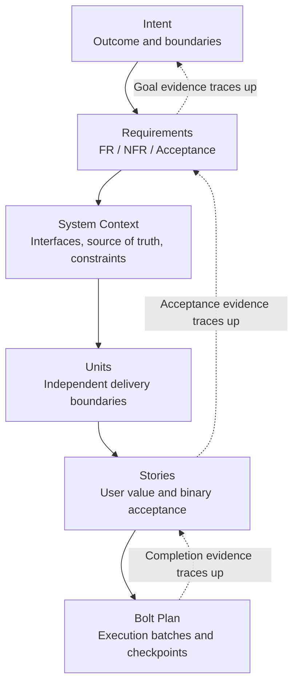

# Chapter 3 · Inception: From Intent to an Executable Plan

## Metadata

| Field | Value |
|-------|-------|
| Chapter ID | CH-03 |
| Status Source | `progress/chapters.json` |
| Writing Sprint Card | D17-T03 · Complete chapter review and evidence alignment |
| Draft Completeness | Formal ten-chapter production-line readable draft; D17-T03 five-category review complete |
| Primary Question | How can AI decompose a high-level Intent into independently deliverable Units, acceptable Stories, and executable Bolts without losing human goals and boundaries? |
| Reader Outcome | Able to perform a traceable decomposition of Intent, Requirements, System Context, Unit, Story, and Bolt Plan |
| Related Experiments | `EXP-03-01`、`EXP-03-02`、`EXP-03-03` |

## 01 · Question: Why Intent Cannot Go Straight to AI Execution

Many teams’ first move when adding AI to development is natural: throw one sentence at the model—“Help me build a GitHub writing system that keeps writing the book, auto-records progress, and ships v0.1 in two weeks.” The model can immediately return directories, files, scripts, even several pages at once. The problem starts there: it already looks like work, but we still do not know whom it is working for, toward which goal, what must be public, what must stay local, or what counts as done.

That is the core tension Inception handles. AI generates fast enough, but a high-level Intent is not an executable unit. Intent mixes outcome, timing, boundaries, quality bars, audience, and implicit risk. Jumping from Intent straight to code commonly yields three outcomes.

First, goals and solutions tangle. The model picks a technical path early without showing it serves the original purpose. Second, there is no dependency graph between tasks. A page can be built first, but if task source of truth, event model, and acceptance rules are undefined, progress numbers on the page are maintained by hand. Third, human judgment points arrive too late. Discovering “this is not the v0.1 I wanted” after dozens of files are generated makes rework expensive.

AI-DLC Inception does not treat “write more prompts” as the fix. It turns one high-level Intent into a traceable, acceptable, executable artifact chain:

```text
Intent
  → Requirements
  → System Context
  → Units
  → Stories
  → Bolt Plan
  → Human Checkpoints
```

This chapter answers one question: how to complete this decomposition chain without distortion. It does not expand Bolt internal execution stages, full cross-session Memory Bank design, or deployment and monitoring. After this chapter, readers should take their own project Intent, decompose into 2 Units and 3–5 Stories, and explain which upstream goal each Story serves and which acceptance condition ends it.

## 02 · Framework: The Seven-Level Decomposition Chain

Inception work is not as simple as splitting big tasks into small ones. Ordinary breakdown only answers “what to do”; AI-DLC breakdown must also answer “why these items exist, how to prove they are done, and where humans judge whether direction has drifted.”

### Seven-level decomposition chain

**Intent** is the destination. It describes the outcome to reach, not the implementation upfront. Example: “Build a system that can keep writing on GitHub, form a publishable v0.1 in two weeks, and automatically visualize every critical update”—that includes outcome, place, rhythm, and visibility, but is not yet a task list.

**Requirements** turn Intent into checkable functional and non-functional requirements. Functional requirements say what the system must provide; non-functional requirements say quality, boundaries, security, traceability, and runtime constraints. Inception that only lists functional requirements often misses constraints that truly affect delivery trust—such as “do not upload local working materials” or “state changes must be recorded automatically.”

**System Context** describes how the system connects to the outside world. It must state where the source of truth lives, which directories enter the public repo, which do not, who the primary readers are, which tools may be assumed, and what must not go online or depend on secrets. Context stops later Agents from guessing boundaries from chat memory.

**Units** are independently deliverable capability boundaries. A Unit is not an arbitrary folder—it is a delivery unit with inputs, outputs, responsibilities, and dependencies. Clear boundaries let AI execute in parallel or phases instead of mixing source of truth, cockpit, release workflow, and feedback in one pass.

**Stories** write Unit capabilities as user value and binary acceptance. A good Story is not just “implement task model”—it says who needs it, which Requirement it serves, and what evidence moves it to done. Binary acceptance is not literary critique—it is a true/false bar.

**Bolt Plan** orchestrates Stories into hour-to-day execution batches. Bolt value is controlling risk propagation: build source of truth and validation first, then visualization; run minimal build before release candidates. Each Bolt should have phases, artifacts, and checkpoints.

**Human Checkpoints** are judgment gates against AI high-speed drift. Humans need not inspect every generated line, but must retain decision rights at goal boundaries, architecture trade-offs, sample quality, release gates, and similar positions.

### Four invariants

Whether Inception is reliable can be checked with four invariants.

First, outcome before solution. Intent should say “what result for whom” first—not lock scripts, frameworks, or page styles upfront. Second, boundary before parallelism. Parallelism without boundaries creates conflict; parallelism with boundaries creates engineering speed. Third, acceptance before generation. Stories without acceptance become “lots written” but never stably done. Fourth, checkpoint before loss of control. Human judgment should appear while errors are still local and reversible.

These four also explain the book’s core formula:

`𝓔 = Engineering with Exsecutio`

In Inception, Engineering means making intent, boundaries, dependencies, acceptance, and evidence explicit; Exsecutio presupposes an execution track AI can follow through while humans can still verify and correct. Without Inception, the faster execution runs, the faster drift may spread.

### Mob Elaboration and dual workflow inputs (summary)

Typical outputs of the official Inception ritual **Mob Elaboration** include: Units, User Stories, NFRs, risk descriptions (alignable with organizational Risk Register), metrics tracing business Intent, and suggested Bolts; optional PRFAQ aligns business narrative (see [Amplify whitepaper](https://prod.d13rzhkk8cj2z0.amplifyapp.com) and [AWS blog post](https://aws.amazon.com/cn/blogs/devops/ai-driven-development-life-cycle/)).

[aidlc-workflows](https://github.com/mancbj/aidlc-workflows/blob/main/docs/WORKING-WITH-AIDLC.md) adds two inputs to solidify early: **Vision** (product/business intent) and **Tech Environment** (stack, constraints, brownfield context). They map to this book’s Intent + System Context, and stress that Inception also follows Question→Doc→Approval—plan md approved before Construction. Chapter-to-workflow mapping is in [WORKING-WITH-AIDLC-MAP.md](../../../docs/WORKING-WITH-AIDLC-MAP.md).

## 03 · Example: Inception Decomposition for This Book Project

We use this book project as the example. Original Intent in one sentence:

> From scratch, build a system on GitHub to write and continuously update *Deep Dive into AI-DLC*, form a publishable v0.1 in two weeks, with all critical updates automatically recorded and visualized.

That sentence carries at least four information classes. Outcome: sustained writing and updates; time boundary: v0.1 in two weeks; source-of-truth boundary: on GitHub; quality bar: critical updates auto-recorded and visualized. Asking AI to create pages first most easily yields a pretty page without task model, event ledger, or Release gates.

The steadier path is Requirements first, for example:

- FR-001: Provide readable sample chapters.
- FR-002: Provide runnable experiments.
- FR-003: Provide progress cockpit.
- NFR-001: All progress traceable.
- NFR-002: Public repo must not contain local working materials.
- NFR-003: Release status must not be manually forged.

System Context then constrains project boundaries: Git repo is source of truth; `progress/tasks.json`, `progress/chapters.json`, `progress/experiments.json` are primary fact files; `specs.md-portal/` and `github_repo_reference_ai-agent-book-main/` do not enter subsequent GitHub repo objects; book build artifacts go to `.artifacts/`; real v0.1 release must be proven by GitHub `release.published` event.

Units further tighten responsibilities. This project treats “GitHub writing system UI / source of truth / automation” as one main Unit. That Unit’s job is not “build a web page”—it maintains consistency among manuscript, experiments, progress source of truth, static cockpit, and release evidence.

Stories turn Unit capabilities into acceptable slices. For example, `D02-T03 · Define task model` is not valued as “write a JSON file”—it gives subsequent tasks stable state, dependencies, artifacts, and acceptance fields so they can be aggregated, validated, and visualized. This Story serves FR-003 and NFR-001. Completion evidence includes `progress/schemas/task-schema.md`, `progress/tasks.json`, validation scripts, and pass status.

Then Bolt Plan. This project did not start with Release workflow—it started with source of truth, sample chapters, experiments, progress aggregation, and core figures. Order matters: without source of truth, the cockpit shows hallucination; without experiment evidence, practice claims in sample chapters are only opinions; without build scripts, internal manuscript cannot form reproducible candidates.

A bad decomposition might read:

```text
Task: Build an awesome release page
Acceptance: Page looks good
Artifact: site/index.html
```

The problem is not that the page is unimportant—“awesome” and “looks good” are not binary; it does not say where page numbers come from, whether source of truth is a prerequisite, or how auto-recording is proven. A corrected task binds source of truth, dependencies, and acceptance:

```text
Task: Render cockpit core metrics
Depends on: task model, experiment pool, progress aggregation
Artifact: site/index.html
Acceptance: Core numbers from progress/generated/current.json; readable without JS
```

Then the task becomes an executable object, not a wish.

## 04 · Experiment: Structural Traceability Check

This chapter’s practical evidence comes from `EXP-03-01 · Intent-to-Story trace chain generator`. It does not call models, go online, or judge business semantics. It only checks whether a candidate Inception decomposition meets structural traceability: whether Requirements have downstream Units and Stories, Stories have upstream goals, acceptance exists, references are valid.

From repo root:

```bash
python3 experiments/sample/quickstart.py \
  --input experiments/sample/samples/input.json \
  --output experiments/sample/output/sample.json
```

Valid sample output is at `experiments/sample/output/sample.json`. Key metrics:

| Metric | Current Result | Meaning |
|---|---:|---|
| requirement_coverage_percent | 100.0 | Every Requirement traces to Unit and Story |
| orphan_story_count | 0 | No Story without upstream goal |
| acceptance_completeness_percent | 100.0 | Every Story has non-empty acceptance |
| invalid_reference_count | 0 | No references to unknown objects |

These four numbers prove structure only, not semantics. Even with `valid: true`, humans still judge whether “readable sample chapter” is specific enough and whether Story acceptance truly represents reader value. AI-DLC needs this division: machines do deterministic structure checks; humans do goal and meaning judgment.

Failure samples matter equally. `experiments/sample/samples/invalid/` holds five bad input types: missing NFR, duplicate ID, unknown reference, orphan Story, empty acceptance. They trigger stable error codes `E_MISSING_NFR`, `E_DUPLICATE_ID`, `E_UNKNOWN_REF`, `E_ORPHAN_STORY`, and `E_ACCEPTANCE`. “Decomposition quality” is no longer subjective—it can enter automated tests and release gates.

Test entry:

```bash
python3 -m unittest discover \
  -s experiments/sample/tests \
  -p 'test_*.py'
```

Readers can adapt this experiment into their own checker. Minimal exercise: write your Intent, list 2 Requirements, 1 Unit, 3 Stories, run a similar check, and see whether any Story lacks upstream goal or any Requirement lacks implementation coverage.

### `EXP-03-02` · Unit and Bolt dependency DAG validator

`EXP-03-02` checks the next structural layer: whether the dependency graph among Unit, Story, and Bolt is executable. It outputs the graph and counts cycles, cross-Unit coupling edges, and unmet prerequisites. Run:

```bash
python3 experiments/exp-03-02/quickstart.py --sample
```

Sample report at `experiments/exp-03-02/output/sample.json`. It shows dependency lists can be machine-reviewed; it does not prove optimal plans, nor auto-fail cross-Unit coupling—that appears as warning counts for human confirmation.

### `EXP-03-03` · Full Inception Agent decomposition reproduction (KEEP-EXT)

`EXP-03-03` is verified but triage remains `KEEP-EXT`: it only checks artifact completeness and trace link coverage for Requirements, System Context, Units, Stories, Bolt Plan against a frozen pin guide in the repo. Run:

```bash
python3 experiments/exp-03-03/quickstart.py --sample
```

Sample at `experiments/exp-03-03/output/sample.json`. It shows frozen decomposition packages reproduce deterministically; it does not write external Inception Agent docs as the only standard or prove business semantics are correct.

## 05 · Figure: Decompose Down, Trace Up

This chapter’s figure should show two directions: decompose down, trace up. The standalone SVG fixes this chain as an auditable source file; the Mermaid below remains a build-time readable expansion.

{.core-figure width=100%}

Source file: `book/images/ch03-intent-to-bolt.svg`. It is a local expansion of the book core figure `book/images/fig0-1.svg`: landing “overall structure” on Inception’s decomposition chain.



So the figure is not decoration—each node in the main text has an evidence path:

| Node | Evidence Entry |
|---|---|
| Intent | `memory-bank/intents/001-github-writing-system/requirements.md` |
| Requirements | `planning/sample-experiment.md` and `experiments/sample/samples/input.json` |
| Units | `memory-bank/intents/001-github-writing-system/units.md` |
| Stories | `memory-bank/story-index.md` |
| Bolt Plan | `memory-bank/bolts/001-github-writing-system-ui/bolt.md` |
| Progress Events | `progress/events/events.jsonl` |

## 06 · Review: Readable Draft Self-Check and Follow-Up Review Entry

This chapter migrated from v0.1 sample to formal ten-chapter production-line CH-03 readable draft. Legacy sample `book/chapters/sample.md` remains as v0.1 release evidence; this file from D17-T02 onward is book build entry and follow-up review target. D17-T03 formal review record is in `planning/reviews/ch-03-writing-review.md`.

First-round five-category review is in `planning/reviews/sample-chapter.md`. Before public release, language polish and figure enhancement can continue, but existing review confirms basic evidence chain for v0.1 candidate gates.

First, technical correctness: this chapter must keep distinguishing three things. AI-DLC is this book’s method framework; specs.md is reference implementation; `EXP-03-01` is structural trace experiment. Do not write structural validity as business correctness, or one local experiment as universal law.

Second, repetition and boundaries: this chapter covers only Intent to Bolt Plan formation—not CH-04 cross-session Memory Bank or CH-06 Bolt runtime detail. Readers should know “how plans form,” not full execution mechanics in this chapter.

Third, structural coherence: the three problems raised at the opening must close in the body. Goal–solution mixing addressed by Requirements and Context; missing dependency graph by Units, Stories, Bolt Plan; late human judgment by Human Checkpoints.

Fourth, terminology consistency: Intent, Requirement, System Context, Unit, Story, Bolt, Checkpoint are defined at first use—do not casually swap for “goal, requirement, module, task, execution pack.” Explanatory language may vary; English terms stay stable.

Fifth, body–experiment alignment: every practice claim must trace to evidence entry. This chapter’s entries include `experiments/sample/README.md`, `experiments/sample/output/sample.json`, five failure sample types, test commands, `planning/sample-experiment.md`, `book/images/fig0-1.svg`, and `book/images/ch03-intent-to-bolt.svg`.

## Reader Exercise

Choose your own project and spend 20 minutes on this exercise.

1. Write one Intent, at most 40 words, stating outcome not solution.
2. Write 2 Requirements, at least 1 non-functional.
3. Write 1 Unit stating responsibility and referenced Requirements.
4. Write 3 Stories, each referencing Unit and Requirement with one binary acceptance.
5. Check for orphan Stories, empty acceptance, or unknown references.
6. Write the next Checkpoint that must be human-judged.

If you complete these six steps, you have a minimal Inception result. It is not a full project plan, but it is far more reliable than “one sentence and let AI start coding.”

## References

- `planning/sample-chapter-decision.md`: CH-03 sample selection and six-phase breakdown.
- `planning/sample-experiment.md`: `EXP-03-01` experiment contract, metrics, boundaries.
- `experiments/sample/README.md`: experiment run instructions and verified status.
- `experiments/sample/output/sample.json`: valid sample output evidence.
- `experiments/sample/output/README.md`: success and failure sample notes.
- `experiments/exp-03-03/README.md`: full Inception Agent decomposition reproduction (KEEP-EXT / frozen pin).
- `experiments/exp-03-03/output/sample.json`: frozen decomposition completeness and trace link coverage sample.
- `progress/experiments.json`: governance status for `EXP-03-01`, `EXP-03-02`, `EXP-03-03`.
- `book/images/fig0-1.svg`: book-wide AI-DLC core figure.
- `book/images/ch03-intent-to-bolt.svg`: Intent-to-Bolt bidirectional trace figure.
- `../../chapters/sample.md`: v0.1 sample chapter evidence copy (Chinese source).
- `planning/reviews/ch-03-writing-review.md`: formal ten-chapter CH-03 five-category review record.
- `progress/chapters.json`: chapter source of truth and phase status.
- [AWS AI-DLC Method Definition (Amplify)](https://prod.d13rzhkk8cj2z0.amplifyapp.com), [WORKING-WITH-AIDLC](https://github.com/mancbj/aidlc-workflows/blob/main/docs/WORKING-WITH-AIDLC.md), `docs/WORKING-WITH-AIDLC-MAP.md`: Mob Elaboration and dual-input summary.
