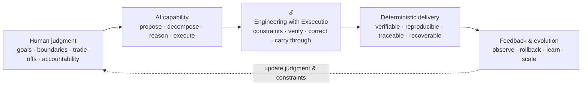
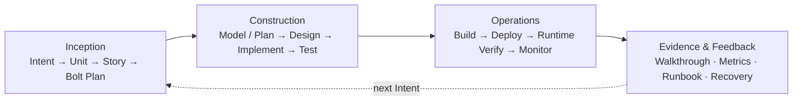
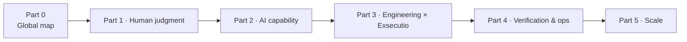

# Part 00 · Bird's-eye AI-DLC: map of this book

> This part is a non-numbered guide—not one of the ten chapters.  
> **Reading goal:** In about 10 minutes, see the core tension, how AI-DLC runs, and how the ten chapters fit together.

## 0.1 Why start with the map

AI-DLC spans methodology, AI capability, engineering artifacts, verification, operations, and organizational change. If you jump straight into Intent, Memory Bank, or Bolt, you may memorize terms without seeing **why** they exist.

This book starts with one map: **probabilistic AI capability becomes deterministic delivery only through human judgment and engineering execution (𝓔).** The ten chapters zoom into regions of that map.

## 0.2 One diagram

Core formula:

> **AI-DLC = 𝓔 (human judgment + AI capability)**  
> **𝓔 = Engineering with Exsecutio**

Human judgment sets destination, boundaries, and accountability. AI amplifies proposal and execution. **𝓔** pushes probabilistic output along an engineering track until results can be verified and delivered.

## 0.3 Three layers

| Layer | Question | In this book |
| --- | --- | --- |
| Principles | Why doesn't probabilistic intelligence equal deterministic delivery? | Part 1 |
| System | How does AI get context, decompose work, and execute on rails? | Parts 2–4 |
| Scale | Which method for which risk; how teams replicate and measure value? | Part 5 |

Distinguish four kinds of knowledge:

- **Book framework** — e.g. `Engineering with Exsecutio`, argued in this book.
- **Method sources** — e.g. AWS AI-DLC, research models.
- **Reference implementations** — e.g. specs.md phases, Memory Bank, Bolts, four Agents.
- **Experiment evidence** — claims bounded by repo experiments and primary sources.

No single tool equals AI-DLC itself.

### 0.3.1 Official source triangle

1. **[AWS AI-DLC method definition (Amplify)](https://prod.d13rzhkk8cj2z0.amplifyapp.com)** — Reimagine rather than retrofit; reverse conversation; DDD in the core; Bolt vs Sprint; three phases and Mob rituals.
2. **[AWS DevOps blog (CN)](https://aws.amazon.com/cn/blogs/devops/ai-driven-development-life-cycle/)** — AI-Driven context and links to the whitepaper.
3. **[aidlc-workflows · WORKING-WITH-AIDLC](https://github.com/mancbj/aidlc-workflows/blob/main/docs/WORKING-WITH-AIDLC.md)** — Question→Doc→Approval, phase gates, Never Vibe Code.

**Book stance:** `Engineering with Exsecutio` explains how to push probabilistic output into verifiable delivery; AWS text is a method source; specs.md and aidlc-workflows are references. Experiment triage (30/30 verified) is not rewritten as “everything SHIP in production.”

**Two paths:** read the book (Part 0 + chapters) · run a workflow ([WORKING-WITH-AIDLC map](../../docs/WORKING-WITH-AIDLC-MAP.md)).

## 0.4 Lifecycle bird's-eye

Reference path from specs.md AI-DLC Flow:

## 0.5 Narrative arc

## 0.6 Reading routes

| Goal | Route | Outcome |
| --- | --- | --- |
| Leadership judgment | Part 0 → Ch. 1, 2, 9, 10 | Boundaries, accountability, scale |
| Team system design | Part 0 → Ch. 3–8, 10 | Artifacts, Bolts, verification, Operations |
| Minimal loop | Part 0 → Ch. 3–8 | Intent to runnable, verified delivery |

## 0.7 Four questions for every chapter

1. What must not be delegated to AI?
2. Are AI inputs, permissions, outputs, and failure modes explicit?
3. What independent evidence allows the next stage?
4. If wrong, can the system detect, rollback, fix, and record?

If these stay answerable, AI is not free-generating—it is moving on engineering rails toward deterministic delivery.
