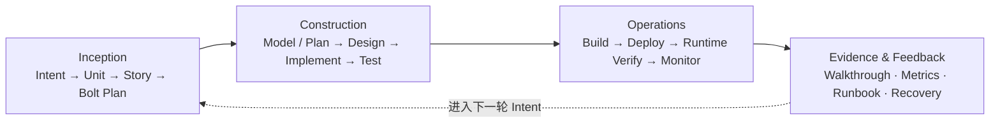
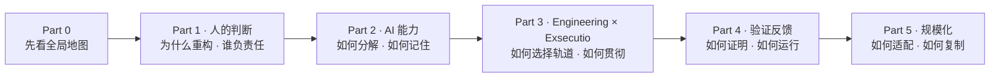

# Part 00 · 鸟瞰 AI-DLC：读懂这本书的地图

> 本部分是非编号导读，不计入十章正文。  
> 阅读目标：用 10 分钟看懂 AI-DLC 的核心矛盾、运转方式和全书叙事路径。

## 0.1 为什么先看鸟瞰图

AI-DLC 同时涉及方法论、AI 能力、工程工件、验证机制、运行体系和组织变革。如果一开始就钻进 Intent、Memory Bank 或 Bolt，读者很容易记住术语，却看不见它们为什么存在。

本书先给出一张完整地图：**概率性的 AI 能力，只有经过人的判断与 𝓔 的工程化贯彻，才能转化为确定性交付。** 后续十章只是在依次放大这张地图的不同区域。

## 0.2 一张图看懂 AI-DLC

核心公式是：

> **AI-DLC = 𝓔（人的判断 + AI 能力）**  
> **𝓔 = Engineering with Exsecutio**

这不是把人和 AI 的能力做简单相加。人的判断先确定目的地、边界与责任，AI 放大提议和执行能力，𝓔 再把概率性输出送入工程轨道，持续推进到能够被验证和交付的状态。

## 0.3 三层认识框架

| 层次 | 回答的问题 | 本书中的位置 |
| --- | --- | --- |
| 原理层 | 为什么概率智能不能直接等于确定性交付？ | Part 1 |
| 系统层 | AI 如何获得上下文、分解工作并沿工程轨道执行？ | Part 2–4 |
| 规模层 | 什么方法适合什么风险，团队如何复制并度量价值？ | Part 5 |

阅读时要同时区分四类知识：

- **本书框架**：例如 `Engineering with Exsecutio`，由本书负责解释和论证。
- **方法论来源**：例如 AWS AI-DLC、V-Bounce 和人类验证者模型。
- **参考实现**：例如 specs.md 的三阶段、Memory Bank、Bolts 和四 Agent。
- **实验证据**：由书中实验或原始研究支持的观察结论。

参考实现帮助我们把理论落地，但任何单一工具都不等于 AI-DLC 本身。

## 0.4 生命周期鸟瞰

specs.md 的 AI-DLC Flow 为本书提供了一条可观察的参考路径：

- **Inception** 把人的目标转成边界清晰、可验收、可执行的工作。
- **Construction** 让 AI 在选定的 Bolt 轨道中分阶段生成和验证交付候选。
- **Operations** 把通过测试的候选物构建、部署，再做 Runtime Verify，并纳入监控。
- **Evidence & Feedback** 保存变更、测试、指标和恢复凭证，驱动下一轮判断。

## 0.5 全书叙事结构

### Part 1 · 人的判断

先解释 AI 为什么迫使 SDLC 重新设计，再明确“AI 提议、人来验证”并不意味着人可以让渡目标、边界与最终责任。

### Part 2 · AI 能力

把抽象的 AI 能力落实为两项工程能力：把 Intent 分解成可执行计划，以及通过 Memory Bank 与 Standards 在跨会话中保持上下文。

### Part 3 · Engineering × Exsecutio

先建立 Bolt 的范围、类型和阶段门禁，再展示 AI 如何沿计划、执行、验证、纠偏与 Walkthrough 一路贯彻到交付候选。

### Part 4 · 验证反馈

回答两个最容易被忽略的问题：如何用独立证据证明结果正确，以及如何把候选物变成可部署、可观测、可回滚的运行系统。

### Part 5 · 规模化

最后讨论如何在 Simple、FIRE 与 AI-DLC 等不同治理强度之间做选择，以及如何重新设计人、Agent、协作节奏和价值度量。

## 0.6 三条阅读路线

| 读者目标 | 建议路线 | 你会得到什么 |
| --- | --- | --- |
| 先建立管理判断 | Part 0 → 第 1、2、9、10 章 | 方法边界、责任、选型与规模化框架 |
| 设计团队研发系统 | Part 0 → 第 3–8、10 章 | 工件链、上下文、Bolt、验证与 Operations |
| 立即跑通最小闭环 | Part 0 → 第 3、4、5、6、7、8 章 | 从 Intent 到可运行系统的实践路径 |

如果只读 v0.1 公开样章，优先阅读第 3 章；它把高层 Intent 变成可追踪、可验收的执行计划。继续理解执行机制时，再读位于全书机械中心的第 6 章。

## 0.7 带着四个问题进入正文

1. 在这个场景中，什么判断不能委托给 AI？
2. AI 的输入、权限、输出与失败模式是否明确？
3. 什么独立证据能够证明结果正确并允许进入下一阶段？
4. 如果结果错误，系统能否发现、回退、修正并留下记录？

只要这四个问题始终可回答，AI 就不是在自由生成，而是在工程轨道上向确定性交付前进。
