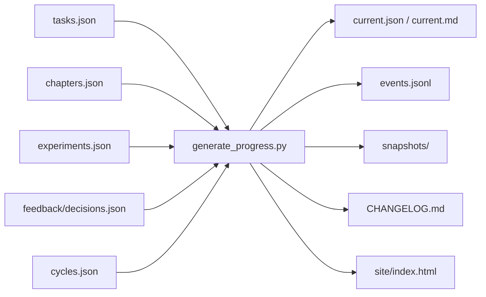

# Progress Automation

## 一条命令完成什么

```text
python3 scripts/generate_progress.py
```

命令按固定顺序执行：事实校验、指标聚合、状态差异、事件去重、快照候选、Markdown 摘要、HTML 驾驶舱、候选验证、发布生成文件、最后更新成功基线。

## 数据流



任务、章节、实验、反馈和周期五类 JSON 是权威源。所有完成率、状态分布、时间线、章节矩阵、实验队列、反馈决策、周期状态、阻塞和下一动作均为生成投影。

## 指标规则

- 总完成率：已完成任务数 / 全部任务数。
- 加权完成率：Must ×3、Should ×2、Could ×1。
- 百分比统一保留一位小数。
- 当前 Day：最早存在未完成任务的 Day；全部完成时为 Day 14。
- 下一动作：依赖均已完成且自身未 done/blocked 的任务。
- 真实发布回执激活周期后：即使 v0.1 仍有已带入的 Should，下一动作也切换到 active cycle 首个依赖已满足的 Must。
- 排序：Must → Should → Could；review → in-progress → ready → backlog；计划日期；稳定 ID。
- blocked 不混入普通下一动作，单独展示原因和解除动作。

## 哪些更新会自动留痕

事件字段、ID 幂等规则和类型边界见 [`progress/schemas/event-schema.md`](../progress/schemas/event-schema.md)。

| 事实变化 | 事件类型 |
|----------|----------|
| 任务状态变化 | `task_status_changed` |
| 章节六阶段任一状态变化 | `chapter_stage_changed` |
| 实验 triage 或 status 变化 | `experiment_changed` |
| 反馈决定为 accepted/rejected/deferred | `feedback_decided` |
| 周期由真实发布回执激活 | `cycle_opened` |

首次运行只写一条 `system_initialized`，不会为现有对象伪造过去历史。无关键变化时不会追加事件。同一来源重复运行通过稳定事件 ID 去重。空反馈和 preview cycle 初始化不会伪造过去事件。

里程碑、构建和版本不是普通事实字段，必须显式记录：

```text
python3 scripts/generate_progress.py \
  --event-type release_published \
  --event-object v0.1 \
  --event-summary "v0.1 已发布"
```

## 来源身份

- 有 Git commit 且五类事实与 `HEAD` 一致：使用完整 commit SHA。
- 有 Git commit 但五类事实存在未提交变化：使用 commit 前缀与 facts fingerprint 组合的 working-tree 身份，避免同一 `HEAD` 下的新事实覆盖旧快照。
- 尚无 commit：对五类权威事实源的规范化内容计算 SHA-256，形成 `working-tree-<摘要>`。

因此生成文件本身不会改变来源身份，也不会形成循环快照。

## 历史与当前状态

- `current.*` 和 `site/` 是当前投影，可以被下一次成功运行替换。
- `events/events.jsonl` 只追加，不重排旧事件。
- `snapshots/` 按时间和来源身份命名；不同来源不覆盖，相同来源复用。
- `CHANGELOG.md` 仅在有新关键事件时追加。
- `last-successful-facts.json` 是差异比较基线，不是人工编辑入口。

## 失败安全

1. 事实校验失败时不写任何生成文件。
2. JSON、HTML 核心结构和快照候选先完成验证。
3. 历史快照已存在但来源冲突时立即失败，不覆盖。
4. 可替换文件使用同目录临时文件和原子替换。
5. 比较基线最后更新；失败后再次运行仍能从最后成功事实识别变化。

跨多个普通文件不具备数据库事务，但稳定事件 ID、不可变快照和最后提交基线使中断可安全重试。

## 人工使用节奏

1. 修改任务、章节或实验事实。
2. 运行生成命令。
3. 打开 `site/index.html` 审阅鸟瞰状态。
4. 检查 `progress/CHANGELOG.md` 是否只出现预期关键更新。
5. 审阅 Git diff 后提交。

Bolt 003 将在 Pull Request、主分支推送和手动工作流中自动调用同一命令；本地与 CI 不使用两套逻辑。
