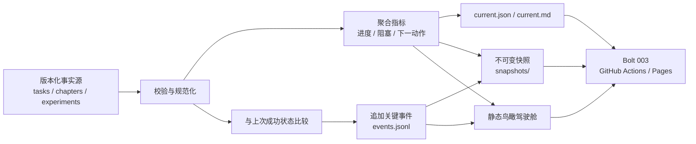

# Implementation Plan: Visual Progress and Automatic Update Record

## Objective

在 Bolt 001 的三个版本化事实源之上建立一条确定、失败安全、可审计的生成链：读取任务、章节和实验事实，计算项目鸟瞰指标，识别关键状态变化，追加事件记录，保存不可变快照，再生成无需后端即可浏览的静态驾驶舱。

本 Bolt 交付 Day 5–8 的可视化状态层，不改变事实源权威关系，也不配置 GitHub Actions、Pages、Projects 或正式发布；这些外部自动触发和托管能力由 Bolt 003/004 接入。

## Outcome at a Glance

## Current State

- `progress/tasks.json` 已包含 14 天、42 项任务和稳定 ID。
- `progress/chapters.json` 已包含 10 章及 Question、Framework、Example、Experiment、Figure、Review 六阶段。
- `progress/experiments.json` 已包含 30 个实验及 SHIP、KEEP-EXT、ALREADY 分类。
- `scripts/validate_project.py` 和 11 个 unittest 已通过，可在生成前作为数据门禁。
- 当前仓库已初始化本地 Git，但尚无 commit 和 remote；生成器必须为此提供确定的本地身份回退。
- `working-book/ai_dlc_book_action_guide.html` 是作者本地内容和 IBM Carbon 视觉基线，必须保留但不进入公开仓库。
- 尚无聚合结果、事件账本、快照、变更日志或动态驾驶舱。

## Deliverables

### 1. Shared Progress Engine

- `scripts/progress_core.py`：加载和规范化事实、计算指标、下一动作、阻塞、章节缺口与实验分布。
- `scripts/generate_progress.py`：单一命令入口，负责“校验 → 聚合 → 差异 → 事件 → 快照 → 摘要 → 页面”的事务式生成。
- `scripts/README.md`：补充本地运行、参数、输出、失败语义和 Bolt 003 的 CI 接入约定。
- `docs/PROGRESS-AUTOMATION.md`：说明权威数据、生成数据、关键事件定义、快照策略与恢复方法。

### 2. Replaceable Current Projection

- `progress/generated/current.json`：机器可读的当前指标、阻塞、下一动作、最近事件索引和源身份。
- `progress/generated/current.md`：面向作者的当前阶段、关键数字、阻塞和下一项 Must 摘要。
- `progress/generated/last-successful-facts.json`：只在整条生成链成功后替换的规范化比较基线。
- `site/data/progress.json`：供静态页面增强行为读取的同源投影。

当前投影可替换，但必须先写入同目录临时文件并通过完整生成，再以原子替换发布。失败时保留最后一次成功版本。

### 3. Append-Only Key Event Ledger

- `progress/events/events.jsonl`：按发生顺序追加的关键事件账本。
- 每个事件包含稳定事件 ID、时间、事件类型、对象类型、对象 ID、前后状态、提交/工作树身份、actor 和摘要。
- 自动事件覆盖任务状态、章节阶段状态、实验分类/状态变化。
- 里程碑、构建、版本事件保留显式命令参数入口，避免从普通文字变更中猜测。
- 首次生成只产生一个 `system_initialized` 事件，不为现有 42 个任务伪造历史。
- 相同事实和相同源身份重复运行时不得追加事件；既有行不得被重排或重写。

### 4. Immutable Snapshots and Changelog

- `progress/snapshots/<timestamp>-<source-id>.json`：包含源身份、指标、阻塞、下一动作和本次关键事件的历史快照。
- `progress/CHANGELOG.md`：只在出现关键事件时追加人类可读条目，并链接对应快照和对象。
- 同一提交或同一工作树指纹重复运行时复用并验证既有快照，不创建冲突副本。
- 无关键事件的手动运行允许刷新 current 和 dashboard，但默认不制造历史噪声。
- 只有成功验证全部待发布产物后，才依次发布事件、快照、current、changelog 和 dashboard；任何异常返回非零。

### 5. Bird's-Eye Static Dashboard

- `site/index.html`：从聚合数据生成完整 HTML 回退内容，禁用 JavaScript 时仍可看到核心指标、阻塞和下一动作。
- `site/assets/dashboard.css`：延续原行动指南的 IBM Carbon 视觉语言，支持桌面与 360px 移动视口。
- `site/assets/dashboard.js`：只负责过滤、详情折叠和增强交互；理解核心状态不依赖脚本或动画。
- 仪表盘固定包含：总体与加权进度、当前 Day、距 Day 14 天数、Must/Should 完成率、任务状态分布、14 天时间线、10 章六阶段生产线、实验分类/状态、阻塞项、最近事件、下一动作。
- 数字只从生成投影进入页面，不在模板中复制手工统计。
- `README.md` 增加驾驶舱、当前摘要、生成命令和事实源下钻入口。

### 6. Drilldown and Accessibility

- 时间线、章节、实验、阻塞和事件条目链接到仓库内事实记录、产物或完整日志。
- 未配置 GitHub remote 时使用仓库相对路径，不生成假 URL。
- 页面使用 `header`、`nav`、`main`、`section`、`table` 等语义结构，并提供跳过导航链接。
- 所有导航、过滤器和详情链接可使用键盘操作，具有清晰 `:focus-visible` 状态。
- 状态同时使用文字/符号和颜色；关闭颜色后仍可判读。
- 小屏采用单列、可换行指标和可滚动的非核心表格；核心指标与下一动作不得水平溢出。

## Story-to-Deliverable Mapping

| Story | Planned Files | Completion Evidence |
|-------|---------------|---------------------|
| 007 · 聚合指标 | `progress_core.py`、`current.json`、`current.md` | 输出总进度、Must/Should、状态、Day、章节、实验、阻塞和稳定排序的下一动作 |
| 008 · 关键事件 | `events.jsonl`、差异与去重逻辑 | 首次运行仅初始化；关键变化追加；无变化不追加；旧事件保持字节顺序 |
| 009 · 快照与日志 | `snapshots/`、`CHANGELOG.md`、成功基线 | 快照关联源身份且不覆盖；同源复用；失败不污染最后成功状态 |
| 010 · 鸟瞰仪表盘 | `site/index.html`、CSS、JS、页面数据 | 14 天、10 章、实验、阻塞、事件和下一动作均来自生成数据；无 JS 可读 |
| 011 · 下钻与无障碍 | 页面语义、链接、响应式与焦点样式、README | 360px 可用；键盘可达；状态不只靠颜色；关键对象可下钻 |

## Metric Rules

### Task Progress

- 普通完成率：`done 数 / 任务总数`，空集合固定为 `0%`。
- 优先级权重：Must = 3、Should = 2、Could = 1。
- 加权完成率：`done 任务权重和 / 全部任务权重和`。
- Must/Should 分别使用各自集合计算；不存在该优先级时为 `0%` 并标注无样本。
- 百分比统一保留一位小数，由整数分子/分母一次性计算，避免累计浮点误差。
- 状态分布覆盖 backlog、ready、in-progress、review、done、blocked 六种状态。

### Current Day and Countdown

- 当前 Day 为最早存在未完成任务的 Day；全部完成时固定为 Day 14 并进入“发布/下一周期”状态。
- 倒计时使用当前 Day 到 Day 14 的计划天数差，不推测真实日历完成日期。
- 最新更新时间取事实记录中合法 `updated` 的最大值，而不是生成命令运行时间。

### Next Actions

候选任务必须未完成且依赖均为 done。稳定排序键为：

1. Must、Should、Could；
2. 已进入 in-progress/review 的工作优先于 ready/backlog；
3. `planned_date`；
4. 稳定任务 ID。

blocked 任务不作为普通下一动作；单独输出 `blocker_reason` 与 `unblock_action`。无候选且任务全部完成时输出“准备 v0.1 发布或开启下一周期”。

### Chapters and Experiments

- 每章计算六阶段完成数、完成率和第一个未完成阶段。
- 全书展示六阶段矩阵与按阶段汇总。
- 实验展示 SHIP/KEEP-EXT/ALREADY 分类分布和状态分布，保持二者语义分离。

## Event Contract

### Automatically Detected Events

| Object | Key Change | Event Type |
|--------|------------|------------|
| task | status 变化到 in-progress/review/done/blocked，或从 blocked 解除 | `task_status_changed` |
| chapter stage | 六阶段中任一状态变化 | `chapter_stage_changed` |
| experiment | triage 或 status 变化 | `experiment_changed` |

### Explicit Events

里程碑、构建和版本发布不从文件名或文字猜测，通过 CLI 的显式事件参数记录为 `milestone_reached`、`build_completed`、`release_published`。Bolt 003 将把构建和发布上下文传入此接口。

### Identity and Deduplication

- 有 Git commit 时使用完整 commit SHA。
- 尚无 commit 时，对规范化事实 JSON 计算 SHA-256，得到 `working-tree-<12位摘要>`。
- 事件 ID 对“类型、对象、前值、后值、源身份”进行规范化哈希。
- 去重以事件 ID 为准；actor 或生成时间变化不得制造重复事件。
- `--actor` 缺失时使用 CI actor、Git user 或 `unknown`，且不读取或输出秘密值。

## Transaction and Failure-Safety Design

1. 读取事实文件和最后成功基线到内存。
2. 复用 Bolt 001 校验规则；任何错误立即退出，磁盘生成状态不变。
3. 在内存中计算聚合、差异、事件、快照、Markdown 和 HTML。
4. 在临时目录写出所有候选产物并重新解析/检查链接与大小。
5. 对既有事件账本只构造“旧字节 + 新行”，验证旧前缀完全一致。
6. 对已存在同源快照比较规范化内容；一致则复用，不一致则失败而非覆盖。
7. 所有检查通过后才发布候选文件；current 与基线最后更新。
8. 失败时返回非零，并在标准错误中给出对象、原因和修复建议。

跨多个文件无法获得数据库级事务，因此实现将通过“先完整暂存、历史文件绝不覆盖、可替换文件原子替换、成功基线最后提交”保证可恢复性。

## Dashboard Information Architecture

1. 顶部状态条：v0.1 目标、当前 Day、最新事实更新时间、源身份。
2. 第一视区：总体/加权/Must/Should 指标、阻塞数量、唯一首要下一动作。
3. 14 天时间线：按 Day 汇总 done/total，并可下钻到任务事实。
4. 章节生产线：10 行 × 6 阶段矩阵，文字状态和下一缺口并列。
5. 实验队列：三种 triage 与执行状态分布，链接实验事实。
6. 阻塞中心：原因、解除动作、负责人和对应任务。
7. 最近事件：默认最近 10 条，链接完整变更日志和快照。
8. 行动区：排序后的下一动作及其依赖、产物和验收入口。

## Implementation Sequence

1. 抽取可复用的事实加载、规范化和确定性序列化能力。
2. 实现指标、阻塞、章节/实验汇总与稳定下一动作排序。
3. 实现源身份、事实差异、初始化事件、稳定事件 ID 和追加去重。
4. 实现成功基线、current 投影、不可变快照和人类可读 changelog。
5. 实现 Carbon 风格 HTML/CSS 及无 JavaScript 回退内容。
6. 实现过滤/折叠增强、下钻链接、语义结构、键盘焦点和移动布局。
7. 更新 README 和自动化说明，运行一次真实生成以建立初始快照。
8. 编写单元、集成、确定性、失败安全、链接和静态页面契约测试。

## Constraints

- 仅使用 Python 标准库和原生 HTML/CSS/JavaScript，不引入包管理器或第三方运行依赖。
- 不修改 `working-book/ai_dlc_book_action_guide.html` 的现有内容；新驾驶舱只复用其视觉语言，并改为链接公开的 Part 0 导读。
- 不修改事实源来迎合聚合结果；发现非法事实时失败并指导修复。
- 不创建 Git commit、remote、GitHub 仓库、Actions、Pages 或 Projects。
- 不把生成时间用于确定性指标或事件去重。
- 不记录字符级书稿变化，不替代 Git 历史。
- 核心 `site/` 生成资产总计保持在 2 MB 以内。

## Tests and Verification Plan

### Unit Tests

- 空任务、全完成、优先级加权、六状态分布和一位小数规则。
- 下一动作的依赖过滤、优先级、进行中状态、日期和 ID 稳定排序。
- blocked 详情与无普通候选的发布提示。
- 10 章六阶段缺口和实验 triage/status 双分布。
- 首次初始化、任务/章节/实验变化、无变化、稳定事件 ID 和重复去重。
- Git commit 身份和无 commit 的工作树指纹回退。
- 同源快照复用、不同源不覆盖、冲突快照失败。

### Integration and Failure Tests

- 在临时仓库中完整生成 current、事件、快照、changelog 和 dashboard。
- 注入非法事实、渲染异常和冲突快照，确认返回非零且最后成功基线/current 不变。
- 同一事实连续运行两次，确认指标等价、事件数不变、快照不膨胀。
- 改变一个任务状态，确认只产生预期事件并同步更新所有投影。
- 保留 Bolt 001 的 11 个校验测试全部通过。

### Static Dashboard Checks

- 断言核心区域、指标文本、14 天、10 章、三类实验、阻塞、事件和下一动作均存在。
- 删除或禁用 JavaScript 后，核心摘要和导航链接仍存在于 HTML。
- 检查语义 landmarks、skip link、焦点样式、状态文字/符号和 360px 断点。
- 检查站内相对链接、生成文件引用与核心资产总大小。
- 以真实事实执行生成器并人工审阅桌面/移动布局和信息层级。

## Acceptance Criteria

- [ ] 单一生成命令从三个事实源产生机器摘要、人类摘要、事件、快照、变更日志和驾驶舱。
- [ ] 总体、加权、Must/Should、六状态、当前 Day、章节和实验指标规则固定且可测试。
- [ ] 下一动作仅包含依赖满足项，并按批准的稳定规则排序。
- [ ] blocked 项明确展示原因和解除动作。
- [ ] 首次运行只记录初始化；关键变化追加；无变化不追加；事件稳定去重。
- [ ] 不同源身份的快照互不覆盖，相同源身份重复运行不会产生冲突副本。
- [ ] 任何生成失败都不会替换最后成功 current 或比较基线。
- [ ] 驾驶舱在无 JavaScript、360px 和桌面环境中均能显示核心状态与下一行动。
- [ ] 页面所有统计来自生成数据，并可下钻到事实、产物、事件或快照。
- [ ] 页面键盘可达，状态不只依赖颜色，核心资产低于 2 MB。
- [ ] 现有行动指南与用户资产保持不变，Bolt 001 回归测试继续通过。

## Decisions Requiring No Additional Authority

- 使用独立 `site/index.html`，保留原行动指南作为内容与视觉参考。
- 无 commit 时采用事实内容指纹，不阻塞本地从零起步。
- 初次真实生成创建一个初始化事件和一个初始快照，为后续自动差异提供基线。
- 当前投影为可替换生成物；事件、快照和 changelog 为历史审计层。
- GitHub URL 未配置时统一使用仓库相对链接。

## Open Implementation Risks

- 多文件发布不具备真正数据库事务，需要严格执行暂存、校验和“成功基线最后更新”的顺序。
- 首次运行与已有历史之间没有可验证前态，只能明确记录初始化，不能补造过去事件。
- 静态 HTML 同时承担无 JavaScript 回退和交互增强，模板必须避免两套数字来源。
- 当前 Git 仓库无 commit，工作树指纹必须只基于权威事实，不能被生成文件反向改变。
- 下钻到 JSON 只能定位事实文件，无法天然跳到对象行；本 Bolt 将用稳定对象锚点和页面详情补足可行动性。
