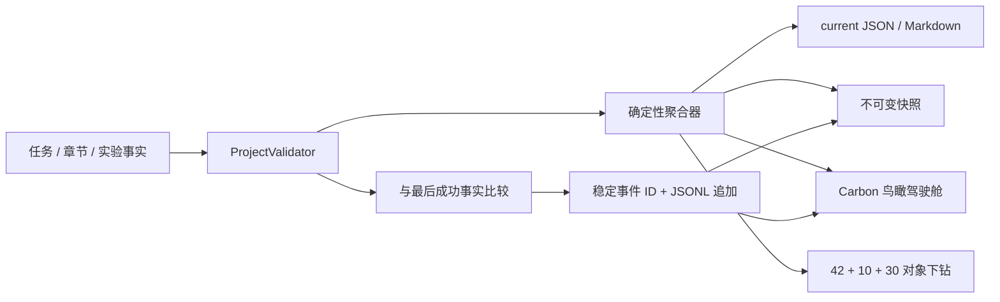

# Implementation Walkthrough: Visual Progress and Automatic Update Record

## Outcome

Bolt 002 已把三个版本化事实源连接成可运行的本地生成链。作者修改 `progress/tasks.json`、`progress/chapters.json` 或 `progress/experiments.json` 后，只需运行：

```text
python3 scripts/generate_progress.py
```

生成器会先校验事实，再更新当前指标、文字摘要、关键事件、不可变快照、变更日志、鸟瞰驾驶舱和对象下钻页。原行动指南保留不变。

## Implemented Data Flow



## Main Implementation

### Progress Core

`scripts/progress_core.py` 实现：

- 总完成率和 Must ×3、Should ×2、Could ×1 加权进度。
- Must/Should 单独完成率和六种任务状态分布。
- 当前 Day、剩余计划日、14 天时间线。
- 依赖满足过滤与优先级、工作状态、计划日期、稳定 ID 排序。
- blocked 原因和解除动作的独立输出。
- 10 章 × Question/Framework/Example/Experiment/Figure/Review 六阶段矩阵。
- SHIP/KEEP-EXT/ALREADY 与实验执行状态双重分布。
- Git commit 身份；无 commit 时使用三个权威事实的 SHA-256 指纹。
- 任务、章节阶段和实验变化的差异检测与稳定事件 ID。
- 首次初始化事件、重复事件去重和既有事件解析校验。

### Transactional Generator

`scripts/generate_progress.py` 实现：

1. 使用 Bolt 001 的校验器阻止非法事实。
2. 读取最后成功事实并计算关键差异。
3. 构造所有 JSON、Markdown 和 HTML 候选。
4. 验证候选 JSON 和页面核心结构。
5. 保存或复用来源唯一的不可变快照。
6. 保持原事件字节前缀不变，只追加新 JSONL 行。
7. 使用同目录临时文件和 `os.replace` 发布可替换投影。
8. 最后更新 `last-successful-facts.json`，作为成功标记。

CLI 支持 `--dry-run`、`--actor`、固定生成时间，以及显式记录里程碑、构建和版本事件。

### Human and Visual Renderers

`scripts/progress_render.py` 由同一份聚合对象生成：

- `progress/generated/current.md`：当前阶段、核心数字、阻塞、关键事件和下一动作。
- `progress/CHANGELOG.md`：仅在有关键事件时追加的变更记录。
- `site/index.html`：完整无 JavaScript 回退的鸟瞰驾驶舱。
- `site/details.html`：42 个任务、10 章和 30 个实验的稳定锚点与产物入口。

页面数字没有第二套手工来源。

## Dashboard Sections

鸟瞰页包含七个固定层级：

1. 两周目标总览：总体、加权、当前 Day、Must、Should 和阻塞。
2. 14 天时间线：每一天的完成数、当前日和阻塞提示。
3. 十章六阶段生产线：每章进度和下一缺口。
4. 实验治理队列：SHIP、KEEP-EXT、ALREADY 与执行状态。
5. 阻塞中心：原因与解除动作。
6. 最近关键更新：事件时间、摘要和稳定 ID。
7. 可立即执行：经过依赖与优先级排序的下一动作。

IBM Carbon 视觉变量参考作者本地 `working-book/ai_dlc_book_action_guide.html` 的白、黑、蓝、绿、红、黄体系。核心页面使用语义 landmarks、跳过导航、键盘焦点、文字/符号状态和 360px 响应式断点。

## Object-Level Drilldown

- 时间线的 Day 卡进入 `site/details.html#day-NN`。
- 下一动作和阻塞进入 `#task-DNN-TNN`。
- 章节行进入 `#chapter-CH-NN`。
- 实验区进入 30 个实验对象列表，每个实验拥有 `#experiment-EXP-NN-NN`。
- 任务详情直接链接声明的产物路径；所有对象保留返回权威 JSON 的入口。

未配置 GitHub remote，因此当前不制造 GitHub URL，而使用可工作的仓库相对路径。

## First Real Baseline

首次真实生成结果：

```text
[OK] source=working-tree-5c9b6ebc6169 tasks=42 chapters=10 experiments=30 new_events=1 total_events=1 snapshot=20260721T083907Z-working-tree-5c9b6ebc6169.json
```

当前自动聚合状态：

- 目标：两周形成可发布 v0.1。
- 当前：Day 1 / 14，剩余 13 个计划日。
- 任务：0 / 42，Must 0 / 40，Should 0 / 2。
- 章节：10 章，六阶段均等待作者开始。
- 实验：30 个；20 SHIP、9 KEEP-EXT、1 ALREADY。
- 阻塞：0。
- 下一动作：`D01-T01 · 写核心公式`。
- 历史：1 条 `system_initialized`，1 份初始快照。

第二次及后续相同事实运行结果为 `new_events=0`，事件账本、Changelog 和快照数量保持不变。

## Generated Artifacts

| Artifact | Role |
|----------|------|
| `progress/generated/current.json` | 当前机器指标 |
| `progress/generated/current.md` | 当前文字摘要 |
| `progress/generated/last-successful-facts.json` | 最后成功差异基线 |
| `progress/events/events.jsonl` | 追加式关键事件账本 |
| `progress/snapshots/20260721T083907Z-working-tree-5c9b6ebc6169.json` | 第一份不可变整体快照 |
| `progress/CHANGELOG.md` | 人类可读关键更新历史 |
| `site/data/progress.json` | 页面数据投影 |
| `site/index.html` | 鸟瞰驾驶舱 |
| `site/details.html` | 对象级下钻页 |
| `site/assets/dashboard.css` | Carbon 风格、响应式与无障碍样式 |
| `site/assets/dashboard.js` | 下一动作过滤的可选增强 |

核心 `site/` 资产当前约 105 KB，低于 2 MB 预算。

## Documentation Updated

- 根 `README.md` 增加驾驶舱、文字摘要、事件、快照和单一生成命令入口。
- `docs/PROGRESS-AUTOMATION.md` 说明指标、事件、来源、快照、失败安全和日常节奏。
- `docs/REPOSITORY-GUIDE.md` 明确 `site/` 与生成投影职责。
- `progress/README.md` 区分权威事实、当前投影和不可变历史。
- `scripts/README.md` 记录本地、dry-run 和显式事件命令。
- `site/README.md` 说明发布资产边界。

## Implementation-Stage Smoke Evidence

- 三个 Python 文件可通过 `py_compile`。
- `--dry-run` 正确加载 42 个任务、10 章和 30 个实验，未写盘。
- 首次真实运行创建一个初始化事件和一个快照。
- 相同事实重复运行后仍为 1 个事件、1 个快照。
- 重复运行前后事件账本与 Changelog 的 SHA-256 保持一致。
- 生成页包含主要内容、14 天、十章、实验、阻塞、事件、下一动作和对象锚点。
- `git diff --check` 无空白错误。

这些是实现阶段冒烟记录，不替代 Stage 3 的完整单元、集成、失败注入、链接和布局验证。

## Deliberately Not Changed

- 没有把任何 Day 1–14 写作任务标为完成。
- 没有修改作者本地 `working-book/ai_dlc_book_action_guide.html`，公开页面也不依赖该文件。
- 没有创建 Git commit、remote、GitHub 仓库、Actions、Pages 或 Projects。
- 没有伪造过去的任务、章节或实验事件。
- 没有安装第三方 Python 或 JavaScript 依赖。
