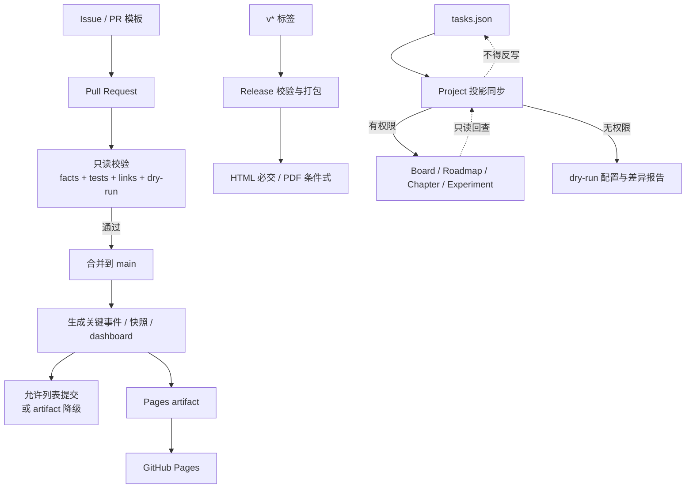

# Implementation Plan: GitHub Collaboration, Automation and Projection

## Objective

把 Bolt 001–002 已经在本地可运行的写作系统接入 GitHub：协作者使用统一 Issue/PR 格式，Pull Request 自动校验，主分支关键更新自动留痕并发布 Pages，版本标签形成不可覆盖的 Release 候选，GitHub Projects 作为可降级的鸟瞰投影。

本 Bolt 只创建和验证仓库内配置、脚本与文档。当前本地仓库没有 commit、remote 或 GitHub 项目地址，因此不会创建远程仓库、推送、部署 Pages、发布 Release 或修改真实 Project。所有远程变更都必须等到用户提供/确认目标仓库后，由显式操作触发。

## Current State

- Bolt 001 已交付 42 个任务、10 章、30 个实验及结构校验。
- Bolt 002 已交付确定性聚合、关键事件、不可变快照、Changelog、驾驶舱和对象下钻。
- 32 个 unittest、真实事实校验、140 个页面链接和 360px/1280px 浏览器验收均通过。
- 本地 Git 已初始化为 `main`，但当前没有 commit，也没有 remote。
- GitHub CLI 2.93.0 可用；`actionlint` 当前不可用。
- Pandoc 与 XeLaTeX 当前不可用；Release 必须明确 HTML 必交、PDF 条件式交付。
- `.github/workflows/` 只有职责说明，没有实际 workflow。

## Outcome at a Glance

## Deliverables

### 1. Collaboration Templates and Taxonomy

Planned files:

- `.github/ISSUE_TEMPLATE/writing.yml`
- `.github/ISSUE_TEMPLATE/experiment.yml`
- `.github/ISSUE_TEMPLATE/bug.yml`
- `.github/ISSUE_TEMPLATE/feedback.yml`
- `.github/ISSUE_TEMPLATE/config.yml`
- `.github/pull_request_template.md`
- `.github/labels.yml`
- `docs/GITHUB-COLLABORATION.md`
- `planning/github-milestones.md`

Issue Forms 固定要求：Task ID（反馈可为 `N/A` 并解释）、目标、产物、二元验收、优先级/阶段以及必要的章节或实验 ID。PR 模板要求任务列表、变更类型、事实/内容/生成物边界、测试/构建结果、验收、风险和截图/不适用说明。

标签分类覆盖：

- 类型：writing、experiment、engineering、review、release、bug、feedback。
- 优先级：must、should、could。
- 阶段：foundation、progress、github、release。
- 对象：chapter、experiment。
- 状态：blocked。

里程碑文档定义 v0.0.1 与 v0.1 的用途、包含范围、明确不包含项、完成门禁和关闭条件。未连接远程仓库时，标签与里程碑配置仍可本地审阅。

### 2. Reusable Local/CI Checks

避免把校验逻辑只写在 YAML 中，新增标准库脚本：

- `scripts/check_internal_links.py`：检查仓库内 Markdown/HTML 相对链接、HTML fragment 和生成页面资产；外部链接只列出，不联网阻断。
- `scripts/validate_pr_metadata.py`：校验 PR body 中至少存在 Task ID、测试结果和验收确认；本地可读取文件，CI 可读取事件 payload。
- `scripts/ci_check.py`：按顺序执行事实校验、unittest、生成 dry-run、链接检查和 PR 元数据检查，并汇总阶段时间与修复提示。
- `docs/CI-RUNBOOK.md`：给出与 GitHub Actions 完全相同的本地命令、失败解释和 60 秒预算。

`ci_check.py` 只使用 Python 标准库，通过子进程返回码传播 Must 失败。每个失败都指出命令、文件/对象和修复入口。

### 3. Pull Request Validation Workflow

`.github/workflows/validate.yml`：

- 触发：`pull_request`、`workflow_dispatch`。
- 顶层权限：`contents: read`；不请求 secrets，不使用 `pull_request_target`。
- 并发：同一 PR 新运行取消旧运行。
- 超时：核心 job 2 分钟，目标实际运行 <60 秒。
- 步骤：checkout → Python 环境 → `scripts/ci_check.py` → 上传失败诊断（仅必要时）。
- Fork PR 与同仓库 PR 使用同一路径，不获得 Pages、Release 或 Project 凭证。
- 文案变更仍运行事实结构、测试、dry-run 和内部链接；外部 URL 波动不阻断。

实施时将联网核对 GitHub 官方 Actions 的当前受支持版本，并使用官方仓库的完整 commit SHA 固定，旁注对应 major，避免浮动 tag 供应链风险。

### 4. Main Progress Record and Pages Workflow

`.github/workflows/pages.yml` 采用“默认只读、特权 job 单独提升”的结构：

1. `validate`：只读，运行共享检查。
2. `build`：只读，运行真实 `generate_progress.py`，构造 Pages 发布目录并上传 artifact。
3. `record`：仅 main 非机器人 push；`contents: write`；只允许提交下列生成路径：
   - `progress/generated/`
   - `progress/events/events.jsonl`
   - `progress/snapshots/`
   - `progress/CHANGELOG.md`
   - `site/index.html`、`site/details.html`、`site/data/`
4. `deploy`：仅 environment `github-pages`；只授予 `pages: write` 与 `id-token: write`。

记录 job 使用 `[progress]` bot commit，并在机器人触发的后续 workflow 中跳过写入，避免递归提交。若分支保护不允许 bot push，生成结果仍作为 artifact/Pages 候选保留，同时给出“需要维护者 PR 或调整权限”的清晰降级说明，不反写事实源。

Pages 发布树保留驾驶舱相对链接所需结构：

- 根入口重定向到 `site/index.html`。
- `site/`、选定 `progress/` 投影与事实、`docs/`、`planning/`、根 README 和现有行动指南。
- 发布 manifest 包含来源 SHA、生成时间、workflow run 和产物清单。

构建失败时不调用 artifact/deploy/record 后续步骤，不能把旧产物冒充为当前提交。

### 5. Release Workflow and Packaging

Planned files:

- `.github/workflows/release.yml`
- `scripts/prepare_release.py`
- `docs/RELEASE-AUTOMATION.md`
- `release-manifest.schema.json` 或等价 Markdown schema

触发：不可变语义版本标签 `vMAJOR.MINOR[.PATCH][-suffix]` 和手动 dry-run。流程：

1. 验证 tag 指向的 commit、事实、测试、链接和生成投影。
2. 拒绝覆盖已存在的正式 Release。
3. 创建带来源 SHA、生成时间、版本、文件哈希和已知缺口的 release manifest。
4. 构造 HTML/站点 zip，作为 v0.1 的必交浏览产物。
5. 仅在 Pandoc + XeLaTeX 可用且书稿入口完整时生成 PDF；否则 manifest 明确 `pdf: skipped` 与安装/重试方法，不把占位文件命名为 PDF。
6. 使用 GitHub CLI 创建 draft Release 和自动 notes，再上传 manifest、HTML zip，以及存在时的 PDF。

权限只在最终 release job 使用 `contents: write`。重复标签/Release 明确失败，不覆盖正式资产。

### 6. GitHub Projects Schema and Degraded Sync

Planned files:

- `planning/github-project.json`：可机器读取的字段、选项、视图和状态映射。
- `docs/GITHUB-PROJECTS.md`：人工创建/检查清单、权限和权威性规则。
- `scripts/sync_github_project.py`：默认 dry-run；显式 `--apply` 才调用 GraphQL。
- `.github/workflows/project-sync.yml`：手动触发和可选 main 更新；缺少 Token 时生成降级报告。
- `progress/generated/project-sync-report.json`：replaceable 投影差异报告，不是事实源。

Project 字段固定为 Status、Priority、Type、Day、Chapter、Experiment、Milestone、Artifact、Task ID。视图固定为：

- Board：按 Status 分列，blocked 显著标记。
- Roadmap：Day 1–14，按计划日排序。
- Chapters：按 Chapter 分组。
- Experiments：按 Experiment/Triage 过滤与分组。

同步身份使用稳定 Task ID；Issue body 中保留机器 marker，重复运行先索引已有 item，不创建重复项。

权威方向固定为 repository → Project。远程 Project 状态与事实源不一致时，输出 divergence，默认退出且不修改任何一端；必须由维护者选择“重新投影”或先人工更新仓库事实。缺少仓库地址、Project number、Token、字段或权限时进入 `degraded`，输出下一步，不修改事实源。

## Workflow Security Model

| Workflow/Job | Default Permission | Elevated Permission | Secret Access |
|--------------|--------------------|---------------------|---------------|
| PR validate | `contents: read` | None | None |
| Main validate/build | `contents: read` | None | None |
| Generated record | `contents: read` | `contents: write` | `GITHUB_TOKEN` only |
| Pages deploy | `contents: read` | `pages: write`, `id-token: write` | OIDC only |
| Release publish | `contents: read` | `contents: write` | `GITHUB_TOKEN` only |
| Project dry-run | `contents: read` | None | None |
| Project apply | `contents: read` | Token-defined Project scope | `PROJECT_TOKEN` only |

Rules:

- 不使用 `pull_request_target` 执行来自 Fork 的代码。
- 第三方 action 禁止浮动 tag；优先 GitHub 官方 action，固定完整 SHA。
- secrets 不打印、不写 artifact、不进入生成事件。
- write 权限只在需要外部副作用的 job 声明。
- Project Token 不存在时不是事实生成失败，而是明确降级。

## Story-to-Deliverable Mapping

| Story | Planned Evidence |
|-------|------------------|
| 012 · 协作模板 | 4 个 Issue Forms、PR 模板、labels、v0.0.1/v0.1 milestones 文档与 schema 测试 |
| 013 · PR 校验 | 共享 CI 脚本、只读 validate workflow、PR metadata 校验、<60 秒本地基准 |
| 014 · Pages/Release | main 生成与记录、Pages 发布树、tag/draft Release、source manifest、HTML 必交/PDF 条件式 |
| 015 · Projects | 9 字段、4 视图、稳定 ID、dry-run/apply、缺权限降级与 divergence 报告 |

## Implementation Sequence

1. 创建 Issue Forms、PR 模板、标签、里程碑和协作文档。
2. 抽取内部链接与 CI 编排脚本，保证本地先可运行。
3. 创建 PR validate workflow，并固定官方 Actions SHA。
4. 创建 Pages 发布树构造与 main 生成/允许列表记录流程。
5. 创建 Release 打包脚本、manifest 和 tag workflow。
6. 创建 Project schema、dry-run 同步器、差异报告和手动 workflow。
7. 更新 README、workflow README 和运行手册。
8. 用本地夹具、YAML 结构解析、mock GitHub HTTP、静态权限审计和真实计时验证。

## Test and Verification Plan

### Collaboration Files

- 解析 Issue Form YAML，确认必需字段、labels 和联系方式结构。
- PR 模板必须含 Task ID、变更类型、测试/构建、验收和风险段落。
- labels 名称/颜色唯一；taxonomy 覆盖规定维度。
- v0.0.1、v0.1 均有范围和关闭门禁。

### CI and Workflow Contracts

- 使用 Python 标准库或仓库内轻量解析器检查 YAML 触发、job、needs、timeout、permissions、if 和 action pin。
- PR workflow 不含 `pull_request_target`、write 权限或 secret 引用。
- Fork 情境静态验证只走只读 job。
- 故意破坏事实、链接和 PR body，确认共享 CI 返回非零和修复建议。
- 真实项目核心检查连续计时，目标 <60 秒。

### Pages and Release

- 临时目录构造 Pages tree，验证所有站内链接在发布根可解析。
- 构建失败注入后不存在新 current marker、deploy/record 条件不满足。
- release manifest 含 SHA、时间、版本、哈希、HTML/PDF 状态。
- 无 Pandoc/XeLaTeX 时 HTML 成功、PDF 明确 skipped；禁止伪 PDF。
- 同版本已有 Release 时脚本拒绝覆盖。

### Project Sync

- 无 remote、无 Token、无 Project number、权限失败分别产生 `degraded` 报告且退出策略明确。
- dry-run 不发网络请求、不修改事实源。
- mock GraphQL 测试稳定 Task ID 索引和重复运行去重。
- 字段重命名、远程归档和状态分叉均产生 divergence，不静默覆盖。
- 对运行前后三个权威事实 JSON 计算哈希，确认同步零反写。

### Regression

- Bolt 001–002 的 32 个 unittest 全部通过。
- 真实 42/10/30 事实校验通过。
- 驾驶舱、事件、快照和下钻结果不退化。
- `git diff --check` 通过。

## Constraints

- 不创建或猜测 GitHub remote、owner、repository、Project number 或可见性。
- 不请求、读取或写入真实 Token；只提供 secret 名称和降级路径。
- 不执行 `gh repo create`、`git push`、Pages deploy、Release publish 或 Project mutation。
- 不把 GitHub Project 变为事实源，不实现默认双向同步。
- 不声称当前已生成 PDF；本机缺少 Pandoc/XeLaTeX。
- 不自动提交当前大型未跟踪工作树。
- 核心运行继续只依赖 Python 标准库；GitHub Actions 使用官方运行环境能力。

## Decisions Requiring No Additional Authority

- Issue 使用 GitHub Issue Forms YAML，PR 使用 Markdown 模板。
- PR 验证默认只读并覆盖所有文案改动。
- Pages HTML 是必交产物，PDF 是依赖可用时的条件式产物。
- Project 同步默认 dry-run，`--apply` 和 Token 同时存在才允许远程写入。
- 远程状态分叉时报告而不反写。
- 当前只创建本地配置与测试，不安装 GitHub 插件，也不触发外部副作用。

## Authority Required Later

以下动作不在本 Bolt 的当前自动授权范围内，实施完成后仍需用户明确提供/确认：

- GitHub owner/repository 与公开/私有可见性。
- 是否创建首个 commit 并推送当前工作区。
- 是否启用 Pages 和允许 Actions 写入主分支。
- Project owner、Project number 与 Token 类型/权限。
- 是否真正创建 labels、milestones、Project views 和 Release。

## Open Risks

- 分支保护可能阻止 Actions bot 直接记录生成文件，需要切换为自动 PR；计划保留 artifact 降级路径。
- GitHub Projects V2 的 Token 和字段 API 权限差异较大，真实 apply 必须在目标仓库确定后验证。
- 官方 Actions major 与 SHA 会随时间更新，Stage 2 必须从官方来源核对，不凭记忆固定。
- 仓库当前无首个 commit，无法在本地完整模拟 `github.sha`、tag 和 bot recursion；通过临时 Git 夹具覆盖。
- Pages 相对链接跨 `site/`、`progress/`、`docs/` 和 `planning/`，发布树必须有独立链接审计。
