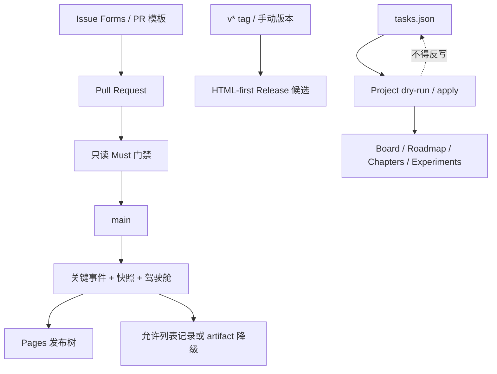

# Implementation Walkthrough: GitHub Collaboration, Automation and Projection

## Outcome

Bolt 003 已在本地仓库中接好 GitHub 协作与交付层：统一 Issue/PR 输入、只读 Pull Request 门禁、主分支进度自动记录、Pages 发布树、HTML-first Release 候选，以及默认 dry-run 的 GitHub Projects 单向投影。

当前仓库仍没有 commit、remote 或 Project 地址。本阶段没有创建 GitHub 仓库、推送、部署、Release 或 Project item；所有远程副作用仍需后续明确授权和目标配置。

## Delivery Flow



## Collaboration Contract

新增四个 Issue Forms：Writing、Experiment、Bug、Feedback。每个表单要求稳定 Task ID（允许解释后的 `N/A`）、目标/观察、产物和可判断验收；实验表单额外要求 Experiment ID、Chapter 和 SHIP/KEEP-EXT/ALREADY 分类。

PR 模板要求关联任务、变更类型、目标、产物、测试与构建结果、验收、风险和回滚。`scripts/validate_pr_metadata.py` 会拒绝缺少有效 Task ID、核心段落、至少一个已确认清单项，或仍保留占位提示的 PR 正文。

`.github/labels.yml` 定义类型、优先级、阶段、章节/实验对象和 blocked 标签。`planning/github-milestones.md` 定义 v0.0.1 与两周 v0.1 的用途、范围、排除项和关闭门禁。它们当前是可审阅配置，不会静默修改远端。

## Shared CI Gate

本地与 Pull Request 共用：

```text
python3 scripts/ci_check.py --budget-seconds 60
```

门禁依次运行：

1. 42/10/30 事实源校验。
2. GitHub 工作流、模板、标签和 Project 契约校验。
3. 全部 unittest。
4. 进度生成 dry-run。
5. Markdown/HTML 仓库内链接检查。
6. PR 环境中的正文元数据检查。

`docs/CI-RUNBOOK.md` 记录本地等价命令、失败定位和降级边界。外部链接不在 Must 门禁中联网抓取，重型 PDF 构建也不占用核心 60 秒预算。

## Workflow Security

四条 workflow 已创建：

| Workflow | Purpose | Privilege model |
|---|---|---|
| `validate.yml` | PR 事实、测试、链接和生成门禁 | 全程 `contents: read`，无 secrets |
| `pages.yml` | main 生成、关键记录、Pages 构建/部署 | 默认只读；record、deploy job 分别最小提升 |
| `release.yml` | 版本校验、候选构建、draft Release | 仅 publish job 使用 `contents: write` |
| `project-sync.yml` | 手动 Project 投影 | 默认 dry-run；Token 只在显式 apply 使用 |

所有 `uses:` 均锁定到官方 Action 的 40 位 commit SHA，并旁注版本：checkout v7.0.1、setup-python v7.0.0、upload-artifact v7.0.1、download-artifact v8.0.1、configure-pages v6.0.0、upload-pages-artifact v5.0.0、deploy-pages v5.0.0。

PR workflow 不含 `pull_request_target`、write 权限或 secret 引用。`scripts/validate_github_config.py` 会持续检查这些约束，避免安全边界被后续 YAML 编辑悄然移除。

## Automatic Visual Record and Pages

`pages.yml` 在 main 校验成功后运行真实进度生成器，因此关键任务、章节、实验、里程碑、构建或版本变化继续形成 JSONL 事件、不可变快照、Changelog 和鸟瞰驾驶舱。

记录 job 只暂存显式允许列表中的生成路径，并使用 `[progress] ... [skip ci]` 机器人提交避免递归。若分支保护拒绝 bot push，`progress-record.tgz` artifact 保留同一批记录，维护者可通过 PR 恢复。

`scripts/prepare_pages.py` 使用带 `.aidlc-generated` 标记的临时树进行替换，输出：

- 根跳转入口与 `site/` 驾驶舱。
- `progress/` 事实、事件、快照和当前投影。
- `book/`、`planning/`、`docs/`、必要测试证据与 GitHub workflow 说明。
- `publish-manifest.json`，记录 source ID、commit SHA、生成时间、workflow run、文件大小和 SHA-256。

发布树链接审计最初发现驾驶舱链接到 `tests/test_validate_project.py` 而候选未包含测试证据；实现阶段已把 `tests/` 纳入发布树，重建后 189 个站内链接零错误。

## Release Candidate

`scripts/prepare_release.py v0.1` 生成：

- `aidlc-book-v0.1-html.zip`：HTML 必交产物。
- `release-manifest.json`：版本、来源、commit、时间、哈希和 HTML/PDF 状态。
- `release-notes.md`：人工审阅入口。
- 仅在显式提供且确为 `.pdf` 的已验证文件时加入 PDF；否则记录 `pdf: skipped`、原因和重试方式，不创建伪 PDF。

输出目录必须带生成标记才允许替换。远端同名 Release 已存在时，workflow 在创建 draft Release 前明确停止，不覆盖正式资产。

## GitHub Projects Projection

`planning/github-project.json` 定义 9 个字段：Status、Priority、Type、Day、Chapter、Experiment、Milestone、Artifact、Task ID；定义 Board、Roadmap、Chapters、Experiments 四个鸟瞰视图。

`scripts/sync_github_project.py` 使用 Issue body 中的稳定 marker `<!-- aidlc-task:DNN-TNN -->` 建立身份。默认 dry-run，不发网络请求；缺 repository、owner、number 或 Token 时生成 `degraded` 报告。重复 marker、字段缺失或 Project Status 与仓库事实分叉时报告并停止。只有明确 `--apply` 才允许远程创建/更新，且运行前后三个权威 JSON 的哈希必须一致。

由于 Projects V2 的视图配置接口限制，字段/item 可由脚本投影，四个 view 按 `docs/GITHUB-PROJECTS.md` 的人工清单创建与核验。

## Implementation-Stage Evidence

- 7 个新增 Python 入口通过 `py_compile`。
- 10 个 GitHub YAML 文件通过本机 YAML 解析。
- GitHub 配置契约：4 workflows、4 Issue Forms、9 fields、4 views，零错误。
- 共享 CI：5 checks，32 tests，1.716 秒 / 60 秒，零错误。
- 仓库链接：23 files、185 internal、2 external-not-fetched，零错误。
- Pages 候选：44 files，发布树 189 个内部链接零错误。
- Release 候选：45 个 zip entry；HTML included；PDF skipped；zip CRC 零错误。
- Projects 无目标配置：`dry-run` + `degraded`，42 个期望任务，三个事实源前后哈希一致。

这些是 Stage 2 实现冒烟，不替代 Stage 3 的完整回归、失败注入、HTTP mock、幂等与安全测试。

## Files Added or Updated

- `.github/ISSUE_TEMPLATE/`、`.github/pull_request_template.md`、`.github/labels.yml`
- `.github/workflows/{validate,pages,release,project-sync}.yml`
- `scripts/{check_internal_links,ci_check,prepare_pages,prepare_release,sync_github_project,validate_github_config,validate_pr_metadata}.py`
- `planning/github-milestones.md`、`planning/github-project.json`
- `docs/{CI-RUNBOOK,GITHUB-COLLABORATION,GITHUB-PROJECTS,RELEASE-AUTOMATION}.md`
- 根 README、仓库指南、脚本说明和 workflow 说明

## Deliberately Not Performed

- 未创建首个 commit 或设置 Git remote。
- 未创建或安装远端 labels、milestones、Project fields/views/items。
- 未推送 main、启用 Pages、触发 workflow、创建 tag 或 Release。
- 未读取、保存或打印任何 GitHub Token。
- 未把 GitHub Project 设为事实源，也未实现默认双向同步。
