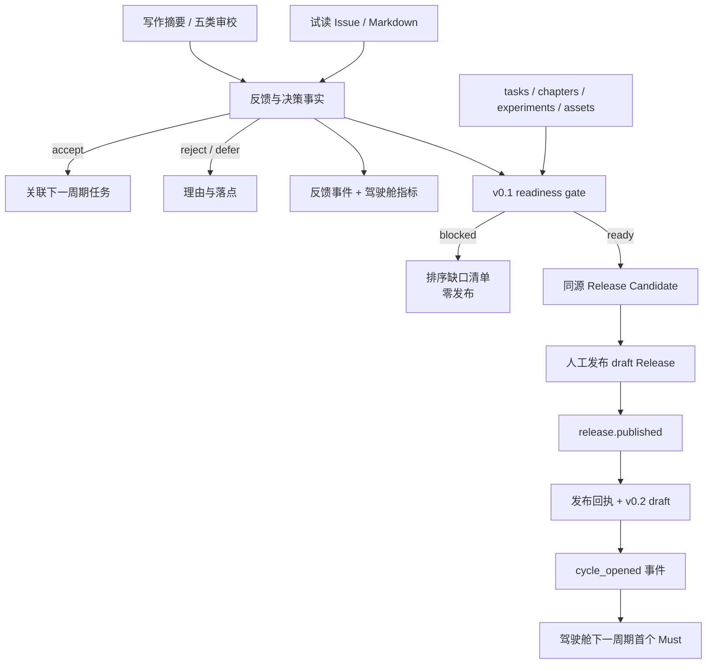

# Implementation Plan: Review, v0.1 Release Gate and Continuous Update Cycle

## Objective

完成写作系统的最后闭环：把写作决策、五类审校和试读反馈变成版本化事实与后续任务；为 v0.1 建立不可绕过、可解释的发布门禁和同源候选；在真实 v0.1 发布后自动形成 v0.2 draft，并让鸟瞰驾驶舱立即显示下一周期首个可执行 Must。

本 Bolt 建设和验证“闭环能力”，不代替作者完成样章、实验、核心图或真实试读，也不在没有 remote 的本地仓库中伪造发布。当前真实写作进度仍为 0/42，20 个 SHIP 实验均未验证，样章、核心图、书稿构建和发布回执尚不存在；因此 Stage 2 的真实 v0.1 readiness 预期是 `blocked`，并输出按优先级排序的缺口，而不是制造一个通过结果。

## Scope Interpretation

用户最初要求的是“从 0 起步、在 GitHub 写作和持续更新的详细行动规划”，不是要求本次 Construction 自动写完整本书或替用户联系试读者。因此：

- 可以创建模板、事实模型、校验器、生成器、工作流和诚实的 readiness 报告。
- 可以用临时完整 fixture 验证“满足全部门禁时可以发布”。
- 不会把仅有空模板的文件认作可读样章、有效实验或真实反馈。
- 不会仅因 Bolt 001–003 的工程能力已完成，就把 Day 1–14 写作任务批量改为 `done`。
- 不会声称已有三位试读者、公开 Pages、GitHub Release 或 v0.1 tag。

## Current State and Gap

| Layer | Current evidence | Release meaning |
|---|---|---|
| 系统能力 | 59 tests、4 workflows、Pages/Release/Projects 本地验证通过 | 发布机器已经具备 |
| 写作事实 | 42 tasks：0 done；40 Must：0 done | v0.1 内容尚未完成 |
| 章节 | 10 章结构存在，六阶段均 pending | 结构成立，样章未达可读标准 |
| 实验 | 30 个；20 SHIP、9 KEEP-EXT、1 ALREADY；状态 planned/ready | 尚无已验证的 10 分钟实验 |
| 视觉 | 驾驶舱存在；任务声明的核心图尚不存在 | 系统视觉完成，书稿核心图缺失 |
| 发布 | HTML-first 打包器通过；PDF 条件式 | 候选构建能力存在，真实 v0.1 不可发布 |
| 远端 | 无 commit、remote、Pages、Release、Project | 不能执行真实外部发布与回读 |

## Outcome at a Glance

## Deliverable 1 · Review and Writer Decision Records

Planned files:

- `writer-chats/template.md`
- `planning/reviews/chapter-review-template.md`
- `planning/reviews/sample-chapter.md`
- `docs/LEARNING.md`
- `docs/READER-GUIDE.md`

Writer Chat 模板只保存摘要而不是完整私密对话，固定字段为日期、Task ID、问题、关键提示/上下文摘要、采用方案、放弃方案、理由、影响文件和下一动作。模板显著提醒移除 Token、Cookie、个人身份和未经许可原文。

审校模板固定五类结论：

1. 技术正确性与过度承诺。
2. 重复内容和概念边界。
3. 结构连贯性与读者路径。
4. 术语一致性。
5. 正文观点与实验/图/练习的对应。

每条 issue 必须记录严重度、影响、建议、文件/锚点、决策、负责人和关闭证据。`planning/reviews/sample-chapter.md` 初始明确写为“尚无可审样章”，不能以空表勾选通过。

`docs/LEARNING.md` 提供入门、实践、跳读三条路径；`docs/READER-GUIDE.md` 给三位试读者一个仅依靠 README/Pages/Release 的阅读与复现实验入口，但不记录姓名或联系方式。

## Deliverable 2 · Feedback as a Versioned Decision Source

Planned files:

- `feedback/decisions.json`
- `progress/schemas/feedback-schema.md`
- `planning/feedback-template.md`
- `planning/reader-invitations.md`
- `scripts/validate_feedback.py`
- `scripts/record_feedback.py`

每条反馈使用稳定 `FB-NNN`，字段包括：来源类型、匿名 reader slot、对象（章节/实验/页面）、最小证据摘要、决策、理由、关联 Task/Cycle Task、创建/决定时间和状态。

Decision 只允许：

- `accepted`：必须关联一个已有任务或下一周期任务，并带二元验收。
- `rejected`：必须记录不采纳理由。
- `deferred`：必须记录目标版本/周期和重新评估条件。
- `pending`：尚未决定，不计入接受/拒绝/延期统计。

正文只保存必要摘要，不保存邮箱、聊天账号、Cookie、完整表单导出或未经同意的原文。`planning/reader-invitations.md` 使用 Reader A/B/C 匿名槽位记录 `not-invited / invited / responded` 和时间；Stage 2 不会把槽位伪造为已邀请或已响应。

`record_feedback.py` 默认 dry-run。显式 `--apply` 时先校验候选，再写反馈事实；accepted 反馈没有任务关联时拒绝写入。成功决定通过进度生成器记录稳定 `feedback_decided` 事件。

## Deliverable 3 · Feedback and Cycle Visibility

Changes:

- 将 `feedback/decisions.json` 与 `progress/cycles.json` 纳入版本化来源身份和成功比较基线。
- `progress_core.py` 聚合 pending/accepted/rejected/deferred 数量、未关联 accepted 数量和 reader slot 状态。
- `progress_render.py` 在驾驶舱增加“反馈闭环”和“下一周期”区块。
- 反馈决策、release receipt 和 cycle 激活生成稳定事件；初始化空集合不伪造历史事件。
- `site/details.html` 为每个反馈和 cycle task 提供稳定锚点。

关键更新仍走同一 JSONL、不可变快照、Changelog 和 Pages 链，因此每个接受/拒绝/延期决策、真实发布和周期开启都有自动可视记录。

## Deliverable 4 · Evidence Reconciliation Without False Completion

Planned files:

- `scripts/audit_roadmap_evidence.py`
- `planning/releases/roadmap-evidence.md`

审计器把 42 个任务分为：

- `verified`：状态与已通过验收一致，必需产物存在。
- `artifact-present-review-required`：文件存在，但内容/作者判断未验收。
- `missing`：缺产物、依赖或验收。
- `path-divergence`：规划路径与实际等价实现不同，需要作者更新事实或补兼容入口。

该工具只生成报告，绝不自动把任务改为 done。作者确认后仍通过 `progress/tasks.json` 的正常状态流更新，生成器会自动记录任务状态变化和驾驶舱进度。

这一步特别处理 D08–D11 的路径差异，例如 `site/details.html` 与计划中的 `site/progress.html`、`.github/pull_request_template.md` 与早期计划路径；不会用“相似文件存在”静默通过。

## Deliverable 5 · Machine-Readable v0.1 Definition of Done

Planned files:

- `planning/releases/v0.1-policy.json`
- `planning/releases/v0.1-checklist.md`
- `scripts/check_release_readiness.py`
- `releases/v0.1-rc/readiness.json`
- `releases/v0.1-rc/readiness.md`

Policy 将已批准的 v0.1 MVP 转成二元门禁：

1. 全部 Must 任务为 done、acceptance 全通过、必需产物存在、零 blocked Must。
2. 十章结构存在且核心问题唯一。
3. 至少一个样章不是模板/占位，达到政策定义的结构和人工 review 结论。
4. 至少一个 SHIP 实验处于 validated/done 等发布允许状态，README、命令、样例输入输出与测试均存在，并通过 10 分钟复现记录。
5. 至少一张核心图存在、被样章引用，并记录源文件/再生成方法。
6. 事实校验、59+ tests、内部链接、进度 dry-run、Pages tree 和 HTML Release 构建均通过。
7. README、学习路线、Reader Guide、反馈入口、五类审校和 Release Notes 存在且非占位。
8. candidate manifest 的 source/commit/time/hash 完整；HTML 必交。PDF 按 Bolt 003 已批准策略为条件式：存在则结构校验并列入；不存在必须明确 skipped 和重试方法，不能伪造。
9. 已知缺口公开；缺口若影响任一 Must 则阻止发布，不能以 Release Notes 披露代替门禁。
10. 下一版本目标与周期入口策略存在，但只有真实 v0.1 published receipt 后才激活。

输出 gap 固定排序：Must blocker → Must missing → review required → Should/reader-response known gap。每项包含 code、priority、object、evidence、fix 和 owner。相同事实、policy 和 source 生成等价报告。

当前真实仓库运行预期返回非零并写出完整 gap 报告；临时完整 fixture 用于证明 ready 路径返回零。

## Deliverable 6 · Release Notes and Candidate Enforcement

Planned files/changes:

- `scripts/render_release_notes.py`
- `releases/v0.1-rc/release-notes.md`
- `planning/releases/v0.1.md`（发布回执模板，初始状态 `not-published`）
- `scripts/prepare_release.py`
- `.github/workflows/release.yml`
- `docs/V0.1-RELEASE-RUNBOOK.md`

Release Notes 从 readiness、current metrics、experiments、feedback 和 next goal 生成，固定包含：新增内容、实验状态、关键指标、已知缺口、来源提交、产物哈希、反馈入口和 v0.2 目标。

Release workflow 调整为：

1. 共享 CI。
2. 生成 readiness JSON/Markdown，即使 blocked 也上传诊断 artifact。
3. 独立 enforce step 在 blocked 时返回非零，后续 build/publish 不运行。
4. ready 后用同一 commit 构造确定性候选与生成 Release Notes。
5. 最终 job 仍只创建 draft Release，不擅自公开。
6. 同名 Release 存在时拒绝覆盖。

`prepare_release.py` 接受 readiness 和生成 notes，只在 `status=ready`、source/commit 一致时生成 v0.1 正式候选。普通开发 smoke 仍可使用明确的 pre-release 测试模式，但不得误标为 ready v0.1。

## Deliverable 7 · v0.2 Draft and Post-Release Automation

Planned files:

- `progress/cycles.json`
- `progress/schemas/cycle-schema.md`
- `scripts/open_next_cycle.py`
- `planning/releases/v0.2-draft.md`
- `releases/v0.1/release.json`（只由真实 published event 形成）
- `.github/workflows/post-release.yml`

Cycle draft 固定字段：cycle ID、version target、origin release/version/source/URL、status、monthly release target、weekly cadence、candidate tasks、accepted feedback、carried gaps 和 next Must。

默认 v0.2 节奏至少包含：

- 每周一节可读内容。
- 每周一次实验运行/结果更新。
- 每周一次构建或审校。
- 每月一个可读 Release 目标。

`open_next_cycle.py`：

- 默认 dry-run，读取未完成 Should、accepted feedback 和已知缺口。
- 没有 accepted feedback 时，从公开缺口和未完成 Should 生成候选。
- 没有真实 `release.published` receipt 时只能生成 inactive preview，不能激活 cycle。
- 有 receipt 时生成稳定 cycle tasks，重复运行幂等，不修改 v0.1 已完成任务。
- 至少一个新周期 Must 为 ready 且依赖满足，否则失败。

`post-release.yml` 只响应 GitHub `release: published`，检出发布 tag，核对 manifest/source，记录 `release_published` 与 `cycle_opened`，生成 v0.2 draft 和更新后的驾驶舱。由于主分支保护和发布 tag 不应被直接修改，workflow 优先创建自动化分支/PR；若权限或 push 失败，上传包含 receipt、cycle、事件和页面的 recoverable artifact。不会自动发布 v0.2。

远端 PR 创建需要 `contents: write` 与 `pull-requests: write`，只存在于 published-release job。Fork、PR validate、dry-run 和候选构建均不读取这些权限或 secret。

## Story-to-Deliverable Mapping

| Story | Planned evidence |
|---|---|
| 016 · 审校反馈闭环 | Writer Chat/Review/Reader 模板、feedback schema/validator/recorder、决策→任务约束、反馈驾驶舱 |
| 017 · v0.1 发布 | machine policy、真实 blocked 报告、passing fixture、notes、同源 candidate、workflow enforce、runbook |
| 018 · 下一周期 | cycle fact/schema、release receipt、v0.2 draft、post-release workflow、next Must 驾驶舱与历史不重置测试 |

## Implementation Sequence

1. 创建 Writer Chat、五类审校、Learning、Reader Guide 和匿名 reader slots。
2. 建立 feedback 事实、schema、validator 和安全 recorder。
3. 扩展来源身份、事件、快照和驾驶舱，展示反馈决策。
4. 实现 roadmap evidence audit，形成真实现状而不改任务状态。
5. 建立 v0.1 policy、readiness gate 和排序 gap 报告。
6. 生成完整 Release Notes；把 readiness enforce 接入 release workflow。
7. 建立 cycle schema/opening script、v0.2 draft 和发布后 workflow。
8. 扩展驾驶舱 next action，只有真实发布回执后切入 active cycle。
9. 更新 README、进度、发布和反馈运行手册。
10. 执行 failure injection、完整 fixture、actionlint、全回归和真实 blocked 验收。

## Test and Verification Plan

### Review and Feedback

- 五类审校缺任一结论时失败。
- accepted 缺任务/验收失败；rejected 缺理由失败；deferred 缺目标周期失败。
- 重复 Feedback ID、非法 decision、无时区时间失败。
- pending 不计入已决策统计；匿名来源允许，个人敏感字段拒绝。
- 相互冲突反馈保持独立决策，不互相覆盖。

### Automatic Visual Record

- feedback accepted/rejected/deferred 各生成一条稳定事件；重复运行不追加。
- cycle preview 不产生 `cycle_opened`；真实 receipt 激活时只产生一次。
- 快照 source fingerprint 包含 feedback/cycle facts。
- 驾驶舱反馈数量、accepted task link、cycle next Must 与详情锚点一致。

### Release Readiness

- 在真实仓库上必须 blocked，且 gap 包含未完成 Must、样章、实验、核心图和远端发布缺口。
- 缺任一最小 DoD 产物的 fixture 返回非零；报告仍落盘。
- 空模板、极短占位、伪 PDF、未验证实验不能骗过门禁。
- 完整 fixture 返回 ready 并生成完整 notes/candidate。
- blocked workflow 不进入 build/publish；Actionlint 验证 needs/if/permissions。
- source SHA 不一致、重复 Release 和候选 hash 不一致明确失败。

### Next Cycle

- 无 release receipt 只生成 inactive preview。
- published receipt 后生成 v0.2 draft；重复运行字节等价且不重复任务。
- 原 v0.1 done 状态及其文件哈希不变。
- 有 accepted feedback 时任务可追溯；没有时使用 Should/gaps fallback。
- 新周期包含每周内容、实验、build/review 和 monthly target。
- active cycle 至少一个依赖满足的 Must；驾驶舱下一动作非空。

### Regression and Security

- 当前 59 tests 全部通过并增加 Bolt 004 覆盖。
- 核心 CI 仍小于 60 秒。
- Pages/Release 内部链接零错误，核心页面低于 2 MB。
- GitHub workflows 通过 actionlint，Action 固定 SHA。
- secret/PII 模式扫描零命中。
- `git diff --check`、重复生成和事实哈希检查通过。

## Completion Semantics

Bolt 004 的代码/系统验收与真实内容发布状态分开记录：

- Story capability 可在实现、fixture 和失败门禁全部通过后标记 implemented。
- 真实 v0.1 readiness 只有 report 为 ready 才能称为“可发布”。
- 没有真实 published receipt 时，Story 018 只能证明 automation 可运行，不能声称 v0.2 已激活。
- 最终 walkthrough 必须同时给出 capability verdict 与 real repository verdict。

## Constraints

- 不自动写样章正文、伪造实验结果、核心图结论或审校意见。
- 不联系或虚构三位试读者，不保存联系方式和原始私密反馈。
- 不把空模板或文件存在性当作语义完成。
- 不创建 commit、remote、tag、Pages deployment、Release 或 Project mutation。
- 不把 candidate build 记录为 `release_published`。
- 不重置、删除或重编号 v0.1 历史任务和事件。
- 核心校验与生成继续优先仅使用 Python 标准库。

## Authority Required Later

以下动作必须等用户明确提供或批准：

- 确认样章、核心图、实验结果和五类审校的内容判断。
- 提供三位试读者或自行发送邀请；系统只准备匿名槽位和说明。
- 选择 GitHub owner/repository、可见性并创建首个 commit/remote。
- 启用 Pages、Actions write、Project Token 和 post-release PR 权限。
- 发布 draft Release 为公开 v0.1。
- 批准 roadmap evidence report 中需要人工判断的任务状态变化。

## Open Risks

- 当前 0/42 与 Bolt 001–003 系统能力完成之间存在“双层进度”认知差异；计划用 evidence audit 解释，不自动篡改事实。
- v0.1 真实通过需要作者内容与实验，不是软件 fixture 能替代。
- post-release 自动 PR 受分支保护与 Actions 权限影响，必须保留 artifact 降级路径。
- feedback/cycle 成为新事实后会改变 source fingerprint；迁移必须只建立空基线，不制造过去事件。
- PDF 当前是条件式产物；若用户以后恢复“PDF 必交”，必须修改 policy 并让门禁阻止无 PDF 发布。
