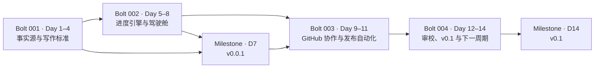
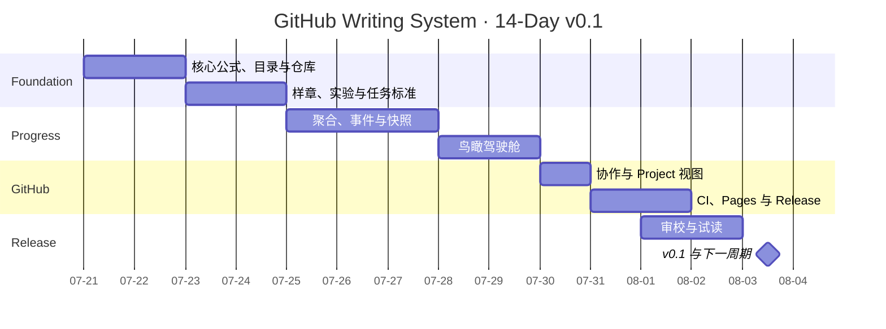

# 14 天 GitHub 写作系统行动规划

## 目标边界

在 14 个连续自然日内交付可公开试读、可复现实验、可追踪进度的 `v0.1`。它不是十章完稿，而是证明“写、跑、审、发、记”闭环已经能够持续运转的最小版本。

**v0.1 不可再缩范围**：

- 一个可读样章
- 十章目录与每章核心问题
- 一个可复现实验及样例产物
- 一张核心图
- 一条可运行的 HTML/PDF 构建链
- 一个自动聚合的进度鸟瞰页
- 一套关键更新事件、快照和变更日志
- 一个公开反馈入口和下一周期计划

若正式开工日晚于 2026-07-21，整体日期顺延，但 Day 1–14 的依赖和验收保持不变。

## 鸟瞰图

## 四个执行 Bolt

| Bolt | 日期 | 核心结果 | Stories | 完成门 |
|------|------|----------|---------|--------|
| `001-github-writing-system-ui` | Day 1–4 | 仓库事实源、14 天计划、任务/章节/实验标准 | 001–006 | 事实源可校验，后续生成器有稳定输入 |
| `002-github-writing-system-ui` | Day 5–8 | 聚合、事件、快照、驾驶舱 | 007–011 | 同一提交可重复生成同一鸟瞰结果 |
| `003-github-writing-system-ui` | Day 9–11 | GitHub 协作、Projects、CI、Pages、Release | 012–015 | PR 可拦截坏数据，主分支可发布静态页 |
| `004-github-writing-system-ui` | Day 12–14 | 审校、反馈、v0.1、下一周期 | 016–018 | v0.1 通过 Definition of Done 并产生下一动作 |

## 每日行动清单

### Day 1 · 2026-07-21 · 定义这本书

- `D01-T01` 写一句 AI-DLC 核心公式和五条“它不是什么”。
- `D01-T02` 明确主要读者、读完后的能力变化和 v0.1 承诺。
- `D01-T03` 写出十章标题，每章只保留一个核心问题。
- **产物**：`book/manifesto.md`、`planning/readers.md`、`planning/toc.md`
- **验收**：陌生人能在 30 秒内复述书的主题；十章没有重复核心问题。
- **Story**：001、002

### Day 2 · 2026-07-22 · 搭建仓库和任务事实源

- `D02-T01` 创建书稿、实验、计划、进度、脚本、测试和写作对话目录。
- `D02-T02` 写 README 第一版：定位、读者、核心公式、章节表、实验表、阅读与贡献入口。
- `D02-T03` 定义任务字段、六种状态、优先级和完成规则。
- **产物**：仓库骨架、`README.md`、任务 Schema 与示例任务
- **验收**：缺少必需字段或非法状态的示例会被识别；README 可引导新协作者。
- **Story**：001、003

### Day 3 · 2026-07-23 · 建立章节和实验池

- `D03-T01` 建立至少 30 个候选实验，不先判断实现价值。
- `D03-T02` 按 `SHIP`、`KEEP-EXT`、`ALREADY` 初步分类并估算 S/M/L。
- `D03-T03` 从第 2、3、4 章中选一个样章，写 Question–Framework–Example–Experiment–Figure–Review 提纲。
- **产物**：`EXPERIMENT_TRIAGE.md`、实验卡、样章模板与提纲
- **验收**：每个实验都有分类；样章六阶段字段齐全；样章选择形成决策记录。
- **Story**：005、006

### Day 4 · 2026-07-24 · 定义可运行证据和校验门

- `D04-T01` 为样章实验定义输入、输出、命令、指标、失败案例和验收。
- `D04-T02` 准备最小 demo 骨架、`env.example`、样例输入与预期输出。
- `D04-T03` 设计重复 ID、未知依赖、循环依赖、虚假完成和时间戳校验用例。
- **产物**：实验 README、demo 骨架、校验用例清单
- **验收**：新读者只看 README 即知道如何运行；至少五类坏数据有预期错误。
- **Story**：004、005、006
- **Bolt Gate**：Bolt 001 的六个 Stories 具备 Plan 阶段输入。

### Day 5 · 2026-07-25 · 跑通第一个实验和进度聚合

- `D05-T01` 实现最小 demo，并产出 JSON、Markdown 报告、SVG 或截图之一。
- `D05-T02` 运行测试，保存成功和失败样例。
- `D05-T03` 聚合总体、优先级、状态、当前 Day、章节、实验、阻塞和下一动作。
- **产物**：`quickstart.py`、样例产物、测试、第一份 progress JSON
- **验收**：读者能在 10 分钟内跑出样例；同一事实源重复聚合结果等价。
- **Story**：006、007

### Day 6 · 2026-07-26 · 让关键变化自动留痕

- `D06-T01` 定义任务、章节、实验、构建、里程碑和发布事件类型。
- `D06-T02` 比较前后事实，生成带时间、前后状态、提交和摘要的事件。
- `D06-T03` 为核心公式生成第一张 SVG 图并接入样章或 introduction。
- **产物**：事件记录器、事件 Schema、`fig0-1.svg`
- **验收**：真实状态变化产生一条事件；无变化不产生虚假事件；重复运行不重复追加。
- **Story**：008

### Day 7 · 2026-07-27 · 建立快照并发布内部 v0.0.1

- `D07-T01` 生成当前汇总、不可变历史快照和人类可读变更日志。
- `D07-T02` 跑通最小 HTML/PDF 构建；修复内部断链。
- `D07-T03` 标记内部 `v0.0.1`，记录完成项、缺口和第二周风险。
- **产物**：snapshot、changelog、构建产物、`v0.0.1` Release Notes
- **验收**：快照能关联提交；构建失败不覆盖成功产物；内部版本有明确时间锚点。
- **Story**：009、017
- **Milestone**：`v0.0.1`

### Day 8 · 2026-07-28 · 把进度变成驾驶舱

- `D08-T01` 将样章推进到 60%–80% 可读度，所有实践性观点有证据入口。
- `D08-T02` 在现有行动指南上增加总体进度、Day、倒计时、阶段和下一动作。
- `D08-T03` 增加时间线、章节、实验、阻塞和最近事件视图。
- **产物**：样章可读稿、驾驶舱 v1
- **验收**：页面数字全部来自生成数据；关闭 JavaScript 仍可见核心摘要。
- **Story**：010
- **Bolt Gate**：进度引擎能从事实源生成完整鸟瞰页。

### Day 9 · 2026-07-29 · 让鸟瞰页可行动

- `D09-T01` 为 Day、章节、实验和阻塞项增加任务、产物或 GitHub 下钻链接。
- `D09-T02` 检查 360px 和桌面布局，补焦点样式、语义标签和非颜色状态信号。
- `D09-T03` 让新使用者只看 README，在 30 秒内找到下一项 Must。
- **产物**：驾驶舱 v2、无障碍与响应式检查记录
- **验收**：所有核心卡片可通过键盘访问；无水平溢出；下钻没有死链。
- **Story**：011

### Day 10 · 2026-07-30 · 建立 GitHub 协作鸟瞰

- `D10-T01` 创建写作、实验、缺陷、反馈 Issue 模板和 PR 模板。
- `D10-T02` 定义标签、`v0.0.1`/`v0.1` 里程碑和分支/合并规则。
- `D10-T03` 配置 Projects 字段与 Board、14-Day Roadmap、Chapter、Experiment 四种视图。
- **产物**：`.github/ISSUE_TEMPLATE/`、PR 模板、标签/里程碑清单、Project 配置说明
- **验收**：新 Issue/PR 能关联任务 ID 和验收；四个 Project 视图能表达同一事实源。
- **Story**：012、015

### Day 11 · 2026-07-31 · 建立 CI、Pages 和 Release

- `D11-T01` 配置 PR 校验：数据、测试、内部链接和生成冒烟测试。
- `D11-T02` 配置主分支快照与 GitHub Pages 发布。
- `D11-T03` 配置 tag 驱动的 Release Notes 和 HTML/PDF 候选产物。
- **产物**：validate、snapshot、pages、release 工作流
- **验收**：坏数据 PR 被阻止；工作流最小权限；成功页面标注来源提交。
- **Story**：013、014
- **Bolt Gate**：远程协作、校验、鸟瞰和发布链全部有可运行入口。

### Day 12 · 2026-08-01 · 第一轮审校和学习路线

- `D12-T01` 按技术、重复、结构、术语、实验对应五类审校样章。
- `D12-T02` 写 `docs/LEARNING.md`，给出入门、实践和跳读路线。
- `D12-T03` 整理关键写作对话和决策；准备试读 README 与反馈模板。
- **产物**：review、学习路线、writer-chat/decision、feedback template
- **验收**：每个审校问题都有影响、建议和对应文件；反馈能转成接受/拒绝/延期决策。
- **Story**：016

### Day 13 · 2026-08-02 · 试读和发布候选

- `D13-T01` 邀请 3 位读者只依赖 README 阅读样章或复现实验。
- `D13-T02` 处理阻断发布的反馈；非阻断项进入下一周期。
- `D13-T03` 生成 v0.1 Release Candidate，跑全量校验和构建。
- **产物**：反馈记录、修订 PR/提交、v0.1-rc、缺口清单
- **验收**：反馈均有决策；所有 Must 检查通过；剩余缺口公开且有落点。
- **Story**：016、017

### Day 14 · 2026-08-03 · 发布 v0.1 并继续前进

- `D14-T01` 复核 v0.1 Definition of Done 和关键指标。
- `D14-T02` 发布 GitHub Release、Pages、HTML/PDF 和 Release Notes。
- `D14-T03` 从未完成项、已接受反馈和已知缺口生成 v0.2 草案与下一项 Must。
- **产物**：`v0.1`、公开驾驶舱、Release Notes、下一周期入口
- **验收**：所有公开产物关联同一提交；驾驶舱显示发布事件；下一动作非空。
- **Story**：017、018
- **Milestone**：`v0.1`

## 每日固定动作

每个工作日用 60–120 分钟完成一个小闭环：

1. 从驾驶舱选择依赖已满足的首个 Must 任务。
2. 把任务从 `ready` 改为 `in-progress`，自动记录开始事件。
3. 先产出最小可审阅文件，再补示例、测试或证据。
4. 提交或发起 PR，触发校验和预览。
5. 验收通过后进入 `done`，自动生成完成事件、快照和驾驶舱更新。
6. 保存当天关键写作对话、决策或失败案例。

## 关键更新自动记录矩阵

| 触发 | 自动记录 | 自动可视化 | 失败策略 |
|------|----------|------------|----------|
| 任务进入 `in-progress` | `task_started` 事件，时间、任务、提交、摘要 | 当前任务与 Day 卡高亮 | 非法转换阻止提交 |
| 任务进入 `review` | `task_review_requested` 事件和验收清单 | Review 数量、待审任务 | 缺验收标准则失败 |
| 任务进入 `done` | 前后状态、产物、提交、完成时间 | 总体、阶段、Must/Should、Day 完成率重算 | 产物缺失或验收未勾选则失败 |
| 任务进入/离开 `blocked` | 原因、下一动作、解除记录 | 阻塞卡、阻塞数量、关键路径提示 | 无原因或下一动作则失败 |
| 章节阶段改变 | `chapter_stage_changed` | 六阶段生产线和下一缺口 | 未知阶段则失败 |
| 实验分类/状态改变 | `experiment_changed` | SHIP/KEEP-EXT/ALREADY 分布 | 分类字段不完整则失败 |
| 主分支 Push | 当前聚合结果、工作流状态、提交 SHA | 刷新驾驶舱和最近更新 | 失败不覆盖最后成功页面 |
| 里程碑或版本 Tag | `milestone_completed` / `release_published` | 时间线锚点、Release 卡 | Must 门禁不通过则阻止发布 |
| 手动 `workflow_dispatch` | 运行人、提交、生成摘要 | 刷新 current；若无变化标注“无状态变化” | 不制造虚假关键事件 |

## 进度计算规则

- **总体完成率**：`done 任务权重 / 全部任务权重`；Must 权重 3、Should 权重 2、Could 权重 1。
- **Day 完成率**：当日已完成任务数 / 当日任务总数。
- **阶段完成率**：Bolt 内已完成 Story 数 / Bolt Story 总数。
- **章节完成率**：六阶段已完成数 / 6。
- **实验进度**：按分类展示数量；只有满足对应分类验收时才计为完成。
- **下一动作**：依赖已满足的任务中，依次按 Must、计划日期、稳定 ID 排序。
- **阻塞规则**：关键路径上任一 blocked 任务使对应 Bolt 显示风险，不修改历史完成率。

## v0.1 Definition of Done

- [ ] 核心公式、目标读者和十章目录已版本化。
- [ ] 至少一个样章达到可读标准并完成一次审校。
- [ ] 至少一个实验可由新读者在 10 分钟内复现样例结果。
- [ ] 至少一张核心图进入书稿。
- [ ] HTML/PDF 或批准的等价构建产物可重复生成。
- [ ] 任务校验、测试、链接和进度生成通过。
- [ ] 鸟瞰驾驶舱展示 14 天计划、章节、实验、阻塞和关键更新。
- [ ] 关键事件、快照和变更日志可以追溯到提交。
- [ ] README、学习路线、Release Notes 和反馈入口存在。
- [ ] GitHub Release/候选产物与 Pages 指向同一来源提交。
- [ ] 已知缺口公开，且下一周期存在至少一个可执行 Must 任务。

## 风险与压缩策略

| 风险 | 早期信号 | 处理 |
|------|----------|------|
| 两周容量不足 | Day 4 仍未确定样章或实验 | 冻结新想法，只保留一个样章和一个 SHIP 实验 |
| 自动化复杂度失控 | Day 8 仍无法本地生成 current progress | 暂停 Projects 双向同步，优先仓库事实源 + Pages 单向发布 |
| 内容被工程任务挤压 | 连续两天无正文增量 | 每天第一段时间先写 500–1500 字，再做自动化 |
| 进度数据失真 | done 任务缺产物或验收 | 校验阻止合并，禁止手改统计数字 |
| 外部工具不可用 | Pandoc/XeLaTeX 或 API 无法运行 | 固定版本并记录替代 HTML 构建；任何范围变更需写入决策日志 |
| 试读反馈延迟 | Day 12 尚未邀请读者 | 先发布反馈入口；Day 14 记录未响应为已知缺口，不伪造反馈 |
