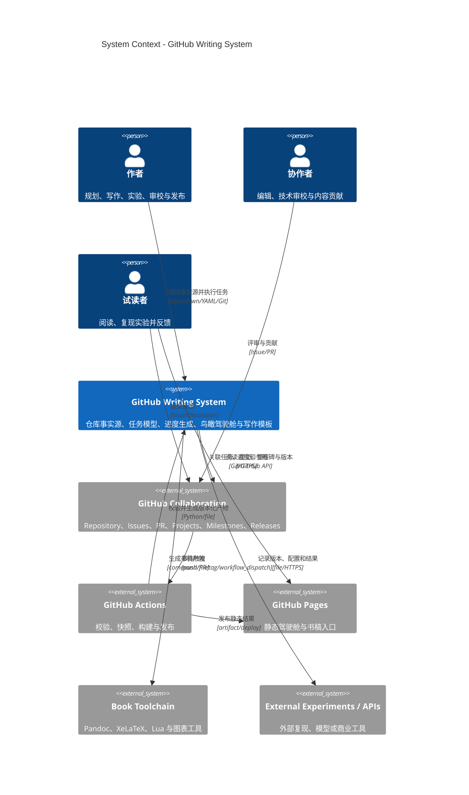

# GitHub Writing System - System Context

## System Overview

GitHub Writing System 是以 Git 仓库为事实源的静态写作生产系统。作者和协作者通过 Markdown、YAML、Issue、Pull Request 与版本发布推进书稿；本地脚本和 GitHub Actions 校验状态、聚合进度、记录关键事件，并把鸟瞰驾驶舱和书稿入口发布到 GitHub Pages。

系统边界包含仓库内的任务模型、进度事件、生成脚本、静态驾驶舱、工作流配置和写作模板。GitHub 托管能力、书稿构建工具以及可选的外部实验/API 位于边界之外。

## Actors

- **作者**（Human）：维护核心公式、书稿、实验、任务优先级和发布决策。
- **编辑/技术审校者**（Human）：通过 Pull Request、审校记录和验收清单提出修改。
- **试读者/实验复现者**（Human）：从 README、Pages 或 Release 获取内容，提交反馈与复现结果。
- **贡献者**（Human）：通过 Issue 和 Pull Request 提交正文、实验、图表或修复。
- **自动化执行者**（System）：由本地命令或 GitHub Actions 触发校验、聚合、快照、构建和发布。

## Context Diagram

## External Integrations

| System | Direction | Data Exchanged | Protocol | Risk |
|--------|-----------|----------------|----------|------|
| GitHub Repository | Both | Git 提交、分支、文件、标签 | Git/HTTPS | Low |
| GitHub Issues / PR | Both | 任务关联、验收、评论、变更 | GitHub Web/API | Medium |
| GitHub Projects | Both | 投影视图、状态、时间线 | GraphQL/API | Medium：权限与字段同步 |
| GitHub Actions | Inbound to system | 事件上下文、提交 SHA、工作流状态 | Workflow/file | Low |
| GitHub Pages | Outbound | 静态 HTML、JSON、书稿入口 | Artifact/HTTPS | Low |
| GitHub Releases | Both | 标签、Release Notes、PDF/HTML | GitHub API | Medium |
| Pandoc/XeLaTeX | Outbound | Markdown、图表、PDF | Command/file | Medium：本地依赖 |
| External Experiments/APIs | Both | 配置、样例输入、结果、复现指针 | File/HTTPS | High：版本与密钥 |

## Data Flows

### Inbound

- 作者提交 Markdown/YAML 任务、书稿、实验卡和写作记录；进入时校验结构、状态、引用、时间戳与产物路径。
- GitHub push、Pull Request、tag 和手动运行事件携带提交 SHA、分支、操作者与运行上下文。
- 试读反馈以 Issue、表单结果或 Markdown 记录进入，必须转成接受、拒绝或延期决策。
- 外部实验输入只保存可公开样例、配置模板和固定版本；密钥通过环境变量注入。

### Outbound

- 生成 `progress` 聚合数据、关键事件、快照、变更日志和静态驾驶舱。
- 生成或收集 HTML/PDF、Release Notes、实验结果与校验报告。
- 向 GitHub Pages 和 Releases 发布可追溯到具体提交的产物。
- 可选地把仓库任务投影到 GitHub Projects；同步失败不得损坏仓库事实源。

## High-Level Constraints

- 核心生成链不使用数据库或服务器端应用。
- Git 仓库是唯一权威事实源，Projects 和驾驶舱都是投影视图。
- 生成必须确定、可重放、失败安全，并保留历史关键事件。
- 外部集成采用最小权限；来自 Fork 的工作流不能访问发布密钥。
- v0.1 在 14 天内完成，内容范围可缩小，但实验、构建和留痕闭环不可移除。

## Key NFR Goals

- 关键事件记录完整率 100%，时间戳统一使用 ISO 8601 时区格式。
- MVP 规模的校验和进度生成在 GitHub Runner 上 60 秒内完成。
- 驾驶舱核心资源不超过 2 MB，并支持移动端、键盘和无 JavaScript 摘要。
- 非法任务引用、状态或缺失产物必须阻止错误结果发布。

## Future Integrations

- GitHub Discussions 或外部反馈表单可在 v0.1 后接入。
- 搜索、分析和订阅通知可作为后续 Intent，不改变仓库事实源模型。
