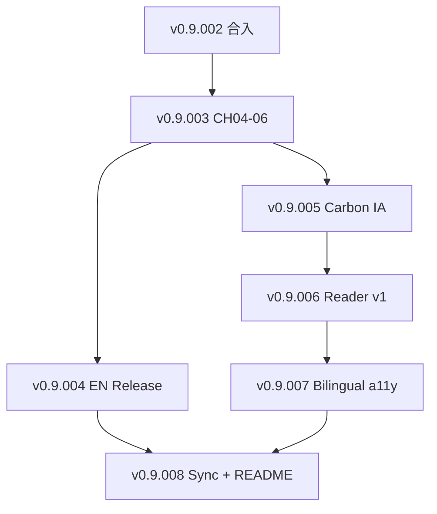

# v0.9.003–v0.9.008 · 自主多轮 Loop 编排

> **执行模式**：Agent 按 Round 顺序推进，**不向维护者中途确认**；每完成一个 **Version Loop** 即 `commit → push → draft PR`，CI 绿后再开下一 patch 分支（或在同一 orchestration 分支上递增 commit，PR 按 patch 拆分合入）。
>
> 配套：[`v0.9-roadmap.md`](../releases/v0.9-roadmap.md) · [`v0.9-publication-master-plan.md`](v0.9-publication-master-plan.md)

## 总目标（至 v0.9.008 + README 终稿）

| 终点 | 读者/维护者可见结果 |
| --- | --- |
| **主线 A** | 英文全书 `build_book --locale en` + **v0.9.004** 英文 Release PDF/HTML + content-audit |
| **主线 B** | Carbon 风格 **Pages 阅读站**（章节路由、Side nav、图内联/放大、print CSS） |
| **A+B** | `hreflang`/语言切换、a11y 基线、**publish-manifest 与 book build hash 同源** |
| **Capstone** | **README.md / README.en.md** 翻新：默认链到 Pages 阅读 URL + Release 离线包 + 双主线说明 |

## Loop 索引

| Loop | Version | 主题 | 分支模板 | Task ID 段 |
| --- | --- | --- | --- | --- |
| **L0** | （基线） | v0.9.002 合入 | `cursor/v0.9.002-en-ch01-03-fdde` | D25-T01 |
| **L1** | v0.9.003 | 英文 CH04–06 + 半书 release-profile 审计 | `cursor/v0.9.003-en-ch04-06-fdde` | D25-T02–T04 |
| **L2** | v0.9.004 | 英文 CH07–10 + 英文 Release tag 链 | `cursor/v0.9.004-en-release-fdde` | D25-T05–T08 |
| **L3** | v0.9.005 | Carbon IA + token + 着陆页 | `cursor/v0.9.005-carbon-ia-fdde` | D26-T01–T03 |
| **L4** | v0.9.006 | 可视化阅读器 v1 | `cursor/v0.9.006-book-reader-fdde` | D26-T04–T06 |
| **L5** | v0.9.007 | 中英切换 + a11y | `cursor/v0.9.007-bilingual-a11y-fdde` | D26-T07–T09 |
| **L6** | v0.9.008 | Pages/Release 同源 + README 终稿 | `cursor/v0.9.008-pages-sync-readme-fdde` | D26-T10–T12 |

## 硬门禁（每个 Loop 结束必跑）

```bash
python3 scripts/ci_check.py --budget-seconds 120
python3 scripts/generate_progress.py --dry-run
```

含 PDF/HTML Release 的 Loop 额外：

```bash
python3 scripts/build_release_book.py --locale <zh|en> --format all --output .artifacts/book-release
python3 scripts/audit_release_content.py --html .artifacts/book-release/<book>.html
python3 scripts/check_release_readiness.py --version v0.9.00x
```

## L1 · v0.9.003（英文 CH04–06）

**Loop 目标**：Memory Bank / Bolt / Exsecutio 英文叙事进入构建；release-profile HTML **半本书**可审计。

| Round | 名称 | 交付 | 验收 |
| --- | --- | --- | --- |
| R1 | mirror-ch04 | `book/en/chapters/ch04-memory-bank-standards.md` | 无 policy 占位 marker；`images/ch04-*.svg` |
| R2 | mirror-ch05-06 | ch05、ch06 英文稿 | Primary Question 唯一；Exsecutio 边界与中文一致 |
| R3 | build-wire | `SOURCE_FILES_EN`、toc、manifesto、glossary 增量 | `build_book --locale en` OK |
| R4 | policy-ci | `v0.9.003-policy.json`、tests、release-profile smoke + `audit_release_content.py` | CI 120s 内绿 |

**Scorecard**：content 50 / build 25 / audit 15 / docs 10

## L2 · v0.9.004（英文全书 + Release）

| Round | 名称 | 交付 |
| --- | --- | --- |
| R1 | mirror-ch07-10 | 四章英文 mirror |
| R2 | release-names | `aidlc-book-v0.9.004-en.pdf` 命名、RC 目录、`build_release_book --locale en` |
| R3 | readiness | `v0.9.004-policy.json`（`pdf_required: true` for en）、readiness JSON |
| R4 | readme-en-links | README.en 链到英文 Release 资产 |

**验收**：英文 release-profile HTML/PDF content-audit pass；tag `v0.9.004` 可打（维护者触发 Release workflow）。

## L3 · v0.9.005（Carbon IA）

| Round | 名称 | 交付 |
| --- | --- | --- |
| R1 | pages-ia-doc | `docs/PAGES-IA.md`（URL：`/book/` zh、`/book/en/`、`/ops/` 驾驶舱） |
| R2 | carbon-tokens | `book-site/carbon-tokens.css`（无 npm 运行时，CSS variables 对齐 Carbon 色型/间距） |
| R3 | landing | `book-site/index.html`：封面 + 公式 hero + fig0-1 |
| R4 | prepare-pages-hook | `prepare_pages.py` 拷贝 `book-site/` 到 Pages 根 |

## L4 · v0.9.006（阅读器 v1）

| Round | 名称 | 交付 |
| --- | --- | --- |
| R1 | reader-shell | `book-site/reader.html` + `book-site/reader.js`（Side nav、prev/next） |
| R2 | chapter-routes | `scripts/build_book_site.py`：由 locale 书稿生成 `book-site/<locale>/ch*.html` 或单页锚点 TOC |
| R3 | figures | SVG 内联 + 可选 modal；Plex Mono 代码块 |
| R4 | print-css | `book-site/print.css` |

## L5 · v0.9.007（双语 + a11y）

| Round | 名称 | 交付 |
| --- | --- | --- |
| R1 | lang-switch | UI chrome 中/英；`localStorage` + path prefix |
| R2 | hreflang | `<link rel="alternate" hreflang="...">` on reader/landing |
| R3 | a11y | skip link、landmark、focus ring、`prefers-reduced-motion` |
| R4 | chart-alt | 英文章节 figure alt / 长描述抽查补齐 |

## L6 · v0.9.008（同源 + README 终稿）

| Round | 名称 | 交付 |
| --- | --- | --- |
| R1 | manifest-hash | `publish-manifest.json` 扩展 `book_html_sha256`、`locale_assets` |
| R2 | ci-gate | 测试：Pages 构建后 book hash 与 `build-manifest.json` 一致 |
| R3 | readme-refresh | README.md / README.en.md：首屏 CTA → **Pages `/book/`**；Release 为离线归档；v0.9 双主线一段式说明 |
| R4 | policy-close | `v0.9.008-policy.json`，`next_version` → `v0.9.009-draft`（维护/图优化，非 Reader 驱动） |

## 依赖图（执行顺序）



## 风险与并行策略

| 风险 | 缓解 |
| --- | --- |
| 英中漂移 | 每章 Metadata `Chapter ID` 与 `book/chapters/` 文件名一一对应；CI 路径合同 |
| Loop 体量 | 严格按 patch 拆 PR；单 PR 不超过「一章 + 构建」或「一站点多脚本」 |
| Carbon 体积 | 仅 token + 阅读器 CSS/JS，不引入 React 运行时 |
| Release 与 Pages 双轨 | L6 强制 manifest hash 门禁 |

## 当前执行指针

- **合入**：优先 **PR #30**（含 v0.9.002–008 全链）；#29/#31 可关闭避免重复
- **CI**：validate/pages budget **180s**；Pages build job **8min**
- **Tag 建议**：合入后 `v0.9.002` → `v0.9.003` → `v0.9.004`（英文 Release）→ `v0.9.008`（Pages 阅读站），或按维护者节奏跳 patch
- **Next**：`v0.9.009-draft` 维护循环

---

*本文件随 Loop 推进更新「当前执行指针」与各 Loop 勾选状态（在对应 `planning/releases/v0.9.00x.md` 中记录实施状态）。*
