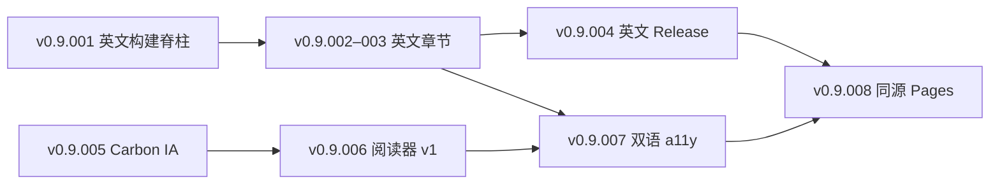

# v0.9 出版体验主线 · 版本系列规划

> 基线：`v0.8.010`（中文全书 + 官方来源对齐）已发布。  
> **自本规划起**：下一稿 **不再** 以「消化真实 Reader 反馈」为发布驱动；`READER-RESPONSES` 仍为 policy **known-gap**（保留 Issue 入口，不阻塞 patch）。  
> 补丁号规则不变：见 [`VERSIONING.md`](VERSIONING.md)。

## 双主线（并行可交错，发布按 patch 切分）

| 主线 | 目标 | 读者价值 |
| --- | --- | --- |
| **A · 英文书稿 HTML/PDF** | 与中文同构的 **release-profile** 英文出版物（非仅 README.en） | 国际读者可下载/离线阅读；术语与 `Exsecutio` 边界一致 |
| **B · Carbon 可视化网站** | GitHub Pages 上的 **高度可视化阅读站**（IBM Carbon 设计体系） | 章节导航、图示、公式与生命周期图可交互/高对比呈现；中英切换 |

两条主线共享：**构建事实源**（书稿路径、manifest、content-audit）、**Pages 发布链**（`prepare_pages.py` / `pages.yml`）、**Release 链**（RC PDF/HTML + tag）。

## 版本序列总览

| Version | 主题 | 主线 | 发布物（预期） |
| --- | --- | --- | --- |
| `v0.9.001` | 英文构建脊柱 | A | `build_book` locale/manifest、`book/en/` 或等价源树约定、CI 合同（无完稿要求） |
| `v0.9.002` | 英文 Part 0 + CH01–03 | A | 英文 HTML 预览（dev profile 可）；术语表 v1 |
| `v0.9.003` | 英文 CH04–06 | A | 半本书 release-profile HTML 审计通过 |
| `v0.9.004` | 英文 CH07–10 + 英文 Release | A | **`aidlc-book-v0.9.004-en.pdf`** / 单页 HTML；Release tag |
| `v0.9.005` | Carbon 站点信息架构 | B | Pages 子站骨架：`/` 阅读入口 vs `/site/` 运维驾驶舱分离或统一 IA |
| `v0.9.006` | 可视化章节阅读器 v1 | B | Carbon 组件化布局、章节路由、SVG/图内嵌、print-friendly CSS |
| `v0.9.007` | 中英切换与 a11y | A+B | `hreflang`、语言持久化、键盘导航、对比度/减少动效 |
| `v0.9.008` | 阅读站 + Release 同源 | A+B | Pages 默认入口指向可视化书；Release zip 与 Pages 构建 hash 对齐门禁 |

> 若某一 patch 范围过大，可在 `v0.9.00x` 之间插入 **`v0.9.003a` 不采用**（policy 禁止跳号伪装）；应拆成 `v0.9.003` / `v0.9.004` 或增加 patch 位如 `v0.9.003.1` 仅用于 draft 周期名，**不**用于 Git tag。

## 主线 A：英文 HTML/PDF（技术要点）

### 源语组织（推荐）

```text
book/                          # 中文 canonical（现状）
book/en/                       # 英文 mirrored tree（part-00, chapters, toc.en.md）
book/build-frontmatter.en.md
```

- **专用术语**：`Exsecutio`、`Bolt`、`Memory Bank` 等保留英文；新增 `book/en/glossary.md` 与中文对照。
- **构建**：扩展 `scripts/build_book.py` → `locale`（`zh` | `en`）、`TITLE`/CSS 分 locale；Release 资产命名示例：`aidlc-book-<version>-en.pdf`。
- **质量门禁**：沿用 `audit_release_content.py`；英文稿同样剥离 Metadata/Gate（release profile）。
- **与中文关系**：不要求 byte-level 同步 tag；但 **major patch** 应声明中文 commit 基线（manifest `source_id`）。

### 分 patch 交付定义

1. **v0.9.001**：目录约定 + 空壳 frontmatter + CI 检测英文源文件存在性；Pandoc 能产出 **最小** 英文 HTML（可仅 Part 0 占位）。
2. **v0.9.002–003**：内容翻译/改写（工程英语，非机翻堆砌）；每章保留 Primary Question / Reader Outcome 结构。
3. **v0.9.004**：首次 **英文 public Release**（PDF + HTML + manifest）；README.en 链到 `-en` 资产。

## 主线 B：Carbon 可视化网站（技术要点）

### 现状与差距

- 已有：`site/` 运维驾驶舱（`dashboard.css`）、`prepare_pages.py` 发布树、书稿 `book/book.css`（偏印刷/长文）。
- 目标：**IBM Carbon Design System**（Grid、Type token、UI Shell、Tabs、SideNav）驱动的 **阅读体验**，而不是仅 Markdown 镜像。

### 分 patch 交付定义

1. **v0.9.005 · IA**
   - 明确 Pages URL 结构，例如：`/book/`（阅读）、`/book/en/`、`/ops/`（驾驶舱，可选迁移现 `site/`）。
   - Carbon 设计 token 文件（CSS variables 或 `@carbon/styles` 构建链；优先 **无 npm 运行时** 的静态站，或 CI 内 bundling）。
   - 首页：封面、公式 hero、三阶段生命周期 **可视化**（复用 `fig0-1.svg` + Carbon 排版）。

2. **v0.9.006 · 阅读器 v1**
   - 章节级路由（10+Part0）；侧边 TOC、上一章/下一章、锚点标题。
   - 图示：SVG 内联 + 可选「放大阅读」；Mermaid 静态化策略与中文站一致。
   - 代码块：IBM Plex Mono（与 PDF 字体策略对齐）。

3. **v0.9.007 · 双语与 a11y**
   - 与主线 A 英文源联动；UI chrome 英/中；书稿内容语言由 URL 或切换器决定。
   - WCAG 基线：skip link、focus ring、landmark、图表 `alt`/长描述。

4. **v0.9.008 · 同源发布**
   - `prepare_pages.py` 同时 staging 可视化书与驾驶舱；`publish-manifest.json` 记录 book build hash。
   - README / Release notes 默认链到 **Pages 阅读 URL**（不仅 GitHub raw md）。

## 硬门禁（全系列沿用）

- 实验 **30/30 verified** 不降级；不因新 UI 改写 triage。
- `READER-RESPONSES`：**known-gap**，不作为 `next_action` 文案主驱动。
- Operations / specs alpha 免责声明保留。
- 每个 patch：`planning/releases/v0.9.00x-policy.json` + RC readiness + content-audit（若含 PDF/HTML）。
- PR 模板 Task ID、CI budget（90s）与 Release 工作流保持一致。

## 建议执行顺序（依赖）



**可并行**：`v0.9.002` 与 `v0.9.005`（内容 vs 设计系统）；合并冲突集中在 `prepare_pages.py` 与 `book/` 路径。

## 下一动作（立即）

1. 将 [`v0.8.010-policy.json`](v0.8.010-policy.json) 的 `next_version` 指向 **`v0.9.001-draft`**（已在本仓库更新）。
2. 在 `progress/cycles.json` 中激活 **`v0.9.001-draft`** 周期任务（可选，由维护者确认后写入事实源）。
3. 从 **v0.9.001** 开分支：`cursor/v0.9.001-en-build-spine-fdde`。

详细 Loop 拆分见 [`planning/publication/v0.9-publication-master-plan.md`](../publication/v0.9-publication-master-plan.md)。**自主多轮执行编排**见 [`v0.9-loop-orchestration.md`](../publication/v0.9-loop-orchestration.md)（v0.9.003–v0.9.008 + README 终稿）。
