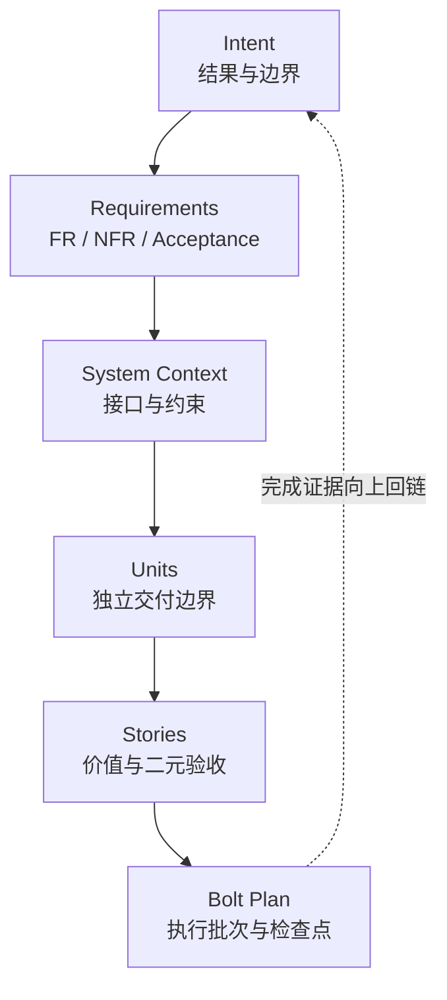

# v0.1 样章选择与六阶段提纲

> 决策：选择 **CH-03《Inception：从 Intent 到可执行计划》** 作为 v0.1 公开样章。  
> 计划稿路径：`book/chapters/sample.md`  
> 章节事实源：`progress/chapters.json`  
> 主实验候选：`EXP-03-01`  
> 决策日期：2026-07-22

## 1. 为什么从第 2、3、4 章中选择

原行动指南把第 2–4 章列为样章候选，因为它们分别代表人的判断、AI 驱动分解和上下文工程，能够在不依赖后半部 Operations 内容的情况下独立成章。

评分采用 1–5 分，最终分为 `得分 ÷ 5 × 权重`。分数用于暴露取舍，不冒充客观实验数据。

| 标准 | 权重 | CH-02 人的判断 | CH-03 Inception | CH-04 上下文工程 |
|---|---:|---:|---:|---:|
| 代表本书独特方法 | 30 | 5 | 5 | 4 |
| 可脱离前文独立阅读 | 20 | 5 | 4 | 4 |
| 能承载真实端到端案例 | 20 | 3 | 5 | 4 |
| 两周内可做轻量实验 | 20 | 4 | 5 | 5 |
| v0.1 写作风险可控 | 10 | 5 | 5 | 4 |
| **加权总分** | **100** | **88** | **96** | **84** |

### 选择 CH-03 的理由

1. 它直接展示 AI-DLC 与“让 AI 写代码”的根本差别：先把目的地变成可追踪、可验收的执行图。
2. 它可以使用本书项目自身作为递归案例，所有工件都已存在并可核对，不需要虚构企业故事。
3. 它自然连接 CH-02 的人类判断、CH-04 的上下文持久化，以及 CH-05/06 的 Bolt 执行。
4. `EXP-03-01` 可用纯 Python 与 JSON 实现，适合 v0.1 的单一 SHIP 实验边界。

### 未选择另外两章的原因

- **CH-02**：最适合作为管理者入口，但核心判断较抽象，若没有后续工件链，样章容易停留在原则层。
- **CH-04**：冷启动 A/B 实验很强，但理解 Memory Bank 与 Standards 前，读者最好先知道 Intent、Unit、Story 与 Bolt 的来源。
- **CH-06**：仍是理解“从计划到交付候选”的机械中心，但不在 D03-T03 指定的第 2–4 章候选范围；它作为 CH-03 之后的进阶阅读章。

## 2. 样章的一句话承诺

读完本章，读者能够把一句高层 Intent 分解成带边界、验收、依赖和人工检查点的 `Requirements → System Context → Units → Stories → Bolt Plan`，并检查这条链是否可追踪、可执行。

## 3. 六阶段鸟瞰


章节不是概念清单，而是一条连续论证：先证明直接生成的问题，再给出分解框架，用本仓库工件验证框架，最后把框架交给读者运行和审查。

## 4. 01 · Question

### 唯一核心问题

AI 如何把一个高层 Intent 分解成可独立交付的 Unit、可验收的 Story 和可执行的 Bolt，而不丢失人的目标与边界？

### 开场冲突

以一句真实请求开场：“请帮我从零建立一套能在 GitHub 持续写作、两周发布 v0.1、每次更新自动可视化留痕的系统。”

直接让 AI 开始创建文件会产生三个问题：

1. 目标、手段和边界混在一起，局部代码无法证明服务于最终目的。
2. 多个可交付物之间没有依赖图，AI 容易提前实现后续功能或遗漏前置事实源。
3. 人类检查点没有落位，只能在大量生成完成后做昂贵返工。

### 本节 Gate

- 只回答一个问题：如何完成不失真的可执行分解。
- 明确本章不展开 Bolt 内部实现、跨会话恢复和生产部署。
- 读者结果可以通过一份追踪表和依赖图观察。

## 5. 02 · Framework

### 5.1 七级可追踪分解链

```text
Intent
  → Requirements（FR / NFR / Acceptance）
  → System Context（边界 / 接口 / 约束）
  → Units（可独立交付的能力边界）
  → Stories（用户价值 + 二元验收）
  → Bolt Plan（小时到天级执行批次）
  → Human Checkpoints（批准 / 退回 / 重规划）
```

每向下一层分解，都必须能回答两个方向的问题：

- **向下**：这个上层目的由哪些下层工件实现？
- **向上**：这个下层任务服务于哪个目的，为什么存在？

### 5.2 四条分解不变量

1. **结果先于方案**：Intent 描述要达成的结果，不预埋具体实现。
2. **边界先于并行**：Unit 只有在输入、输出、依赖和责任边界清楚后才能独立执行。
3. **验收先于生成**：Story 必须先有二元验收，Bolt 才能知道何时结束。
4. **检查点先于失控**：在错误仍局部、可逆时安排人工判断，而不是把终审当唯一安全网。

### 5.3 回到核心公式

`𝓔 = Engineering with Exsecutio` 在 Inception 中表现为：

- **Engineering**：把意图、边界、约束、依赖和验收显式化。
- **Exsecutio 的前提**：生成一个 AI 可以持续贯彻、但人仍能验证和纠偏的执行轨道。

本章只完成“轨道设计”；CH-05 选择 Bolt 轨道，CH-06 展示如何沿轨道贯彻到交付候选。

## 6. 03 · Example

### 案例：把“两周发布本书 v0.1”变成可执行系统

使用当前仓库的真实工件，不另造示例项目：

| 层级 | 本书项目中的真实工件 | 要证明的关系 |
|---|---|---|
| Intent | `memory-bank/intents/001-github-writing-system/requirements.md` | 两周发布、鸟瞰进度和自动留痕来自同一目标 |
| System Context | `system-context.md` | Git 仓库是事实源；本地工作资料不进入公开仓库 |
| Unit | `001-github-writing-system-ui` | 写作控制面可以作为独立交付单元 |
| Story | `003-define-task-schema-and-status` | 统一任务状态服务于可聚合和可验收 |
| Bolt | `001-github-writing-system-ui` | 先完成事实源和校验，再建设驾驶舱与 GitHub 自动化 |
| 行动任务 | `D02-T03` | 产物、依赖、验收和状态变化均可核对 |

### 示例叙事顺序

1. 展示原始一句话 Intent，并圈出结果、时间、边界和质量要求。
2. 展示 AI 的第一轮澄清问题，以及人必须决定的 v0.1 最小边界。
3. 展示从 FR-3 到 Story 003、Bolt 001、D02-T03 的一条完整追踪链。
4. 展示一个错误分解：任务有标题却没有验收与产物，为什么无法进入 `done`。
5. 对照修正后的任务模型与自动事件记录，证明分解结果已经可执行。

### 示例边界

- 只选一条追踪链深入，不把 42 项任务逐项复制进正文。
- specs.md 的工件名称标注为参考实现；核心公式和解释框架标注为本书框架。
- 已完成的仓库事实可以陈述为证据；未来实验结果必须标注为计划或假设。

## 7. 04 · Experiment

### 主实验候选

`EXP-03-01 · Intent 到 Story 追踪链生成器`（`SHIP / S / planned`）

| 项目 | 样章提纲中的定义 |
|---|---|
| 输入 | 一个高层 Intent、3–5 条约束、目标读者和时间边界 |
| 输出 | Requirements、Units、Stories 与双向追踪表 JSON |
| 命令 | D04-T01 固化为无密钥的 Python quickstart 命令 |
| 指标 | 需求覆盖率、孤立 Story 数、无验收 Story 数 |
| 失败案例 | 丢失 NFR、Story 无上游目标、重复 ID、未知引用、验收不可二元判断；Unit 依赖环留给 `EXP-03-02` |
| 验收 | 同一输入可稳定生成合法结构；坏样例被明确拒绝；结果可被读者人工复核 |

### 备选扩展

`EXP-03-02 · Unit 与 Bolt 依赖 DAG 校验器` 作为后续增强，不进入 v0.1 最小实验承诺，避免样章同时承担两个实现。

### 读者练习

用 20 分钟把自己项目的一句 Intent 分解到 2 个 Unit 和 3 个 Story；给每个 Story 写一条二元验收，然后检查是否存在没有上游目标的 Story。

## 8. 05 · Figure

### 核心图：Intent-to-Bolt 双向证据链

图形采用“向下分解、向上追踪”的双向结构：



计划源文件：`book/images/ch03-intent-to-bolt.svg`。图中每个节点只保留名称、核心问题和一个真实仓库路径，详细字段留在正文表格中。D06-T03 生成正式图时必须保留可编辑源或可重复生成方法。

## 9. 06 · Review

### 五类审校清单

1. **技术正确性与过度承诺**：区分 AI-DLC 方法、本书框架和 specs.md 参考实现；不把产品页面主张当独立实证。
2. **重复内容与概念边界**：不重复 CH-02 的责任论证、CH-04 的跨会话机制和 CH-05/06 的执行细节。
3. **结构连贯性与读者路径**：Question 提出的三个问题都必须在 Framework、Example 或 Experiment 中得到回应。
4. **术语一致性**：Intent、Requirement、System Context、Unit、Story、Bolt 和 Checkpoint 首次出现时定义，之后不换同义词。
5. **正文与实验/图/练习对应**：正文中的追踪链字段必须能在实验输出和核心图中找到，不出现孤立视觉或孤立实验。

### 样章完成定义

- 文件为 `book/chapters/sample.md`，Metadata 明确 `Chapter ID = CH-03`。
- 正文不少于发布策略的 1,500 字符门禁，目标为 4,000–6,000 个中文字符。
- 六阶段都有非占位内容，至少包含一条真实工件追踪链、一个失败案例、一个实验入口和一张图。
- `EXP-03-01` 的实现状态与正文措辞一致；未验证前不得写成已证明结论。
- 五类审校全部给出结论，任何阻塞项都有负责人和解除动作。

## 10. 后续任务接口

| 后续任务 | 直接输入 | 预期输出 |
|---|---|---|
| D04-T01 定义样章实验 | 本文第 7 节 + `EXP-03-01` | 完整输入、输出、命令、指标、失败案例和验收 |
| D06-T03 生成一张核心图 | 本文第 8 节 | `book/images/ch03-intent-to-bolt.svg` 或同等可再生视觉 |
| D08-T01 完成样章可读稿 | 本文六阶段提纲 | `book/chapters/sample.md` |
| D12-T01 完成五类审校 | 本文第 9 节 | `planning/reviews/sample-chapter.md` 的真实审校结论 |

本决策只完成选择和拆解，不把提纲状态误报为章节正文完成。`progress/chapters.json` 中 CH-03 的生产阶段将在对应内容真实形成后再更新。
