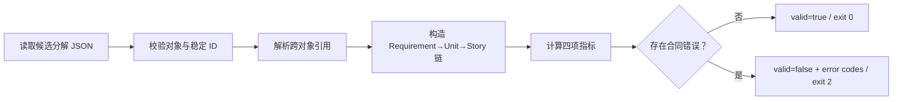

# EXP-03-01 · Intent 到 Story 追踪链生成器

> Chapter：CH-03《Inception：从 Intent 到可执行计划》  
> Triage：`SHIP`  
> Effort：`S`  
> Status：`verified`  
> Runtime：Python 3.9+ 标准库，无网络、无模型 API、无密钥

## 1. 实验问题

当 AI 或人提出一份从 Intent 到 Stories 的候选分解时，能否用一个确定性工具证明：每条 Requirement 都有下游实现路径，每个 Story 都有上游目标和二元验收，并且所有引用都有效？

本实验验证的是**结构追踪性**，不是让规则脚本替代 AI 生成语义，也不声称自动判断需求是否符合业务真实意图。

## 2. 实验假设

如果 Inception 工件采用稳定 ID、显式引用和二元验收，那么不依赖 LLM 的标准库脚本可以：

1. 生成 Requirement → Unit → Story 的双向追踪表。
2. 计算覆盖率、孤立 Story、验收完整率和无效引用数。
3. 用稳定错误代码拒绝结构不完整的候选分解。
4. 对相同输入产生字节一致的输出，成为人工检查点的确定性证据。

## 3. 边界

### In Scope

- 读取单个 UTF-8 JSON 文件。
- 校验 Intent、Requirements、Units 与 Stories 的最小结构。
- 校验唯一 ID 和跨对象引用。
- 生成稳定排序的追踪链、指标和错误列表。
- 为一个合法样例和五类语义坏样例提供可测试结果。

### Out of Scope

- 调用 LLM 自动编写 Requirements 或 Stories。
- 判断需求语义是否正确、完整或具有商业价值。
- 规划 Bolt、检测 Unit 依赖环；依赖 DAG 留给 `EXP-03-02`。
- 读写 Memory Bank 或修改任何项目事实源。
- 联网、遥测、身份验证或外部数据库。

## 4. 运行接口

从仓库根目录运行：

```bash
python3 experiments/sample/quickstart.py \
  --input experiments/sample/samples/input.json \
  --output experiments/sample/output/sample.json
```

测试命令：

```bash
python3 -m unittest discover \
  -s experiments/sample/tests \
  -p 'test_*.py'
```

### 退出码

| Code | 含义 | 输出行为 |
|---:|---|---|
| `0` | 输入合法，全部结构门禁通过 | 写入 `valid: true` 报告 |
| `2` | JSON 可读取，但违反实验合同 | 写入 `valid: false` 报告和稳定错误代码 |
| `1` | 文件不存在、JSON 语法错误或非预期运行错误 | 不伪造报告；向 stderr 输出可操作错误 |

## 5. 输入合同

输入是一个候选 Inception 分解，不是自然语言 Prompt：

```json
{
  "schema_version": "1.0.0",
  "intent": {
    "id": "INT-001",
    "statement": "两周内发布可公开试读的 AI-DLC 图书 v0.1",
    "outcomes": ["陌生读者能阅读样章并运行一个实验"],
    "constraints": ["Git 仓库是唯一事实源", "本地工作资料不公开"]
  },
  "requirements": [
    {
      "id": "FR-001",
      "type": "functional",
      "text": "提供可读样章",
      "acceptance": ["样章六阶段均为非占位内容"]
    },
    {
      "id": "NFR-001",
      "type": "non-functional",
      "text": "所有进度可追溯",
      "acceptance": ["关键状态变化产生版本化事件"]
    }
  ],
  "units": [
    {
      "id": "UNIT-001",
      "title": "GitHub Writing System",
      "responsibilities": ["维护书稿、实验和进度事实源"],
      "requirement_refs": ["FR-001", "NFR-001"]
    }
  ],
  "stories": [
    {
      "id": "STORY-001",
      "unit_id": "UNIT-001",
      "title": "形成可读样章",
      "requirement_refs": ["FR-001"],
      "acceptance": ["读者可以从 README 打开样章"]
    },
    {
      "id": "STORY-002",
      "unit_id": "UNIT-001",
      "title": "记录关键更新",
      "requirement_refs": ["NFR-001"],
      "acceptance": ["任务完成后事件时间线新增一条记录"]
    }
  ]
}
```

### 字段门禁

| 对象 | 必需字段 | 约束 |
|---|---|---|
| 根对象 | `schema_version`、`intent`、`requirements`、`units`、`stories` | 四类对象必须存在；三个集合必须非空 |
| Intent | `id`、`statement`、`outcomes`、`constraints` | 字符串非空；列表至少一项 |
| Requirement | `id`、`type`、`text`、`acceptance` | `type` 只允许 `functional` / `non-functional`；两类至少各一项 |
| Unit | `id`、`title`、`responsibilities`、`requirement_refs` | 引用只能指向已知 Requirement |
| Story | `id`、`unit_id`、`title`、`requirement_refs`、`acceptance` | Unit 与 Requirement 引用必须存在；验收至少一项 |

所有 ID 在各自类型内唯一。列表元素必须是非空字符串；布尔值、数字或空白字符串不得冒充 ID 和验收文本。

## 6. 输出合同

输出是稳定 JSON；不得包含当前时间、随机数或机器绝对路径：

```json
{
  "schema_version": "1.0.0",
  "experiment_id": "EXP-03-01",
  "source_digest": "sha256:<canonical-input-hash>",
  "valid": true,
  "metrics": {
    "requirement_coverage_percent": 100.0,
    "orphan_story_count": 0,
    "acceptance_completeness_percent": 100.0,
    "invalid_reference_count": 0
  },
  "traces": [
    {
      "requirement_id": "FR-001",
      "unit_ids": ["UNIT-001"],
      "story_ids": ["STORY-001"]
    }
  ],
  "errors": []
}
```

### 稳定性规则

- 输入先按 UTF-8 JSON 解析，再用排序键和紧凑分隔符生成 canonical JSON。
- `source_digest` 为 canonical input 的 SHA-256，不使用文件修改时间。
- `traces` 按 Requirement ID 排序，内部 ID 列表去重后排序。
- `errors` 按 `path`、`code`、`message` 排序。
- 输出使用 UTF-8、2 空格缩进，并以一个换行结束。

## 7. 指标定义

| 指标 | 公式 | 通过条件 |
|---|---|---|
| 需求覆盖率 | 同时被至少一个 Unit 和其下 Story 引用的 Requirement 数 ÷ Requirement 总数 × 100 | 合法样例为 `100.0` |
| 孤立 Story 数 | 没有合法 Unit，或没有任何合法 Requirement 引用的 Story 数 | 合法样例为 `0` |
| 验收完整率 | `acceptance` 含至少一个非空项的 Story 数 ÷ Story 总数 × 100 | 合法样例为 `100.0` |
| 无效引用数 | Unit/Story 指向未知 Requirement 或 Story 指向未知 Unit 的引用总数 | 合法样例为 `0` |

指标只描述结构。即使四项全部通过，人仍必须检查 Intent、Requirement 和验收内容是否语义合理。

## 8. 五类失败样例

失败样例放在 `experiments/sample/samples/invalid/`，每个文件只突出一个主要错误：

| Fixture | 错误代码 | 触发条件 | 预期结果 |
|---|---|---|---|
| `missing-nfr.json` | `E_MISSING_NFR` | 只有 functional Requirement | exit `2`；指出缺少 non-functional Requirement |
| `duplicate-id.json` | `E_DUPLICATE_ID` | 同类对象出现重复 ID | exit `2`；定位第二个重复对象 |
| `unknown-reference.json` | `E_UNKNOWN_REF` | Unit/Story 引用未知 ID | exit `2`；列出字段路径和未知值 |
| `orphan-story.json` | `E_ORPHAN_STORY` | Story 无合法 Unit 或 Requirement 上游 | exit `2`；孤立计数至少为 1 |
| `empty-acceptance.json` | `E_ACCEPTANCE` | Story 的验收为空或只有空白 | exit `2`；验收完整率低于 100 |

文件不存在和损坏 JSON 属于 CLI/解析错误，使用 exit `1`，不计入上述五类结构实验样例。

## 9. 处理流程



处理器不得修改输入文件、项目 Memory Bank、任务状态或章节状态。输出目录是唯一允许写入的位置。

## 10. 二元验收

- [x] 合法样例以 exit `0` 生成 `valid: true`，四项指标分别为 `100.0 / 0 / 100.0 / 0`。
- [x] 五个坏样例均以 exit `2` 失败，并至少包含表中对应的稳定错误代码。
- [x] 相同输入连续运行两次，输出文件 SHA-256 完全一致。
- [x] `python3 -m unittest discover -s experiments/sample/tests -p 'test_*.py'` 全部通过。
- [x] 实验在 Python 3.9+ 标准库环境运行，不联网、不读取密钥、不依赖 `specs.md-portal/`。
- [x] README 明确声明结构校验边界，不能把 `valid: true` 写成业务语义正确的证明。

全部通过后，`EXP-03-01` 才能从 `ready` 进入 `verified`。仅完成 Demo 骨架或只生成一次样例输出都不满足完成定义。

## 11. 后续任务接口

| 任务 | 使用本规范的部分 | 产物 |
|---|---|---|
| D04-T02 准备最小 Demo 骨架 | 第 4–6、8 节 | README、`env.example`、目录和样例占位 |
| D05-T01 实现最小实验 | 第 5–9 节 | `quickstart.py` 与稳定输出 |
| D05-T02 补测试 | 第 8、10 节 | 合法、失败和确定性测试 |
| D08-T01 样章可读稿 | 第 1、2、7 节 | 正文实验段、指标解释与限制 |

本任务只定义实验合同，不提前创建 Demo 或把实验标记为 `verified`。
