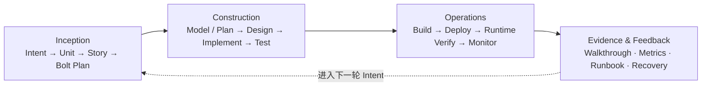
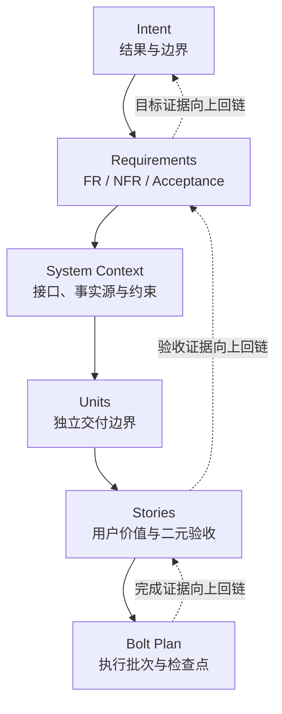

<!-- source: book/build-frontmatter.md -->


---
title: 深入理解 AI-DLC
subtitle: 从概率智能到确定性交付——AI 驱动规模化开发的理论与实践
author: AI 潮局
lang: zh-CN
---

{.book-cover width=42%}

\tableofcontents
\clearpage

> **AI-DLC = 𝓔（人的判断 + AI 能力）**  
> **𝓔 = Engineering with Exsecutio**

{.core-figure width=100%}

\newpage


<!-- source: book/manifesto.md -->


# 《深入理解 AI-DLC》核心宣言

## 核心公式

> **AI-DLC = 𝓔（人的判断 + AI 能力）**  
> **𝓔 = Engineering with Exsecutio**

一句话解释：**人定方向，AI 加速度，工程化执行保交付。**

人的判断负责定义目标、意图、边界与取舍；AI 能力负责生成、推理、执行与并行协作；𝓔 通过工程约束、持续验证、纠偏与执行转化，把概率性的生成能力变成可验证、可交付、可持续演进的软件系统。

AI-DLC 的目标不是“生成得更快”，而是“更快地交付正确”。

## 从公式到可观察产物

| 公式要素 | 职责 | 可观察产物 |
| --- | --- | --- |
| 人的判断 | 定方向、定边界、做取舍并承担最终责任 | 意图、验收标准、约束、决策记录 |
| AI 能力 | 生成、推理、执行与并行协作，放大工程吞吐 | 设计草案、代码、测试、分析与执行记录 |
| 𝓔 | 建立工程轨道，持续约束、验证、纠偏和转化 | 版本化事实源、质量门禁、证据链、变更日志 |
| 确定性交付 | 让结果可验证、可复现、可发布并持续演进 | 通过验收的发布候选、构建清单、发布回执 |

## AI-DLC 不是什么

1. 不是一次 Prompt 或一次代码生成就等于完成交付。
2. 不是把目标、边界、取舍和最终责任交给 AI。
3. 不是只追求生成速度，而忽略正确性、可验证性与可维护性。
4. 不是只展示成功样例，却隐藏失败边界、成本和纠偏过程。
5. 不是绕过工程方法的工具包装，而是以工程化执行建立确定性交付闭环。

## 30 秒复述

> 人定方向，AI 加速度，工程化执行保交付。人的判断与 AI 能力只有经过 𝓔 的约束、验证和纠偏，才能从概率性生成走向确定性交付。

## D01-T01 验收

- [x] 核心公式已使用作者定稿。
- [x] 公式各要素已对应到可观察产物。
- [x] 五条“不是”已填写，能够约束范围和过度承诺。
- [ ] 由目标读者完成 30 秒复述测试（留给后续读者验证任务，不计入 D01-T01 完成条件）。

## 来源记录

- 文字来源：作者提供的 `深入理解AI-DLC_书籍封面与概要介绍.html`。
- HTML SHA-256：`70cb33ff2acae776eec35a68ead34bc9941a37512b9a08fde37ca597db5392f4`。
- 封面归档：[images/cover.png](images/cover.png)。
- 封面 SHA-256：`2409acc814521cadcf90e094a8bff20204d80b6708d269eed3595995271d506f`。
- 纳入时间：`2026-07-22T03:51:07Z`。


<!-- source: book/part-00-overview.md -->


# Part 00 · 鸟瞰 AI-DLC：读懂这本书的地图

> 本部分是非编号导读，不计入十章正文。  
> 阅读目标：用 10 分钟看懂 AI-DLC 的核心矛盾、运转方式和全书叙事路径。

## 0.1 为什么先看鸟瞰图

AI-DLC 同时涉及方法论、AI 能力、工程工件、验证机制、运行体系和组织变革。如果一开始就钻进 Intent、Memory Bank 或 Bolt，读者很容易记住术语，却看不见它们为什么存在。

本书先给出一张完整地图：**概率性的 AI 能力，只有经过人的判断与 𝓔 的工程化贯彻，才能转化为确定性交付。** 后续十章只是在依次放大这张地图的不同区域。

## 0.2 一张图看懂 AI-DLC


核心公式是：

> **AI-DLC = 𝓔（人的判断 + AI 能力）**  
> **𝓔 = Engineering with Exsecutio**

这不是把人和 AI 的能力做简单相加。人的判断先确定目的地、边界与责任，AI 放大提议和执行能力，𝓔 再把概率性输出送入工程轨道，持续推进到能够被验证和交付的状态。

## 0.3 三层认识框架

| 层次 | 回答的问题 | 本书中的位置 |
| --- | --- | --- |
| 原理层 | 为什么概率智能不能直接等于确定性交付？ | Part 1 |
| 系统层 | AI 如何获得上下文、分解工作并沿工程轨道执行？ | Part 2–4 |
| 规模层 | 什么方法适合什么风险，团队如何复制并度量价值？ | Part 5 |

阅读时要同时区分四类知识：

- **本书框架**：例如 `Engineering with Exsecutio`，由本书负责解释和论证。
- **方法论来源**：例如 AWS AI-DLC、V-Bounce 和人类验证者模型。
- **参考实现**：例如 specs.md 的三阶段、Memory Bank、Bolts 和四 Agent。
- **实验证据**：由书中实验或原始研究支持的观察结论。

参考实现帮助我们把理论落地，但任何单一工具都不等于 AI-DLC 本身。

### 0.3.1 官方方法来源三角

与本书并行、可对齐的三条公开入口如下（正文仅摘要，全文以链接为准）：

1. **[AWS AI-DLC 方法定义（Amplify 白皮书）](https://prod.d13rzhkk8cj2z0.amplifyapp.com)** —— 强调 *Reimagine rather than retrofit*：不为旧 SDLC/Scrum「外挂 AI」，而按 AI 的小时/天级节奏重设阶段、角色与仪式；提出 *Reverse the conversation*（AI 发起澄清与分解，人验证与拍板）、将 DDD 等设计技法嵌入核心、Bolt 取代长周期 Sprint，以及 Inception / Construction / Operations 三阶段与 Mob Elaboration、Mob Construction。
2. **[AWS DevOps 博文（中文）](https://aws.amazon.com/cn/blogs/devops/ai-driven-development-life-cycle/)** —— 从 AI-Assisted 到 AI-Driven 的语境说明，并链向白皮书与社区实践。
3. **[aidlc-workflows · WORKING-WITH-AIDLC](https://github.com/mancbj/aidlc-workflows/blob/main/docs/WORKING-WITH-AIDLC.md)** —— 操作层约定：Question→Doc→Approval、阶段切换时清理聊天 context、Vision / Tech Environment 双输入、Construction 先计划批准再 codegen、以及 *Never Vibe Code*（无工件、无批准则不执行）。

**本书定位**：用 `Engineering with Exsecutio` 解释「如何把概率输出推入可验证交付」；AWS 文本是方法论来源；specs.md 与 aidlc-workflows 是参考实现与操作指南。实验 30/30 与 evidence 边界不因官方材料而改写为「已全部 SHIP 落地」。

**两条路径**：只读方法论 → Part 0 与十章；要在仓库里跑通 → 读书第 3–6 章并对照 [WORKING-WITH-AIDLC 映射表](../docs/WORKING-WITH-AIDLC-MAP.md)。

## 0.4 生命周期鸟瞰

specs.md 的 AI-DLC Flow 为本书提供了一条可观察的参考路径：



- **Inception** 把人的目标转成边界清晰、可验收、可执行的工作。
- **Construction** 让 AI 在选定的 Bolt 轨道中分阶段生成和验证交付候选。
- **Operations** 把通过测试的候选物构建、部署，再做 Runtime Verify，并纳入监控。
- **Evidence & Feedback** 保存变更、测试、指标和恢复凭证，驱动下一轮判断。

## 0.5 全书叙事结构


### Part 1 · 人的判断

先解释 AI 为什么迫使 SDLC 重新设计，再明确“AI 提议、人来验证”并不意味着人可以让渡目标、边界与最终责任。

### Part 2 · AI 能力

把抽象的 AI 能力落实为两项工程能力：把 Intent 分解成可执行计划，以及通过 Memory Bank 与 Standards 在跨会话中保持上下文。

### Part 3 · Engineering × Exsecutio

先建立 Bolt 的范围、类型和阶段门禁，再展示 AI 如何沿计划、执行、验证、纠偏与 Walkthrough 一路贯彻到交付候选。

### Part 4 · 验证反馈

回答两个最容易被忽略的问题：如何用独立证据证明结果正确，以及如何把候选物变成可部署、可观测、可回滚的运行系统。

### Part 5 · 规模化

最后讨论如何在 Simple、FIRE 与 AI-DLC 等不同治理强度之间做选择，以及如何重新设计人、Agent、协作节奏和价值度量。

## 0.6 三条阅读路线

| 读者目标 | 建议路线 | 你会得到什么 |
| --- | --- | --- |
| 先建立管理判断 | Part 0 → 第 1、2、9、10 章 | 方法边界、责任、选型与规模化框架 |
| 设计团队研发系统 | Part 0 → 第 3–8、10 章 | 工件链、上下文、Bolt、验证与 Operations |
| 立即跑通最小闭环 | Part 0 → 第 3、4、5、6、7、8 章 | 从 Intent 到可运行系统的实践路径 |

如果只读 v0.1 公开样章，优先阅读第 3 章；它把高层 Intent 变成可追踪、可验收的执行计划。继续理解执行机制时，再读位于全书机械中心的第 6 章。

## 0.7 带着四个问题进入正文

1. 在这个场景中，什么判断不能委托给 AI？
2. AI 的输入、权限、输出与失败模式是否明确？
3. 什么独立证据能够证明结果正确并允许进入下一阶段？
4. 如果结果错误，系统能否发现、回退、修正并留下记录？

只要这四个问题始终可回答，AI 就不是在自由生成，而是在工程轨道上向确定性交付前进。


<!-- source: book/toc.md -->


# 《深入理解 AI-DLC》十章目录

> 副标题：从概率智能到确定性交付——AI 驱动规模化开发的理论与实践  
> v3 依据：作者五编骨架 + specs.md 官网存档 + Part 0 鸟瞰导读  
> 优化时间：2026-07-22T05:47:09Z

## 全书主线

全书沿着一条确定性交付链展开：**人设定目的地 → AI 提议与执行 → 工程事实源约束上下文 → Bolt 分阶段推进 → 人与机器共同验证 → Operations 完成交付 → 组织按风险规模化**。

`𝓔 = Engineering with Exsecutio` 是本书的解释框架；specs.md 的三阶段、Memory Bank、Bolts 和 Agents 是贯穿全书的参考实现，不被描述为 AI-DLC 的唯一实现。

## Part 00 · 鸟瞰 AI-DLC：读懂这本书的地图

**导读问题：AI-DLC 由哪些关键部分构成，这十章为什么按当前顺序展开？**

- 阅读时间：约 10 分钟。
- 读者结果：能够复述核心公式、三阶段生命周期、五编叙事弧，并选择适合自己的阅读路线。
- 视觉地图：人的判断 → AI 能力 → Engineering with Exsecutio → 确定性交付 → 反馈与规模化。
- 正文入口：[part-00-overview.md](part-00-overview.md)。

Part 00 是非编号导读，不计入十章正文，也不改变 CH-01 至 CH-10 的章节事实源。

## Part 01 · 人的判断

### 第 1 章 · AI 原生 SDLC：从概率智能到确定性交付

**唯一核心问题：当代码生成成本骤降而输出仍具有概率性时，为什么需要重新设计 SDLC，而不只是给旧流程增加 AI？**

- 读者结果：能够区分 AI-Assisted、AI-Driven 与 Agentic 三种范式，并用核心公式解释 AI-DLC 的必要性和边界。
- 参考实现：specs.md 对 AI-DLC、Bolt 与传统 Sprint 的定位。
- 实验方向：让同一需求分别走“对话式生成”和“AI-DLC 闭环”，比较交付周期、返工、缺陷和证据完整度。

### 第 2 章 · 人的判断与反向对话

**唯一核心问题：当 AI 主动提议、分解和执行时，人应如何设定目的地、保留责任并选择验证检查点？**

- 读者结果：能够定义意图、边界、不可委托判断、人工检查点和最终责任人。
- 参考实现：AI proposes, human validates；Mob Elaboration；Master Agent 路由。
- 实验方向：比较“人逐步提示 AI”和“AI 提议、人验证”的需求澄清质量与人工注意力消耗。

## Part 02 · AI 能力

### 第 3 章 · Inception：从 Intent 到可执行计划

**唯一核心问题：AI 如何把一个高层 Intent 分解成可独立交付的 Unit、可验收的 Story 和可执行的 Bolt，而不丢失人的目标与边界？**

- 读者结果：能够完成 Intent → Requirements/System Context → Unit → Story → Bolt Plan 的可追溯分解。
- 参考实现：Inception Agent、Intent、Unit、Story、Bolt Planning。
- 实验方向：对同一模糊目标进行自由分解与工件化分解，比较边界冲突、循环依赖和验收遗漏。

### 第 4 章 · 上下文工程：Memory Bank 与 Standards

**唯一核心问题：如何用版本化事实源和明确标准，让每次全新的 Agent 会话恢复正确上下文并持续遵守工程约束？**

- 读者结果：能够设计最小 Memory Bank、Standards 目录、工件引用和变更同步规则。
- 参考实现：Memory Bank、Tech Stack、Coding Standards、Architecture、跨工件追溯。
- 实验方向：让新会话只依赖版本化工件恢复任务，与依赖聊天历史的会话比较遗漏、冲突和恢复时间。

## Part 03 · Engineering × Exsecutio

### 第 5 章 · Bolts：为快速执行选择正确轨道

**唯一核心问题：如何按领域复杂度、风险和可逆性选择 Bolt 范围、类型与阶段门禁，使速度提高而错误不级联？**

- 读者结果：能够拆分小时到天级 Bolt，并在 DDD Construction 与 Simple Construction 之间作出有依据的选择。
- 参考实现：Bolt vs Sprint；DDD 的 Model → Design → ADR → Implement → Test；Simple 的 Plan → Implement → Test。
- 实验方向：用两类 Bolt 处理同一中等复杂度需求，比较设计收益、额外负担与缺陷前移程度。

### 第 6 章 · Exsecutio：把提议贯彻为交付候选

**唯一核心问题：如何让 AI 沿计划、执行、验证、纠偏和 Walkthrough 持续推进，直到生成物满足完成定义并可被下一阶段接收？**

- 读者结果：能够运行一个完整 Bolt，保留输入、阶段决策、文件变化、测试结果、失败修正与完成凭证。
- 参考实现：Construction Agent、Bolt stage progression、Walkthrough 和状态记录。
- 实验方向：从一个小型需求出发，运行可中断、可恢复、可验收的 Bolt，并由陌生审阅者仅凭 Walkthrough 复核。

## Part 04 · 验证反馈

### 第 7 章 · 验证：把人类检查点变成有效损失函数

**唯一核心问题：如何组合确定性检查、独立测试、模型评审和人工判断，证明 AI 参与的结果正确，而不是把模型自评当证据？**

- 读者结果：能够按复杂度、可逆性、安全影响和数据风险选择验证强度，并建立分层交付证据链。
- 参考实现：AI-DLC 固定检查点；FIRE 的 Autopilot、Confirm、Validate 自适应检查点作为对照。
- 实验方向：向同一实现注入缺陷，比较模型自评、自动测试、独立评审和人工门禁的发现率与成本。

### 第 8 章 · Operations：从交付候选到可持续运行

**唯一核心问题：如何通过 Build、Deploy、Runtime Verify、Monitor 与恢复机制，让通过测试的候选物成为可运行、可观测、可回滚的系统？**

- 读者结果：能够定义构建凭证、环境门禁、部署策略、冒烟验证、监控指标和回滚 Runbook。
- 参考实现：Operations Agent 与 `memory-bank/operations/`；同时记录该实现当前为 alpha，而非假定工具已经成熟。
- 实验方向：在隔离环境完成构建、部署、故障注入、检测和回滚，验证交付凭证是否足够复现。

## Part 05 · 规模化

### 第 9 章 · 适配性工程：选择正确的 Flow 与治理强度

**唯一核心问题：如何根据任务复杂度、代码库现状、监管要求和团队规模，在 Simple、FIRE 与 AI-DLC 之间选择，而不过度或不足工程化？**

- 读者结果：能够使用风险—仪式矩阵选择 Flow、检查点数量与运行范围，并解释选择代价。
- 参考实现：Simple 的 Requirements → Design → Tasks；FIRE 的动态 Run、Brownfield/Monorepo 与自适应检查点；AI-DLC 的完整追溯。
- 实验方向：为三个不同风险任务分别选择 Flow，再交换 Flow 执行，比较摩擦、遗漏与可追溯性。

### 第 10 章 · 组织与度量：从 Agent 分工到研发操作系统

**唯一核心问题：如何重构人、Agent、协作节奏与度量体系，并判断哪些 AI-DLC 实践值得在组织内规模化？**

- 读者结果：能够设计 Master/Inception/Construction/Operations 与人的责任图、Mob 协作节奏和业务价值记分卡。
- 参考实现：四 Agent 架构、Mob Elaboration、Mob Construction、Dashboard 与工件驱动异步审阅。
- 实验方向：用交付周期、质量、成本、可复现性、人工注意力和业务价值评估一次团队试点。

## 核心问题去重审计

| 章 | 本章独占对象 | 明确不展开的相邻问题 |
| --- | --- | --- |
| 1 | 新生命周期的必要性与理论边界 | 不展开责任分配和具体工件 |
| 2 | 人机责任、反向对话与检查点选择 | 不展开工作分解结构 |
| 3 | Intent 到 Bolt Plan 的 AI 驱动分解 | 不展开跨会话上下文保存 |
| 4 | 事实源、标准与上下文持久化 | 不展开 Bolt 执行阶段 |
| 5 | Bolt 范围、类型和静态门禁结构 | 不展开动态执行与审阅记录 |
| 6 | 从计划到交付候选的动态贯彻 | 不展开验证方法比较和生产部署 |
| 7 | 验证强度与独立证据 | 不展开部署、监控与回滚操作 |
| 8 | 生产交付、观测与恢复 | 不展开 Flow 选型 |
| 9 | 方法适配、Brownfield 与治理强度 | 不展开组织角色重构 |
| 10 | Agent 分工、团队节奏与价值度量 | 不展开单个 Flow 的内部实现 |

## 来源与证据规则

1. `𝓔 = Engineering with Exsecutio` 标注为本书框架。
2. AWS AI-DLC、V-Bounce 等标注为方法论或研究来源。
3. Memory Bank、四 Agent 和具体 Bolt 类型标注为 specs.md 参考实现。
4. 官网的效率数字和竞争性结论必须回到原始研究核验，不能只引用产品页面。
5. 工具已知限制必须保留；尤其不能把 alpha 状态的 Operations 实现写成成熟生产能力。

## 官方参考链接（摘要入口）

| 资源 | 本书中的主要落点 |
| --- | --- |
| [AWS AI-DLC 方法定义（Amplify）](https://prod.d13rzhkk8cj2z0.amplifyapp.com) | CH-01 原则摘要；CH-02 Mob；CH-05 Bolt；CH-08 Operations；CH-10 采用策略 |
| [AWS DevOps 博文（中文）](https://aws.amazon.com/cn/blogs/devops/ai-driven-development-life-cycle/) | Part 0 来源三角；CH-01 AI-Driven 语境 |
| [aidlc-workflows · WORKING-WITH-AIDLC](https://github.com/mancbj/aidlc-workflows/blob/main/docs/WORKING-WITH-AIDLC.md) | CH-02/03/04/06 操作对齐；[映射表](../docs/WORKING-WITH-AIDLC-MAP.md) |

全书正文仅保留摘要与链接，不粘贴白皮书 Appendix A 全文 prompt 模板。

## v0.1 边界

- v0.1 固化十章结构、唯一核心问题和读者结果，不承诺十章完稿。
- 第 3 章已由 D03-T03 选为 v0.1 样章；第 6 章保留为理解执行机制的后续核心章。
- 30 项实验池已在 D03-T01 按本版目录重建，并由 D03-T02 完成初步分类；只有达到验收门禁的实验才可进入 `verified`。
- 至少一个实验达到新读者可复现标准，其余进入治理队列。

## D01-T03 持续验收

- [x] 十章与核心公式、目标读者和五编骨架一致。
- [x] 十个核心问题没有重复。
- [x] specs.md 的三阶段、核心工件、Agent、Flow 与 Operations 均有明确落点。
- [x] 本书框架、方法来源、参考实现和实验证据已经分层。


<!-- source: book/chapters/ch01-ai-native-sdlc.md -->


# 第 1 章 · AI 原生 SDLC：从概率智能到确定性交付

## Metadata

| Field | Value |
|-------|-------|
| Chapter ID | CH-01 |
| Status Source | `progress/chapters.json` |
| Draft Completeness | D15-T02 可读稿；等待 D15-T03 审校与证据对齐 |
| Primary Question | 当代码生成成本骤降而输出仍具有概率性时，为什么需要重新设计 SDLC，而不只是给旧流程增加 AI？ |
| Reader Outcome | 能够区分 AI-Assisted、AI-Driven 与 Agentic 三种范式，并用核心公式解释 AI-DLC 的必要性和边界 |
| Related Experiments | `EXP-01-01`、`EXP-01-02`、`EXP-01-03` |

## 01 · Question：为什么旧 SDLC 装不下 AI

想象一个很普通的产品需求：给内部工具增加一个“试读反馈入口”。在没有 AI 的时代，团队会先澄清需求，写任务，排期，实现，测试，发布。代码本身很重要，但真正占据周期的往往不是敲键盘，而是对齐目标、理解上下文、处理边界、验证正确性、修复遗漏，再把结果放进可以维护的系统里。

现在把 AI 放进来。开发者可以在几分钟内得到路由、表单、后端接口、测试样例、文档草案，甚至一份看起来完整的 Pull Request 描述。生成速度突然变快，快到让人产生一个自然错觉：如果代码和文档都能这么快生成，那么软件交付是不是也会自动变快？

答案没有那么轻盈。AI 能降低生成成本，但它不会自动降低交付风险。它可以给出一个合理实现，也可以遗漏一个权限边界；可以补齐测试，也可以把错误假设写进测试；可以生成漂亮说明，也可以把尚未验证的结论说得非常确定。于是团队会遇到一种新的反直觉现象：**写出来更容易了，确认它真的该被交付反而更重要了。**

本章只回答这个问题：**当代码生成成本骤降而输出仍具有概率性时，为什么需要重新设计 SDLC，而不只是给旧流程增加 AI？**

这里的“重新设计”不是推翻所有既有工程实践。需求、设计、测试、发布、回滚、审阅依然重要。真正需要改变的是它们之间的组织方式：旧流程默认人是主要生成者，工具是辅助者；AI 原生流程必须承认 AI 已经进入提议、分解、生成、修复和记录的中心链路。流程如果不随之改变，就会出现失衡：

```text
AI 让生成更快
        ↓
候选方案、代码和变更数量上升
        ↓
验证、取舍、追溯和恢复压力上升
        ↓
如果 SDLC 不重构，速度会把不确定性一起放大
```

所以，AI 原生 SDLC 的核心任务不是让 AI “多写一点”，而是把 AI 的概率性能力纳入一个能持续约束、验证、纠偏和交付的系统。

读完本章，读者应该能完成两个动作。第一，判断一个团队实践到底只是 AI-Assisted，还是已经进入 AI-Driven 或 Agentic。第二，用本书核心公式解释：为什么 AI-DLC 不是“AI 替代流程”，而是把人的判断与 AI 能力放进工程化执行轨道，最终走向确定性交付。

### Gate

- [x] 核心问题只有一个：为什么需要重新设计 SDLC。
- [x] 读者结果可以观察：能区分三种范式，并能用核心公式解释必要性和边界。

## 02 · Framework：三种范式与一条交付链

讨论 AI 与 SDLC 的关系时，最容易混淆三件事：工具辅助、流程驱动和代理协作。它们都可能使用大模型，都可能生成代码，但它们对人的角色、事实源、验证方式和交付责任的要求完全不同。

### 2.1 AI-Assisted：人在旧流程里使用 AI

AI-Assisted 的默认结构是“人主导，AI 辅助”。人仍然手工推动需求、设计、实现、测试和发布，AI 被嵌入某些局部环节：补全代码、解释错误、生成测试、润色文档、把一段命令改成脚本。

这种模式很有价值。它学习成本低，对组织结构冲击小，也很适合个人开发者和低风险任务。一个工程师在 IDE 里请 AI 写一个工具函数，或者让 AI 根据失败日志解释单元测试，通常不需要重构整个研发系统。

但 AI-Assisted 的边界也很清楚：流程本身没有改变。需求是否清楚，边界是否写入事实源，验收是否可复现，失败样例是否保存，发布是否有回执，仍然主要依赖人手工维护。AI 只是加速了旧流程里的某些动作。

判断一句话：**如果 AI 只是在人的局部动作里提升效率，而没有改变任务分解、状态推进、证据记录和阶段门禁，它就是 AI-Assisted。**

### 2.2 AI-Driven：AI 参与分解、执行和推进

AI-Driven 的变化不只是“AI 写更多代码”。AI 开始参与工作分解、方案提议、任务执行、测试修复、状态更新和进度同步。人的工作也随之变化：不再只是给 AI 一个个提示，而是设定目标、边界和检查点，让 AI 沿着事实源推进。

这时系统必须回答一组新问题：

- AI 的输入和边界来自哪里？
- AI 生成的计划如何被验收？
- AI 执行中的偏差如何被发现？
- 每次关键更新如何自动记录？
- 人在哪里做不可委托的判断？

如果这些问题没有工程化答案，AI-Driven 很容易退化为更快、更复杂的聊天式开发。团队看起来推进很快，但第二天换一个会话、换一个人或换一个 Agent，就不知道当前状态来自哪里、哪些决定已经生效、哪些证据证明结果可以继续进入下一阶段。

判断一句话：**如果 AI 已经参与计划、执行和状态推进，而团队同时用事实源、验收、事件和门禁约束它，它才真正进入 AI-Driven。**

### 2.3 Agentic：多个 Agent 沿工程轨道协作

Agentic 开发进一步把 AI 能力扩展为可分工、可恢复、可持续执行的代理系统。Master Agent 可以路由任务；Inception Agent 可以把 Intent 分解成 Requirement、Unit、Story 和 Bolt Plan；Construction Agent 可以沿 Bolt 生成设计、实现、测试和 Walkthrough；Operations Agent 可以把候选物构建、部署，再做 Runtime Verify，并纳入监控。

这种模式最迷人的地方在于并行和连续。多个 Agent 可以围绕同一事实源协作，把复杂任务拆成可以推进的局部。但它的风险也更明显：Agent 越多，越不能靠聊天记忆和口头约定维持秩序。否则，多 Agent 只是把不确定性并行化。

判断一句话：**如果多个 Agent 能围绕同一组版本化工件分工，并通过阶段门禁与证据链持续推进，它才是 Agentic；否则只是多个会话同时生成。**

### 2.4 三种范式的差异

| 范式 | AI 的位置 | 人的主要工作 | 事实源要求 | 典型风险 |
| --- | --- | --- | --- | --- |
| AI-Assisted | 局部辅助工具 | 写提示、审代码、手工收尾 | 低到中；可沿用旧流程 | 局部正确但整体不可追溯 |
| AI-Driven | 参与计划与执行 | 定目标、定边界、验收、纠偏 | 高；需要任务、状态、证据和事件 | 速度放大隐藏假设 |
| Agentic | 多 Agent 分工推进 | 设计责任、门禁和恢复机制 | 很高；必须版本化、可恢复、可审计 | 并行放大上下文漂移 |

这张表的重点不是给团队贴标签，而是帮助团队识别下一步该补什么。如果你仍处于 AI-Assisted，就不要假装已经拥有 Agentic 交付能力；如果你已经让 AI 参与分解和执行，就必须开始补事实源、门禁和证据链。

### 2.5 方法来源：AWS AI-DLC 方法定义（摘要）

[Raja SP · AWS AI-DLC 方法定义](https://prod.d13rzhkk8cj2z0.amplifyapp.com)（亦可从 [AWS DevOps 博文](https://aws.amazon.com/cn/blogs/devops/ai-driven-development-life-cycle/) 进入）与本书第 1 章问题高度同构，但表述来自 AWS 官方白皮书，此处只摘要对读要点，**不替代原文**：

| 原则（节选） | 对 SDLC 的含义 |
| --- | --- |
| Reimagine rather than retrofit | 迭代从「周/月」转向「小时/天」；许多传统仪式（如 story point 速度）需用业务价值等重新思考 |
| Reverse the conversation | 人给出 Intent（目的地），AI 提供分解与路线（类似导航逐步指引），人保留 oversight |
| Integration of design into the core | DDD/BDD/TDD 等 flavor 内嵌于计划与分解，而非团队自选白区 |
| Align with AI capability | 采用 AI-Driven 平衡：AI 编排，人负责验证、安全与最终责任 |
| Cater to complex systems | 面向高架构复杂度与多团队系统；极简/low-code 场景不在该方法范围内 |
| Retain what enhances symbiosis | 保留 User Story、Risk Register 等利于人类验证的工件，并优化为实时可用 |
| Facilitate transition through familiarity | Bolt 等有意识重命名，降低从 Agile 联想学习的成本 |
| Minimise stages, maximise flow | 阶段尽量少，但在关键决策点保留人的「损失函数」式验证 |
| No hard-wired SDLC workflows | AI 按 pathway（绿场/棕场/缺陷等）生成 Level 1 Plan，人逐级验证 Level 2+ |

本书的 **AI-DLC = 𝓔（人的判断 + AI 能力）** 是对上述官方方法论的**工程化解释层**，不是 AWS 文档的逐字翻译。specs.md、aidlc-workflows 与本书实验各自标注证据边界，避免把白皮书附录中的 prompt 模板当作全书唯一操作标准。

## 03 · Core Formula：从概率智能到确定性交付

本书把 AI-DLC 的分水岭压缩为一个公式：

> **AI-DLC = 𝓔（人的判断 + AI 能力）**  
> **𝓔 = Engineering with Exsecutio**

这个公式故意没有写成“人 + AI = 交付”。因为人的判断与 AI 能力即使相加，也只会得到更强的生成能力、更快的反馈速度和更多候选路径。它们还没有自动变成可发布的软件。

人的判断负责四件事：目标、边界、取舍和责任。目标回答“我们到底要去哪里”；边界回答“哪些事情不能做”；取舍回答“多个方案之间如何选择”；责任回答“结果出错时谁负责判断和修正”。这些判断可以被 AI 辅助，但不能被 AI 最终接管。

AI 能力也负责四件事：提议、分解、生成和执行。它可以把模糊意图转成候选需求，可以提出架构选项，可以生成代码和测试，可以根据失败结果修复实现。它的优势是速度、广度和耐心；它的风险是概率性、不完整上下文和过度自信。

`𝓔 = Engineering with Exsecutio` 负责把前两者转化为交付。这里的 `Exsecutio` 是本书专用术语，强调“把计划贯彻到可交付状态”的执行力，而不只是一般意义上的 execution。`𝓔` 至少包含四类可观察产物：

| 𝓔 的能力 | 它约束什么 | 可观察产物 |
| --- | --- | --- |
| 事实源 | 当前目标、任务、状态和依赖 | `progress/tasks.json`、Memory Bank、Story、Bolt |
| 阶段门禁 | 什么可以进入下一阶段 | 验收项、检查点、Definition of Done |
| 证据链 | 为什么认为结果正确 | 测试、失败样例、构建清单、审校记录 |
| 反馈记录 | 变化如何被恢复和追踪 | 事件账本、快照、CHANGELOG、发布回执 |

因此，AI-DLC 的最短定义仍然是：

> 人定方向，AI 加速度，工程化执行保交付。

更严格地说，AI-DLC 不是“AI 替代 SDLC”，而是“围绕 AI 的能力与风险重新设计 SDLC”。它承认 AI 的速度，也承认 AI 的概率性；它利用 AI 的生成力，但不把模型自信当作交付证据。

全书开篇已经嵌入 `book/images/fig0-1.svg` 作为核心图。本章可以反复回看这张图：人的判断与 AI 能力并不直接落到交付，而是先进入 `𝓔`。只有经过约束、验证、纠偏和贯彻，概率性输出才可能成为确定性交付。

## 04 · Three-Part Argument：为什么必须重构生命周期

### 第一段：AI 改变了软件开发的成本结构

传统 SDLC 的很多节奏，是围绕人的生产成本设计的。需求澄清需要会议，设计需要多人同步，实现需要工程师排期，测试需要人工构造样例，发布需要协调窗口。Scrum 的 Sprint、需求评审、开发排期和集中测试，都是在这种成本结构下形成的组织技术。

AI 改变的第一件事，是草案的成本。一个需求可以在几分钟内生成多套方案；一个接口可以快速配套测试；一段错误日志可以马上得到解释；一份发布说明可以自动起草。这会让团队觉得“瓶颈已经消失”。但真正消失的只是部分生成成本。

新的瓶颈出现在选择、验证和整合上。方案越多，取舍越重要；代码越快，测试越重要；改动越频繁，追溯越重要；上下文越长，事实源越重要。团队如果还用旧流程理解 AI，就会把 AI 当作更快的打字员，而看不见系统瓶颈已经迁移。

本段的结论是：**AI 的主要影响不是让旧流程每一步快一点，而是改变了流程瓶颈的位置。**

### 第二段：概率智能必须通过工程系统转化

AI 输出的强大之处，恰恰也是它的危险之处。它能在不完全信息下给出连贯答案，也能在缺少证据时生成看似合理的解释。人类读到流畅文本时，很容易降低警惕；系统读到可运行代码时，也容易误以为结果已经可靠。

但软件交付需要的不是“看起来合理”，而是“在约束下正确”。一个实现要能回到需求，一个需求要能回到意图，一个测试要能证明关键风险，一个发布要能回到构建凭证。AI 可以参与这些环节，但不能用自己的确信替代证据。

这就是为什么 AI-DLC 需要版本化事实源、阶段门禁、失败样例、状态差异记录和审阅凭证。它们不是文档负担，而是把概率智能转化为工程结果的传动装置。没有这些装置，速度越快，偏差越难被发现。

本段的结论是：**如果缺少事实源、标准、检查点和证据链，速度会同时放大产出与风险。**

### 第三段：AI-DLC 是把速度转化为确定性交付的生命周期

AI-DLC 的目标不是让流程显得更“AI”，而是让 AI 的速度进入可验证、可复现、可发布、可恢复的闭环。参考 specs.md 的三阶段，可以把这个闭环看作一条从意图到运行的链：

```text
Inception
  Intent → Requirements → Unit → Story → Bolt Plan
Construction
  Model / Plan → Design → Implement → Test → Walkthrough
Operations
  Build → Deploy → Runtime Verify → Monitor → Recovery
Evidence & Feedback
  Events → Snapshots → Changelog → Next Intent
```

这条链的每一段都在处理同一个问题：AI 可以生成候选物，但候选物必须通过人的判断和工程证据才能继续前进。Inception 不只是写需求，而是把目标变成可追踪的工作结构。Construction 不只是写代码，而是让实现沿着阶段门禁推进。Operations 不只是上线，而是保存构建、Runtime Verify、监控和恢复凭证；这里的 Runtime Verify 不等于第 7 章对交付候选的验证。Evidence & Feedback 不只是总结，而是把经验回写成下一轮判断。

本段的结论是：**AI-DLC 的价值不是“更像 AI 的流程”，而是让 AI 的速度进入可验证、可复现、可发布、可恢复的交付闭环。**

## 05 · Example：同一 Intent 的两条路径

为了让上面的框架落地，先看一个最小例子。假设团队要实现一个“试读反馈入口”：读者可以提交章节反馈，作者可以看到反馈摘要，并把阻断问题转成修订任务。

### 路径 A：旧流程加 AI

在 AI-Assisted 路径中，作者可能这样工作：

1. 让 AI 生成一个反馈表单页面。
2. 让 AI 补一个提交脚本或静态表单配置。
3. 让 AI 写几条测试。
4. 人工检查页面看起来是否能用。
5. 把代码合并，后续再补文档。

这个路径很快，尤其适合探索。但它容易留下几个问题：需求边界在哪里？反馈是否需要匿名？哪些字段是必填？提交失败如何处理？反馈如何进入任务系统？发布后如何证明入口真的可用？如果下一次会话继续维护，应该从哪里恢复上下文？

这些问题不是 AI-Assisted 的错误，而是它的边界。它适合局部加速，不天然提供生命周期级的可追溯性。

### 路径 B：AI-DLC 闭环

在 AI-DLC 路径中，同一 Intent 会先进入事实源和任务轨道：

```text
Intent：准备试读反馈入口
  - 边界：只收集试读反馈，不处理营销订阅
  - 验收：入口可访问、字段完整、反馈路径可说明
  - 任务：D12-T03「准备试读反馈入口」
  - 产物：feedback/template、README、site link
  - 事件：任务状态变化自动写入 events.jsonl
  - 投影：驾驶舱与对象下钻显示下一动作和完成证据
```

在这条路径里，AI 仍然可以生成页面、脚本和文案，但每一步都必须回到任务、产物和验收。完成不是“页面看起来可以”，而是事实源显示任务完成、必需产物存在、验收项通过、进度页可下钻、关键事件可追踪。

这就是 AI-DLC 与旧流程加 AI 的差别：前者不是让 AI 慢下来，而是让 AI 的速度有轨道、有刹车、有里程表。

### 对比观察

| 观察维度 | 旧流程加 AI | AI-DLC 闭环 |
| --- | --- | --- |
| 速度 | 启动快，局部生成快 | 启动略重，但后续可恢复 |
| 责任 | 主要靠人记住和兜底 | 人的判断写入边界、验收和门禁 |
| 证据 | 容易停留在“看起来可用” | 任务、产物、测试、事件可追踪 |
| 恢复 | 依赖聊天历史或个人记忆 | 新会话可从事实源继续 |
| 风险 | 隐藏假设可能后移 | 假设更早暴露在验收和记录中 |

本章后续实验会把这种对照变得更硬：同一 Intent 分别走对话式生成和 AI-DLC 闭环，比较交付周期、返工、缺陷和证据完整度。

## 06 · Experiment：本章实验入口

其中 `EXP-01-01`、`EXP-01-02` 与 `EXP-01-03` 均已 verified，且只消费仓库内冻结夹具，不在 CI 中调用外部模型或抓取外网。`EXP-01-03` triage 仍为 `KEEP-EXT`。

### `EXP-01-01` · 同一 Intent 多次生成方差基线

这个实验回答：当输入相同而多次冻结生成结果具有差异时，结构差异率和测试通过率方差有多大？运行：`python3 experiments/exp-01-01/quickstart.py --sample`。样例在 `experiments/exp-01-01/output/sample.json`。

它证明同一 Intent 的多次冻结结果可被确定性差分；冻结方差基线不证明某模型“足够稳定”。它支撑本章论证：流程不能只依赖一次生成结果。

### `EXP-01-02` · AI-Assisted 与 AI-Driven 对照实验

这个实验回答：同一小型功能分别走冻结的 AI-Assisted 与 AI-Driven 交付记录时，人工往返、缺陷逃逸与端到端耗时如何对照？运行：`python3 experiments/exp-01-02/quickstart.py --sample`。样例在 `experiments/exp-01-02/output/sample.json`。

它证明两组冻结工作流记录可对照；不证明某一工作流普遍更优。它支撑本章案例：AI-DLC 用事实源和门禁换取可恢复、可审计的交付能力。

### `EXP-01-03` · AI-DLC 三阶段官方流程复现（KEEP-EXT）

这个实验对照仓库内冻结 pin 指南，核对 Inception、Construction、Operations 三阶段轨迹的工件完整率与检查点数量。运行：`python3 experiments/exp-01-03/quickstart.py --sample`。样例在 `experiments/exp-01-03/output/sample.json`。

它证明冻结指南上的三阶段轨迹可确定性复现；不把 specs.md 写成唯一标准，也不验证实时 portal。它支撑本章边界：specs.md 是参考实现，不是方法论本身。

## 07 · Figure：本章图示入口

本章图示继续复用全书核心图 `book/images/fig0-1.svg`（见书稿开篇嵌入）。它表达的不是一个普通流程图，而是 AI-DLC 的因果结构：

```text
人的判断 + AI 能力
        ↓
𝓔 = Engineering with Exsecutio
        ↓
确定性交付
        ↓
反馈与规模化
```

读图时注意两个位置。第一，人的判断和 AI 能力没有直接指向交付；中间必须经过 `𝓔`。第二，反馈不是附录，而是返回人的判断与工程约束，决定下一轮生命周期如何开始。

如果读者只能记住一张图，就记住这张：AI-DLC 的全部章节都在展开这条链的不同局部。CH-02～CH-10 的独立章节图是这条链的局部展开，而不是替代核心图。

## 08 · Boundary：本章不展开什么

为了避免第一章变成一本小书，本章刻意不展开以下内容：

- 不展开人机责任分配的完整模型；那是第 2 章的任务。
- 不展开 Intent 到 Bolt Plan 的分解细节；那是第 3 章的任务。
- 不展开 Memory Bank 与 Standards 的工程结构；那是第 4 章的任务。
- 不展开 Bolt 类型、阶段门禁和执行机制；那是第 5、6 章的任务。
- 不展开验证方法、部署运维和组织规模化；那是第 7–10 章的任务。

本章只建立一个入口判断：**如果 AI 的生成能力已经改变开发系统的成本结构，那么 SDLC 必须围绕概率智能的工程化转化重新设计。**

## 09 · Reader Exercise

选择你自己团队最近一次使用 AI 编程的经历，用 10–30 分钟完成下面的小练习。

1. 写下这次工作的 Intent：一句话说明目标。
2. 判断它属于 AI-Assisted、AI-Driven 还是 Agentic。
3. 列出人的三个不可委托判断：目标、边界、取舍或责任。
4. 列出 AI 实际承担的动作：提议、分解、生成、测试、修复或记录。
5. 检查是否存在四类 `𝓔` 产物：事实源、阶段门禁、证据链、反馈记录。
6. 如果缺一类，只补一个最小工件。例如：一条验收项、一份失败样例、一条事件记录或一个可复现命令。

完成后，你应该能回答一句话：这次 AI 使用是在提高局部效率，还是已经开始改变交付系统？

## 10 · Review Notes for D15-T03

D15-T03 审校时重点检查五件事：

- 技术边界：不要把 AI-DLC 写成唯一正确流程，也不要把 specs.md 写成本书框架本身。
- 术语一致性：保留 `𝓔 = Engineering with Exsecutio`，不得自动改为 `Execution`。
- 证据边界：`EXP-01-01` / `EXP-01-02` / `EXP-01-03` 已 verified，但分别只证明冻结夹具上的差分、对照与三阶段轨迹可复现；`EXP-01-03` 不得改写成 SHIP，也不得写成官方流程已全面落地。
- 结构连贯性：问题、框架、案例、实验、图示和练习必须服务同一核心问题。
- 相邻章节边界：第 1 章只解释生命周期为什么要重构，不抢第 2–10 章的具体方法。

## References

- `book/manifesto.md`：核心公式、公式解释与边界。
- `book/part-00-overview.md`：AI-DLC 鸟瞰、生命周期地图与全书叙事结构。
- `book/images/fig0-1.svg`：AI-DLC 核心公式与确定性交付闭环。
- `book/toc.md`：CH-01 核心问题、读者结果、参考实现与实验方向。
- `specs.md-portal/pages/methodology/what-is-ai-dlc.md`：AI-DLC 方法论入口的本地抓取副本。
- `specs.md-portal/pages/methodology/sdlc-reimagined.md`：AI 原生 SDLC 相关方法论页面的本地抓取副本。
- `specs.md-portal/pages/core-concepts/bolts.md`：Bolts 与 Sprint 对照的本地抓取副本。
- `progress/chapters.json`：章节事实源与六阶段状态。
- `progress/experiments.json`：`EXP-01-01`、`EXP-01-02`、`EXP-01-03` 的实验治理记录。
- `progress/tasks.json`：D15-T01、D15-T02、D15-T03 写作任务卡。
- [AWS AI-DLC 方法定义（Amplify）](https://prod.d13rzhkk8cj2z0.amplifyapp.com)、[AWS DevOps 博文](https://aws.amazon.com/cn/blogs/devops/ai-driven-development-life-cycle/)：方法论来源摘要（CH-01 §2.5）。


<!-- source: book/chapters/ch02-human-judgment.md -->


# 第 2 章 · 人的判断与反向对话

## Metadata

| Field | Value |
|-------|-------|
| Chapter ID | CH-02 |
| Status Source | `progress/chapters.json` |
| Draft Completeness | D16-T02 可读稿；等待 D16-T03 审校与证据对齐 |
| Primary Question | 当 AI 主动提议、分解和执行时，人应如何设定目的地、保留责任并选择验证检查点？ |
| Reader Outcome | 能够定义意图、边界、不可委托判断、人工检查点和最终责任人 |
| Related Experiments | `EXP-02-01`、`EXP-02-02`、`EXP-02-03` |

## 01 · Question：当 AI 开始主动，人还负责什么

第 1 章建立了一个入口判断：AI 降低了生成成本，却没有自动带来确定性交付。第 2 章继续往前推进一步。假设团队已经接受 AI 不只是自动补全工具，AI 可以主动提议、拆解任务、生成方案、修复错误、更新记录。那么问题会立刻变成：**AI 越主动，人类判断到底应该站在哪里？**

这个问题很容易被两种误解拉偏。

第一种误解是“人继续逐步提示就好”。在这种模式里，AI 只是更快的执行工具。人先想清楚每一步，再让 AI 写代码、补测试、改文档。它安全、熟悉，也适合低风险局部任务；但当 AI 已经能提出分解、暴露歧义、比较方案时，纯粹逐步提示会浪费 AI 的提议能力。

第二种误解更危险：既然 AI 能主动，那就让 AI 自己决定目标、边界和取舍。表面上看，系统更自动了；实际上，人的责任被稀释了。模型可以给出建议，但模型不是最终责任主体。它不知道组织愿意承担什么风险，不知道哪些读者优先，不知道某个实验结论是否已经足以写入正文，也不能为一次发布后果负责。

因此，本章的核心观点是：**AI 越主动，人的判断越不能退场；人的工作不是盯住 AI 的每一步动作，而是设定目的地、边界、不可委托判断、人工检查点和最终责任人。**

在 AI-DLC 里，这种关系可以压缩成一句话：

```text
AI proposes.
Human validates.
Engineering records the decision.
```

AI 提议让系统更早看到备选路径；人类验证让目标、边界和责任不漂移；工程记录让这次判断能被下一次会话、下一位协作者和下一轮发布恢复。三者缺一不可。只有 AI proposes，容易变成模型自说自话；只有 Human validates，容易变成人肉流程；只有 Engineering records，才让人的判断真正进入生命周期。

读完本章，读者应该能完成一个具体动作：拿到一个 AI 任务后，先写出 Intent、Boundary、Non-delegable Judgment、Human Checkpoint 和 Accountability，再决定让 AI 从哪里开始主动。

### Gate

- [x] 核心问题只有一个：AI 主动后，人如何设定目的地、保留责任并选择检查点。
- [x] 读者结果可以观察：能定义意图、边界、不可委托判断、人工检查点和最终责任人。

## 02 · Framework：人的判断五件套

本章用一个五件套框架回答“人还负责什么”：

```text
Intent
  - 目的地：我们要达成什么结果？
Boundary
  - 边界：哪些事情不做、不能做、暂时不做？
Non-delegable Judgment
  - 不可委托判断：哪些取舍不能交给 AI 最终决定？
Human Checkpoint
  - 人工检查点：哪些阶段必须停下来让人确认？
Accountability
  - 责任：谁对最终选择和后果负责？
```

这五件事对应全书公式里的“人的判断”。它们不是 AI 能力的对立面，而是 AI 能力能够安全放大的前置条件。

### 2.1 Intent：目的地不是提示词

Intent 不是一句随意 prompt，也不是“帮我做一个功能”。Intent 是人对结果的判断：为什么要做、做到什么程度、给谁使用、如何知道成功。

比如“帮我做一个反馈入口”只是任务愿望，不是合格 Intent。它至少还缺四个信息：反馈给谁用，收集哪些反馈，不收集哪些信息，成功标准是什么。AI 可以补问这些问题，也可以提出默认方案，但默认方案必须被人确认。

如果 Intent 不清楚，AI 仍然可以生成大量内容。危险恰恰在这里：它会很快、很认真地做一件没有被正确定义的事。

### 2.2 Boundary：边界让速度不越界

边界回答“哪些事情不做”。边界不是消极限制，而是主动保护。它让 AI 知道哪些路径虽然看似合理，却不应该进入当前工作。

在本书项目里，边界已经多次救过流程。例如 `specs.md-portal/` 是本地官网抓取资料，不作为后续 GitHub 仓库对象上传；`github_repo_reference_ai-agent-book-main/` 是本地参考仓库，不进入公开仓库；`working-book/` 是作者工作材料，也不进入发布对象。如果这些边界只存在于聊天记忆中，AI 的整理能力就可能变成风险：它会把“相关”误判为“应该纳入”。

边界让 AI 的速度不越界，也让下一次会话恢复时不需要重新猜作者意图。

### 2.3 Non-delegable Judgment：不可委托判断

不可委托判断是那些即使 AI 可以给出建议，也必须由人最终拍板的事项。它们通常涉及价值、风险、责任和现实约束。

在写作项目里，不可委托判断包括：

- 本书面向谁，优先解决哪类读者问题。
- 某个术语是否必须保留，例如 `𝓔 = Engineering with Exsecutio`。
- 某个实验是否已经足以支撑正文结论。
- 哪些目录不进入公开仓库。
- v0.1 是否达到发布门槛。
- 是否为了更强证据推迟发布。

在软件项目里，不可委托判断也类似：业务风险是否可接受，合规边界在哪里，数据能否被模型访问，故障恢复目标是什么，最终上线窗口由谁批准。

AI 可以列选项、解释代价、指出遗漏、生成对照表；但它不能成为最终责任主体。不可委托判断的关键不是“AI 不能参与”，而是“AI 不能最终决定”。

### 2.4 Human Checkpoint：检查点不是刹车，是方向盘

检查点经常被误解成“让 AI 慢下来”。更准确地说，检查点是高速系统的方向盘。速度越快，越需要在关键路口确认方向。

一个好的 Human Checkpoint 至少满足三个条件：

1. 它发生在错误会级联之前。
2. 它要求明确证据，而不是只看 AI 的自评。
3. 它能留下记录，让下一次执行知道为什么继续、暂停或改道。

在 AI-DLC 中，检查点不应该只出现在最后验收。Intent 是否正确、边界是否清楚、Story 是否可验收、Bolt 是否选对、测试是否独立、发布是否可回滚，都可以成为人工检查点。检查点不是越多越好，而是要放在错误最容易放大、返工成本最高、责任最需要明确的位置。

### 2.5 Accountability：责任不能被自动化

责任是五件套的收束点。只要结果进入真实世界，就必须有人对取舍负责。这里的责任不是“出了错找人背锅”，而是系统必须知道：

- 谁有权确认目标。
- 谁有权接受风险。
- 谁有权批准发布。
- 谁负责在结果错误时启动纠偏。
- 谁负责把经验回写成下一轮约束。

没有责任，AI-DLC 会退化成“模型建议，大家默认可以”。有责任，AI 才能成为人的能力放大器，而不是责任稀释器。

## 03 · Core Pattern：反向对话

传统人机交互常常是“人问，AI 答”。这种结构在局部问题里很好用：我给一个错误日志，AI 解释；我给一段代码，AI 重构；我给一段草稿，AI 润色。

但在 AI-DLC 中，更关键的结构是反向对话：**AI 先把问题、风险、选项和缺口提出来，人再验证、修正或拒绝。**

```text
传统提示链
  Human asks -> AI answers -> Human asks again

反向对话链
  Human states intent -> AI proposes questions/options/risks
  -> Human validates boundaries/checkpoints
  -> AI executes within recorded constraints
```

反向对话不是让 AI 主导目标，而是让 AI 更早暴露需要人判断的地方。一个好的 Agent 不应该只急着完成任务，还应该在执行前提出：

- 我理解的目标是否正确？
- 哪些边界还没有定义？
- 哪些判断不能由我代替你做？
- 哪些阶段需要你确认？
- 如果我继续执行，可能产生什么风险？

这也是 specs.md 参考实现里 Master Agent、Inception Agent、Construction Agent 和 Operations Agent 分工的价值所在。Master 负责路由和上下文判断，Inception 负责把意图变成可执行计划，Construction 负责沿 Bolt 推进，Operations 负责发布和运行。每个 Agent 都可以主动提议，但每个关键推进都应该留下人的验证与工程记录。

### 3.1 Mob Elaboration 与 Question–Doc–Approval（摘要）

AWS 方法定义将 **Mob Elaboration** 描述为 Inception 的核心仪式：同一房间、共享屏幕，由 facilitator 带领 PO、开发、QA 等 stakeholders（mob）；AI 先基于 Intent 提议 User Stories、验收标准、Units 与建议 Bolts，团队再修正欠/过度工程化部分并对齐 NFR、风险与度量。这与本章「反向对话」一致：**AI 先暴露缺口与选项，人验证边界与检查点**。

社区仓库 [aidlc-workflows · WORKING-WITH-AIDLC](https://github.com/mancbj/aidlc-workflows/blob/main/docs/WORKING-WITH-AIDLC.md) 把同类约束操作化为 **Question→Doc→Approval**：关键结论必须先写入 md 工件并经人批准，才允许进入 Construction；阶段切换时应用「门控」清理无关聊天 context，避免旧假设污染下一 Bolt。本书第 4 章展开 Memory Bank；第 3 章只要求读者在 Inception 输出中已包含可批准、可链接的 Story/Unit/Bolt 工件，而不是在聊天里「口头同意」。

## 04 · Three-Part Argument：为什么人的判断必须前置

### 第一段：AI 主动性改变了人的工作位置

在 AI-Assisted 模式里，人通常先想清楚每一步，再让 AI 辅助完成局部动作。进入 AI-Driven 或 Agentic 后，AI 开始提出问题、拆分工作、推荐路线并执行候选方案。人的工作位置因此前移：从逐步发号施令，转向定义目的地、边界和检查点。

如果人仍然只在末尾审查，问题会很晚才暴露：目标理解错了、边界没有写、默认方案不符合风险偏好、测试没有覆盖真正的验收。越晚发现，越容易返工。

本段的结论是：**AI 越能主动推进，人越需要从“操作员”变成“判断者与门禁设计者”。**

### 第二段：反向对话把澄清责任前移

传统人机交互把澄清责任主要放在人身上：人问得越清楚，AI 答得越好。但真实项目里，人一开始往往也不知道所有边界。AI 的价值不只是回答问题，还可以帮助发现问题。

反向对话让 AI 在执行前先列出歧义、风险、方案和检查点。人不需要从空白开始设计提示，而是验证 AI 提出来的判断清单。这会把“实现后才发现需求没说清”的风险前移到“执行前先澄清”。

本段的结论是：**反向对话不是让 AI 主导目标，而是让 AI 更早暴露需要人判断的地方。**

### 第三段：人的判断必须落成可追踪工件

人的判断如果只停留在聊天里，很快会失效。下一次会话看不到这次选择；另一个协作者不知道为什么排除某个方案；发布审计也无法判断某个风险是否被接受。

所以，判断必须进入工件：Intent、边界说明、验收项、检查点、决策记录、任务状态、责任人、事件账本和审校记录。工程记录不是文书负担，而是让人的判断持续约束 AI 的方式。

本段的结论是：**人的判断只有被工程化记录，才能持续约束 AI 的执行，而不是成为一次性口头意见。**

## 05 · Example：同一个模糊需求的两种对话

假设作者提出一个需求：

> 帮我做一个试读反馈入口。

这个需求看起来很小。AI 可以马上生成一个表单、一个提交脚本、一段说明文案。但它也隐藏了很多判断：反馈是否匿名？是否收集联系方式？是否公开展示？是否进入 Issue？是否允许试读者上传文件？哪些字段必填？失败后怎么办？谁处理反馈？哪些反馈会阻断发布？

### 路径 A：人逐步提示

在普通提示链里，人可能这样推进：

```text
Human: 帮我做一个试读反馈入口。
AI: 生成一个表单页面。
Human: 加上章节字段。
AI: 已添加。
Human: 再加一个邮箱字段。
AI: 已添加。
Human: 写一段 README。
AI: 已生成。
```

这个路径启动很快，但它把关键判断分散在一个个补充提示里。人想到什么，就补什么；没想到的边界，就暂时不存在。最终得到的可能是一个能看的页面，却不是一个可治理的反馈入口。

路径 A 的风险不是 AI 没做事，而是 AI 做了太多没有被系统判断约束的事。

### 路径 B：AI 提议，人验证

在反向对话链里，AI 不急着实现，而是先提出判断清单：

```text
AI: 我先确认 5 件事：
  1. Intent：这个入口是收集试读反馈，还是正式读者支持？
  2. Boundary：是否禁止收集手机号、公司名等敏感信息？
  3. Non-delegable Judgment：哪些反馈会阻断 v0.1 发布？
  4. Human Checkpoint：提交入口上线前由谁确认？
  5. Accountability：反馈进入后由谁处理和关闭？

Human: 只收集试读反馈；不收集手机号；阻断反馈由作者判断；
       上线前我确认；反馈决定写入 feedback/decisions.json。

AI: 记录边界和验收后，再生成入口与说明。
```

路径 B 不一定比路径 A 慢。它只是把实现前的判断显性化。AI 仍然生成页面和文档，但生成是在约束之后发生的。完成标准也不再是“页面看起来可以”，而是“入口、边界、验收、责任和记录路径都可追踪”。

### 对比观察

| 维度 | 人逐步提示 | AI 提议、人验证 |
| --- | --- | --- |
| 启动方式 | 人直接要求实现 | AI 先暴露判断清单 |
| 边界 | 想到一条补一条 | 执行前集中确认 |
| 风险 | 未说出的默认由 AI 猜 | 未定义项先进入澄清 |
| 责任 | 容易隐含在聊天里 | 写入责任人与检查点 |
| 记录 | 依赖对话回忆 | 进入事实源、任务和事件 |

这个例子不想证明“所有需求都必须重流程”。它只说明：当 AI 已经能主动执行时，最值得自动化的不是人的判断，而是把需要人判断的地方更早暴露出来。

## 06 · Experiment：本章实验入口

本章关联三个实验。其中 `EXP-02-01`、`EXP-02-02` 与 `EXP-02-03` 均已 verified；`EXP-02-03` triage 仍为 `KEEP-EXT`。

### `EXP-02-01` · 不可委托判断清单生成器

这个实验把项目目标、风险、约束与责任角色转成一份“人类判断点与责任边界清单”。它关注两个指标：判断点覆盖率和未归属责任数。运行入口：

```bash
python3 experiments/exp-02-01/quickstart.py --sample
```

样例输出在 `experiments/exp-02-01/output/sample.json`。它证明输入条目可以按固定规则生成判断点与责任边界；覆盖率只表示规则命中率，不证明已覆盖项目中的全部不可委托判断。

### `EXP-02-02` · 反向对话澄清收益实验

这个实验比较同一模糊需求在两组冻结会话中的差异：一组直接实现，一组先澄清再实现。指标包括实现后需求变更数、关键遗漏数和澄清轮次。运行：`python3 experiments/exp-02-02/quickstart.py --sample`。样例在 `experiments/exp-02-02/output/sample.json`。

它证明冻结会话可对照澄清收益；澄清不总能减少变更。它支撑本章模式：反向对话是为了把关键遗漏提前暴露。

### `EXP-02-03` · 四 Agent 人机检查点会话复现（KEEP-EXT）

这个实验对照仓库内冻结 pin 指南，核对路由、提议、人工审批与交接会话的检查点遵循率与无依据批准数。运行：`python3 experiments/exp-02-03/quickstart.py --sample`。样例在 `experiments/exp-02-03/output/sample.json`。

它证明冻结会话上的人机检查点可确定性复现；不把外部 Agent 说明写成唯一标准，也不替代真人审批。它支撑本章边界：多个 Agent 的价值在于交接回到人的验证与工程记录。

## 07 · Figure：本章图示入口

本章图示为“人类判断门禁图”。它不是普通审批流程，而是 AI 主动性进入工程轨道前的判断结构。

{.core-figure width=100%}

源文件：`book/images/ch02-human-judgment-gate.svg`。读图时抓住这条主链：

```text
Intent
  -> Boundary
  -> AI Proposal
  -> Human Checkpoint
  -> Accepted Work
  -> Evidence Record
  -> Feedback to Intent / Boundary
```

这张图的重点有两个：

1. AI Proposal 位于 Boundary 之后。AI 可以主动，但主动必须发生在边界之内。
2. Evidence Record 会反馈回 Intent 与 Boundary。每次执行后的证据都会更新下一次人的判断。

## 08 · Boundary：本章不展开什么

为了保持第 2 章的焦点，本章刻意不展开以下内容：

- 不重复第 1 章对 AI 原生 SDLC 必要性的总论。
- 不展开 Intent 到 Requirement、Unit、Story、Bolt Plan 的完整分解；那是第 3 章的任务。
- 不展开 Memory Bank 与 Standards 的跨会话上下文结构；那是第 4 章的任务。
- 不展开 Bolt 阶段门禁细节；那是第 5、6 章的任务。
- 不展开验证方法比较；那是第 7 章的任务。

本章只回答：**当 AI 主动提议和执行时，人类判断如何变成目的地、边界、检查点和责任。**

## 09 · Reader Exercise

选择一个你正在考虑交给 AI 的任务，用 10-30 分钟写出下面这张最小判断卡。

```text
Task:
Intent:
Boundary:
Non-delegable Judgment:
Human Checkpoint:
Accountability:
Evidence Record:
```

填写时遵守三条规则：

1. Intent 必须写成结果，而不是动作。例如“收集试读反馈并形成修订入口”，比“做一个表单”更好。
2. Boundary 至少写三条，其中一条必须是“当前不做什么”。
3. Non-delegable Judgment 至少写两条，并标注最终确认人。

完成后，再让 AI 基于这张判断卡提出实现方案。如果 AI 的方案没有引用这些约束，就不要进入实现；先让它重写方案。

## 10 · Review Notes for D16-T03

D16-T03 审校时重点检查五件事：

- 技术边界：不要把人的判断写成“人工审批一切”，也不要把 AI 主动性写成“AI 负责一切”。
- 术语一致性：继续保留 `𝓔 = Engineering with Exsecutio`，并把本章明确归入公式中的“人的判断”部分。
- 证据边界：`EXP-02-01` / `EXP-02-02` / `EXP-02-03` 已 verified，但分别只证明规则化清单、冻结会话对照与人机检查点复现；`EXP-02-03` 不得改写成 SHIP，也不得写成 Agentic 审批已成熟。
- 结构连贯性：问题、五件套、反向对话、案例、实验、图示和练习必须服务同一核心问题。
- 相邻章节边界：本章不展开第 3 章的 Intent 分解工件细节，只定义人应如何确认目标和边界。

## References

- `book/toc.md`：CH-02 核心问题、读者结果、参考实现与实验方向。
- `book/manifesto.md`：核心公式中“人的判断”的职责定义。
- `book/chapters/ch01-ai-native-sdlc.md`：上一章对 AI-Assisted、AI-Driven 与 Agentic 的区分。
- `progress/chapters.json`：章节事实源与六阶段状态。
- `progress/experiments.json`：`EXP-02-01`、`EXP-02-02`、`EXP-02-03` 的实验治理记录。
- `progress/tasks.json`：D16-T01、D16-T02、D16-T03 写作任务卡。
- `specs.md-portal/pages/agents/overview.md`：四 Agent 职责说明的本地抓取副本。
- `specs.md-portal/pages/faq.md`：AI proposes, human validates 与 Mob Elaboration 相关说明的本地抓取副本。
- [aidlc-workflows · WORKING-WITH-AIDLC](https://github.com/mancbj/aidlc-workflows/blob/main/docs/WORKING-WITH-AIDLC.md)、`docs/WORKING-WITH-AIDLC-MAP.md`：Question→Doc→Approval 操作映射。


<!-- source: book/chapters/ch03-inception.md -->


# 第 3 章 · Inception：从 Intent 到可执行计划

## Metadata

| Field | Value |
|-------|-------|
| Chapter ID | CH-03 |
| Status Source | `progress/chapters.json` |
| Writing Sprint Card | D17-T03 · 完成章节审校与证据对齐 |
| Draft Completeness | 正式十章生产线可读稿；D17-T03 五类审校已完成 |
| Primary Question | AI 如何把一个高层 Intent 分解成可独立交付的 Unit、可验收的 Story 和可执行的 Bolt，而不丢失人的目标与边界？ |
| Reader Outcome | 能够完成 Intent、Requirements、System Context、Unit、Story 与 Bolt Plan 的可追溯分解 |
| Related Experiments | `EXP-03-01`、`EXP-03-02`、`EXP-03-03` |

## 01 · Question：为什么 Intent 不能直接交给 AI 执行

很多人第一次把 AI 接入开发流程时，最自然的动作是把一句话扔给模型：“帮我做一个能持续写书、自动记录进度、两周发布 v0.1 的 GitHub 写作系统。”模型往往能立即给出目录、文件、脚本，甚至一口气写出若干页面。问题也正是在这里开始的：它看起来已经在工作，但我们还不知道它究竟在替谁工作、为哪个目标工作、哪些东西必须公开、哪些东西必须留在本地、哪些结果才算完成。

这就是 Inception 要处理的核心矛盾。AI 的生成速度足够快，但高层 Intent 本身并不是可执行单位。Intent 里面混合了结果、时间、边界、质量要求、读者对象和隐含风险。如果直接从 Intent 跳到代码，常见后果有三个。

第一，目标和方案缠在一起。模型会提前选择技术路径，却没有证明这个路径服务于原始目的。第二，任务之间没有依赖图。一个页面可以先做出来，但如果任务事实源、事件模型和验收规则还没有定义，页面上的进度数字就只能靠手工维护。第三，人的判断点太晚。等几十个文件生成完以后再发现“这不是我要的 v0.1”，返工成本已经很高。

AI-DLC 的 Inception 不把“写更多提示词”当作解决方案。它要做的是把一句高层 Intent 变成一条可追踪、可验收、可执行的工件链：

```text
Intent
  → Requirements
  → System Context
  → Units
  → Stories
  → Bolt Plan
  → Human Checkpoints
```

本章只回答一个问题：如何完成这条不失真的分解链。它不展开 Bolt 内部的执行阶段，也不讨论跨会话 Memory Bank 的完整设计，更不讨论部署和监控。读完本章，读者应当能拿自己的一个项目 Intent，分解出 2 个 Unit、3 到 5 个 Story，并能解释每个 Story 服务于哪个上游目标、由哪个验收条件结束。

## 02 · Framework：七级分解链

Inception 的工作不是把大任务拆成小任务那么简单。普通拆分只回答“做哪些事”，AI-DLC 的拆分还必须回答“为什么这些事存在、怎样证明它们做完、谁在什么位置判断方向是否偏了”。

### 七级分解链

**Intent** 是目的地。它描述要达到的结果，而不是预先指定实现。例如“建立一套能在 GitHub 持续写作、两周形成可发布 v0.1、每次关键更新自动可视化留痕的系统”，这里包含结果、地点、节奏和可见性要求，但还不是任务列表。

**Requirements** 把 Intent 变成可检查的功能与非功能要求。功能要求回答系统必须提供什么能力；非功能要求回答质量、边界、安全、可追溯性和运行约束。一个只写功能要求的 Inception 往往会遗漏“不要上传本地工作资料”“状态变化必须自动留痕”这类真正影响交付可信度的约束。

**System Context** 说明系统与外界如何相接。它需要写明事实源在哪里、哪些目录进入公开仓库、哪些目录不进入、谁是主要读者、哪些工具可以假定存在、哪些东西不能联网或不能依赖密钥。Context 的作用是让后续 Agent 不靠聊天记忆猜边界。

**Units** 是可独立交付的能力边界。一个 Unit 不是随手分出来的文件夹，而是有输入、输出、职责和依赖的交付单位。边界清楚以后，AI 才能并行或分阶段执行，而不在同一轮里把事实源、驾驶舱、发布工作流和反馈系统混成一团。

**Stories** 把 Unit 里的能力写成用户价值与二元验收。好的 Story 不只是“实现任务模型”，还要说明谁需要它、它服务于哪个 Requirement、什么证据让它进入 done。二元验收不是文学评价，而是可以判断真假的门槛。

**Bolt Plan** 把 Stories 编排成小时到天级的执行批次。Bolt 的价值在于控制风险传播：先建事实源和校验，再建可视化；先跑最小构建，再谈发布候选。每个 Bolt 都应有阶段、产物和检查点。

**Human Checkpoints** 是防止 AI 高速偏航的判断闸口。人不需要检查每一行生成物，但必须在目标边界、架构取舍、样章质量、发布门禁这类位置保留决定权。

### 四条不变量

Inception 是否可靠，可以用四条不变量检查。

第一，结果先于方案。Intent 应该先说“要让谁获得什么结果”，不要一开始就锁死具体脚本、框架或页面样式。第二，边界先于并行。没有边界的并行会制造冲突，有边界的并行才会形成工程速度。第三，验收先于生成。没有验收的 Story 会变成“看起来写了很多”，但永远无法稳定进入 done。第四，检查点先于失控。人的判断应该出现在错误仍局部、可逆的时候。

这四条也解释了本书的核心公式：

`𝓔 = Engineering with Exsecutio`

在 Inception 阶段，Engineering 指的是把意图、边界、依赖、验收和证据显式化；Exsecutio 的前提是形成一条 AI 能沿着贯彻、而人仍能验证和纠偏的执行轨道。没有 Inception，执行越快，偏差可能越快扩大。

### Mob Elaboration 与 workflow 双输入（摘要）

官方 Inception 仪式 **Mob Elaboration** 的典型产出包括：Units、User Stories、NFR、风险描述（可对齐组织 Risk Register）、追溯业务 Intent 的度量标准，以及建议 Bolts；可选 PRFAQ 用于对齐业务叙述（详见 [Amplify 白皮书](https://prod.d13rzhkk8cj2z0.amplifyapp.com) 与 [AWS 博文](https://aws.amazon.com/cn/blogs/devops/ai-driven-development-life-cycle/)）。

[aidlc-workflows](https://github.com/mancbj/aidlc-workflows/blob/main/docs/WORKING-WITH-AIDLC.md) 补充两类应尽早固化的输入：**Vision**（产品/业务意图）与 **Tech Environment**（技术栈、约束与棕场上下文）。它们对应本书的 Intent + System Context，并强调 Inception 阶段同样遵守 Question→Doc→Approval——计划 md 经批准后再进入 Construction。章节与 workflow 条目的对照见 [WORKING-WITH-AIDLC-MAP.md](../../docs/WORKING-WITH-AIDLC-MAP.md)。

## 03 · Example：本书项目的 Inception 分解

我们用本书项目自身作为例子。原始 Intent 可以写成一句话：

> 从零建立一套在 GitHub 上写作和持续更新《深入理解 AI-DLC》的系统，两周形成可发布 v0.1，所有关键更新自动记录并可视化。

这句话里至少有四类信息。结果是“能持续写作和更新”；时间边界是“两周形成 v0.1”；事实源边界是“GitHub 上”；质量要求是“关键更新自动记录并可视化”。如果直接要求 AI 创建页面，最容易先得到一个漂亮页面，却没有任务模型、事件账本和 Release 门禁。

更稳的做法是先把它变成 Requirements。例如：

- FR-001：提供可读样章。
- FR-002：提供可运行实验。
- FR-003：提供进度驾驶舱。
- NFR-001：所有进度可追溯。
- NFR-002：公开仓库不包含本地工作资料。
- NFR-003：发布状态不得手工伪造。

接着，System Context 约束项目边界：Git 仓库是事实源；`progress/tasks.json`、`progress/chapters.json`、`progress/experiments.json` 是主要事实文件；`specs.md-portal/` 和 `github_repo_reference_ai-agent-book-main/` 不进入后续 GitHub 仓库对象；书稿构建产物进入 `.artifacts/`；真实 v0.1 发布必须由 GitHub `release.published` 事件证明。

Unit 进一步收束职责。当前项目把“GitHub 写作系统 UI / 事实源 / 自动化”作为一个主要 Unit。这个 Unit 的职责不是“做一个网页”，而是维护书稿、实验、进度事实源、静态驾驶舱和发布证据之间的一致性。

Story 再把 Unit 里的能力变成可验收片段。例如，`D02-T03 · 定义任务模型` 的价值不是“写一个 JSON 文件”，而是让后续任务都有稳定状态、依赖、产物和验收字段，进而能被聚合、校验和可视化。这个 Story 服务于 FR-003 和 NFR-001。它的完成证据包括 `progress/schemas/task-schema.md`、`progress/tasks.json`、验证脚本和通过状态。

最后进入 Bolt Plan。这个项目没有先做 Release 工作流，而是先从事实源、样章、实验、进度聚合和核心图开始。这个顺序很重要：没有事实源，驾驶舱只能展示幻觉；没有实验证据，样章的实践观点只是观点；没有构建脚本，内部书稿无法形成可复现候选。

一个错误分解可以这样写：

```text
Task: 做一个很棒的发布页面
Acceptance: 页面看起来不错
Artifact: site/index.html
```

它的问题不在于页面不重要，而在于“很棒”和“看起来不错”不可二元判断；它也没有说明页面数字来自哪里、是否依赖前置事实源、如何证明更新自动留痕。修正后的任务应该绑定事实源、依赖和验收：

```text
Task: 渲染驾驶舱核心指标
Depends on: 任务模型、实验池、进度聚合
Artifact: site/index.html
Acceptance: 核心数字来自 progress/generated/current.json，且无 JS 时仍可读
```

这样，任务才从愿望变成可执行对象。

## 04 · Experiment：结构追踪性检查

本章的实践证据来自 `EXP-03-01 · Intent 到 Story 追踪链生成器`。它不调用模型，不联网，也不试图判断业务语义。它只检查一份候选 Inception 分解是否满足结构追踪性：Requirement 是否有下游 Unit 和 Story，Story 是否有上游目标，验收是否存在，引用是否有效。

从仓库根目录运行：

```bash
python3 experiments/sample/quickstart.py \
  --input experiments/sample/samples/input.json \
  --output experiments/sample/output/sample.json
```

合法样例的当前输出位于 `experiments/sample/output/sample.json`。关键指标为：

| Metric | Current Result | Meaning |
|---|---:|---|
| requirement_coverage_percent | 100.0 | 每条 Requirement 都能追到 Unit 和 Story |
| orphan_story_count | 0 | 没有失去上游目标的 Story |
| acceptance_completeness_percent | 100.0 | 每个 Story 都有非空验收 |
| invalid_reference_count | 0 | 没有指向未知对象的引用 |

这四个数字只证明结构，不证明语义。即使 `valid: true`，人仍要判断“可读样章”这个 Requirement 是否足够具体、Story 的验收是否真的代表读者价值。AI-DLC 需要这种分工：机器负责确定性结构检查，人负责目标与意义判断。

失败样例同样重要。`experiments/sample/samples/invalid/` 中保存了五类坏输入：缺少非功能需求、重复 ID、未知引用、孤立 Story、空验收。它们分别触发稳定错误代码 `E_MISSING_NFR`、`E_DUPLICATE_ID`、`E_UNKNOWN_REF`、`E_ORPHAN_STORY` 和 `E_ACCEPTANCE`。这让“分解质量”不再只是主观感觉，而能进入自动测试和发布门禁。

测试入口为：

```bash
python3 -m unittest discover \
  -s experiments/sample/tests \
  -p 'test_*.py'
```

这个实验可以被读者改造成自己的检查器。最小练习是：写一个自己的 Intent，列出 2 条 Requirement、1 个 Unit 和 3 个 Story，然后运行类似检查，观察是否有 Story 没有上游目标，是否有 Requirement 从未被实现路径覆盖。

### `EXP-03-02` · Unit 与 Bolt 依赖 DAG 校验器

`EXP-03-02` 继续检查下一层结构：Unit、Story 与 Bolt 的依赖图是否可执行。它输出依赖图，并计数循环依赖、跨 Unit 耦合边和未满足前置。运行入口：

```bash
python3 experiments/exp-03-02/quickstart.py --sample
```

样例报告在 `experiments/exp-03-02/output/sample.json`。它证明依赖清单可以被机器复核；它不证明计划最优，也不把跨 Unit 耦合自动判为错误——后者会以警告计数，留给人确认。

### `EXP-03-03` · Inception Agent 完整分解复现（KEEP-EXT）

`EXP-03-03` 已 verified，但 triage 仍为 `KEEP-EXT`：它只对照仓库内冻结 pin 指南，核对 Requirements、System Context、Units、Stories、Bolt Plan 的工件完整率与追踪链接覆盖率。运行：

```bash
python3 experiments/exp-03-03/quickstart.py --sample
```

样例在 `experiments/exp-03-03/output/sample.json`。它证明冻结分解包可确定性复现；不把外部 Inception Agent 说明写成唯一标准，也不证明业务语义已经正确。

## 05 · Figure：向下分解与向上追踪

本章的图应当帮助读者看见两个方向：向下分解，向上追踪。独立 SVG 把这条链固定为可审计源文件；下面的 Mermaid 保留为构建期可读展开。

{.core-figure width=100%}

源文件：`book/images/ch03-intent-to-bolt.svg`。它是全书核心图 `book/images/fig0-1.svg` 的局部展开：把“总结构”落到 Inception 的分解链上。



为了让图不变成装饰，正文中的每个节点都要有证据路径：

| Node | Evidence Entry |
|---|---|
| Intent | `memory-bank/intents/001-github-writing-system/requirements.md` |
| Requirements | `planning/sample-experiment.md` 与 `experiments/sample/samples/input.json` |
| Units | `memory-bank/intents/001-github-writing-system/units.md` |
| Stories | `memory-bank/story-index.md` |
| Bolt Plan | `memory-bank/bolts/001-github-writing-system-ui/bolt.md` |
| Progress Events | `progress/events/events.jsonl` |

## 06 · Review：可读稿自检与后续审校入口

本章已从 v0.1 样章迁移为正式十章生产线的 CH-03 可读稿。旧样章 `book/chapters/sample.md` 继续作为 v0.1 发布证据保留；本文件从 D17-T02 起作为书稿构建入口和后续审校对象。D17-T03 正式审校记录见 `planning/reviews/ch-03-writing-review.md`。

第一轮五类审校记录见 `planning/reviews/sample-chapter.md`。后续公开前仍可继续做语言润色和图示增强，但既有审校已确认它具备进入 v0.1 候选门禁的基本证据链。

第一，技术正确性：本章必须持续区分三件事。AI-DLC 是本书方法框架；specs.md 是参考实现；`EXP-03-01` 是结构追踪实验。不能把结构合法写成业务正确，也不能把一个本地实验写成普遍定律。

第二，重复与边界：本章只讲 Intent 到 Bolt Plan 的形成，不展开 CH-04 的跨会话 Memory Bank，也不展开 CH-06 的 Bolt 运行细节。读者读完应知道“计划怎样产生”，但不必在本章学完全部执行机制。

第三，结构连贯性：开头提出的三个问题必须在正文中闭环。目标和方案混杂的问题由 Requirements 与 Context 解决；依赖图缺失的问题由 Units、Stories 与 Bolt Plan 解决；人的判断过晚的问题由 Human Checkpoints 解决。

第四，术语一致性：Intent、Requirement、System Context、Unit、Story、Bolt、Checkpoint 首次出现时已经定义，之后不要随意改成“目标、需求、模块、任务、执行包”这类近义词混用。中文解释可以灵活，英文术语要稳定。

第五，正文与实验对应：所有实践观点都必须能追到证据入口。本章的证据入口包括 `experiments/sample/README.md`、`experiments/sample/output/sample.json`、五类失败样例、测试命令、`planning/sample-experiment.md`、`book/images/fig0-1.svg` 和 `book/images/ch03-intent-to-bolt.svg`。

## Reader Exercise

选择你自己的一个项目，用 20 分钟完成下面练习。

1. 写一句 Intent，不超过 40 个字，包含结果而不是方案。
2. 写 2 条 Requirement，其中至少 1 条是 non-functional。
3. 写 1 个 Unit，说明职责和引用的 Requirement。
4. 写 3 个 Story，每个 Story 必须引用 Unit 和 Requirement，并给出一条二元验收。
5. 检查是否存在孤立 Story、空验收或未知引用。
6. 写下一个必须由人判断的 Checkpoint。

如果你能完成这六步，你已经拥有一个最小 Inception 结果。它还不是完整项目计划，但已经比“一句话让 AI 开始写代码”可靠得多。

## References

- `planning/sample-chapter-decision.md`：CH-03 样章选择与六阶段拆解。
- `planning/sample-experiment.md`：`EXP-03-01` 实验合同、指标和边界。
- `experiments/sample/README.md`：实验运行说明与 verified 状态。
- `experiments/sample/output/sample.json`：合法样例输出证据。
- `experiments/sample/output/README.md`：成功与失败样例说明。
- `experiments/exp-03-03/README.md`：Inception Agent 完整分解复现（KEEP-EXT / 冻结 pin）。
- `experiments/exp-03-03/output/sample.json`：冻结分解完整率与追踪链接覆盖率样例。
- `progress/experiments.json`：`EXP-03-01`、`EXP-03-02`、`EXP-03-03` 实验治理状态。
- `book/images/fig0-1.svg`：全书 AI-DLC 核心图。
- `book/images/ch03-intent-to-bolt.svg`：Intent 到 Bolt 双向追踪图。
- `book/chapters/sample.md`：v0.1 样章证据副本。
- `planning/reviews/ch-03-writing-review.md`：正式十章生产线 CH-03 五类审校记录。
- `progress/chapters.json`：章节事实源与阶段状态。
- [AWS AI-DLC 方法定义（Amplify）](https://prod.d13rzhkk8cj2z0.amplifyapp.com)、[WORKING-WITH-AIDLC](https://github.com/mancbj/aidlc-workflows/blob/main/docs/WORKING-WITH-AIDLC.md)、`docs/WORKING-WITH-AIDLC-MAP.md`：Mob Elaboration 与双输入摘要。


<!-- source: book/chapters/ch04-memory-bank-standards.md -->


# 第 4 章 · 上下文工程：Memory Bank 与 Standards

## Metadata

| Field | Value |
|-------|-------|
| Chapter ID | CH-04 |
| Status Source | `progress/chapters.json` |
| Writing Sprint Card | D18-T03 · 完成章节审校与证据对齐 |
| Draft Completeness | 正式十章生产线可读稿；D18-T03 五类审校已完成 |
| Primary Question | 如何用版本化事实源和明确标准，让每次全新的 Agent 会话恢复正确上下文并持续遵守工程约束？ |
| Reader Outcome | 能够设计最小 Memory Bank、Standards 目录、工件引用和变更同步规则 |
| Related Experiments | `EXP-04-01`、`EXP-04-02`、`EXP-04-03` |

## 01 · Question：为什么 AI 需要可恢复的上下文

第 3 章解决的是“如何把 Intent 分解成可执行计划”。但计划一旦进入真实写作或开发，马上会遇到第二个问题：AI 会话是流动的，工程事实却必须连续。

一个人类工程师第二天回到项目时，会从仓库、文档、Issue、测试和最近的决策记录里恢复上下文。一个新的 Agent 会话也需要同样的入口。不同的是，Agent 的语言能力很强，记忆边界却更脆弱：它很容易根据聊天历史里的片段补全缺口，也很容易把旧假设当成当前事实。如果项目只依赖对话记忆，那么越到后期，越难回答三个基本问题。

第一，当前目标到底是什么？是继续 v0.1 发布，还是已经进入 v0.2？如果没有版本化事实源，Agent 可能继续执行已经完成的任务，或者跳过刚出现的阻塞。

第二，哪些文件属于公开仓库，哪些只是本地工作材料？在本书项目里，`specs.md-portal/`、`github_repo_reference_ai-agent-book-main/` 和散落的学习材料都被明确排除在后续 GitHub 上传对象之外。这个边界如果只存在于聊天里，下一次会话就可能误把本地参考材料纳入公开产物。

第三，什么规则不能被“顺手优化”？例如本书核心术语必须保留为 `𝓔 = Engineering with Exsecutio`，`Exsecutio` 不能被自动纠正为 `Execution`。这不是拼写问题，而是作者定义的专用术语。类似规则必须进入 Standards，而不能依赖模型每次都猜对作者意图。

所以，上下文工程的核心问题不是“怎样让 AI 记住更多”。记住更多往往只会扩大噪音。真正的问题是：**怎样把下一次会话必须继承的事实、标准和决策，压缩成可读取、可校验、可更新的工程工件。**

在 AI-DLC 中，Memory Bank 与 Standards 就是这个问题的最小答案。

```text
聊天历史       → 不可靠的回忆
版本化事实源   → 可恢复的当前状态
Standards     → 可继承的工程约束
事件与快照     → 可审计的变化路径
```

本章只回答“上下文如何恢复并约束下一次执行”。它不展开 Bolt 内部如何实现，也不讨论生产部署和监控；这些分别留给第 5、6、8 章。读完本章，读者应能为自己的项目写出一个最小 Memory Bank：至少包含目标、状态、标准、当前任务、证据链接和最近决策，并能解释为什么这些工件足以让一个新会话继续工作。

### 1.1 上下文丢失的三种典型故障

**故障一：目标漂移。**  
Agent 接到“继续下一任务”时，如果没有读取事实源，只能从最近聊天猜测下一步。猜测在短任务里也许够用，但在连续两周写作系统里会很快失真。v0.1 发布后，正确下一步已经从 `D14-T03` 切到 v0.2 周期任务 `C02-T01`；这件事必须由 `progress/cycles.json` 和 `progress/generated/current.json` 证明，而不是由语感决定。

**故障二：边界遗忘。**  
项目越真实，边界越多：哪些目录不上传，哪些素材只作参考，哪些输出可以发布，哪些凭证必须留痕。边界如果没有进入版本化规则，AI 的“整理能力”反而会变成风险，因为它会把看似相关的文件统一归档、移动或发布。

**故障三：标准漂移。**  
写作项目也有工程标准。图表风格、章节六阶段、发布 Definition of Done、GitHub 模板字段、SVG 中不得使用 `foreignObject`，都属于标准。标准漂移不是一次明显错误，而是一系列“看起来也可以”的小偏移。等偏移积累到一本书或一个系统里，读者会感到风格混乱，维护者会失去判断依据。

### 1.2 Memory Bank 不是资料库

很多团队第一次听到 Memory Bank，会把它理解成“把资料都放进去”。这恰恰是误区。资料库追求收集，Memory Bank 追求恢复；资料库可以很大，Memory Bank 应该尽量小；资料库回答“过去有什么”，Memory Bank 回答“下一次应该如何继续”。

一个有效的 Memory Bank 至少满足四个条件。

1. **当前性**：它描述当前项目状态，而不是历史愿望。已完成、阻塞、下一动作和发布源必须能从事实源直接读出。
2. **可追溯性**：每个状态变化都能回到文件、事件、快照或发布回执，避免“我记得已经做了”。
3. **可执行性**：它不仅记录背景，还告诉下一次会话能安全执行什么，不能越界做什么。
4. **可收敛性**：它能被脚本校验。格式、状态枚举、依赖、链接和证据路径不靠人工肉眼长期维护。

本书项目当前的最小上下文就由几类文件组成：`progress/tasks.json` 记录 14 天任务事实，`progress/cycles.json` 记录 v0.2 持续更新周期，`progress/chapters.json` 记录十章六阶段生产线，`progress/events/events.jsonl` 记录关键变化，`memory-bank/standards/` 保存项目标准。它们合在一起，才构成“新会话可以接着干”的上下文。

### 1.3 Standards 是人的判断的固化形式

Standards 的价值不在于显得正式，而在于把人类判断提前放进轨道。人的判断不可能每次都重新解释一遍；一旦解释靠口头补充，AI 的执行速度越快，偏差扩散也越快。

例如，本书已经形成几条强约束：

- 核心公式必须保留 `𝓔 = Engineering with Exsecutio`。
- 图表默认采用技术专著级、瑞士网格、IBM Carbon 倾向的克制风格。
- 公开 GitHub 仓库不纳入本地爬取资料、参考仓库和 working-book 工作材料。
- 每个关键更新都必须进入事件、快照、驾驶舱或发布回执。
- 章节进度必须按 `question / framework / example / experiment / figure / review` 六阶段推进。

这些规则看似分散，其实都在回答同一个问题：当人没有在每个 token 旁边盯着时，AI 如何仍然沿着人的判断前进？

### 1.4 本节完成定义

本节完成后，读者应能复述三句话：

1. Memory Bank 不是“让 AI 记住全部资料”，而是让新会话恢复当前状态、边界和下一动作。
2. Standards 不是文档装饰，而是把人的判断固化成 AI 必须继承的执行约束。
3. 上下文工程的目标不是更长上下文，而是更可靠、更可校验、更能持续更新的事实源。

如果读者能带着这三句话进入第 4 章后续部分，就已经越过了上下文工程最容易误解的一道门：AI-DLC 不追求把聊天变长，而是把工程事实变硬。

## 02 · Framework：最小可恢复上下文栈

CH-04 的框架不是“把所有资料都喂给 AI”，而是设计一组足够小、足够硬、足够可验证的上下文工件，让一个全新会话能恢复当前状态，并继续遵守人的判断与工程标准。

本章采用五层上下文栈：

```text
Current State
  当前周期、下一动作、完成/阻塞状态

Intent & Scope
  目标、边界、不做什么、公开/本地资料边界

Standards
  技术栈、编码规则、术语、视觉风格、发布门禁

Evidence Links
  任务、章节、实验、事件、快照、构建清单、审校记录

Update Protocol
  何时更新、谁更新、如何校验、如何生成可视化记录
```

这五层共同回答新会话的五个恢复问题：

1. 我现在处在什么周期，下一步是什么？
2. 这个任务服务于哪个 Intent，边界在哪里？
3. 哪些规则不能被“顺手优化”？
4. 我做出的判断和变更应该落到哪些证据入口？
5. 我完成后如何让下一次会话也能恢复？

在这套框架中，Memory Bank 负责保存可恢复事实，Standards 负责保存可继承约束，事件与快照负责保存变化路径。它们共同构成 `𝓔 = Engineering with Exsecutio` 在上下文层面的实现：人的判断不只是说出来，而是固化为下一次 AI 执行必须继承的轨道。

### Gate

- [x] 核心问题只有一个：新会话如何恢复正确上下文并持续遵守工程约束。
- [x] 读者结果可以观察：能设计最小 Memory Bank、Standards 目录、工件引用和变更同步规则。
- [x] 本章不把 Memory Bank 写成“更长聊天历史”或“万能长期记忆”。
- [x] 本章不展开 Bolt 内部执行、发布监控或多 Agent 组织治理。

### Question–Doc–Approval 与 Never Vibe Code（摘要）

[WORKING-WITH-AIDLC](https://github.com/mancbj/aidlc-workflows/blob/main/docs/WORKING-WITH-AIDLC.md) 将上下文纪律概括为：**Question→Doc→Approval**（澄清写入版本化工件→人批准→再执行）与 **Never Vibe Code**（没有批准的计划/Story，就不应开始 codegen）。阶段门控还建议在新 Bolt 或新阶段开始时**主动清理**与当前工件无关的聊天 context，迫使 Agent 从 Memory Bank、Standards 与 `aidlc-docs/`（或本书的 `progress/`、`memory-bank/`）冷启动，而不是从冗长对话里猜状态。

这与本章五层上下文栈一致：Memory Bank 回答「下一会话继承什么」，Standards 回答「什么不能顺手改」，Update Protocol 回答「批准后如何写回事实源」。本书不复制 workflow 全文目录结构；读者若采用 aidlc-workflows，应保留与本章相同的证据边界——聊天不是交付凭证。

## 03 · Three-Part Argument：为什么上下文工程决定连续交付

### 第一段：聊天历史不能承担工程事实源

聊天历史适合交流，却不适合承担持续交付的事实源。它缺少稳定结构，难以被脚本校验，也无法天然区分“已完成事实”“旧计划”“临时想法”和“作者最终判断”。如果 Agent 只依赖聊天印象继续推进，最容易出现目标漂移、边界遗忘和状态误判。

本段结论：**上下文工程的第一项价值，是把必须继承的当前事实从聊天历史中抽离出来，放进版本化、可校验、可追踪的工件。**

### 第二段：Standards 把人的判断变成可继承约束

人的判断如果只停留在一轮对话里，就会在下一轮执行中衰减。术语不能改、目录不能上传、图表风格不能漂移、发布状态不能手工伪造，这些都不是模型通过“聪明”就能稳定猜中的偏好，而是需要被明确写入 Standards 的工程约束。

本段结论：**上下文工程的第二项价值，是把人的判断固化成新会话必须读取并遵守的标准。**

### 第三段：更新协议让上下文持续变硬，而不是持续变脏

Memory Bank 和 Standards 如果只新增不整理，很快会退化成噪音库。AI-DLC 需要把更新动作本身工程化：状态变化进入事实源，关键变化进入事件账本，阶段结果生成快照，驾驶舱从事实源投影，审校记录回到章节证据链。这样，上下文不是越积越重，而是随着每次交付变得更可恢复。

本段结论：**上下文工程的第三项价值，是让上下文在持续更新中保持可恢复、可审计和可执行。**

## 04 · Example：本书项目的最小 Memory Bank

我们用本书项目自身作为例子。假设一个全新的 Agent 会话只收到一句话：“继续下一任务。”如果它只依赖聊天印象，很容易把“下一任务”理解成最近提到过的任务、v0.1 发布尾声，甚至重复已经完成的工作。要让它稳定接住工作，项目必须把“继续”翻译成可读取的事实。

当前最小 Memory Bank 可以分为五类入口：

```text
Current State
  progress/generated/current.json
  progress/tasks.json
  progress/cycles.json

Intent & Scope
  memory-bank/intents/001-github-writing-system/requirements.md
  memory-bank/story-index.md

Standards
  memory-bank/standards/coding-standards.md
  memory-bank/standards/tech-stack.md
  working-book/SVG_STYLE_GUIDE.md

Evidence Links
  progress/events/events.jsonl
  progress/snapshots/
  planning/reviews/
  .artifacts/book/build-manifest.json

Update Protocol
  validate_project.py
  generate_progress.py
  ci_check.py
```

第一类是 Current State。`progress/tasks.json` 告诉 Agent 哪些任务已经 done，哪个任务 ready，依赖是否满足；`progress/chapters.json` 告诉它每一章的六阶段生产线状态；`progress/generated/current.json` 是面向驾驶舱和下一动作的聚合投影。没有这类事实源，“继续”就只能靠猜。

第二类是 Intent & Scope。`memory-bank/intents/001-github-writing-system/requirements.md` 和 `memory-bank/story-index.md` 让 Agent 知道当前系统最初服务于什么目标：不是单纯写几章文章，而是建立一套可在 GitHub 上持续写作、自动记录、可视化追踪和发布的系统。Scope 也包括“不做什么”：`specs.md-portal/`、`github_repo_reference_ai-agent-book-main/`、`working-book/` 不作为后续 GitHub 仓库对象上传。

第三类是 Standards。`memory-bank/standards/coding-standards.md` 规定了任务、JSON、链接、生成文件和测试的基本约束；`memory-bank/standards/tech-stack.md` 规定了本项目的静态技术栈；`working-book/SVG_STYLE_GUIDE.md` 则保存了图表风格判断。它们共同防止 AI 把“我觉得也不错”当成项目标准。

第四类是 Evidence Links。任务完成不能只停留在一句“已完成”。它应该能回到事件账本、快照、审校记录、实验输出和构建清单。例如 D17-T03 关闭 CH-03 时，证据同时落在 `planning/reviews/ch-03-writing-review.md`、`progress/events/events.jsonl`、`progress/snapshots/` 和驾驶舱对象下钻里。这样，新会话不必信任上一轮 Agent 的自述，可以沿着证据复核。

第五类是 Update Protocol。`validate_project.py` 负责检查事实源，`generate_progress.py` 负责从事实源生成事件、快照和页面，`ci_check.py` 负责把校验串成持续集成门禁。上下文不是人工整理出来的一页“项目简介”，而是每次任务推进后自动变硬的一组工件。

所以，一个带 Memory Bank 的会话会这样理解“继续下一任务”：

```text
读取事实源
  → 找到 ready 任务
  → 检查依赖与边界
  → 修改对应章节或产物
  → 更新任务/章节事实源
  → 生成事件、快照、驾驶舱
  → 运行校验并提交证据
```

没有 Memory Bank 的会话也许能写出流畅文本，但它不知道自己是否在正确任务上；有 Memory Bank 的会话不只是更“有记性”，而是拥有恢复、执行和交接的轨道。

## 05 · Experiment：冷启动恢复 A/B 检查

本章证据入口是 `EXP-04-01 · Memory Bank 冷启动恢复 A/B 实验`。它比较两组候选首轮行动：

- `with_memory_bank`：读取版本化事实源、周期、章节、标准和排除边界后行动。
- `without_memory_bank`：只依赖聊天印象和模糊项目背景行动。

当前样例输出显示：

| Group | Context Recovery | First Action Error | Clarification Questions |
|---|---:|---:|---:|
| with_memory_bank | 100.0% | false | 0 |
| without_memory_bank | 0.0% | true | 3 |

从仓库根目录运行：

```bash
python3 experiments/exp-04-01/quickstart.py --sample
```

输出位于 `experiments/exp-04-01/output/sample.json`。实验只用 Python 标准库，不联网，不调用模型。它检查五件事：当前周期、下一动作、证据路径、排除目录和专用术语是否恢复正确。

这组结果不能证明所有项目都会得到同样数字，也不能证明 AI 一定理解了业务语义。它只能支撑一个更窄、也更可靠的结论：**当关键上下文被写成版本化事实源和 Standards 时，新会话更容易恢复正确行动边界；当上下文只存在于聊天印象里，首个动作错误和术语漂移会更容易出现。**

这正是 AI-DLC 需要实验的地方。我们不要求实验证明“Memory Bank 永远有效”，只要求它把一个可观察差异放到桌面上：同样一句“继续下一任务”，有无工程化上下文，恢复质量可以完全不同。

### `EXP-04-02` · Standards 漂移检测器

`EXP-04-02` 检查版本化 Standards 与生成工件之间的规则违反和版本差异。运行入口：

```bash
python3 experiments/exp-04-02/quickstart.py --sample
```

输出位于 `experiments/exp-04-02/output/sample.json`。它只证明声明规则可以被确定性比对；它不证明这些规则适用于所有仓库。没有人工基准标签时，误报率记为 `null`，不得伪装成已经很低。

### `EXP-04-03` · 官方 Memory Bank 结构复现（KEEP-EXT）

`EXP-04-03` 已 verified，但 triage 仍为 `KEEP-EXT`：它只对照仓库内冻结 pin 夹具校验最小 Memory Bank 必需路径与引用有效性，不在 CI 抓取外部 specs.md 页面。运行入口：

```bash
python3 experiments/exp-04-03/quickstart.py --sample
```

输出位于 `experiments/exp-04-03/output/sample.json`。样例给出 `required_file_completeness_percent` 与 `reference_validity_percent`；它证明冻结结构可复现加载，不把 specs.md 写成唯一标准，也不证明任意项目的 Memory Bank 语义已经正确。

## 06 · Figure：新会话冷启动恢复栈

本章图示为“新会话冷启动恢复栈”：

{.core-figure width=100%}

源文件：`book/images/ch04-memory-bank-stack.svg`。结构摘要：

```text
New Agent Session
  ↓
Read Current State + Intent + Standards + Evidence
  ↓
Derive Next Safe Action
  ↓
Execute and Update Facts
  ↓
Events / Snapshots / Dashboard
  ↺
Next Session Recovers from Updated Facts
```

这张图要强调一个闭环，而不是一个资料夹。新会话先读取 Current State、Intent & Scope、Standards 和 Evidence Links，推导出下一步安全动作；执行后，它必须通过 Update Protocol 把变化写回事实源，并触发 Events、Snapshots 和 Dashboard。下一次会话再从更新后的事实源恢复。

图中至少应有三层视觉权重：

1. 一级：`New Session → Next Safe Action → Updated Facts` 的主流程。
2. 二级：Current State、Intent & Scope、Standards、Evidence Links 四类输入。
3. 三级：Events、Snapshots、Dashboard 等审计输出。

不要把 Memory Bank 读成普通资料库：恢复栈的价值在于“下一次会话如何安全继续”。

## 07 · Boundary：本章不解决什么

为了避免 Memory Bank 变成一个装万物的篮子，本章必须划清边界。

第一，本章不讨论“无限长期记忆”。AI-DLC 关注的是工程恢复，不是让模型保存所有对话、资料和偏好。长期记忆如果没有结构、校验和更新规则，只会把旧假设保存得更久。

第二，本章不替代第 5、6 章的 Bolt 执行机制。Memory Bank 告诉 Agent 当前状态和约束，Bolt 决定某个执行批次怎样被设计、实现、测试和验收。上下文正确不等于执行正确。

第三，本章不替代第 8 章的 Operations。事件、快照和驾驶舱可以支撑发布前后的可追踪性，但部署验证、监控和恢复策略仍需要单独展开。

第四，本章不要求所有团队复制本书目录。读者要复制的是原则：当前状态版本化，人的判断标准化，证据路径可追踪，更新协议可自动校验。具体文件名可以不同，但四件事不能缺。

第五，`EXP-04-03` 的 verified 只覆盖冻结 pin 夹具上的结构与引用校验；不得把 KEEP-EXT 复现写成官方规范已全面落地，也不得改写成 SHIP。

## Reader Exercise

选择你自己的一个项目，用 20 分钟设计一个 6 文件以内的最小 Memory Bank。

1. 写一个 `current-state` 文件：说明当前周期、下一动作、已完成/阻塞状态。
2. 写一个 `intent-and-scope` 文件：说明目标、边界和明确不做的事。
3. 写一个 `standards` 文件：列出 5 条 AI 不能“顺手优化”的规则。
4. 写一个 `evidence-index` 文件：列出任务、实验、审校、发布或构建证据入口。
5. 写一个 `update-protocol` 文件：说明完成任务后必须更新哪些事实源。
6. 删除一个不必要文件，确保 Memory Bank 不是资料库。

完成后，用一句话测试它：让一个完全不了解项目的新会话只读取这组文件，然后回答“下一步安全动作是什么？”如果它还需要大量猜测，你的 Memory Bank 不是太小，而是还不够硬。

## References

- `progress/cycles.json`：v0.2 active cycle 与下一动作来源。
- `progress/generated/current.json`：当前进度聚合与驾驶舱数据。
- `progress/chapters.json`：十章六阶段生产线事实源。
- `memory-bank/standards/coding-standards.md` 与 `memory-bank/standards/tech-stack.md`：当前项目 Standards 入口。
- `planning/releases/v0.2-draft.md`：v0.2 持续更新周期草案。
- `experiments/exp-04-01/README.md`：Memory Bank 冷启动恢复 A/B 实验说明。
- `experiments/exp-04-01/output/sample.json`：C02-T02 生成的可复现实验输出。
- `experiments/exp-04-03/README.md`：官方 Memory Bank 结构复现（KEEP-EXT / 冻结 pin）说明。
- `experiments/exp-04-03/output/sample.json`：冻结 pin 结构与引用校验样例。
- `progress/experiments.json`：`EXP-04-01`、`EXP-04-02`、`EXP-04-03` 实验治理状态。
- `planning/reviews/ch-04-writing-review.md`：正式十章生产线 CH-04 五类审校记录。
- [WORKING-WITH-AIDLC](https://github.com/mancbj/aidlc-workflows/blob/main/docs/WORKING-WITH-AIDLC.md)、`docs/WORKING-WITH-AIDLC-MAP.md`：Question→Doc→Approval 与 Never Vibe Code。


<!-- source: book/chapters/ch05-bolts.md -->


# 第 5 章 · Bolts：为快速执行选择正确轨道

## Metadata

| Field | Value |
|-------|-------|
| Chapter ID | CH-05 |
| Status Source | `progress/chapters.json` |
| Writing Sprint Card | D19-T03 · 完成章节审校与证据对齐 |
| Draft Completeness | 正式十章生产线可读稿；D19-T03 五类审校已完成 |
| Primary Question | 如何按领域复杂度、风险和可逆性选择 Bolt 范围、类型与阶段门禁，使速度提高而错误不级联？ |
| Reader Outcome | 能够拆分小时到天级 Bolt，并在 DDD Construction 与 Simple Construction 之间作出有依据的选择 |
| Related Experiments | `EXP-05-01`、`EXP-05-02`、`EXP-05-03` |

## 01 · Question：为什么快执行也需要轨道

第 3 章讲 Inception：把 Intent 分解成 Requirements、Units、Stories 和 Bolt Plan。第 4 章讲上下文工程：让新会话能从 Memory Bank 与 Standards 恢复当前事实。到了第 5 章，问题变成：**恢复了正确上下文之后，怎样把工作切成既足够快、又不会让错误级联的执行批次？**

AI-DLC 把这种执行批次称为 Bolt。Bolt 不是普通任务，也不是传统 Sprint 的缩小版。普通任务常常只描述“做什么”；Sprint 常常承载一到两周的计划、协作和排期；Bolt 则更接近一个小时到数天级的工程执行轨道：它必须有清楚范围、输入、输出、阶段门禁、验收标准和完成证据。

如果 Bolt 切得太大，AI 会在一个长执行链里积累假设，错误会从设计扩散到实现、测试和文档。等人类发现方向错了，已经不只是改一段代码，而是要拆掉一串相互依赖的产物。如果 Bolt 切得太小，系统又会退化为碎片化提示：上下文切换变多，设计无法沉淀，验证成本反而上升。

因此，本章的核心问题是：**如何按领域复杂度、风险和可逆性选择 Bolt 范围、类型与阶段门禁，使速度提高而错误不级联？**

读完本章，读者应能完成三个动作：

1. 把一个 Story 拆成小时到天级的 Bolt。
2. 判断它更适合 Simple Construction 还是 DDD Construction。
3. 为 Bolt 设计最小阶段门禁，让 AI 可以高速推进，但不能无证据地跨过风险点。

### Gate

- [x] 核心问题只有一个：如何选择 Bolt 范围、类型与阶段门禁。
- [x] 读者结果可以观察：能拆分小时到天级 Bolt，并在 DDD 与 Simple 之间作出有依据的选择。
- [x] 本章不展开完整执行日志和 Walkthrough；那是第 6 章的重点。
- [x] 本章不把 Bolt 写成传统 Sprint、普通任务或无限自治 Agent。

## 02 · Framework：Bolt 的四个设计旋钮

本章用四个设计旋钮描述 Bolt：

```text
Scope
  一次 Bolt 应该覆盖多少 Story、文件和风险面？

Type
  应该走 Simple Construction，还是 DDD Construction？

Gates
  哪些阶段必须停下来验证、记录或让人确认？

Evidence
  什么产物证明 Bolt 可以关闭并交给下一阶段？
```

### 2.1 Scope：把工作切到错误可逆

Bolt 的范围不是越小越好，而是要小到错误可逆，大到足以形成可交付增量。一个好的 Bolt 通常具备三条边界：

- 输入边界：它从哪些 Story、Requirements、Standards 或事实源开始。
- 修改边界：它允许改哪些文件、目录、接口或内容。
- 完成边界：什么证据出现后可以停止，而不是继续“顺手优化”。

这三条边界让 AI 的速度有容器。没有容器，速度会变成扩散；有容器，速度才会变成推进。

### 2.2 Type：Simple 与 DDD 的选择

并非所有 Bolt 都需要完整 DDD。对于低领域复杂度、低不确定性、低风险、可快速回滚的任务，Simple Construction 足够：Plan → Implement → Test。比如更新进度投影、补一个页面下钻、生成章节骨架，通常不需要沉重设计。

但当任务涉及领域模型、跨模块依赖、不可逆迁移、安全边界、复杂状态机或长期维护成本时，就应考虑 DDD Construction。它通常需要 Model → Design → ADR → Implement → Test，把关键概念、关系和取舍前置。

判断句可以很朴素：

```text
如果错误主要是局部实现错误，用 Simple。
如果错误会来自概念建模、边界选择或跨对象协作，用 DDD。
```

### 2.3 Gates：阶段门禁防止错误级联

Bolt 的门禁不是为了让 AI 慢下来，而是为了让错误在局部暴露。一个 Simple Bolt 至少要有 Plan、Implement、Test 三个可见阶段；一个 DDD Bolt 则需要更早暴露领域模型和架构取舍。门禁的关键不是阶段名称，而是每个阶段是否有可检查证据。

例如，“实现任务状态推进”这个 Bolt，如果没有测试门禁，AI 很容易把状态从 `backlog` 直接改成 `done`，却没有生成事件、快照和驾驶舱更新。如果门禁要求“事实源校验通过、事件生成、下钻页面更新、CI 通过”，错误就会在交付前显性化。

### 2.4 Evidence：关闭 Bolt 必须留下证据

Bolt 完成不能只靠一句“已完成”。它至少要留下四类证据：

- 计划证据：为什么这样切、依赖是什么、范围在哪里。
- 实现证据：哪些文件改变、为什么改变。
- 验证证据：测试、链接检查、构建、失败样例或人工审校。
- 交接证据：下一步是什么，哪些风险被接受，哪些缺口留给后续 Bolt。

这些证据让 Bolt 既能被关闭，也能被恢复。没有证据的完成，只是聊天里的乐观判断。

### 2.5 Bolt 与 Sprint：AWS 官方命名（摘要）

AWS AI-DLC 将传统 Scrum **Sprint** 重命名为 **Bolt**，强调小时到天级、高强度、可并行的迭代单元，而不是 4–6 周的长周期（见 [方法定义白皮书](https://prod.d13rzhkk8cj2z0.amplifyapp.com)）。一个 Unit 可由一个或多个 Bolt 顺序或并行完成；AI 规划 Bolts，开发/PO 验证。本书沿用了同一术语，并在第 6 章用 `Exsecutio` 描述 Bolt 内部的贯彻闭环——**Bolt 是范围与门禁单位，Exsecutio 是执行动力学**。

## 03 · Three-Part Argument：为什么 Bolt 是速度的工程单位

### 第一段：AI 的速度需要批次边界

AI 可以快速生成多个方案、文件和测试，但真实交付不能让所有生成物混在同一个执行流里。范围越大，隐含假设越多；链路越长，错误越晚暴露。Bolt 通过小时到天级批次，把高速执行限制在一个可理解、可验证、可回滚的范围内。

本段结论：**Bolt 的第一项价值，是把 AI 的生成速度装进错误可逆的工程批次。**

### 第二段：不同风险需要不同执行类型

同样是“做一个功能”，有的任务只是局部页面或文案改动，有的任务会影响领域模型、数据一致性和长期架构。如果所有任务都走 Simple，就会低估复杂度；如果所有任务都走 DDD，又会把小任务过度工程化。Bolt 类型选择的本质，是让执行流程与风险形态匹配。

本段结论：**Bolt 的第二项价值，是按复杂度、风险和可逆性选择合适的执行轨道。**

### 第三段：门禁和证据让 Bolt 可以被交接

AI-DLC 的连续性来自可交接。一个 Bolt 如果没有阶段记录、测试结果、失败修正和完成凭证，下一次会话就只能信任上一轮叙述。门禁和证据让 Bolt 成为可审计对象：它为什么开始，怎样推进，凭什么结束，下一步接哪里。

本段结论：**Bolt 的第三项价值，是把执行从一次性会话变成可恢复、可审计、可继续的交付单位。**

## 04 · Example：本书项目中的四个 Bolt

我们用本书项目已经完成的四个 Bolt 作为例子。它们全部属于 `001-github-writing-system-ui` Unit，但每个 Bolt 的范围、依赖和风险面不同。

```text
Bolt 001
  建立仓库事实源、任务模型、章节模板、实验治理

Bolt 002
  聚合进度、记录事件、生成快照、渲染驾驶舱

Bolt 003
  接入 GitHub 模板、PR 校验、Pages、Release、Projects

Bolt 004
  完成样章审校、试读反馈、v0.1 发布和下一周期入口
```

这四个 Bolt 都选择 Simple Construction，并不是因为项目不重要，而是因为每个 Bolt 的领域复杂度可控、输入输出明确、失败可回滚，且主要风险可以通过事实源校验、链接检查、构建和 CI 暴露。

如果把这四件事塞进一个巨大 Bolt，AI 会同时处理事实源、驾驶舱、GitHub 自动化、发布、反馈和下一周期。看起来省事，实际上风险会级联：任务模型尚未稳定时，驾驶舱数字就没有可信来源；本地系统尚未验证时，GitHub Actions 和 Pages 就可能围绕错误事实发布；样章尚未审校时，发布门禁就只剩形式。

如果把它们拆成几十个碎片提示，另一个问题会出现：每次提示都很小，但系统失去批次感。AI 可能今天补一个 JSON 字段，明天改一段页面，后天补一个测试，却没有一个明确的交付边界说明“这一组变更共同完成了什么”。碎片提示看起来可控，但很难交接。

四个 Bolt 的顺序体现了风险传播控制。

**Bolt 001** 先建立仓库事实源、任务模型、章节模板和实验治理。它解决的是“后续所有状态从哪里来”。如果没有它，任何进度页面都只是手工文案。

**Bolt 002** 在事实源稳定后再做进度聚合、事件记录、快照和驾驶舱。它解决的是“关键更新如何自动可视化”。如果把它放在 Bolt 001 前面，页面会先于事实存在。

**Bolt 003** 在本地系统可验证后接入 GitHub 模板、PR 校验、Pages、Release 和 Projects。它解决的是“协作和发布如何接住事实源”。如果过早接 GitHub，远程自动化会把不稳定状态放大。

**Bolt 004** 最后处理样章审校、试读反馈、v0.1 发布和下一周期入口。它解决的是“系统如何形成一个可公开、可回收、可继续的闭环”。如果没有前三个 Bolt，它就只能靠人工清单发布，难以复现。

这个案例说明：Bolt 的价值不是把任务排成列表，而是把风险按可验证顺序切开。正确的 Bolt 既不是“大而全”，也不是“碎到失去意义”，而是能让 AI 在一个批次里完成真实增量，并留下足够证据交给下一个批次。

### 4.1 Simple Bolt 为什么足够

本书前四个 Bolt 都使用 Simple Construction。理由可以从四个维度判断：

| 判断维度 | 当前情况 | 结论 |
|---|---|---|
| 领域复杂度 | 主要是写作系统、事实源、静态页面和 GitHub 工作流 | 不需要完整领域建模 |
| 可逆性 | Markdown、JSON、HTML、YAML 变更都可由 Git 恢复 | 可以用较轻流程推进 |
| 验证方式 | 校验脚本、链接检查、构建、CI 能覆盖关键路径 | Test 门禁足够暴露多数错误 |
| 跨边界风险 | 不涉及真实用户数据迁移或生产数据库 | 不需要 ADR 级别的架构门禁 |

如果同样的项目开始处理付费读者数据、协作者权限、自动 Issue 同步写入、发布回滚和多仓库依赖，判断就会改变。那时，错误不再只是页面或 Markdown 错误，而可能涉及权限、数据一致性和长期架构，DDD Construction 就会更合适。

## 05 · Experiment：Bolt 选择的三个验证方向

本章实验入口包括三项：

- `EXP-05-01 · Bolt 尺寸估算器`：根据 Stories、复杂度、风险与依赖，生成 Bolt 范围、预计时长与拆分建议。运行：`python3 experiments/exp-05-01/quickstart.py --sample`。
- `EXP-05-02 · DDD 与 Simple Bolt 选择器`：根据任务描述、领域复杂度、风险与可逆性，给出 Bolt 类型建议与选择依据。运行：`python3 experiments/exp-05-02/quickstart.py --sample`。
- `EXP-05-03 · 官方 Bolt 类型检查点复现`：对照仓库内冻结的 Bolt 类型指南夹具，复现 DDD 与 Simple 两条阶段记录。运行：`python3 experiments/exp-05-03/quickstart.py --sample`。

其中 `EXP-05-01`、`EXP-05-02` 与 `EXP-05-03` 均已 verified。`EXP-05-01` 样例在 `experiments/exp-05-01/output/sample.json`，证明 Stories 的复杂度、风险与依赖可换算为范围、估时与拆分建议；有基线时给出工期估算误差，否则为 `null`。`EXP-05-02` 样例在 `experiments/exp-05-02/output/sample.json`，证明规则化 Simple/DDD 建议可附带依据与灰区拆分/门禁建议；有专家标签时给出一致率与过度/不足工程化计数。二者都不替代人工判断。

`EXP-05-03` triage 仍为 `KEEP-EXT`：样例在 `experiments/exp-05-03/output/sample.json`，给出 Simple/DDD 两轨的 `stage_completeness_percent` 与 `checkpoint_adherence_percent`。它只证明冻结指南夹具上的阶段/检查点核对可复现，不把外部 specs.md 页面写成唯一标准，也不能替代人工 Bolt 类型选择。

| Experiment | It should test | It must not overclaim |
|---|---|---|
| `EXP-05-01` | Bolt 范围、估时与溢出拆分是否可复现 | 不证明所有项目都能准确估时 |
| `EXP-05-02` | Simple / DDD 类型选择是否接近专家判断 | 不证明选择器可以替代人工判断 |
| `EXP-05-03` | 冻结 pin 指南上的阶段/检查点是否能被复现 | 不把外部参考实现写成本书唯一标准；KEEP-EXT 不得改写成 SHIP |

这三项实验共同服务于一个问题：Bolt 不是靠感觉切分，而是应该能被复杂度、风险、依赖、可逆性和验证成本解释。

## 06 · Figure：Bolt 选择矩阵

本章图示为“Bolt 选择矩阵”：

{.core-figure width=100%}

源文件：`book/images/ch05-bolt-selection-matrix.svg`。矩阵读法：

```text
Low Complexity / Low Risk / Reversible
  → Simple Construction
  → Plan → Implement → Test

High Domain Complexity / Cross-boundary Risk / Hard to Reverse
  → DDD Construction
  → Model → Design → ADR → Implement → Test
```

横轴为领域复杂度，纵轴为风险/不可逆性；左下为 Simple，右上为 DDD，中间区域标注“拆分 Bolt 或增加门禁”。

这张图的核心不是画两个象限，而是帮助读者做选择。一个任务如果在左下角，Simple Construction 通常够用；如果在右上角，DDD Construction 更稳；如果落在中间灰区，常见处理不是拍脑袋二选一，而是先拆分 Bolt，或者给 Simple Bolt 增加额外门禁。

可以把中间灰区理解为一个提醒：

```text
如果你不知道该选 Simple 还是 DDD，
先问：能不能把高风险部分拆成单独 Bolt？
如果不能拆，再问：需要增加哪个门禁？
```

例如，给静态驾驶舱增加一个新指标也许是 Simple；但如果这个指标要改变任务状态模型、事件语义和发布门禁，它就不再只是页面改动。正确做法可能是拆成两个 Bolt：先修改事实源模型并验证，再更新页面展示。

## 07 · Boundary：本章不解决什么

第一，本章不教读者完整运行 Bolt。第 6 章会展开 Exsecutio：如何让 AI 沿计划、执行、验证、纠偏和 Walkthrough 推进到交付候选。

第二，本章不把 DDD 写成高级、Simple 写成低级。两者只是不同风险形态下的执行轨道。过度工程化和不足工程化都是错误。

第三，本章不把估算写成精确预测。Bolt 尺寸估算的意义是让风险显性化，而不是保证每个任务都按小时准确完成。

第四，本章不鼓励 AI 自己决定所有门禁。AI 可以建议门禁，但领域复杂度、风险接受和不可逆性判断仍需要人的确认。

第五，`EXP-05-03` 的 verified 只覆盖仓库内冻结指南夹具；不得把 KEEP-EXT 复现写成官方 Bolt 类型已全面落地，也不得伪装为实时外网抓取验证。

## Reader Exercise

选择你自己的一个 Story，用 20 分钟设计两个 Bolt 方案。

1. 写出 Story 的目标和验收。
2. 写一个 Simple Bolt：Plan、Implement、Test 三阶段即可。
3. 写一个 DDD Bolt：Model、Design、ADR、Implement、Test 五阶段。
4. 为每个方案列出 Scope、Type、Gates、Evidence。
5. 标出最可能出错的位置：实现细节、领域模型、跨模块依赖、数据风险或发布风险。
6. 选择一个方案，并写一句选择理由。

如果你能解释“为什么这个 Story 不需要 DDD”，或者“为什么这个 Story 必须 DDD”，你已经开始把速度选择变成工程判断。

## References

- `memory-bank/bolts/001-github-writing-system-ui/bolt.md`：基础事实源与模板 Bolt。
- `memory-bank/bolts/002-github-writing-system-ui/bolt.md`：进度聚合、事件、快照和驾驶舱 Bolt。
- `memory-bank/bolts/003-github-writing-system-ui/bolt.md`：GitHub 协作与发布自动化 Bolt。
- `memory-bank/bolts/004-github-writing-system-ui/bolt.md`：样章审校、反馈、v0.1 发布与下一周期 Bolt。
- `progress/experiments.json`：`EXP-05-01`、`EXP-05-02`、`EXP-05-03` 实验治理状态。
- `book/toc.md`：CH-05 核心问题、读者结果和实验方向。
- `planning/reviews/ch-05-writing-review.md`：正式十章生产线 CH-05 五类审校记录。
- [AWS AI-DLC 方法定义（Amplify）](https://prod.d13rzhkk8cj2z0.amplifyapp.com)：Bolt 与 Sprint 官方命名摘要。


<!-- source: book/chapters/ch06-exsecutio.md -->


# 第 6 章 · Exsecutio：把提议贯彻为交付候选

## Metadata

| Field | Value |
|-------|-------|
| Chapter ID | CH-06 |
| Status Source | `progress/chapters.json` |
| Writing Sprint Card | D20-T03 · 完成章节审校与证据对齐 |
| Draft Completeness | 正式十章生产线可读稿；D20-T03 五类审校已完成 |
| Primary Question | 如何让 AI 沿计划、执行、验证、纠偏和 Walkthrough 持续推进，直到生成物满足完成定义并可被下一阶段接收？ |
| Reader Outcome | 能够运行完整 Bolt，并保留阶段决策、文件变化、测试结果、失败修正与完成凭证 |
| Related Experiments | `EXP-06-01`、`EXP-06-02`、`EXP-06-03` |

## 01 · Question：为什么执行不是“让 AI 一直做下去”

第 5 章回答了如何选择 Bolt：按领域复杂度、风险和可逆性，把工作切进 Simple Construction 或 DDD Construction 的执行轨道。第 6 章继续往前一步：**Bolt 已经选好之后，怎样让 AI 沿计划、执行、验证、纠偏和 Walkthrough 持续推进，直到生成物满足完成定义并可被下一阶段接收？**

这就是本书专用术语 `Exsecutio` 要表达的东西。

`Exsecutio` 不是一般意义上的 execution，也不是让 AI 无限自治地“继续做”。在 AI-DLC 中，它指一种被工程化约束的贯彻能力：目标来自 Inception，边界来自 Memory Bank 与 Standards，范围来自 Bolt，执行必须持续回到计划、测试、失败修正、证据和交接。

也可以把本书封面上的核心公式读成一句工作原则：

```text
AI-DLC = 𝓔（人的判断 + AI 能力）
𝓔 = Engineering with Exsecutio
```

这里的 `Exsecutio` 是指定术语，强调“把提议贯彻为交付候选”的过程。AI 的能力让提议、草案和修改动作变得廉价；人的判断负责方向、边界、风险接受和完成定义；工程化执行把二者连接起来，使结果不只停留在聊天窗口，而是进入可版本化、可验证、可交接的工件系统。

如果只让 AI 持续生成，最容易出现三类问题。

第一，计划和实际脱节。AI 可能实现了计划之外的“顺手优化”，也可能遗漏计划内的关键产物。第二，失败没有被保存。测试失败、修复尝试和复测结果如果只停留在聊天里，下一次会话无法判断问题是否真的关闭。第三，完成定义被软化。AI 会倾向于在结果看起来合理时宣布完成，但工程交付需要可复核的凭证。

因此，本章的核心问题是：**如何让 AI 沿计划、执行、验证、纠偏和 Walkthrough 持续推进，直到生成物满足完成定义并可被下一阶段接收？**

读完本章，读者应能完成三个动作：

1. 为一个 Bolt 写出可执行的 Implementation Plan。
2. 在执行中保存文件变化、失败、修复和复测证据。
3. 用 Walkthrough 让陌生审阅者只凭工件复核 Bolt 是否完成。

### Gate

- [x] 核心问题只有一个：如何把 Bolt 从计划贯彻到可交付候选。
- [x] 读者结果可以观察：能运行完整 Bolt，并保留阶段决策、文件变化、测试结果、失败修正与完成凭证。
- [x] 本章不重新讨论 Bolt 类型选择；那是 CH-05 的重点。
- [x] 本章不把模型自评当成完成证据；验证机制留给 CH-07 深入展开。

## 02 · Framework：Exsecutio 的五段闭环

本章用五段闭环描述 Exsecutio：

```text
Plan
  写清楚要做什么、为什么做、改哪里、如何验收

Execute
  在范围内生成、修改、补充和整理产物

Verify
  运行确定性检查、测试、构建、链接或审校

Repair
  保存失败，修复问题，再次验证

Walkthrough
  解释实际变化、证据、偏差、风险和交接条件
```

这五段不是瀑布式步骤，而是一条带回路的执行闭环。Plan 提供对照物，Execute 产生变化，Verify 暴露事实，Repair 关闭失败，Walkthrough 让结果可以被恢复和接手。AI-DLC 关心的不是 AI 是否“一口气做完”，而是每次推进后，系统是否更接近一个有证据的交付候选。

### 2.1 Plan：计划不是仪式，是执行对照物

Implementation Plan 的价值不是让流程显得正式，而是给后续偏差审计提供对照物。计划至少应写清四件事：目标、范围、产物、验收。没有计划，AI 的每个新增文件都可能被解释成合理；有计划，执行后才能判断“做了什么、漏了什么、偏离了什么”。

一个可执行计划不需要长，但必须能回答：

- Objective：本 Bolt 要把哪件事推到什么状态？
- Scope：允许读取和修改哪些对象？哪些对象不在范围内？
- Deliverables：完成后应该出现哪些文件、页面、数据、测试或文档？
- Acceptance：凭什么判断它可以关闭？
- Constraints：哪些依赖、成本、权限、风格或安全边界不能越过？

对 AI 来说，计划是约束；对人来说，计划是审计入口。它让后面的 Walkthrough 不再只是“我做了这些”，而可以变成“我原计划做这些，实际完成这些，偏差在这里，证据在这里”。

### 2.2 Execute：执行必须受范围约束

执行阶段可以让 AI 快速生成和修改，但不能让它无限扩散。每次修改都应回到 Bolt 的输入边界、修改边界和完成边界。一个好的执行过程不是没有变化，而是变化可解释、可复核、可回滚。

在写作项目里，Execute 可能是扩写章节、生成 SVG、更新任务事实、渲染驾驶舱或补充审校记录。在软件项目里，它可能是创建模块、修改接口、补测试、迁移数据结构或更新文档。无论对象是什么，执行阶段都应该保留两个习惯：

1. 修改前知道为什么改。
2. 修改后能说清改了什么。

这两个习惯听起来朴素，却能挡住 AI 协作中最常见的失控：生成物越来越多，但没有人知道哪一部分是目标，哪一部分是附带，哪一部分只是模型的热情。

### 2.3 Verify：验证先证明可继续，而不是证明完美

Verify 的目标不是证明系统永远正确，而是证明当前 Bolt 可以进入下一阶段。对于写作系统，验证可能是 `validate_project.py`、`generate_progress.py`、`ci_check.py`、链接检查、书稿构建或章节审校。对于软件系统，它可能是单元测试、集成测试、类型检查、冒烟测试或人工门禁。

验证要尽量确定。模型自评可以作为提示，但不能作为完成证据。真正的验证应该产生可复核结果：命令输出、测试报告、构建产物、链接审计、审校清单、截图、快照或人工批准记录。

这里有一个重要边界：验证不是追求完美。一个 Bolt 的验证应该足够覆盖它承诺的风险。如果任务只是更新章节骨架，完整端到端生产压测可能过重；如果任务涉及发布自动化，只看 Markdown 是否存在就太轻。Verify 的关键是让门禁与风险匹配。

### 2.4 Repair：失败是证据，不是噪音

失败日志、修复动作和复测结果必须被保存。没有失败记录，团队会误以为交付一次通过；没有复测记录，团队无法判断修复是否有效。AI-DLC 不要求过程没有失败，它要求失败能够被看见、被修正、被证明关闭。

Repair 阶段最怕两种假象。

第一种是假装失败不存在。测试失败后直接改到通过，但不记录失败原因，下一次同类问题还会重演。第二种是假装修复等于通过。修改了一处代码或文案，就宣布问题关闭，却没有重新运行对应验证。

好的修复记录至少包含：

- Failed Check：哪个检查失败了？
- Cause：失败原因是什么，确定还是推测？
- Change：为修复做了什么修改？
- Re-test：哪个检查重新通过？
- Residual Risk：还有哪些风险没有被本轮覆盖？

这套记录不是为了惩罚失败，而是让团队学习。对 AI-DLC 来说，失败是提高流程准确度的燃料，不是需要隐藏的污点。

### 2.5 Walkthrough：让陌生人可以复核

Walkthrough 是 Bolt 的交接界面。它应该回答：原计划是什么，实际改了什么，测试了什么，失败如何处理，有哪些偏差，剩余风险是什么，下一阶段如何接手。一个新会话或陌生审阅者不应只听 AI 说“完成了”，而应能沿 Walkthrough 复核证据链。

这也是 AI-DLC 和普通对话式协作的差异。普通协作常常依赖“上下文还在聊天里”；AI-DLC 假设上下文会断、会压缩、会换人、会进入 CI 或发布系统。因此，完成不仅要让当前对话满意，还要让未来的自己、另一个 AI 会话、协作者或审阅者能够恢复。

Walkthrough 的好坏，可以用一句话测试：

```text
如果我明天忘了今天的全部聊天，只看仓库工件，还能判断这个 Bolt 是否完成吗？
```

如果答案是不能，Exsecutio 还没有完成。

### 2.6 Construction 两段式与 Mob Construction（摘要）

AWS **Construction** 阶段沿 Domain Design → Logical Design（含 ADR）→ Code/Unit Tests 推进，棕场场景需先把代码提升为静态/动态模型再进入同构绿场路径；并推荐 **Mob Construction**（同室协作、交换集成规格、分 Unit 交付 Bolts），与 Inception 的 Mob Elaboration 成对出现（摘要见 [Amplify 白皮书](https://prod.d13rzhkk8cj2z0.amplifyapp.com)）。

[aidlc-workflows](https://github.com/mancbj/aidlc-workflows/blob/main/docs/WORKING-WITH-AIDLC.md) 在操作层把 Construction 固化为**两段式**：先产出带 checkbox 的 **Implementation Plan** md，经 Question→Doc→Approval 批准后再 codegen；报告类产物（如 validation report）与 `aidlc-docs/` 计划分离，避免与 Memory Bank 事实源混淆。本章五段闭环（Plan→Execute→Verify→Repair→Walkthrough）与两段式兼容：第一段 Plan 对应「可批准计划」，Execute 仅在批准后启动。

## 03 · Three-Part Argument：为什么 Exsecutio 是 AI-DLC 的贯彻层

### 第一段：AI 的提议需要被贯彻到工件

AI 很擅长提出方案、生成草案和解释错误。但交付候选不是提议本身，而是被写入仓库、通过验证、留下证据并能被下一阶段接收的工件。Exsecutio 把“AI 可以做”转成“系统已经接收了什么”。

这一步非常关键。没有 Exsecutio，AI 的输出很容易停留在“看起来有道理”的建议层：方案写得漂亮，路径说得清楚，甚至代码片段也能运行，但仓库事实、测试结果、发布状态和团队共识并没有真正改变。这样的 AI 协作像一场高质量讨论，却不是交付。

Exsecutio 要求提议落到版本化对象上：Markdown、JSON、代码、测试、配置、审校记录、发布说明、事件日志或快照。只有进入这些对象，提议才获得工程生命。

本段结论：**Exsecutio 的第一项价值，是把模型提议贯彻成可版本化、可验证、可交接的工件。**

### 第二段：验证与修复必须进入同一个执行闭环

很多失败不是因为 AI 不能写，而是因为写完后没有把验证和修复放进同一条轨道。测试失败如果没有保存，修复就失去上下文；修复后如果没有复测，完成就是乐观假设。Exsecutio 要求执行、失败、修复和复测共同构成闭环。

这条闭环把“写出来”降级为中间状态，把“可证明继续”升级为完成条件。AI 可以快速生成第一版，但工程系统要问：它有没有通过约定检查？有没有留下失败处理记录？有没有解释计划偏差？有没有说明下一步如何接手？

如果没有这条闭环，AI 协作会制造大量半成品：表面完成，细节漂移，失败丢失，审阅成本后移。Exsecutio 把这些隐性成本前置，让失败在可修复的位置暴露。

本段结论：**Exsecutio 的第二项价值，是把失败—修复—复测变成交付证据，而不是聊天噪音。**

### 第三段：Walkthrough 让执行可以被恢复

AI-DLC 的连续交付依赖可恢复性。一个 Bolt 如果只有最终文件，没有计划、偏差、测试和交接说明，下一次会话仍然要重新猜。Walkthrough 让执行结果不仅能被使用，还能被复核、维护和继续推进。

这对长周期写作尤其重要。写一本技术书，不是一天里把十章写完，而是在数十次会话、数百次修改、若干次审校和发布之间保持方向一致。每一次 Exsecutio 都要让状态更清楚，而不是让上下文债务更高。

可恢复性也是对 AI 幻觉的结构性抑制。AI 可以忘记、误读或过度自信，但工件不会靠情绪证明自己。计划、差异、测试和 Walkthrough 形成一组外部约束，把“我觉得完成了”改成“证据显示它满足了这些条件”。

本段结论：**Exsecutio 的第三项价值，是让执行过程从一次性会话变成可恢复的工程记录。**

## 04 · Example：以本书进度驾驶舱 Bolt 为例

本章用 `memory-bank/bolts/002-github-writing-system-ui/` 作为样例。这个 Bolt 的目标是：在三个版本化事实源之上，建立确定、失败安全、可审计的生成链，把任务、章节和实验事实渲染成鸟瞰驾驶舱、对象下钻页、事件日志、快照和当前摘要。

它是一个 Simple Construction Bolt，但并不简单。它涉及数据聚合、事件去重、快照复用、页面渲染、链接审计、响应式布局和失败安全。之所以仍然选择 Simple，是因为它的领域概念明确、可逆性高、修改对象清楚，风险可以通过测试和链接检查暴露。

这个例子可以完整展示 Exsecutio 的五段闭环。

### 4.1 Plan：把“进度可视化”拆成可验收交付

Implementation Plan 没有只写“做一个驾驶舱”，而是把目标拆成六类交付：

```text
Shared Progress Engine
  加载事实、规范化、计算指标、下一动作、阻塞、章节和实验汇总

Replaceable Current Projection
  current.json / current.md / last-successful-facts.json / site/data/progress.json

Append-Only Key Event Ledger
  events.jsonl，记录任务、章节阶段和实验状态变化

Immutable Snapshots and Changelog
  snapshots/ 与 CHANGELOG.md

Bird's-Eye Static Dashboard
  site/index.html、CSS、JS 与无 JavaScript 回退

Drilldown and Accessibility
  details.html、对象锚点、键盘、语义结构和 360px 响应式
```

这份计划的好处是，后续执行可以逐项对照。AI 不能只交一个漂亮页面就说完成，因为计划还要求事件账本、不可变快照、失败安全、下钻和可访问性。它也不能无限扩展，因为计划明确排除了 GitHub Actions、Pages、Projects 和正式发布，这些留给后续 Bolt。

Plan 在这里扮演了两个角色：它给 AI 一个清晰任务边界，也给人一个验收清单。

### 4.2 Execute：把计划落到文件系统

实现阶段的 Walkthrough 显示，这个 Bolt 交付了三组核心能力。

第一组是数据引擎：`scripts/progress_core.py` 负责指标、状态、当前 Day、下一动作、阻塞、章节矩阵、实验分布、源身份和事件差异。

第二组是事务式生成：`scripts/generate_progress.py` 负责“校验 → 聚合 → 差异 → 事件 → 快照 → 摘要 → 页面”的生成链，并用临时文件和原子替换保护最后成功状态。

第三组是人类可读投影：`progress/generated/current.md`、`progress/CHANGELOG.md`、`site/index.html` 和 `site/details.html` 让作者不必读 JSON 也能看到当前进展、最近事件、下一动作和对象下钻。

这些文件不是零散出现的。它们共同实现了计划中的一条链路：权威事实源保持在 `progress/tasks.json`、`progress/chapters.json`、`progress/experiments.json`；生成物只作为投影和历史记录；页面上的数字不手工维护。

### 4.3 Verify：用自动化和真实浏览器证明可继续

测试 Walkthrough 记录了三层验证。

第一层是自动化测试：Validator、Progress Core、Generator Integration 合计 32 项测试覆盖事实合法性、指标计算、下一动作排序、事件去重、快照复用、失败安全和无 JavaScript 页面契约。

第二层是真实仓库验证：`validate_project.py` 与 `generate_progress.py --dry-run` 证明当前事实源有效，重复运行不会制造多余事件或快照。

第三层是页面和浏览器验证：链接审计确认可点击链接没有错误；桌面 1280 × 720 和移动 360 × 800 检查确认没有页面级横向溢出，核心指标、导航、下钻、焦点和控制台状态都满足要求。

这说明 Verify 不是一句“我检查过了”，而是一组可以被复核的结果。尤其是浏览器验证，它把“HTML 看起来存在”推进到“真实页面在关键视口下可用”。

### 4.4 Repair：失败被纳入交付历史

这个 Bolt 的测试 Walkthrough 还记录了两个发现并修正的问题。

第一个是测试断言的权重算术错误。测试初次运行 31/32 通过，其中一项期望值写错：样例完成权重为 5、总权重为 9，正确加权进度是 55.6%，不是 62.5%。修复动作不是修改实现去迎合错误断言，而是修正测试期望。

第二个是计划产物死链。初次 HTML 审计发现 32 个尚未创建的计划产物被渲染成可点击链接。修复后的规则是：存在的产物显示可点击链接；尚未创建的产物显示路径和“待创建”标签，不制造死链。

这两个问题都很有教学价值。一个说明验证本身也可能错，需要根据事实修正；另一个说明页面可用性不能只看内容，还要检查链接语义。更重要的是，它们没有被藏起来，而是进入了测试 Walkthrough，成为后续审阅者可以复核的失败—修复—复测证据。

### 4.5 Walkthrough：把执行结果交给下一阶段

实现 Walkthrough 最后列出了交付产物、文档更新、冒烟证据和明确未修改范围。测试 Walkthrough 则给出自动测试、链接审计、浏览器验证、无 JavaScript 契约和失败安全证据。

如果一个新会话只读取这些文件，它能回答：

- 这个 Bolt 原计划交付什么？
- 实际实现了哪些文件和能力？
- 哪些测试通过？
- 过程中发现过哪些问题？
- 修复后如何证明问题关闭？
- 哪些事情被故意留给后续 Bolt？

这就是 Exsecutio 的完成形态：AI 不只是把事情做了，还把“为什么这样做、实际做了什么、如何验证、失败如何处理、下一步如何接手”留在仓库里。

## 05 · Pattern：一份可复用的 Exsecutio 记录模板

读者可以把本章案例抽象成一份通用模板。每个 Bolt 不一定都要写很长文档，但至少要让五类信息可见。

| 阶段 | 最小记录 | 审阅者要能判断 |
|---|---|---|
| Plan | 目标、范围、产物、验收、约束 | 这个 Bolt 应该完成什么，不能做什么 |
| Execute | 文件变化、实现说明、关键取舍 | 实际改变是否落在计划范围内 |
| Verify | 命令、测试、构建、审校或人工门禁 | 完成判断是否有外部证据 |
| Repair | 失败、原因、修复、复测、剩余风险 | 问题是否真正关闭 |
| Walkthrough | 计划对照、实际结果、证据、偏差、交接 | 陌生人是否能恢复上下文 |

这张表可以直接放进团队的 Bolt 模板。它不要求每次都长篇大论，但要求关键判断不要只存在于聊天里。

一个轻量 Bolt 可能只需要 20 行 Walkthrough；一个高风险 Bolt 可能需要更完整的设计记录、ADR、测试报告和人工批准。规模可以变化，结构不应消失。

## 06 · Experiment：三个验证方向

本章实验入口包括三项：

- `EXP-06-01 · Plan–Walkthrough 偏差审计器`：比较 Implementation Plan、代码变更与 Walkthrough，生成计划项、实际变更与未声明偏差表。运行：`python3 experiments/exp-06-01/quickstart.py --sample`。
- `EXP-06-02 · 失败—修复—复测闭环记录器`：根据失败日志、修复提交和测试结果，生成按时间排序的修复证据链。运行：`python3 experiments/exp-06-02/quickstart.py --sample`。
- `EXP-06-03 · 端到端 Bolt 执行复现`：对照冻结 pin 的 Bolt 执行指南，复现从计划到测试报告的完整工件与耗时。运行：`python3 experiments/exp-06-03/quickstart.py --sample`。

其中 `EXP-06-01`、`EXP-06-02` 与 `EXP-06-03` 均已 verified。`EXP-06-01` 样例在 `experiments/exp-06-01/output/sample.json`，证明计划、实际变更和 Walkthrough 可对齐审计；未声明变更计为 deviation，不自动视为错误。`EXP-06-02` 样例在 `experiments/exp-06-02/output/sample.json`，证明失败、修复提交与复测可连成时间序证据链，并给出修复轮次、回归通过率与证据完整率；证据完整不等于修复质量最优。

`EXP-06-03` triage 仍为 `KEEP-EXT`：样例在 `experiments/exp-06-03/output/sample.json`，给出 `completion_seconds` 与 `artifact_completeness_percent`。它只证明冻结指南上的端到端工件可复现，不把外部教程写成唯一实现，也不把样例耗时写成生产性能保证。

| Experiment | It should test | It must not overclaim |
|---|---|---|
| `EXP-06-01` | 计划和 Walkthrough 是否一致，是否存在未声明变更 | 不证明所有偏差都一定是错误 |
| `EXP-06-02` | 失败、修复和复测是否能形成连续证据链 | 不证明一次通过比多轮修复更好 |
| `EXP-06-03` | 冻结 pin 上的 Bolt 执行工件是否完整可复现 | 不把外部教程写成本书唯一实现；KEEP-EXT 不得改写成 SHIP |

前两类审计与第三类冻结复现均已落到可复现工件。陌生审阅者复核成本是否因此下降，仍需真实读者与团队实践补充，不得由冻结样例单独过宣称。

## 07 · Figure：Exsecutio 执行闭环

本章图示为“Exsecutio 执行闭环”：

{.core-figure width=100%}

源文件：`book/images/ch06-exsecutio-loop.svg`。主线与回路：

```text
Plan ──▶ Execute ──▶ Verify ──▶ Repair ──▶ Walkthrough
 ▲                         │         │            │
 │                         └─────────┘            ▼
 └──────────── Evidence / Feedback ◀────── Handoff
```

主流程水平展开；失败回路从 Verify 低权重返回 Repair，再回到 Verify；Walkthrough 输出到下一阶段接收区；反馈线返回共同输入或约束区域，而不是只指向单一节点。

这张图要帮助读者看见三件事：

1. Exsecutio 的主线是从计划到交接，不是从提示到回答。
2. Verify 和 Repair 是闭环，不是可选附属动作。
3. Evidence / Feedback 回到共同输入和约束区，让下一轮执行拥有更好的上下文。

图中不应该塞太多细节。每个卡片只保留一句核心说明，让读者先鸟瞰结构，再回到正文理解细节。

## 08 · Boundary：本章不解决什么

第一，本章不讨论如何选择 Simple 或 DDD Bolt。那是第 5 章的内容。本章假设 Bolt 已经被选好，重点是如何运行到可交付候选。

第二，本章不把自动化测试等同于全部验证。写作、设计、产品决策和风险接受都可能需要人工门禁。AI-DLC 的要求是验证可见，而不是验证必须全部自动化。

第三，本章不鼓励 AI 无限自治。Exsecutio 的目标不是把人移出流程，而是让人的判断出现在关键位置：设定方向、确认边界、接受风险、批准发布。

第四，本章不要求所有失败都写成长报告。轻量失败可以轻量记录；高风险失败需要完整记录。真正重要的是失败不要消失，复测不要缺席。

第五，本章不把 Walkthrough 当成文档表演。Walkthrough 的目标是降低恢复成本。如果它不能帮助下一位执行者判断“现在能不能继续”，它就只是漂亮总结。

第六，`EXP-06-03` 的 verified 只覆盖仓库内冻结执行指南夹具；不得伪装为实时外网抓取验证，也不得把样例耗时写成通用性能结论。

## Reader Exercise

选择一个你正在推进的真实小任务，用 30 分钟跑一遍 Exsecutio。

1. 写一个 8 行以内的 Plan：目标、范围、产物、验收。
2. 执行最小修改，只做计划内的事情。
3. 运行一个可以产生外部证据的 Verify：测试、构建、链接检查、审校清单或人工批准。
4. 如果失败，记录失败原因、修复动作和复测结果。
5. 写一段 Walkthrough，包含计划对照、实际变化、验证结果、偏差和下一步。
6. 明天打开同一个仓库，不看聊天记录，只看工件，判断自己是否还能恢复上下文。

如果你能在不依赖聊天记忆的情况下继续推进，这个任务就完成了 Exsecutio 的最小闭环。

## References

- `memory-bank/bolts/002-github-writing-system-ui/bolt.md`：进度聚合、事件、快照和驾驶舱 Bolt。
- `memory-bank/bolts/002-github-writing-system-ui/implementation-plan.md`：Bolt 计划证据。
- `memory-bank/bolts/002-github-writing-system-ui/implementation-walkthrough.md`：实现 Walkthrough。
- `memory-bank/bolts/002-github-writing-system-ui/test-walkthrough.md`：测试 Walkthrough。
- `memory-bank/bolts/001-github-writing-system-ui/bolt.md`：基础事实源 Bolt。
- `progress/experiments.json`：`EXP-06-01`、`EXP-06-02`、`EXP-06-03` 实验治理状态。
- `book/toc.md`：CH-06 核心问题、读者结果和实验方向。
- [AWS AI-DLC 方法定义（Amplify）](https://prod.d13rzhkk8cj2z0.amplifyapp.com)、[WORKING-WITH-AIDLC](https://github.com/mancbj/aidlc-workflows/blob/main/docs/WORKING-WITH-AIDLC.md)：Mob Construction 与两段式 Construction 摘要。


<!-- source: book/chapters/ch07-verification.md -->


# 第 7 章 · 验证：把人类检查点变成有效损失函数

## Metadata

| Field | Value |
|-------|-------|
| Chapter ID | CH-07 |
| Status Source | `progress/chapters.json` |
| Writing Sprint Card | D21-T03 · 完成章节审校与证据对齐 |
| Draft Completeness | 正式十章生产线可读稿；D21-T03 五类审校已完成 |
| Primary Question | 如何组合确定性检查、独立测试、模型评审和人工判断，证明 AI 参与的结果正确，而不是把模型自评当证据？ |
| Reader Outcome | 能够按复杂度、可逆性、安全影响和数据风险选择验证强度并建立分层证据链 |
| Related Experiments | `EXP-07-01`、`EXP-07-02`、`EXP-07-03` |

## 01 · Question：为什么模型自评不是交付证据

第 6 章讲 Exsecutio：如何把 AI 的提议沿 Plan、Execute、Verify、Repair 和 Walkthrough 贯彻为交付候选。到了第 7 章，问题继续向下钻：**交付候选已经出现之后，怎样证明它真的正确，而不是只是模型说自己正确？**

这正是 AI-DLC 中验证层的任务。

在传统开发里，验证常常被理解为“跑测试”。但在 AI 参与开发后，这个定义太窄。AI 可能写出能通过局部测试但违反业务意图的实现；也可能写出语气自信、结构完整、甚至解释得很漂亮的答案，但关键事实、边界条件或风险判断是错的。模型自评尤其危险，因为它和生成结果来自同一个认知来源：同一个模型既当作者又当裁判，最容易把“看起来合理”误认为“已经验证”。

这种危险不只存在于代码。写作项目里，AI 可能把 planned 实验写成 verified 结论；设计项目里，AI 可能给出精美但不可实现的流程图；产品项目里，AI 可能把用户真实约束简化成模板化需求。它们共同的问题不是“AI 没有用”，而是验证层缺席：没有把输出放进独立证据链里检查。

因此，本章的核心问题是：**如何组合确定性检查、独立测试、模型评审和人工判断，证明 AI 参与的结果正确，而不是把模型自评当证据？**

读完本章，读者应能完成三个动作：

1. 根据复杂度、可逆性、安全影响和数据风险，选择合适的验证强度。
2. 区分确定性检查、独立测试、模型评审和人工判断各自能证明什么。
3. 为一个 AI 参与的交付候选建立分层证据链，而不是只依赖模型自评。

### Gate

- [x] 核心问题只有一个：如何证明 AI 参与的结果正确。
- [x] 读者结果可以观察：能选择验证强度并建立分层交付证据链。
- [x] 本章不展开部署、监控与回滚；那是 CH-08 的重点。
- [x] 本章不把模型评审贬为无用；它可以作为辅助信号，但不能独自作为完成证据。

## 02 · Framework：四层验证证据链

本章用四层证据链描述验证：

```text
Deterministic Checks
  可重复、可自动运行、退出码明确的检查

Independent Tests
  与生成路径相对独立的样例、断言、缺陷注入和端到端验证

Model Review
  使用模型做结构化评审、风险扫描、反例生成和一致性检查

Human Judgment
  由人确认目标、风险接受、语义正确性、发布门禁和责任归属
```

四层证据不是越多越好，而是要按风险选择强度。一个低风险、可回滚的 Markdown 修正，也许只需要事实校验、链接检查和人工快速扫读；一个涉及权限、支付、医疗、法律或生产数据的变更，则不能只靠测试通过，更需要独立评审、人工批准和发布后观察。

这一章的关键词是“证据链”。单个检查只回答一个局部问题，证据链回答的是“这个交付候选是否可以被批准”。前者像一个仪表，后者像飞行前检查单。每个仪表都重要，但飞行员最终需要知道整架飞机是否可以起飞。

### 2.1 Deterministic Checks：让机器先抓确定错误

确定性检查是验证链的第一层。它的优点是便宜、稳定、可重复，并且可以进入 CI。格式检查、schema 校验、类型检查、单元测试、链接审计、构建命令、静态分析和仓库规则都属于这一层。

确定性检查适合抓三类错误。

第一类是结构错误：JSON schema 不合法、Markdown 链接断裂、YAML 字段缺失、目录结构不符合约定。第二类是可执行错误：测试失败、构建失败、脚本退出码非零。第三类是工程规则错误：PR 模板缺字段、GitHub workflow 缺门禁、生成器 dry-run 会制造意外事件。

在本书项目里，`python3 scripts/ci_check.py` 就是一个确定性门禁组合器。它聚合事实源校验、连续性检查、GitHub 配置检查、单元测试、进度生成 dry-run 和内部链接审计。它不能证明书稿观点一定正确，但能证明一批工程约束没有被破坏。

本层结论：**确定性检查负责先消灭可机械判断的错误。**

### 2.2 Independent Tests：用独立样例打破自我证明

独立测试的价值在于“独立”。如果 AI 写了实现，又自己写了只覆盖快乐路径的测试，测试通过并不代表风险被充分暴露。更强的做法是引入独立样例、边界条件、缺陷注入、回归用例、端到端场景或由另一个角色/模型生成的反例。

独立测试要回答的问题不是“代码是否能运行”，而是“候选物是否经得起不是它自己设计的检验”。对写作来说，独立测试可能是术语表核对、读者任务复现、外部事实源对齐或陌生审阅者 Walkthrough；对软件来说，它可能是黑盒测试、契约测试、异常路径、并发场景或迁移回滚。

独立不等于必须由另一个团队完成。它可以来自不同数据、不同脚本、不同模型、不同读者角色或不同失败假设。关键是不要让候选物只接受自己预设的检验。

本层结论：**独立测试负责降低自我证明和样例偏置。**

### 2.3 Model Review：把模型变成评审器，而不是裁判长

模型评审并非没有价值。它可以快速扫描结构漏洞、术语漂移、边界条件、反例、风险清单和潜在重复。特别是在写作、设计和架构讨论中，模型评审常常能发现人类暂时没注意到的缺口。

但模型评审的问题也很明确：它仍然可能幻觉、迎合、过度自信或重复生成模型的盲点。因此，模型评审适合做“风险发现器”和“第二意见”，不适合做唯一裁判。它应该输出可检查的问题、证据链接和分歧点，而不是一句“我认为没问题”。

好的模型评审要被约束成结构化输出。例如：

- 技术正确性：是否存在明显不成立的事实或逻辑？
- 结构连贯性：章节或实现是否回答了唯一核心问题？
- 术语一致性：关键术语是否漂移？
- 证据链接：每个结论是否能回到文件、测试、实验或人工记录？
- 过度承诺：planned、ready、done、released 是否被混写？

这类输出不是证书，而是审阅线索。人和机器都可以沿线索继续核对。

本层结论：**模型评审负责扩大风险搜索面，但不能替代确定性证据和人的责任。**

### 2.4 Human Judgment：人类检查点是责任边界

人的判断不是为了显得“人在回路中”，而是因为有些事情无法由测试或模型完全承担：目标是否仍然正确、风险是否可接受、用户语义是否满足、发布是否合时宜、争议取舍是否符合组织责任。

在 AI-DLC 中，人类检查点要尽量具体。好的检查点不是“请确认一下”，而是“请确认这三个风险是否可接受”“请批准从 RC 升级到 v0.1”“请判断这个章节是否可以公开给试读者”。检查点越具体，AI 越能把前置证据准备好，人越能把注意力放在真正需要判断的地方。

人的判断也要留下记录。批准、拒绝、延期、要求返工，都应该能回到对应证据链。否则“人已确认”会退化成另一种不可复核的黑箱。

本层结论：**人类判断负责目标、风险接受和责任归属。**

## 03 · Verification Strength：按风险选择验证强度

验证强度不是固定套餐，而是风险函数。AI-DLC 里可以用四个问题快速判断：

```text
Complexity
  这个变更是否涉及复杂领域概念、跨模块协作或长链路推理？

Reversibility
  如果错了，能否快速回滚？回滚成本是否低？

Safety / Impact
  错误是否会影响真实用户、安全、权限、财务、法律或声誉？

Data / State
  是否修改持久数据、生产状态、发布配置或不可轻易重建的工件？
```

把这四个问题放在一起，就能得到一个验证强度阶梯。

| 风险级别 | 典型任务 | 最小验证链 |
|---|---|---|
| Low | 文案微调、局部 Markdown、无状态页面小修 | 确定性检查 + 人工快速扫读 |
| Medium | 章节可读稿、静态站点、生成脚本、配置变更 | 确定性检查 + 独立样例/链接/构建 + 结构化模型评审 |
| High | 发布自动化、权限、支付、数据迁移、生产变更 | 全链路测试 + 缺陷注入/回滚验证 + 人工批准 |
| Critical | 医疗、法律、安全、财务或不可逆决策 | 多方独立验证 + 审计记录 + 明确责任人批准 |

这张表不是为了吓人，而是为了避免两种常见错误。

一种错误是低风险任务过度验证。每次改一个错别字都跑复杂评审，团队会很快放弃流程。另一种错误是高风险任务低配验证。一个会影响权限或生产数据的变更，如果只靠模型自评和几条单元测试通过，就像用便利贴封住大坝裂缝——看起来贴上了，水可不听话。

验证强度的目标是让注意力匹配风险。低风险任务快速通过，高风险任务慢下来，关键风险必须被看见。

## 04 · Three-Part Argument：为什么验证要分层

### 第一段：AI 的自信会放大未验证错误

AI 输出常常具有高流畅度和高结构感。它会让未验证的结果看起来像已经完成，尤其是在长文、代码、配置和流程说明中。越是顺滑的答案，越容易让人跳过验证。

这不是单纯的“模型幻觉”问题，而是协作心理问题。人类会被完整格式、清晰标题、合理语气降低警觉。AI 说“我已经检查过”，听起来像证据，但如果没有外部检查结果，它只是另一段生成文本。

本段结论：**验证分层的第一项价值，是把“看起来合理”降级为待证假设。**

### 第二段：不同错误需要不同检查层发现

格式错误、链接错误、schema 错误适合确定性检查；边界条件和回归风险适合独立测试；概念漏洞和反例适合模型评审辅助发现；风险接受、语义正确和发布责任必须由人确认。没有单一检查可以覆盖所有错误。

如果把所有错误都交给自动测试，语义和责任会逃逸。如果把所有错误都交给人工审阅，人会被低级错误淹没。如果把所有错误都交给模型评审，模型会把自己的盲点包装成另一种自信。

本段结论：**验证分层的第二项价值，是让检查机制与错误类型匹配。**

### 第三段：证据链让交付候选可以被批准

交付候选要进入发布或下一阶段，不能只靠一句“测试通过”。它需要回答：哪些机器检查通过？哪些独立用例覆盖？模型评审发现了什么？人接受了哪些风险？哪些风险仍然残留？这些答案共同组成证据链。

证据链的意义不是让流程变重，而是让批准变清楚。当所有证据散落在聊天、终端、文件和脑子里，人很难判断是否应该发布；当证据被组织成链，批准、返工或升级风险都更容易。

本段结论：**验证分层的第三项价值，是把完成判断从模型自评转成可批准的证据链。**

## 05 · Example：以本书 CI 门禁为例

本书项目已经有一个可复用的确定性门禁组合器：`scripts/ci_check.py`。它是 `EXP-07-01 · 仓库确定性门禁组合器` 的已存在实现，当前实验状态为 `ALREADY / verified`（triage 仍为 ALREADY，未改写成 SHIP）。

这个脚本做的事很朴素：按固定顺序运行一组 Must 检查，任何子检查失败，整体就以非零退出码失败。它的价值不在于“聪明”，而在于稳定、可重复、可放进 PR 和本地交付流程。`EXP-07-01` 的合同测试静态解析该脚本的门禁组合，不在实验内重跑全量 CI。

### 5.1 候选物是什么

在本项目中，候选物不是一个单独文件，而是当前仓库工作树：书稿章节、任务事实、章节事实、实验事实、生成脚本、站点页面、GitHub 配置、测试和链接。每次完成一个 Dxx 任务后，候选物都要回答同一个问题：

```text
这些变更是否可以作为下一步写作/发布流程的可信输入？
```

这句话比“有没有报错”更准确。没有报错只是最低门槛；可信输入还要求事实源一致、下钻可用、事件不重复、章节能构建、链接不破。

### 5.2 `ci_check.py` 的七类确定性门禁

`ci_check.py` 默认运行七类检查。

| Check | Command | 它能证明什么 |
|---|---|---|
| facts | `scripts/validate_project.py` | 任务、章节、实验事实源合法，依赖、状态和必需产物规则未破坏 |
| continuity | `scripts/validate_feedback.py` | 试读反馈与发布连续性记录符合当前约定 |
| github-config | `scripts/validate_github_config.py` | Issue、PR、Projects、Pages、Release 等 GitHub 配置文件结构有效 |
| tests | `python -m unittest discover -s tests` | 构建、生成、验证、GitHub 配置等核心行为仍满足测试断言 |
| verified-experiments | `scripts/run_verified_experiments.py` | 已 verified 且具备合同路径的 SHIP / ALREADY / KEEP-EXT 实验可复现通过 |
| generation-dry-run | `scripts/generate_progress.py --dry-run --actor ci-check` | 当前事实可生成进度投影，且 dry-run 不写盘、不制造新历史噪声 |
| internal-links | `scripts/check_internal_links.py` | 仓库内 Markdown/HTML 链接和 fragment 锚点没有断裂 |

这七类门禁共同覆盖了本书项目最容易被 AI 改坏的地方：事实源、自动记录、页面下钻、书稿构建、协作配置、已验证实验合同和链接网络。尤其是 dry-run、verified-experiments 和链接审计，它们抓到的是“表面内容没问题、生成或证据系统却坏了”的那种狡猾错误。

### 5.3 它不能证明什么

`ci_check.py` 也有明确边界。

它不能证明某一章观点一定成立。它不能判断读者是否觉得解释清楚。它不能确认封面审美是否最好。它不能替代试读者反馈。它也不能保证未来 GitHub 网络环境、Pages 部署环境或 PDF 渲染环境永远稳定。

因此，`ci_check.py` 是证据链第一层，而不是整条证据链。它证明“工程约束未破坏”，不证明“内容价值已经被读者验证”。这个边界非常重要：如果把 CI 神化，团队会误以为绿色勾就是正确；如果轻视 CI，团队又会让低级错误反复逃逸。

### 5.4 本章草稿如何走完这条验证链

本章草稿完成后，验证路径是：

```text
CH-07 draft
  ↓
validate_project.py
  ↓
generate_progress.py
  ↓
ci_check.py
  ↓
events / snapshot / dashboard
```

这条路径对应了本章自己的主张：先让机器抓确定错误，再把完成状态写入事实源和可视化驾驶舱。后续审校记录再把模型/人工结构化评审补进证据链。

## 06 · Model Review 与 Human Judgment 的协作方式

模型评审和人工判断经常被混成一句“请 review”。在 AI-DLC 中，这两者要拆开。

模型评审适合先做广谱扫描。它可以问很多“有没有可能”的问题：有没有术语漂移？有没有前后章节重复？有没有过度承诺？有没有证据链接缺口？有没有未说明的边界？有没有反例？

人工判断适合做最终取舍。它要回答“我们是否接受”：是否接受这个风险？是否认可这个章节进入试读？是否批准 v0.1 发布？是否把这个缺口留到 v0.2？

两者之间的最佳关系是：

```text
Model Review finds candidates for concern.
Human Judgment accepts, rejects, escalates, or defers them.
```

也就是说，模型帮人扩大搜索面，人负责责任边界。模型评审越结构化，人的判断越省力；人的判断越具体，模型越容易准备真正有用的证据。

## 07 · Experiment：三个验证方向

本章实验入口包括三项：

- `EXP-07-01 · 仓库确定性门禁组合器`：复用 `scripts/ci_check.py`，静态解析并合同化 Must 门禁组合。运行：`python3 experiments/exp-07-01/quickstart.py --sample`。
- `EXP-07-02 · 独立评审分歧矩阵`：比较交付候选、测试证据、独立模型评审与人工 Rubric，生成多方判断及分歧归因矩阵。运行：`python3 experiments/exp-07-02/quickstart.py --sample`。
- `EXP-07-03 · 分层验证检查点复现`：对照冻结 pin 指南，向示例候选注入缺陷，记录各层首次发现位置与逃逸数。运行：`python3 experiments/exp-07-03/quickstart.py --sample`。

其中 `EXP-07-01` 已为 `ALREADY / verified`：样例在 `experiments/exp-07-01/output/sample.json`。它证明 `ci_check.py` 的 Must 门禁组合可被静态解析并稳定复现（含 passed/failed/configured 计数与 missing/extra 对照）；合同测试不得调用 `--live`，也不在实验内重跑全量 CI。它不证明内容质量或读者理解已被充分验证。

`EXP-07-02` 已 verified：样例在 `experiments/exp-07-02/output/sample.json`。它证明冻结的模型评审与人工 Rubric 可生成分歧归因矩阵，并给出一致率、新增风险数与人工推翻率；模型评审不能替代人工判断。

`EXP-07-03` 已为 `KEEP-EXT / verified`：样例在 `experiments/exp-07-03/output/sample.json`，给出 `escaped_defect_count`、`first_discovery_stage` 与 `verification_seconds`。验证层为 deterministic_checks / independent_tests / model_review / human_judgment。这里的 Verify 属于 CH-07 交付候选验证，不等于 CH-08 Runtime Verify；冻结 pin 不等于唯一标准。

三项实验分别服务于三个问题。

| Experiment | It should test | It must not overclaim |
|---|---|---|
| `EXP-07-01` | 固定门禁是否能稳定聚合仓库 Must 检查 | 不证明内容质量或读者理解已经充分验证；ALREADY 不得改写成 SHIP |
| `EXP-07-02` | 模型评审、测试证据和人工 Rubric 的分歧来自哪里 | 不证明模型评审可以替代人工判断 |
| `EXP-07-03` | 缺陷在不同验证层的首次发现位置和逃逸情况 | 不把单一示例推广成所有项目的验证成本模型；KEEP-EXT 不得改写成 SHIP |

## 08 · Figure：分层验证证据链

本章图示为“分层验证证据链”：

{.core-figure width=100%}

源文件：`book/images/ch07-verification-evidence-chain.svg`。结构摘要：

```text
Candidate
  ↓
Deterministic Checks → Independent Tests → Model Review → Human Judgment
  ↓                         ↓                  ↓                ↓
Machine Evidence       Behavioral Evidence  Risk Findings   Approval / Rejection
```

候选物在左，四层证据水平展开，底部汇聚为“Release / Rework / Escalate”三类判定。这里的 Verify 是交付候选验证，不等于 CH-08 的 Runtime Verify。

这张图要让读者看见三件事：

1. 验证不是一个动作，而是一条证据链。
2. 自动检查、独立测试、模型评审和人工判断各自输出不同类型证据。
3. 最终判定不只是 pass/fail，还可能是发布、返工或升级风险。

图中不要把模型评审画在人工判断之后。模型评审应该服务人的判断，而不是替人盖章。

## 09 · Boundary：本章不解决什么

第一，本章不展开 Build、Deploy、Monitor 和 Rollback。那些属于 CH-08 Operations。CH-07 的结束点是“交付候选是否可以被批准”，不是“系统是否已经生产运行”。

第二，本章不把测试通过等同于正确。测试是证据链的一部分，但不是全部。测试覆盖不到的语义、风险接受和责任归属仍需要其他证据。

第三，本章不把模型评审写成模型自证。模型评审有价值，但它输出的是风险线索，不是最终裁决。

第四，本章不主张所有任务都上最高验证强度。验证强度应随风险变化。低风险任务需要快，高风险任务需要稳。

第五，本章不把人类检查点变成形式主义。如果人只是机械点击批准，而没有看到具体风险、证据和取舍，所谓 human-in-the-loop 仍然是空的。

第六，`EXP-07-01` 的 verified 只证明门禁可聚合与合同化复现；绿色 CI 不等于章节论点成立，也不等于 CH-08 Runtime Verify 已通过。

第七，`EXP-07-03` 的 verified 只覆盖冻结分层验证夹具上的缺陷发现/逃逸记录；不得把单一样例推广为所有项目的验证成本模型，也不得与 CH-08 Runtime Verify 混称。

## Reader Exercise

选择一个你最近让 AI 参与完成的交付候选，用 30 分钟设计一条验证证据链。

1. 写出候选物：它是代码、章节、页面、配置、发布包，还是一个流程决策？
2. 判断风险级别：复杂度、可逆性、安全影响、数据/状态影响分别如何？
3. 设计确定性检查：哪些命令、脚本、schema、链接或构建可以自动运行？
4. 设计独立测试：哪些样例、边界条件、反例或陌生审阅者任务可以打破自我证明？
5. 设计模型评审：让模型输出结构化风险清单，而不是一句“看起来没问题”。
6. 设计人工判断：明确谁批准、批准什么、接受哪些风险、拒绝时如何返工。
7. 最后写一句交付判定：Release、Rework、Escalate，或 Defer。

如果你能说清“这个候选物凭什么可以进入下一阶段”，而不是只说“AI 说它完成了”，你就已经掌握了本章的核心。

## References

- `scripts/ci_check.py`：仓库确定性门禁组合器。
- `scripts/validate_project.py`：任务、章节和实验事实源校验。
- `scripts/validate_feedback.py`：反馈与发布连续性校验。
- `scripts/validate_github_config.py`：GitHub 协作与发布配置校验。
- `scripts/check_internal_links.py`：内部链接审计。
- `scripts/run_verified_experiments.py`：verified 实验合同测试入口。
- `experiments/exp-07-01/output/sample.json`：门禁组合合同样例。
- `tests/test_build_book.py`：书稿构建与源文件清单断言。
- `progress/experiments.json`：`EXP-07-01`、`EXP-07-02`、`EXP-07-03` 实验治理状态。
- `book/toc.md`：CH-07 核心问题、读者结果和实验方向。


<!-- source: book/chapters/ch08-operations.md -->


# 第 8 章 · Operations：从交付候选到可持续运行

## Metadata

| Field | Value |
|-------|-------|
| Chapter ID | CH-08 |
| Status Source | `progress/chapters.json` |
| Writing Sprint Card | D22-T03 · 完成章节审校与证据对齐 |
| Draft Completeness | 正式十章生产线可读稿；D22-T03 五类审校已完成 |
| Primary Question | 如何通过 Build、Deploy、Runtime Verify、Monitor 与恢复机制，让通过测试的候选物成为可运行、可观测、可回滚的系统？ |
| Reader Outcome | 能够定义构建凭证、环境门禁、部署策略、冒烟验证、监控指标和回滚 Runbook |
| Related Experiments | `EXP-08-01`、`EXP-08-02`、`EXP-08-03` |

## 01 · Question：为什么“测试通过”还不是运行成功

第 7 章回答了验证问题：如何组合确定性检查、独立测试、模型评审和人工判断，证明 AI 参与的交付候选不是模型自评的幻觉。第 8 章继续往前一步：**候选物已经通过验证之后，如何让它成为可运行、可观测、可回滚的系统？**

这就是 Operations 的范围。

在 AI-DLC 中，Operations 不是“最后把东西上线一下”，也不是把测试通过的文件复制到某个地方。它是一组运行责任：构建必须可追溯，部署必须有环境门禁，验证必须接近真实运行条件，监控必须能发现偏差，恢复机制必须在出事前准备好。

如果没有 Operations，团队会在两个地方犯错。

第一，把交付候选误认为运行系统。一个候选物可能通过 CI、链接检查和人工审校，但它还没有被打包、部署、冒烟验证和监控。第二，把发布成功误认为持续成功。页面能打开、服务能启动、版本能创建，只说明某一刻的动作完成；真正的运行状态还要看监控、告警、回滚和后续恢复。

AI 参与后，这个问题会更明显。AI 可以很快帮你准备 Release Notes、生成部署配置、修复失败脚本，也可以同样快地把错误发布范围扩大。如果 Operations 没有边界，AI 的速度会让“上线”显得像一件轻飘飘的小事；但真正的运行系统从来不是一句“已发布”，而是一套可以追溯、观察和恢复的责任链。

因此，本章的核心问题是：**如何通过 Build、Deploy、Runtime Verify、Monitor 与恢复机制，让通过测试的候选物成为可运行、可观测、可回滚的系统？**

读完本章，读者应能完成三个动作：

1. 为一个发布候选定义来源清单、构建凭证和文件哈希。
2. 为部署定义环境门禁、部署策略、冒烟验证和监控指标。
3. 为失败场景准备回滚 Runbook，并把恢复过程写入可复核记录。

### Gate

- [x] 核心问题只有一个：如何把通过验证的候选物推进到可持续运行。
- [x] 读者结果可以观察：能定义构建凭证、环境门禁、部署策略、冒烟验证、监控指标和回滚 Runbook。
- [x] 本章不重新讨论验证强度选择；那是 CH-07 的重点。
- [x] 本章不把当前 Operations 工具写成成熟生产能力；目录中的参考实现仍需标注 alpha / planned 边界。

## 02 · Framework：Operations 的五段运行链

本章用五段运行链描述 Operations：

```text
Build
  从已验证来源生成可追溯、可复现、带哈希的候选资产

Deploy
  将候选资产发布到明确环境，并记录环境、权限、版本和部署策略

Runtime Verify
  在目标环境执行冒烟验证、入口检查、发布清单核对和回归门禁

Monitor
  观察关键指标、错误信号、用户入口、告警和漂移

Recover
  在失败时按 Runbook 回滚、降级、恢复数据或暂停发布
```

这五段与 CH-07 的验证链不同。CH-07 问的是“候选物是否可以被批准”；CH-08 问的是“批准后的候选物能否进入运行，并在运行中被观察和恢复”。换句话说，验证解决正确性证据，Operations 解决运行责任。

也可以把二者关系写成一句话：

```text
CH-07 Verify: Should this candidate be approved?
CH-08 Operations: Can this approved candidate run, be observed, and be recovered?
```

这一区分很重要。很多团队在 AI 辅助开发里会把 CI 绿勾当成“已经上线成功”，或者把 GitHub Release 创建成功当成“用户已经可用”。前者混淆了验证与运行，后者混淆了部署动作与运行状态。Operations 的任务，就是让这两种混淆都被拆开。

### 2.1 Build：构建必须回答“从哪里来”

Build 的第一职责是来源可追溯。一个可发布资产至少要知道：源提交是什么，事实源身份是什么，构建时间是什么，输入文件有哪些，输出文件哈希是什么，是否混入了未审阅状态。

构建不是“把文件放进 zip”。它要回答三个问题。

- Source：这些资产来自哪个提交、哪组事实源、哪次 readiness？
- Process：它们由哪个脚本、哪个环境、哪个 workflow 构造？
- Output：生成了哪些文件，每个文件的哈希和大小是什么？

在本书项目里，`scripts/prepare_release.py` 和 `scripts/prepare_pages.py` 都体现了这一点。Pages 发布树会记录 source facts、commit、generated_at、workflow_run 和文件哈希；Release 候选会生成 `release-manifest.json`，记录 HTML zip、PDF 状态、release notes 和 readiness 来源。

这些信息并不浪漫，但很重要。它们让团队在发现问题后不用猜：“这个页面到底是从哪个提交来的？”“这个 Release 用的是哪份 readiness？”“PDF 是不是只是占位文件改名？”构建凭证把这些问题提前回答掉。

本层结论：**Build 不是打包动作，而是来源证明。**

### 2.2 Deploy：部署必须回答“到哪里去”

Deploy 的关键不是按下发布按钮，而是明确目标环境和策略。发布到 GitHub Pages、发布为 GitHub Release、部署到 staging、部署到 production，风险都不同。目标环境、权限、并发策略、是否允许覆盖、是否创建 draft、是否需要人工批准，都应该被记录。

本项目的 `.github/workflows/pages.yml` 与 `.github/workflows/release.yml` 提供了两个不同部署语义：Pages 是持续发布入口，Release 是版本候选与草稿发布入口。前者关心页面可访问，后者关心版本资产不可混淆。

Deploy 最容易出问题的地方，是把环境当成背景板。实际上，环境会改变风险。一个页面部署到本地 `.artifacts/`，影响范围很小；部署到 GitHub Pages，就开始影响读者入口；创建 draft Release 还在人工审阅边界内；发布正式 Release，则进入公开版本历史。

因此，部署策略至少要说明：

- Environment：目标是 local、preview、staging、production，还是 draft release？
- Permission：谁可以触发，谁可以批准，使用哪些 token 或 GitHub permissions？
- Concurrency：并发发布如何处理？是否允许取消旧任务？
- Overwrite：是否允许覆盖已有版本或未标记目录？
- Roll-forward / Rollback：失败后是修复前进，还是回滚到上一个稳定版本？

本层结论：**Deploy 不是复制文件，而是把候选物放进有边界的环境。**

### 2.3 Runtime Verify：运行环境仍要再验证

CH-07 的验证发生在交付候选进入 Operations 之前；Operations 中的 Runtime Verify 发生在部署之后。两者不能混为一谈。候选物在本地通过测试，不代表目标环境没有配置差异、路径差异、权限差异、缓存差异或资产缺失。

Runtime Verify 应该接近真实入口。对于 Pages，至少要确认入口页、驾驶舱、下钻链接和发布来源清单；对于 Release，至少要确认版本号、资产哈希、release notes、readiness 来源和 draft 状态。

运行验证要尽量小而锋利。它不是重新跑全部测试，而是检查“部署到这个环境后，最关键的入口是否真的工作”。例如：

```text
Pages
  index.html 可访问
  site/index.html 可访问
  publish-manifest.json 存在
  source commit 与预期一致

Release
  release-manifest.json 存在
  release notes 非空
  HTML zip hash 与 manifest 一致
  PDF 若存在，必须是真 PDF，而不是占位文件
```

本层结论：**运行验证负责证明候选物在目标环境可用。**

### 2.4 Monitor：发布后要能看见偏差

发布成功只是一个瞬间。系统进入运行后，真正的问题可能延迟出现：页面路径失效、资产未加载、用户无法找到入口、版本说明误导、指标异常、错误率升高、反馈入口无人处理。

Monitor 的目标不是收集所有数据，而是选择能代表运行状态的关键指标。对本书项目来说，监控可以先从轻量信号开始：Pages workflow 是否成功、Release artifact 是否存在、进度驾驶舱是否更新、反馈入口是否可用、试读反馈是否出现新阻断。

对一个更典型的软件系统来说，监控可能包括错误率、延迟、吞吐、资源消耗、业务转化、异常日志、告警触发和用户反馈。指标不在多，而在能不能回答“系统是否仍然按照发布目标运行”。

一个实用的 Monitor 设计可以分三层：

- Technical signals：构建、部署、HTTP、错误、延迟、资源。
- Product signals：入口访问、关键路径完成率、用户反馈。
- Governance signals：阻断项、人工批准、回滚记录、known gap。

本层结论：**Monitor 让发布从一次动作变成持续观察。**

### 2.5 Recover：恢复机制必须在失败前写好

Recover 不是事故发生后临时想办法。Runbook 应该在发布前准备好：如何回滚版本，如何撤下错误页面，如何重新生成候选，如何恢复上一次快照，如何通知读者，如何标记 known gap，如何暂停继续扩散。

AI 参与 Operations 时尤其需要明确恢复机制。AI 可以快速修复，但也可能快速扩大错误。Recover 的价值是给修复动作加上边界和顺序，让团队在压力下仍能做确定动作。

最低限度的 Runbook 应该包含：

| 项目 | 要回答的问题 |
|---|---|
| Trigger | 什么信号说明需要恢复动作？ |
| Owner | 谁负责决策和执行？ |
| Scope | 要回滚页面、Release、配置、数据，还是全部？ |
| Steps | 具体命令、入口或手动操作是什么？ |
| Verification | 恢复后如何证明状态正常？ |
| Communication | 需要通知谁，如何记录？ |

本层结论：**Recover 把失败从恐慌事件变成可执行流程。**

## 03 · Three-Part Argument：为什么 Operations 是交付闭环

### 第一段：通过验证的候选物还没有运行身份

测试通过、审校通过和 CI 通过，说明候选物达到进入下一阶段的条件，但它还没有获得运行身份。运行身份来自构建清单、目标环境、部署记录、发布入口和可追溯资产。

如果没有运行身份，团队很难回答一个朴素问题：线上现在跑的到底是什么？这在 AI 协作中尤其危险，因为 AI 可能在多个会话中生成多个候选物、多个页面、多个 Release 草案。没有 manifest 和 source identity，所有候选物都像长得很像的影子。

本段结论：**Operations 的第一项价值，是给交付候选物建立可追溯的运行身份。**

### 第二段：运行风险不同于构建前风险

构建前风险主要来自内容、代码、配置和证据链；运行风险来自环境、权限、网络、缓存、用户路径、版本覆盖、监控盲区和恢复缺失。把两类风险混在一起，团队会用错误工具解决问题。

例如，CI 无法证明 GitHub Pages 环境一定启用；单元测试无法证明 Release 没有被重复覆盖；本地链接检查无法证明读者入口路径清楚；模型评审无法证明监控会在错误发生后提醒你。运行风险需要运行工具治理。

本段结论：**Operations 的第二项价值，是把运行风险从开发验证中分离出来单独治理。**

### 第三段：恢复能力决定发布是否可持续

不可回滚的发布会让团队变得保守；没有监控的发布会让错误沉默扩散；没有 Runbook 的恢复会依赖临场发挥。真正可持续的发布不是永远不失败，而是在失败时能够被发现、定位、回滚和复盘。

这也是 Operations 的成熟度标志。初级团队问：“能不能上线？”成熟团队问：“上线后如果错了，我们多久发现，怎么撤回，谁负责，证据在哪里？”AI-DLC 要训练的是后一个问题。

本段结论：**Operations 的第三项价值，是让交付闭环具备失败后的恢复能力。**

## 04 · Example：以本书 Pages 与 Release 链路为例

本书项目已经存在两条最小 Operations 链路：GitHub Pages 发布链路和 GitHub Release 候选链路。它们不是完整生产系统，但足以作为 CH-08 的案例：同一个书稿项目，如何从验证通过进入可审计的运行入口。

### 4.1 Pages：持续入口的运行链

Pages 链路由 `.github/workflows/pages.yml` 描述。它包含四个关键 job：`validate`、`build`、`record` 和 `deploy`。

```text
validate
  python3 scripts/ci_check.py --budget-seconds 60

build
  generate_progress.py
  prepare_pages.py
  upload-pages-artifact

record
  generate_progress.py
  commit or upload recoverable progress-record

deploy
  deploy-pages
```

这条链路的 Operations 意义在于：它不是直接把 `site/` 发布出去，而是先验证，再生成发布树，再上传 Pages artifact，最后部署。`prepare_pages.py` 会构造一个带 `.aidlc-generated` 标记的输出目录，并生成 `publish-manifest.json`。发布入口页会显示 source commit、source facts、generated_at 和 workflow_run。

也就是说，读者看到的不是一个孤立页面，而是一个带来源身份的运行入口。

### 4.2 Release：版本候选的运行链

Release 链路由 `.github/workflows/release.yml` 描述。它的核心 job 依赖顺序是 `validate` → `readiness` → `build` → `publish`（YAML 声明顺序可能不同，以 `needs` 为准）。

```text
validate
  version syntax
  ci_check.py

readiness
  needs: validate
  check_release_readiness.py
  render_release_notes.py
  upload v0.1-readiness

build
  needs: [validate, readiness]
  download exact readiness evidence
  prepare_release.py
  upload release-candidate

publish
  needs: [validate, readiness, build]
  refuse overwrite
  gh release create ... --draft
```

这条链路特别值得注意的一点是：Release build 依赖 readiness。`prepare_release.py` 会拒绝使用不是 ready 的 readiness，也会拒绝 readiness source 与当前事实来源不一致的候选。这就避免了一个常见发布事故：拿 A 提交的 readiness 去包装 B 提交的资产。

它还对 PDF 做了诚实处理：如果没有通过 `--pdf` 提供经过验证的 PDF，则 manifest 明确记录 `pdf.status = skipped`，而不是伪造 PDF。这一点很 AI-DLC：不知道就是不知道，没验证就是没验证，不能把占位物包装成资产。

### 4.3 Recover：已有链路里的恢复设计

本项目当前的恢复设计还很轻量，但已经有几个重要钩子。

第一，`prepare_pages.py` 和 `prepare_release.py` 都拒绝覆盖没有生成标记的目录，避免误删人工目录。第二，Release workflow 创建 draft Release，而不是直接发布不可撤回版本。第三，readiness gate 会在 build 之前阻止不满足 v0.1 DoD 的候选。第四，进度系统保留事件、快照和 source identity，允许团队回看某次状态变化。

这还不是完整的生产 Runbook，但已经体现了 Operations 的基本态度：发布前拒绝混合来源，发布中保留凭证，发布后允许追溯，失败时尽量可恢复。

## 05 · Pattern：一份最小 Operations 清单

读者可以把本章案例抽象成一份最小清单。

| 阶段 | 最小凭证 | 常见失败 |
|---|---|---|
| Build | source commit、facts identity、manifest、artifact hash | 混入未审阅变更、资产不可复现 |
| Deploy | environment、permissions、version、strategy、artifact id | 发布到错误环境、覆盖已有版本 |
| Runtime Verify | entrypoint、smoke checks、manifest match、critical path | 本地过了，目标环境入口坏了 |
| Monitor | workflow result、errors、usage/feedback、blocker signals | 发布后无人看见错误 |
| Recover | trigger、owner、steps、rollback target、post-check | 出事后靠临场发挥 |

这张表可以直接用于小项目。大项目可以扩展每一格，但不应删除任何一格。

## 06 · Experiment：三个验证方向

本章实验入口包括三项：

- `EXP-08-01 · 发布候选来源清单校验器`：复用 readiness / manifest 校验模型，验证发布候选来源、必需资产与文件哈希是否一致。运行：`python3 experiments/exp-08-01/quickstart.py --sample`。
- `EXP-08-02 · 回滚桌面演练模拟器`：根据部署拓扑、故障场景、监控信号与 Runbook，生成发现、决策、回滚和恢复时间线。运行：`python3 experiments/exp-08-02/quickstart.py --sample`。
- `EXP-08-03 · Operations 四阶段复现`：对照冻结 pin 指南，复现 Build、Deploy、Runtime Verify、Monitor 四阶段凭证与回滚就绪度。运行：`python3 experiments/exp-08-03/quickstart.py --sample`。

其中 `EXP-08-01` 已为 `ALREADY / verified`：样例在 `experiments/exp-08-01/output/sample.json`。它证明冻结的 readiness/manifest 输入上，来源一致性、必需资产覆盖与哈希格式可被确定性校验，并给出 `source_completeness_percent` 与 `hash_mismatch_count`。它不证明真实生产环境已经完整可观测，也不把 ALREADY 改写成 SHIP。

`EXP-08-02` 已 verified：样例报告在 `experiments/exp-08-02/output/sample.json`。它证明部署拓扑、故障、监控信号与 Runbook 可连成 detect→decide→rollback→recover 时间线，并给出发现到回滚耗时、数据损失窗口与 Runbook 缺口数。桌面演练不等于生产恢复能力。

`EXP-08-03` 已为 `KEEP-EXT / verified`：样例在 `experiments/exp-08-03/output/sample.json`，给出 `stage_completion_percent` 与 `rollback_readiness_percent`。其中 Runtime Verify 属于 CH-08 运行时核验，不等于 CH-07 交付候选验证；冻结 pin 不等于成熟生产能力。

三项实验分别服务于三个问题。

| Experiment | It should test | It must not overclaim |
|---|---|---|
| `EXP-08-01` | 发布候选来源、readiness 与 artifact hash 是否一致 | 不证明真实生产环境已经完整可观测；ALREADY 不得改写成 SHIP |
| `EXP-08-02` | 发现、决策、回滚和恢复的时间线是否清楚 | 不证明所有故障都能桌面演练覆盖 |
| `EXP-08-03` | Operations 四阶段凭证是否能按冻结指南复现 | 不把 alpha 参考实现写成成熟生产能力；KEEP-EXT 不得改写成 SHIP |

## 07 · Figure：Operations 运行闭环

本章图示为“Operations 运行闭环”：

{.core-figure width=100%}

源文件：`book/images/ch08-operations-loop.svg`。运行链摘要：

```text
Verified Candidate
  ↓
Build → Deploy → Runtime Verify → Monitor
  ↑                                ↓
  └──────── Recover / Rebuild ◀────┘
```

左侧为 Verified Candidate，中间为 Build / Deploy / Runtime Verify / Monitor，底部低权重回路为 Recover / Rebuild，右侧为 Sustainable Runtime。Runtime Verify 属于运行时核验，不等于 CH-07 的交付候选验证。

这张图要帮助读者看见三件事：

1. Operations 从已验证候选物开始，而不是从随手发布开始。
2. Build、Deploy、Runtime Verify、Monitor 都要产生可追溯凭证。
3. Recover / Rebuild 不是失败后的补丁，而是运行闭环的一部分。

图中不要把 Monitor 画成终点。Monitor 的价值是触发 Recover、Rebuild 或下一轮改进。

## 08 · Boundary：本章不解决什么

第一，本章不重新定义验证强度。CH-07 已经回答如何组合确定性检查、独立测试、模型评审和人工判断。CH-08 只处理批准之后的运行链。

第二，本章不讨论组织规模化治理。不同团队、业务线和风险等级如何选择不同 Flow，是 CH-09 的重点。

第三，本章不把当前 `memory-bank/operations/` 写成已经存在的成熟目录。当前仓库还没有正式 operations 目录；本章只把它作为方法落点和后续实现方向。

第四，本章不承诺 `EXP-08-02` 已证明生产恢复能力；`EXP-08-03` 虽已 verified，也只证明冻结四阶段凭证可复现，不证明生产可观测或恢复能力成熟。

第五，本章不把发布自动化当成生产成熟度。自动化只是动作可靠；成熟度还包括环境门禁、监控、恢复、审计和责任。

第六，`EXP-08-01` 的 verified 只证明候选来源与 manifest 一致性校验可复现；它不等于 Runtime Verify 已通过，也不证明监控与恢复能力已经成熟。

### Operations 阶段与官方方法（摘要）

AWS AI-DLC **Operations** 强调：AI 分析 metrics/logs/traces、对接 runbook 提议扩缩容/调优/隔离，并在**人批准后**执行；Deployment Units 含镜像/Serverless/IaC 等，并生成功能、安全与负载测试（摘要见 [白皮书](https://prod.d13rzhkk8cj2z0.amplifyapp.com)）。本书第 8 章用 Build→Deploy→Runtime Verify→Monitor→Recover 表达同类闭环，并**明确 specs.md Operations Agent / `memory-bank/operations/` 仍为 alpha 参考**——不得因官方白皮书描述而写成「工具已生产成熟」。本书仓库的 Pages/Release 自动化是教学级 Operations 样例，不是 AWS 部署单元的替代实现。

## Reader Exercise

选择一个你准备发布的候选物，用 30 分钟写一份最小 Operations Runbook。

1. 写出候选物：它从哪个提交、事实源、构建脚本和 readiness 来？
2. 写出 Build 凭证：manifest、文件哈希、构建时间和输出资产是什么？
3. 写出 Deploy 策略：目标环境、触发方式、权限、是否 draft、是否允许覆盖。
4. 写出 Runtime Verify：发布后必须检查哪三个真实入口？
5. 写出 Monitor：发布后 24 小时内看哪些信号？谁负责看？
6. 写出 Recover：如果入口坏了、资产错了、版本说明错了，如何回滚或重建？
7. 最后写一句判定：Release、Rollback、Rebuild、Pause，或 Escalate。

如果你能回答“这个候选物出了问题时，我们如何知道、如何撤回、如何重建”，你就已经从发布动作进入了 Operations 思维。

## References

- `scripts/check_release_readiness.py`：v0.1 readiness 与发布阻断报告。
- `scripts/prepare_release.py`：可追溯 Release 候选资产构造。
- `scripts/prepare_pages.py`：GitHub Pages 发布树构造与 publish manifest。
- `.github/workflows/pages.yml`：Pages 构建、上传、部署和进度记录链路。
- `.github/workflows/release.yml`：Release readiness、候选构造与草稿发布链路。
- `planning/releases/v0.1-policy.json`：v0.1 Definition of Done 的机器可读门禁。
- `experiments/exp-08-01/output/sample.json`：发布候选来源清单校验样例。
- `progress/experiments.json`：`EXP-08-01`、`EXP-08-02`、`EXP-08-03` 实验治理状态。
- `book/toc.md`：CH-08 核心问题、读者结果和实验方向。
- [AWS AI-DLC 方法定义（Amplify）](https://prod.d13rzhkk8cj2z0.amplifyapp.com)：Operations 阶段摘要（非 mature 工具宣称）。


<!-- source: book/chapters/ch09-adaptive-engineering.md -->


# 第 9 章 · 适配性工程：选择正确的 Flow 与治理强度

## Metadata

| Field | Value |
|-------|-------|
| Chapter ID | CH-09 |
| Status Source | `progress/chapters.json` |
| Writing Sprint Card | D23-T03 · 完成章节审校与证据对齐 |
| Draft Completeness | 正式十章生产线可读稿；D23-T03 五类审校已完成 |
| Primary Question | 如何根据任务复杂度、代码库现状、监管要求和团队规模，在 Simple、FIRE 与 AI-DLC 之间选择，而不过度或不足工程化？ |
| Reader Outcome | 能够使用风险—仪式矩阵选择 Flow、检查点数量与运行范围，并解释选择代价 |
| Related Experiments | `EXP-09-01`、`EXP-09-02`、`EXP-09-03` |

## 01 · Question：为什么“正确的方法”取决于风险，而不是口号

第 8 章回答了运行问题：通过验证的候选物如何进入可观测、可回滚的 Operations。第 9 章把镜头从单次交付拉远一层：**当任务、代码库、监管约束和团队规模不同时，团队该如何选择治理强度，而不是默认一套流程通吃？**

这就是适配性工程的范围。

在 AI-DLC 中，方法不是装饰，而是风险对冲。Simple Flow 用更少仪式换更快启动；FIRE 用自适应检查点和动态 Run 处理棕地与不确定边界；完整 AI-DLC Flow 用 Intent、Unit、Bolt、Memory Bank、验证和 Operations 换取可追溯与可恢复。三者都有价值，也都有代价。

如果没有适配性选择，团队会在两个方向翻车。

第一，过度工程化。一个可逆的小改动被要求完整 Intent 分解、多层 Bolt、完整 Operations Runbook，结果仪式成本高于风险本身，AI 速度优势被流程吞掉。第二，不足工程化。一个高影响、低可逆、受监管或多人交接的任务只靠聊天式生成和临场判断，结果错误级联、证据缺失、回滚困难。

AI 参与后，这个问题会更尖锐。AI 让草案、代码和文档变得便宜，于是团队更容易误以为“流程也可以更随便”，或者反过来误以为“既然 AI 很快，就该把所有仪式都叠上去”。两种反应都错了。便宜的是提议，不便宜的是错误代价和人工注意力。适配性工程要保护的，正是这两种稀缺资源。

因此，本章的核心问题是：**如何根据任务复杂度、代码库现状、监管要求和团队规模，在 Simple、FIRE 与 AI-DLC 之间选择，而不过度或不足工程化？**

读完本章，读者应能完成三个动作：

1. 用一组可观察维度评估任务风险与治理需求。
2. 在 Simple、FIRE 与 AI-DLC 之间作出有依据的 Flow 选择，并写出不适用条件。
3. 解释该选择带来的检查点数量、运行范围和审阅代价，而不是只说“感觉适合”。

### Gate

- [x] 核心问题只有一个：如何按风险选择 Flow 与治理强度。
- [x] 读者结果可以观察：能使用风险—仪式矩阵选择 Flow、检查点数量与运行范围并解释代价。
- [x] 本章不重新展开单次 Operations 运行链；那是 CH-08 的重点。
- [x] 本章不提前重构组织角色与价值度量；那是 CH-10 的重点。
- [x] 三项 EXP-09 实验当前均为 planned，不得写成已验证结论。

## 02 · Framework：风险—仪式矩阵

本章用“风险—仪式矩阵”作为 Flow 选择框架：先判断风险与约束，再匹配仪式强度，最后显式承担代价。

```text
Risk Dimensions
  Complexity · Codebase State · Compliance · Team Scale · Reversibility

Ceremony Budget
  Checkpoints · Artifacts · Approvals · Traceability · Runtime Scope

Flow Options
  Simple Flow
  FIRE Flow
  AI-DLC Flow
```

矩阵的左边不是偏好，而是约束；右边不是荣誉，而是成本。选择 Flow，就是在“错误代价”和“仪式代价”之间做可解释权衡。

### 2.1 五个风险维度

选择前至少评估五个维度：

| 维度 | 要问的问题 | 高信号 |
|---|---|---|
| Complexity | 任务是否跨越多个领域概念、接口或不确定需求？ | 多 Unit、多边界、需求仍在漂移 |
| Codebase State | 是绿地、棕地，还是 monorepo / 遗留耦合系统？ | 高耦合、缺少测试、局部改动影响面不清 |
| Compliance | 是否有审计、安全、监管或客户合同要求？ | 变更必须留痕、批准、可回放 |
| Team Scale | 是单人推进，还是跨角色、跨会话、跨班次交接？ | 多人并行、上下文易丢失 |
| Reversibility | 出错后能否快速撤回，数据或用户影响是否可恢复？ | 低可逆、影响生产入口或历史版本 |

这些维度不是打分游戏。不必假装能量化到小数点后两位。有用的做法是：对每个维度写出“当前证据是什么”“若判断错了会怎样”。例如，Codebase State 的证据可能是测试覆盖、模块耦合、最近回归事故；Reversibility 的证据可能是能否 draft 发布、能否回滚、是否触及不可逆数据。

本层结论：**先刻画风险，再谈方法；否则 Flow 选择只是口味争论。**

### 2.2 三种 Flow 的治理强度

三种参考 Flow 可以先按仪式强度粗分：

```text
Simple
  Requirements → Design → Tasks
  适合低复杂度、高可逆、边界清楚的任务

FIRE
  动态 Run、自适应检查点、Brownfield / Monorepo 友好
  适合不确定边界、需要边走边确认的任务

AI-DLC
  Intent → Units → Stories → Bolts → Memory Bank → Verify → Operations
  适合需要完整追溯、多人交接和持续恢复能力的任务
```

匹配时不要机械查表，而要看“哪个风险最贵”。

- 如果最大风险是需求不清、边界漂移，FIRE 的动态 Run 与 Autopilot / Confirm / Validate 类自适应检查点往往更贴合。
- 如果最大风险是多人交接、跨会话失忆、发布后不可恢复，AI-DLC 的 Memory Bank、Bolt、验证与 Operations 更值。
- 如果最大风险只是把一个清楚小改动做完，Simple 的短链路通常更诚实。

这里的 Simple、FIRE 与 AI-DLC 是治理强度选项，不是身份标签。同一产品在不同任务上可以选用不同 Flow；同一团队也可以在试点中升级或降级，只要选择理由和不适用条件被写下来。

本层结论：**Flow 是风险对冲工具，不是团队站队旗帜。**

### 2.3 仪式预算：检查点、范围与代价

选完 Flow 还不够，还要决定仪式预算：

- Checkpoints：哪些点必须停下来确认、验证或批准？
- Artifacts：哪些对象必须进入仓库事实源？
- Runtime scope：只做到交付候选，还是必须进入 Pages／Release／监控？
- Review cost：预计增加多少人工注意力？

预算的目标不是“越多越专业”，而是“刚好覆盖关键风险”。多出来的检查点是税；少掉的检查点是债。

一个可用的最小写法是：

```text
Decision Record
  Task:
  Top risks:
  Chosen flow:
  Why not the other two:
  Checkpoint budget:
  Runtime scope:
  Upgrade / downgrade trigger:
```

本层结论：**适配性工程的产品，是可解释的仪式预算，而不只是选一个名词。**

## 03 · Three-Part Argument：为什么方法必须可适配

### 第一段：统一流程会同时制造浪费和空洞

如果所有任务都走完整 AI-DLC，低风险改动会浪费注意力；如果所有任务都走聊天式 Simple，高风险改动会失去追溯和恢复能力。统一流程看起来公平，实际上对风险不公平。

AI 不会自动纠正这种不公平。它只会让错误的流程跑得更快：该省的地方被仪式拖慢，该留痕的地方被速度冲掉。

本段结论：**适配性工程的第一项价值，是避免用同一套仪式处理不同量级的风险。**

### 第二段：代码库状态会改变同一方法的真实成本

同样叫“加一个发布检查”，在绿地小仓和棕地 monorepo 中的成本完全不同。Brownfield 会放大隐藏依赖、测试缺口和回归面；此时 FIRE 的动态 Run 与自适应检查点，或 AI-DLC 的更强追溯，可能比表面简单的线性流程更便宜。

便宜不是少写文档，而是少踩未知耦合。如果仓库本身不干净，假装自己在跑 Simple，通常只是把复杂性推到事故发生之后。

本段结论：**适配性工程的第二项价值，是把代码库现状算进 Flow 选择，而不是假装所有仓库一样干净。**

### 第三段：选择必须带着代价和不适用条件

只说“我们选 AI-DLC”没有工程内容。真正有用的选择要说明：为什么这套仪式能覆盖哪些风险，哪些任务不该用它，检查点预算是多少，以及如果判断错了如何降级或升级。

没有不适用条件的方法选择，最后都会变成宗教。适配性工程要求每次选择都能被下一班人审阅：他们不一定同意，但必须看得懂。

本段结论：**适配性工程的第三项价值，是让 Flow 选择成为可审阅决策，而不是口号。**

## 04 · Example：三类任务的 Flow 对照与 Swap Test

本书写作系统本身就可以当作三类任务的对照样本。它们不是实验室虚构题，而是同一仓库里真实出现过的风险差异。

### 4.1 Task A · 低风险文案修正

假设只修正某章一个术语说明，不改脚本、不改发布链路、不影响 Pages 入口。

| 维度 | 判断 |
|---|---|
| Complexity | 低：局部文案 |
| Codebase State | 无关或弱相关 |
| Compliance | 低：无额外审计要求 |
| Team Scale | 单人即可 |
| Reversibility | 高：易于回退 |

倾向选择：**Simple**。仪式预算可以是：写清改动意图、改正文、跑内部链接或相关门禁、提交审阅。不适用条件：为它建立完整 Intent 分解、多层 Bolt 或完整 Operations Runbook。

如果给 Task A 套上完整 AI-DLC，最常见的结果不是质量更高，而是仪式税：大量工件只为证明“我们很规范”，却不覆盖任何额外关键风险。

### 4.2 Task B · 棕地发布门禁改造

假设要改 `scripts/check_release_readiness.py` 或 Release workflow，使 readiness 与候选资产来源更严格。

| 维度 | 判断 |
|---|---|
| Complexity | 中高：门禁逻辑与发布语义耦合 |
| Codebase State | Brownfield：已有脚本、workflow、政策文件互相依赖 |
| Compliance | 中：影响版本发布可信度 |
| Team Scale | 可能跨会话、需后人接手 |
| Reversibility | 中低：错误门禁会阻断或误放行发布 |

倾向选择：**FIRE**，或在关键路径上局部升到 **AI-DLC**。仪式预算应包括：先确认现有 readiness / prepare_release 边界、改动前后对照、失败样例、是否允许覆盖、如何回滚 workflow 行为。不适用条件：无检查点的一次性大改，或只在聊天里“觉得改对了”。

### 4.3 Task C · 多角色写作系统冲刺

假设要连续推进十章生产线、进度事实源、驾驶舱和审校闭环，并在多个 Agent／会话间交接。

| 维度 | 判断 |
|---|---|
| Complexity | 高：章节、任务、实验、事件、站点耦合 |
| Codebase State | 持续演进的写作系统，不是一次性脚本 |
| Compliance | 中高：需要可审计状态和发布证据 |
| Team Scale | 跨会话、跨角色、跨天 |
| Reversibility | 中：错误状态会污染 tasks／chapters／dashboard |

倾向选择：**AI-DLC**。仪式预算包括 Intent／任务事实源、章节六阶段、验证门禁、进度事件和必要时的 Operations 入口。不适用条件：只靠聊天记录保存状态，或把“模型说完成了”当作完成。

### 4.4 Swap Test：把选错的代价写出来

| 交换 | 典型代价 |
|---|---|
| Task A × AI-DLC | 仪式税：注意力被工件淹没，交付变慢，但风险并未降低 |
| Task C × 无追溯 Simple | 证据空洞：状态不可交接，回归难定位，发布理由说不清 |
| Task B × 无检查点冲刺 | 回归债：门禁看似通过，来源混杂或回滚路径缺失 |

这个对照要回答一个关键问题：如果团队不能说明“为什么选这个 Flow、检查点花在哪里、什么情况下不该用”，那么他们拥有的不是适配性工程，只是流程偏好。

## 05 · Pattern：一份最小 Flow 决策卡

读者可以把本章案例收成一张决策卡：

| 字段 | 最小写法 |
|---|---|
| Task | 一句话任务 |
| Top 2 risks | 最贵的两个风险维度 |
| Chosen flow | Simple / FIRE / AI-DLC |
| Why this flow | 覆盖了哪些风险 |
| Why not others | 明确不适用条件 |
| Checkpoint budget | 停哪里、谁确认、确认什么 |
| Runtime scope | 到候选、到 Pages、到 Release，还是到监控 |
| Upgrade / downgrade | 什么信号触发加重或减轻仪式 |

这张卡可以直接进 PR 描述或任务笔记。它不替代 CH-07 的验证强度选择，也不替代 CH-08 的运行链；它只决定“这次用多强的方法骨架”。

## 06 · Experiment：三个验证方向

本章实验入口包括三项：

- `EXP-09-01 · Simple/FIRE/AI-DLC Flow 选择器`：根据任务复杂度、代码库状态、团队规模与合规要求，生成 Flow 建议、理由与不适用条件。运行：`python3 experiments/exp-09-01/quickstart.py --sample`。
- `EXP-09-02 · 风险到检查点预算模拟器`：根据风险清单、可逆性、影响范围与自治偏好，生成检查点数量、位置与成本收益估算。运行：`python3 experiments/exp-09-02/quickstart.py --sample`。
- `EXP-09-03 · Brownfield Flow 选择案例复现`：对照冻结 pin 指南，复现 Simple、FIRE、AI-DLC 三方案对照决策。运行：`python3 experiments/exp-09-03/quickstart.py --sample`。

其中 `EXP-09-01`、`EXP-09-02` 与 `EXP-09-03` 均已 verified。`EXP-09-01` 样例在 `experiments/exp-09-01/output/sample.json`，证明规则化 Flow 建议可附带理由与不适用条件。`EXP-09-02` 样例在 `experiments/exp-09-02/output/sample.json`，证明风险清单可换算为检查点数量、落点与审阅成本；关键风险覆盖率与非必要检查点可计量。二者都不证明穷尽全部风险或已达专家级一致。

`EXP-09-03` triage 仍为 `KEEP-EXT`：样例在 `experiments/exp-09-03/output/sample.json`，给出 `decision_rationale_coverage_percent` 与 `estimated_process_overhead_score`。它只证明冻结棕地案例上的三方案决策可复现，不把外部指南写成唯一标准，也不替代人工 Flow 选择。

| Experiment | It should test | It must not overclaim |
|---|---|---|
| `EXP-09-01` | Flow 建议是否带理由和不适用条件 | 不证明建议已达到专家级一致 |
| `EXP-09-02` | 检查点预算是否覆盖关键风险且不过度 | 不证明所有风险都能被预算公式穷尽 |
| `EXP-09-03` | Brownfield 场景能否对照三种 Flow 做决策 | 不把外部指南复现写成已完成生产验证；KEEP-EXT 不得改写成 SHIP |

## 07 · Figure：风险—仪式矩阵

本章图示为“风险—仪式矩阵”：

{.core-figure width=100%}

源文件：`book/images/ch09-risk-ceremony-matrix.svg`。矩阵读法：

```text
                Low Ceremony -------- High Ceremony
High Risk       FIRE / AI-DLC         AI-DLC
Medium Risk     FIRE                  FIRE / AI-DLC
Low Risk        Simple                Simple / FIRE
```

旁侧同时列出五个风险维度：Complexity、Codebase State、Compliance、Team Scale、Reversibility。矩阵中的落点是典型倾向，不是强制法令；每个落点都应能追问：为什么、为什么不、检查点预算是什么。右侧保留不适用条件与升级／降级触发器。

## 08 · Boundary：本章不解决什么

第一，本章不重新展开 Operations 五段运行链。Build、Deploy、Runtime Verify、Monitor、Recover 的细节属于 CH-08；这里只决定某次任务要不要进入完整运行范围。

第二，本章不讨论组织角色重构、Mob 节奏和价值记分卡。那是 CH-10 的重点。

第三，本章不把 Simple、FIRE、AI-DLC 写成互相消灭的阵营。它们是不同治理强度，可以并存于同一产品的不同任务。

第四，本章不承诺 `EXP-09-01` / `EXP-09-02` 已证明选型或预算达到专家级；`EXP-09-03` 虽已 verified，也只证明冻结案例决策可复现，不替代人工 Flow 选择。

第五，本章不提供可替代人工判断的自动选型黑盒。矩阵帮助组织问题，最终责任仍在人。

## Reader Exercise

选择一个你正在做或即将做的真实任务，用 30 分钟填写一张 Flow 决策卡。

1. 用一句话写出任务，并标出最贵的两个风险维度。
2. 在 Simple、FIRE、AI-DLC 中选出一个 Flow，并写清为什么。
3. 分别写一句：为什么不选另外两个。
4. 列出检查点预算：至少两个必须停下的点，以及谁来确认什么。
5. 写出 Runtime scope：到候选、到验证、到发布，还是到监控。
6. 写出升级／降级触发器：什么信号出现时你会加重或减轻仪式。
7. 最后做一次微型 Swap Test：如果选错，最可能付出的代价是什么。

如果你能回答“这个任务为什么配这个 Flow，以及什么情况下不该用它”，你就已经从方法偏好进入了适配性工程。

## References

- `book/toc.md`：CH-09 核心问题、读者结果、参考实现与实验方向。
- `book/part-00-overview.md`：规模层问题与 AI-DLC Flow 参考路径。
- `book/chapters/ch08-operations.md`：运行链边界；本章只决定是否进入完整运行范围。
- `scripts/check_release_readiness.py`：Task B 类发布门禁改造的项目内参照。
- `.github/workflows/release.yml`：发布语义与 draft／拒绝覆盖的项目内参照。
- `progress/experiments.json`：`EXP-09-01`、`EXP-09-02`、`EXP-09-03` 实验治理状态。
- `progress/chapters.json`：CH-09 六阶段生产线状态。
- `https://specs.md/architecture/choose-flow`：`EXP-09-03` 外部决策指南入口；本地 portal 副本不进入仓库。


<!-- source: book/chapters/ch10-organization-metrics.md -->


# 第 10 章 · 组织与度量：从 Agent 分工到研发操作系统

## Metadata

| Field | Value |
|-------|-------|
| Chapter ID | CH-10 |
| Status Source | `progress/chapters.json` |
| Writing Sprint Card | D24-T03 · 完成章节审校与证据对齐 |
| Draft Completeness | 正式十章生产线可读稿；D24-T03 五类审校已完成 |
| Primary Question | 如何重构人、Agent、协作节奏与度量体系，并判断哪些 AI-DLC 实践值得在组织内规模化？ |
| Reader Outcome | 能够设计 Master/Inception/Construction/Operations 与人的责任图、Mob 协作节奏和业务价值记分卡 |
| Related Experiments | `EXP-10-01`、`EXP-10-02`、`EXP-10-03` |

## 01 · Question：为什么有了 Flow 还不够，还要组织与度量

第 9 章回答了方法适配：如何按风险在 Simple、FIRE 与 AI-DLC 之间选择治理强度。第 10 章继续问一个更组织化的问题：**即使选对了 Flow，人与 Agent 如何分工、如何协作、如何度量，才能判断哪些实践值得规模化？**

这就是“从 Agent 分工到研发操作系统”的范围。

AI-DLC 不是只给个人提速的技巧清单。当多个 Agent、多个会话、多个角色同时工作时，如果责任不清，AI 的速度会放大推诿；如果协作节奏不清，上下文会在交接中蒸发；如果度量只看“生成了多少”，组织会奖励噪音而不是价值。

个人层面的 Exsecutio 可以把提议贯彻为交付候选；组织层面还要把贯彻能力变成可复制的操作系统：谁负责什么，何时同步，怎样知道试点该扩大还是停用。这里的 `Exsecutio` 仍是指定术语，强调贯彻，而不是普通 execution。

因此，本章的核心问题是：**如何重构人、Agent、协作节奏与度量体系，并判断哪些 AI-DLC 实践值得在组织内规模化？**

读完本章，读者应能完成三个动作：

1. 为 Master／Inception／Construction／Operations 与人的关键决策画出责任边界。
2. 设计一套最小 Mob 协作节奏，使 elaboration 与 construction 可交接。
3. 用业务价值记分卡判断试点是否值得扩大，而不是只看产出数量。

### Gate

- [x] 核心问题只有一个：如何重构分工、节奏与度量以支撑规模化。
- [x] 读者结果可以观察：能设计责任图、Mob 节奏和价值记分卡。
- [x] 本章不重新展开单个 Flow 的内部实现；那是 CH-03～CH-09 的内容。
- [x] 三项 EXP-10 实验当前均为 planned，不得写成已验证结论。

## 02 · Framework：责任、节奏与价值三层

本章用三层框架描述组织化 AI-DLC：

```text
Responsibility
  人与四类 Agent 的决策、执行、审批与知会边界

Cadence
  Mob Elaboration、Mob Construction、异步审阅与交接节奏

Value Scorecard
  周期、质量、成本、可复现性、人工注意力与业务结果
```

没有责任层，Agent 只是更快的手指；没有节奏层，责任图只是墙上海报；没有记分卡，规模化只是感觉良好的扩张。

### 2.1 Responsibility：四 Agent 与人的责任图

specs.md 参考实现中的四类 Agent 提供了分工骨架：

```text
Master Agent
  路由、上下文判断、阶段导航

Inception Agent
  把意图变成可执行计划

Construction Agent
  沿 Bolt 推进到交付候选

Operations Agent
  发布、运行、观察与恢复
```

Agent 分工不等于人的责任消失。本章采用 RACI 思路：对关键活动标明 Responsible、Accountable、Consulted、Informed。

| 活动 | Agent 可 Responsible | 人必须 Accountable 的内容 |
|---|---|---|
| 路由到下一阶段 | Master 可提议 | 是否接受阶段切换与优先级 |
| 分解 Intent／Unit／Story | Inception 可起草 | 目标、边界、完成定义 |
| 执行 Bolt／修复失败 | Construction 可推进 | 风险接受、停手条件 |
| 发布与回滚 | Operations 可准备 | 发布后果与恢复授权 |

一句话原则：**AI 可以 Responsible，人必须保留 Accountable。** 模型可以提出方案，但不能自动成为最终责任主体。

本层结论：**组织化的第一步，是让每个关键决策都有且只有一个最终责任人。**

### 2.2 Cadence：Mob 与工件驱动的协作节奏

协作节奏要回答“何时同步、何时异步、交接什么”。

```text
Mob Elaboration
  共同澄清意图、边界与计划

Mob Construction
  在关键门禁处共同推进或复核

Artifact-driven async review
  用仓库工件而不是聊天记录做异步审阅

Handoff log
  记录未决问题、证据位置和下一个可执行点
```

同步会议只应发生在高杠杆点：澄清意图、接受风险、批准发布、复盘事故。其余时间，协作应围绕可版本化工件：章节稿、tasks.json、审校记录、CI 结果、progress events、dashboard。

Dashboard（进度驾驶舱、Bird's-Eye 视图、事件与快照）属于节奏的观测面：它不替代责任，但让失步可见。如果驾驶舱显示 ready 任务、章节阶段和最近事件，下一班人就不需要重建聊天上下文。

本层结论：**节奏的产品是可交接状态，而不是更长的会议。**

### 2.3 Value Scorecard：用什么证明值得规模化

规模化不能只看“用了 AI-DLC”。最小记分卡至少覆盖：

| 维度 | 要看的信号 | 常见假信号 |
|---|---|---|
| Cycle time | 从意图到可审阅候选／可发布入口的时间 | 只统计生成字数或 commit 数 |
| Quality | 缺陷逃逸、返工、验证失败后的修复闭环 | 只看 CI 绿勾，不看内容与运行风险 |
| Cost / Attention | 人工审阅负担、仪式税、阻塞时间 | 把所有会议和检查都算成“质量投入” |
| Reproducibility | 跨会话恢复、证据完整、来源可追溯 | 个人笔记本里的“我记得” |
| Business result | 读者／用户／业务目标是否改善 | 内部满意度口号 |

记分卡的用法不是制造新 KPI 剧场，而是支持三个决定：扩大、收缩、停用。说不清这三者，就还不具备规模化资格。

本层结论：**只有能同时解释速度、质量与注意力成本的实践，才值得扩大。**

### 2.4 采用 AI-DLC：官方建议与本书边界（摘要）

AWS 白皮书 **Adopting AI-DLC** 提出两条路径（摘要，详见 [Amplify 白皮书](https://prod.d13rzhkk8cj2z0.amplifyapp.com) 与 [AWS 博文](https://aws.amazon.com/cn/blogs/devops/ai-driven-development-life-cycle/)）：

1. **Learning by Practicing** —— 以 Mob Elaboration、Mob Construction 等仪式在真实场景中带练（AWS 现场 offering 称 AI-DLC Unicorn Gym），而非仅靠文档培训。
2. **Embedding in Developer Experience Tooling** —— 将 AI-DLC 嵌入跨 SDLC 编排工具，使开发者在统一 DX 中无感实践。

本书第十章的 Agent 分工、Mob 节奏与记分卡与上述方向一致，但**不宣称**本书仓库或 specs.md 即成熟「研发操作系统」；30/30 实验与 KEEP-EXT 边界仍然有效。若团队从 [aidlc-workflows](https://github.com/mancbj/aidlc-workflows/blob/main/docs/WORKING-WITH-AIDLC.md) 起步，应把 Question→Doc→Approval 与组织记分卡一起落地，而不是只复制 Agent 名称。

## 03 · Three-Part Argument：为什么组织层决定规模化成败

### 第一段：无人负责的自动化会制造系统性推诿

AI 可以提议、生成和修补，但不能自动承担组织后果。如果 Master／Inception／Construction／Operations 的活动没有人的 Accountable，团队会在事故后发现“每个人都参与了，没有人负责”。

速度越高，推诿越贵。因为错误会更快穿过更多环节，而责任空白会在事后同时暴露。

本段结论：**组织化 AI-DLC 的第一项价值，是把 Agent 能力嵌回明确的人责边界。**

### 第二段：没有交接节奏，上下文工程会在组织缝隙里失效

Memory Bank、任务事实源和审校记录解决的是工件层记忆；Mob 节奏解决的是人际与跨会话缝隙。两者缺一，组织就会反复冷启动：每个新会话都重新解释“我们做到哪了、为什么停在这里、下一步是什么”。

本段结论：**组织化 AI-DLC 的第二项价值，是让协作节奏保护上下文，而不是靠英雄记忆。**

### 第三段：没有价值记分卡，规模化会复制浪费

把一个本地有效的提示词技巧或流程模板直接推广，可能同时复制其仪式税和盲区。记分卡迫使团队回答：周期是否缩短、质量是否可维持、注意力是否被浪费、业务结果是否改善。

没有记分卡的推广，只是把个人习惯写成组织政策。

本段结论：**组织化 AI-DLC 的第三项价值，是用可比较信号决定扩大、收缩或停用。**

## 04 · Example：以本书写作系统试点为例

本书的 GitHub 写作系统是一个小而完整的组织试点：有分工，有节奏，有观测面，也有明确的完成与发布门禁。它不是大企业 RACI 全手册，但足以演示三层框架如何落地。

### 4.1 责任图：谁对什么负责

| 活动 | Responsible（可含 Agent） | Accountable（人） | 关键工件 |
|---|---|---|---|
| 路由下一张 Dxx 卡片 | Master-like 路由／状态分析 | 作者／Maintainer | `progress/tasks.json` |
| 锁定章节骨架／可读稿 | Construction-like 写作执行 | 作者 | `book/chapters/*.md` |
| 五类审校 | 审校执行者／Agent 辅助 | 作者 | `planning/reviews/*` |
| 校验与进度生成 | 脚本与 CI | 作者／Maintainer | `scripts/*`、`progress/generated/` |
| Pages／Release | Operations-like workflow | Maintainer | workflows、manifest、release |

这里的关键约束是：Agent 可以帮助写稿、改脚本、跑校验，但“是否关闭任务、是否接受审校结论、是否发布”仍由人 Accountable。

### 4.2 节奏：冲刺卡片、PR 与驾驶舱

本书试点的最小节奏可以写成：

```text
1. 从 ready 任务开始（单一焦点）
2. 在独立分支完成产物
3. 跑 links / build / validate / generate_progress / ci_check
4. 用 PR 提交审阅，不自动合并
5. 让 events、snapshots、dashboard 记录状态变化
6. 下一会话先读事实源，再继续
```

这对应了 Mob Elaboration（明确任务与边界）、Mob Construction（在门禁处共同或连续复核）、以及工件驱动异步审阅（PR + review + CI）。交接日志不一定单独成文；`tasks.json`、审校记录和 progress events 共同承担 handoff。

### 4.3 记分卡种子：如何判断试点是否值得继续

| 维度 | 本书试点可观察信号 |
|---|---|
| Cycle time | 一张 Dxx 卡片从 ready 到 done 的关闭速度 |
| Quality | CI、内部链接、五类审校、release readiness |
| Attention | blocked 项、返工次数、无证据的大段返修 |
| Reproducibility | events／snapshots／source identity 是否可回看 |
| Business result | 可读章节增加、试读反馈、发布入口是否可用 |

若周期变长却没有质量或可复现性收益，就应收缩仪式；若质量门禁总被跳过，就应停止扩大，先修责任与节奏。

## 05 · Pattern：一份最小组织操作系统清单

| 层 | 最小产物 | 失败信号 |
|---|---|---|
| Responsibility | 一页 RACI／责任图 | 事故后找不到 Accountable |
| Cadence | 同步点清单 + 异步工件约定 | 每个会话都冷启动 |
| Scorecard | 5 维试点记分卡 | 只会说“我们用了 AI” |
| Observation | Dashboard／事件／快照 | 状态只存在聊天里 |
| Scale decision | 扩大／收缩／停用规则 | 无证据地全面推广 |

这张表可以直接用于小团队试点。大组织可以扩展角色和指标，但不应删掉 Accountable、交接工件和停用条件。

## 06 · Experiment：三个验证方向

本章实验入口包括三项：

- `EXP-10-01 · 人–Agent 责任 RACI 生成器`：根据研发活动、四类 Agent 与团队角色，生成责任、审批、协作和知会矩阵。运行：`python3 experiments/exp-10-01/quickstart.py --sample`。
- `EXP-10-02 · AI-DLC 价值记分卡`：根据交付基线、运行记录、缺陷与业务结果，生成周期、质量、审阅负担与业务价值看板。运行：`python3 experiments/exp-10-02/quickstart.py --sample`。
- `EXP-10-03 · Mob 协作与 Agent 交接复现`：对照冻结 pin 指南，复现 Mob Elaboration、Mob Construction 与交接日志。运行：`python3 experiments/exp-10-03/quickstart.py --sample`。

其中 `EXP-10-01`、`EXP-10-02` 与 `EXP-10-03` 均已 verified。`EXP-10-01` 样例在 `experiments/exp-10-01/output/sample.json`，证明关键活动可生成 RACI，并暴露无 Accountable 与责任冲突；Accountable 必须是人。`EXP-10-02` 样例在 `experiments/exp-10-02/output/sample.json`，证明基线与运行记录可汇总为周期、质量、审阅负担与业务结果变化，并给出扩大／收缩／停用建议。二者都不证明组织已落地或业务价值已被因果证实。

`EXP-10-03` triage 仍为 `KEEP-EXT`：样例在 `experiments/exp-10-03/output/sample.json`，给出 `handoff_information_loss_percent`、`decision_agreement_percent` 与 `collaboration_seconds`。它只证明冻结会话上的 Mob 协作与交接可复现，不把外部对照写成唯一标准，也不证明真实组织协作成熟。

| Experiment | It should test | It must not overclaim |
|---|---|---|
| `EXP-10-01` | 关键活动是否都有 Accountable，且冲突可见 | 不证明生成的 RACI 已适合所有组织 |
| `EXP-10-02` | 记分卡是否同时覆盖周期、质量、注意力与业务结果 | 不证明某次试点的业务价值已被因果证实 |
| `EXP-10-03` | Mob 与交接日志是否降低信息损失 | 不把外部对照复现写成已完成生产验证；KEEP-EXT 不得改写成 SHIP |

## 07 · Figure：研发操作系统三层图

本章图示为“研发操作系统三层图”：

{.core-figure width=100%}

源文件：`book/images/ch10-org-operating-system.svg`。三层结构：

```text
People & Agents  →  Responsibility (RACI)
        ↓
Collaboration    →  Cadence (Mob + async review)
        ↓
Evidence & Value →  Scorecard + Dashboard
```

图中必须标出：Accountable 属于人；Agent 可以 Responsible；Dashboard 是观测面而不是责任本身；记分卡输出是扩大／收缩／停用，而不是更多虚荣指标。右侧保留 Scale Decision。

## 08 · Boundary：本章不解决什么

第一，本章不重新展开单个 Flow 的内部实现。Simple／FIRE／AI-DLC 的选型属于 CH-09；Inception、Bolt、Exsecutio、验证与 Operations 的机制属于前面章节。

第二，本章不提供企业变革全方案。它只给小团队试点所需的责任图、节奏和记分卡最小集。

第三，本章不把 Dashboard 写成管理控制台神话。驾驶舱让状态可见，但不自动产生正确决策。

第四，本章不承诺 `EXP-10-01` / `EXP-10-02` 已证明组织落地或业务因果；`EXP-10-03` 虽已 verified，也只证明冻结 Mob/交接会话可复现，不证明真实组织协作成熟。

第五，本章不允许把最终责任外包给模型。AI proposes，human remains accountable。

## Reader Exercise

用 30 分钟为你的团队设计一个最小 AI-DLC 组织操作系统。

1. 列出 5 个关键活动（例如：选题、分解、实现、审校、发布）。
2. 为每个活动填写 R／A／C／I，并检查是否恰好有一个 Accountable。
3. 设计一周节奏：哪些点必须 Mob，哪些点必须异步围绕工件审阅。
4. 写出交接最小集：下一班人打开哪些文件就能继续。
5. 填写 5 维记分卡的当前基线（可先用估计，但要标明是估计）。
6. 写出三条规模化规则：何时扩大、何时收缩、何时停用。
7. 最后用一句话判定：这个试点现在是 Expand、Hold、Shrink，还是 Stop。

如果你能说清“谁负责、如何交接、凭什么扩大”，你就已经从使用 Agent 进入了组织化 AI-DLC。

## References

- `book/toc.md`：CH-10 核心问题、读者结果与参考实现。
- `book/part-00-overview.md`：规模层与阅读路线。
- `book/chapters/ch02-human-judgment.md`：四 Agent 与人机责任前置讨论。
- `book/chapters/ch06-exsecutio.md`：`Exsecutio` 指定术语与贯彻层。
- `book/chapters/ch09-adaptive-engineering.md`：Flow 选择边界；本章不重写选型矩阵。
- `progress/tasks.json` / `progress/chapters.json` / `progress/events/events.jsonl`：组织试点中的事实源节奏。
- `site/`：进度驾驶舱作为观测面参考。
- `progress/experiments.json`：`EXP-10-01`、`EXP-10-02`、`EXP-10-03`。
- `https://specs.md/methodology/ai-dlc-vs-agile`：`EXP-10-03` 外部对照入口；本地 portal 副本不进入仓库。
- [AWS AI-DLC 方法定义（Amplify）](https://prod.d13rzhkk8cj2z0.amplifyapp.com)、[AWS DevOps 博文](https://aws.amazon.com/cn/blogs/devops/ai-driven-development-life-cycle/)、[WORKING-WITH-AIDLC](https://github.com/mancbj/aidlc-workflows/blob/main/docs/WORKING-WITH-AIDLC.md)：Adoption 与 Mob 摘要。
