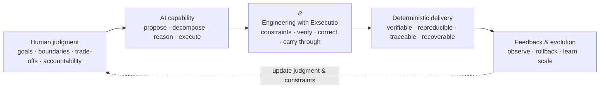
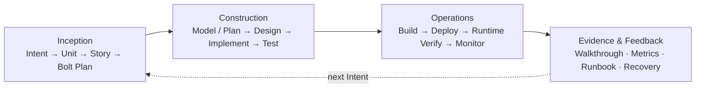
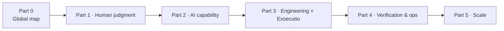
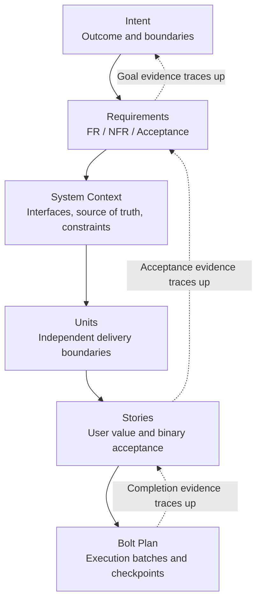

<!-- source: book/en/build-frontmatter.md -->


---
title: Deep Understanding AI-DLC
subtitle: From probabilistic intelligence to deterministic delivery
author: AI-DLC Book Project
lang: en-US
---

{.book-cover width=42%}

\tableofcontents
\clearpage

> **AI-DLC = 𝓔 (human judgment + AI capability)**  
> **𝓔 = Engineering with Exsecutio**

{.core-figure width=100%}

\newpage


<!-- source: book/en/manifesto.md -->


# Core manifesto · Deep Understanding AI-DLC

## Core formula

> **AI-DLC = 𝓔 (human judgment + AI capability)**  
> **𝓔 = Engineering with Exsecutio**

In one line: **humans set direction, AI adds acceleration, engineering execution ensures delivery.**

Human judgment defines goals, intent, boundaries, and trade-offs. AI capability generates, reasons, executes, and parallelizes. **𝓔** applies engineering constraints, verification, correction, and execution so probabilistic output becomes verifiable, deliverable, evolvable software.

The goal is not “generate faster,” but **deliver correctly, faster**.

## What AI-DLC is not

1. A single prompt or code generation is not delivery.
2. Goals, boundaries, trade-offs, and final accountability are not delegated to AI.
3. Speed without correctness, verifiability, and maintainability is not success.
4. Hiding failure modes and evidence boundaries is not engineering.
5. AI-DLC is not a tool wrapper—it is a lifecycle with deterministic delivery loops.

## English edition scope (v0.9.004)

This locale build is the **full English mirror** (Part 0 + chapters 1–10 + glossary). Release-profile PDF/HTML ship under `v0.9.004` tags. Chinese `book/` remains the canonical authoring source.


<!-- source: book/en/part-00-overview.md -->


# Part 00 · Bird's-eye AI-DLC: map of this book

> This part is a non-numbered guide—not one of the ten chapters.  
> **Reading goal:** In about 10 minutes, see the core tension, how AI-DLC runs, and how the ten chapters fit together.

## 0.1 Why start with the map

AI-DLC spans methodology, AI capability, engineering artifacts, verification, operations, and organizational change. If you jump straight into Intent, Memory Bank, or Bolt, you may memorize terms without seeing **why** they exist.

This book starts with one map: **probabilistic AI capability becomes deterministic delivery only through human judgment and engineering execution (𝓔).** The ten chapters zoom into regions of that map.

## 0.2 One diagram



Core formula:

> **AI-DLC = 𝓔 (human judgment + AI capability)**  
> **𝓔 = Engineering with Exsecutio**

Human judgment sets destination, boundaries, and accountability. AI amplifies proposal and execution. **𝓔** pushes probabilistic output along an engineering track until results can be verified and delivered.

## 0.3 Three layers

| Layer | Question | In this book |
| --- | --- | --- |
| Principles | Why doesn't probabilistic intelligence equal deterministic delivery? | Part 1 |
| System | How does AI get context, decompose work, and execute on rails? | Parts 2–4 |
| Scale | Which method for which risk; how teams replicate and measure value? | Part 5 |

Distinguish four kinds of knowledge:

- **Book framework** — e.g. `Engineering with Exsecutio`, argued in this book.
- **Method sources** — e.g. AWS AI-DLC, research models.
- **Reference implementations** — e.g. specs.md phases, Memory Bank, Bolts, four Agents.
- **Experiment evidence** — claims bounded by repo experiments and primary sources.

No single tool equals AI-DLC itself.

### 0.3.1 Official source triangle

1. **[AWS AI-DLC method definition (Amplify)](https://prod.d13rzhkk8cj2z0.amplifyapp.com)** — Reimagine rather than retrofit; reverse conversation; DDD in the core; Bolt vs Sprint; three phases and Mob rituals.
2. **[AWS DevOps blog (CN)](https://aws.amazon.com/cn/blogs/devops/ai-driven-development-life-cycle/)** — AI-Driven context and links to the whitepaper.
3. **[aidlc-workflows · WORKING-WITH-AIDLC](https://github.com/mancbj/aidlc-workflows/blob/main/docs/WORKING-WITH-AIDLC.md)** — Question→Doc→Approval, phase gates, Never Vibe Code.

**Book stance:** `Engineering with Exsecutio` explains how to push probabilistic output into verifiable delivery; AWS text is a method source; specs.md and aidlc-workflows are references. Experiment triage (30/30 verified) is not rewritten as “everything SHIP in production.”

**Two paths:** read the book (Part 0 + chapters) · run a workflow ([WORKING-WITH-AIDLC map](../../docs/WORKING-WITH-AIDLC-MAP.md)).

## 0.4 Lifecycle bird's-eye

Reference path from specs.md AI-DLC Flow:



## 0.5 Narrative arc



## 0.6 Reading routes

| Goal | Route | Outcome |
| --- | --- | --- |
| Leadership judgment | Part 0 → Ch. 1, 2, 9, 10 | Boundaries, accountability, scale |
| Team system design | Part 0 → Ch. 3–8, 10 | Artifacts, Bolts, verification, Operations |
| Minimal loop | Part 0 → Ch. 3–8 | Intent to runnable, verified delivery |

## 0.7 Four questions for every chapter

1. What must not be delegated to AI?
2. Are AI inputs, permissions, outputs, and failure modes explicit?
3. What independent evidence allows the next stage?
4. If wrong, can the system detect, rollback, fix, and record?

If these stay answerable, AI is not free-generating—it is moving on engineering rails toward deterministic delivery.


<!-- source: book/en/toc.md -->


# Table of contents · English edition

> **Status (v0.9.004):** Full English book (Part 0 + CH01–CH10 + glossary) builds in locale `en`.

## Part 00 · Overview

- [Part 00 · Bird's-eye map](part-00-overview.md) — **available**

## Part 01 · Human judgment

- [CH-01 · AI-native SDLC](chapters/ch01-ai-native-sdlc.md)
- [CH-02 · Human judgment and reverse dialogue](chapters/ch02-human-judgment.md)

## Part 02 · AI capability

- [CH-03 · Inception](chapters/ch03-inception.md)
- [CH-04 · Memory Bank and Standards](chapters/ch04-memory-bank-standards.md)

## Part 03 · Engineering × Exsecutio

- [CH-05 · Bolts](chapters/ch05-bolts.md)
- [CH-06 · Exsecutio](chapters/ch06-exsecutio.md)

## Part 04 · Verification and feedback

- [CH-07 · Verification](chapters/ch07-verification.md)
- [CH-08 · Operations](chapters/ch08-operations.md)

## Part 05 · Scale

- [CH-09 · Adaptive engineering](chapters/ch09-adaptive-engineering.md)
- [CH-10 · Organization and metrics](chapters/ch10-organization-metrics.md)

See also: [Chinese canonical TOC](../toc.md) · [Glossary](glossary.md)


<!-- source: book/en/chapters/ch01-ai-native-sdlc.md -->


# Chapter 1 · AI-Native SDLC: From Probabilistic Intelligence to Deterministic Delivery

## Metadata

| Field | Value |
|-------|-------|
| Chapter ID | CH-01 |
| Status Source | `progress/chapters.json` |
| Draft Completeness | D15-T02 readable draft; awaiting D15-T03 review and evidence alignment |
| Primary Question | When the cost of code generation drops sharply while output remains probabilistic, why must we redesign the SDLC rather than merely adding AI to the old process? |
| Reader Outcome | Able to distinguish AI-Assisted, AI-Driven, and Agentic paradigms, and explain the necessity and boundaries of AI-DLC using the core formula |
| Related Experiments | `EXP-01-01`、`EXP-01-02`、`EXP-01-03` |

## 01 · Question: Why the Old SDLC Cannot Contain AI

Imagine a very ordinary product need: add a “trial-read feedback entry” to an internal tool. In the era before AI, the team would clarify requirements, write tasks, schedule work, implement, test, and release. Code mattered, but what often consumed the cycle was not typing—it was aligning on goals, understanding context, handling edge cases, verifying correctness, fixing gaps, and placing the result in a maintainable system.

Now bring AI in. Developers can get routing, forms, backend APIs, test samples, draft documentation, even a Pull Request description that looks complete—all in minutes. Generation suddenly speeds up, fast enough to create a natural illusion: if code and docs can be produced this quickly, will software delivery automatically speed up too?

The answer is not that light. AI can lower generation cost, but it does not automatically lower delivery risk. It can produce a reasonable implementation and miss a permission boundary; it can add tests and bake wrong assumptions into those tests; it can generate polished explanations and state unverified conclusions with great certainty. Teams then hit a new counterintuitive phenomenon: **writing gets easier, and confirming that something should actually be delivered becomes more important.**

This chapter answers one question only: **when the cost of code generation drops sharply while output remains probabilistic, why must we redesign the SDLC rather than merely adding AI to the old process?**

“Redesign” here does not mean throwing away all existing engineering practice. Requirements, design, testing, release, rollback, and review still matter. What must change is how they are organized: the old process assumes people are the primary producers and tools are helpers; an AI-native process must acknowledge that AI has entered the center of proposing, decomposing, generating, fixing, and recording. If the process does not change with that, imbalance appears:

```text
AI makes generation faster
        ↓
More candidate designs, code, and changes
        ↓
Pressure rises on verification, trade-offs, traceability, and recovery
        ↓
If the SDLC is not restructured, speed amplifies uncertainty along with output
```

So the core job of an AI-native SDLC is not to have AI “write a bit more,” but to fold AI’s probabilistic capabilities into a system that can continuously constrain, verify, correct, and deliver.

After this chapter, readers should be able to do two things. First, judge whether a team practice is merely AI-Assisted or has entered AI-Driven or Agentic territory. Second, use this book’s core formula to explain why AI-DLC is not “AI replacing the process,” but putting human judgment and AI capability on an engineered execution track toward deterministic delivery.

### Gate

- [x] There is only one core question: why the SDLC must be redesigned.
- [x] Reader outcomes are observable: able to distinguish the three paradigms and explain necessity and boundaries with the core formula.

## 02 · Framework: Three Paradigms and One Delivery Chain

When discussing AI and the SDLC, three things are easiest to conflate: tool assistance, process driving, and agent collaboration. All may use large models and generate code, but they impose completely different requirements on human roles, sources of truth, verification, and delivery accountability.

### 2.1 AI-Assisted: People Use AI Inside the Old Process

The default structure of AI-Assisted is “human-led, AI-assisted.” People still manually drive requirements, design, implementation, testing, and release; AI is embedded in local steps: completing code, explaining errors, generating tests, polishing docs, turning a command into a script.

This mode is valuable. Learning cost is low, organizational shock is small, and it fits individual developers and low-risk tasks well. An engineer asking AI for a utility function in the IDE, or asking AI to explain a unit test from a failure log, usually does not require restructuring the whole R&D system.

But the boundary of AI-Assisted is clear: the process itself has not changed. Whether requirements are clear, whether boundaries are written into the source of truth, whether acceptance is reproducible, whether failure samples are kept, whether release has receipts—still depends mainly on manual upkeep. AI only accelerates certain actions in the old process.

One-line test: **if AI only improves efficiency in local human actions without changing task decomposition, state progression, evidence recording, and stage gates, it is AI-Assisted.**

### 2.2 AI-Driven: AI Participates in Decomposition, Execution, and Progression

The shift in AI-Driven is not just “AI writes more code.” AI begins to participate in work breakdown, proposing plans, executing tasks, fixing tests, updating status, and syncing progress. Human work changes too: not just feeding prompts one by one, but setting goals, boundaries, and checkpoints so AI advances along the source of truth.

The system must then answer a new set of questions:

- Where do AI’s inputs and boundaries come from?
- How are AI-generated plans accepted?
- How is drift during AI execution detected?
- How is each critical update recorded automatically?
- Where do humans make judgments that cannot be delegated?

Without engineered answers, AI-Driven easily degrades into faster, more complex chat-driven development. The team looks like it is moving fast, but the next day a new session, a different person, or another Agent may not know where current state came from, which decisions are in effect, or which evidence shows the result can enter the next stage.

One-line test: **if AI already participates in planning, execution, and state progression, and the team constrains it with sources of truth, acceptance, events, and gates, it has truly entered AI-Driven.**

### 2.3 Agentic: Multiple Agents Collaborate Along an Engineering Track

Agentic development further extends AI capability into a delegable, recoverable, continuously executable agent system. A Master Agent can route tasks; an Inception Agent can decompose Intent into Requirement, Unit, Story, and Bolt Plan; a Construction Agent can follow Bolts to produce design, implementation, tests, and Walkthrough; an Operations Agent can build and deploy candidates, run Runtime Verify, and fold in monitoring.

What is most appealing here is parallelism and continuity. Multiple Agents can collaborate around the same source of truth and split complex work into advanceable local pieces. But risk is also clearer: the more Agents, the less order can rely on chat memory and verbal agreement. Otherwise, multi-Agent work only parallelizes uncertainty.

One-line test: **if multiple Agents can divide work around the same set of versioned artifacts and keep advancing through stage gates and an evidence chain, it is Agentic; otherwise it is just multiple sessions generating at once.**

### 2.4 How the Three Paradigms Differ

| Paradigm | AI’s place | Human’s main work | Source-of-truth requirement | Typical risk |
| --- | --- | --- | --- | --- |
| AI-Assisted | Local assist tool | Write prompts, review code, manual wrap-up | Low to medium; old process can continue | Locally correct but not traceable end-to-end |
| AI-Driven | Participates in plan and execution | Set goals, boundaries, acceptance, correction | High; needs tasks, state, evidence, events | Speed amplifies hidden assumptions |
| Agentic | Multi-Agent division of labor | Design accountability, gates, recovery | Very high; must be versioned, recoverable, auditable | Parallelism amplifies context drift |

The point of this table is not to label teams, but to help them see what to add next. If you are still AI-Assisted, do not pretend you already have Agentic delivery; if AI already decomposes and executes, you must start adding sources of truth, gates, and evidence chains.

### 2.5 Method Source: AWS AI-DLC Method Definition (Summary)

[Raja SP · AWS AI-DLC Method Definition](https://prod.d13rzhkk8cj2z0.amplifyapp.com) (also reachable from the [AWS DevOps blog post](https://aws.amazon.com/cn/blogs/devops/ai-driven-development-life-cycle/)) is highly isomorphic to this book’s Chapter 1 question, but phrased in AWS’s official whitepaper. Below is a reading summary only—it **does not replace the original**:

| Principle (excerpt) | Meaning for the SDLC |
| --- | --- |
| Reimagine rather than retrofit | Iteration shifts from weeks/months to hours/days; many traditional rituals (e.g. story-point velocity) need rethinking in terms of business value |
| Reverse the conversation | Humans give Intent (destination); AI provides decomposition and route (like turn-by-turn navigation); humans retain oversight |
| Integration of design into the core | DDD/BDD/TDD flavors are embedded in planning and decomposition, not optional white space per team |
| Align with AI capability | Adopt AI-Driven balance: AI orchestrates; humans own verification, security, and final accountability |
| Cater to complex systems | Aimed at high architectural complexity and multi-team systems; minimal/low-code scenarios are out of scope for this method |
| Retain what enhances symbiosis | Keep artifacts that help human verification, such as User Story and Risk Register, optimized for real-time use |
| Facilitate transition through familiarity | Deliberate renames such as Bolt lower the cost of learning from Agile mental models |
| Minimise stages, maximise flow | Few stages as possible, but human “loss function” style verification at key decision points |
| No hard-wired SDLC workflows | AI generates Level 1 Plan by pathway (greenfield/brownfield/defect, etc.); humans validate Level 2+ step by step |

This book’s **AI-DLC = 𝓔 (human judgment + AI capability)** is an **engineering interpretation layer** on that official methodology, not a verbatim translation of AWS documents. specs.md, aidlc-workflows, and this book’s experiments each mark evidence boundaries so whitepaper appendix prompt templates are not treated as the book’s sole operational standard.

## 03 · Core Formula: From Probabilistic Intelligence to Deterministic Delivery

This book compresses the AI-DLC watershed into one formula:

> **AI-DLC = 𝓔 (human judgment + AI capability)**  
> **𝓔 = Engineering with Exsecutio**

The formula is deliberately not “human + AI = delivery.” Human judgment and AI capability, even added together, only yield stronger generation, faster feedback, and more candidate paths. They do not automatically become shippable software.

Human judgment owns four things: goal, boundary, trade-off, and accountability. Goal answers “where are we actually going”; boundary answers “what must not be done”; trade-off answers “how to choose among options”; accountability answers “who owns judgment and correction when results are wrong.” AI can assist these judgments but cannot finally own them.

AI capability also owns four things: propose, decompose, generate, and execute. It can turn vague intent into candidate requirements, suggest architecture options, generate code and tests, and fix implementation from failures. Its strengths are speed, breadth, and stamina; its risks are probabilistic output, incomplete context, and overconfidence.

`𝓔 = Engineering with Exsecutio` turns the first two into delivery. `Exsecutio` is a book-specific term stressing execution that drives plans to a deliverable state—not generic “execution” alone. `𝓔` includes at least four observable capability classes:

| 𝓔 capability | What it constrains | Observable artifacts |
| --- | --- | --- |
| Source of truth | Current goals, tasks, state, dependencies | `progress/tasks.json`, Memory Bank, Story, Bolt |
| Stage gates | What may enter the next stage | Acceptance items, checkpoints, Definition of Done |
| Evidence chain | Why we believe the result is correct | Tests, failure samples, build manifests, review records |
| Feedback record | How change is recovered and traced | Event ledger, snapshots, CHANGELOG, release receipts |

So the shortest definition of AI-DLC remains:

> Humans set direction, AI adds acceleration, engineered execution ensures delivery.

More strictly, AI-DLC is not “AI replacing the SDLC,” but “redesigning the SDLC around AI’s capabilities and risks.” It acknowledges AI’s speed and AI’s probabilistic nature; it uses AI’s generative power but does not treat model confidence as delivery evidence.

The opening of the book already embeds `book/images/fig0-1.svg` as the core figure. This chapter can revisit it repeatedly: human judgment and AI capability do not land on delivery directly—they enter `𝓔` first. Only through constraint, verification, correction, and follow-through can probabilistic output become deterministic delivery.

## 04 · Three-Part Argument: Why the Lifecycle Must Be Restructured

### Part one: AI changed the cost structure of software development

Much of the rhythm of traditional SDLC was designed around human production cost. Clarifying requirements took meetings; design took multi-person sync; implementation took engineer scheduling; testing took manually crafted samples; release took coordinated windows. Scrum Sprints, requirement reviews, dev scheduling, and batched testing are organizational techniques formed under that cost structure.

The first thing AI changes is the cost of drafts. A requirement can spawn multiple solution sketches in minutes; an API can quickly get matching tests; an error log can get an immediate explanation; release notes can be auto-drafted. Teams feel “the bottleneck is gone.” What actually disappeared is only part of generation cost.

The new bottleneck appears in selection, verification, and integration. More options mean trade-offs matter more; faster code means tests matter more; frequent changes mean traceability matters more; longer context means sources of truth matter more. Teams that still understand AI through the old process treat AI as a faster typist and miss that the system bottleneck has moved.

Conclusion of this part: **AI’s main effect is not making every old step a little faster—it changes where the process bottleneck sits.**

### Part two: Probabilistic intelligence must pass through an engineering system

What makes AI output powerful is also what makes it dangerous. It can give coherent answers under incomplete information and plausible explanations without evidence. Humans lower their guard when reading fluent text; systems assume runnable code means reliability.

Software delivery needs not “looks reasonable” but “correct under constraints.” An implementation must trace back to requirements; requirements to intent; tests must prove key risks; release must trace to build credentials. AI can participate in these links but cannot substitute its own certainty for evidence.

That is why AI-DLC needs versioned sources of truth, stage gates, failure samples, state diff records, and review credentials. They are not documentation burden—they are the transmission that turns probabilistic intelligence into engineering outcomes. Without them, the faster you go, the harder drift is to detect.

Conclusion of this part: **without sources of truth, standards, checkpoints, and evidence chains, speed amplifies both output and risk.**

### Part three: AI-DLC is the lifecycle that turns speed into deterministic delivery

The goal of AI-DLC is not to make the process look more “AI,” but to bring AI’s speed into a loop that is verifiable, reproducible, releasable, and recoverable. Referencing specs.md’s three phases, that loop can be read as a chain from intent to runtime:

```text
Inception
  Intent → Requirements → Unit → Story → Bolt Plan
Construction
  Model / Plan → Design → Implement → Test → Walkthrough
Operations
  Build → Deploy → Runtime Verify → Monitor → Recovery
Evidence & Feedback
  Events → Snapshots → Changelog → Next Intent
```

Each segment of this chain handles the same problem: AI can generate candidates, but candidates must pass human judgment and engineering evidence to move forward. Inception is not just writing requirements—it turns goals into traceable work structure. Construction is not just writing code—it advances implementation through stage gates. Operations is not just going live—it preserves build, Runtime Verify, monitoring, and recovery credentials; Runtime Verify here is not the same as delivery-candidate verification in Chapter 7. Evidence & Feedback is not just summarizing—it writes experience back into the next round of judgment.

Conclusion of this part: **the value of AI-DLC is not “a more AI-like process,” but bringing AI’s speed into a delivery loop that is verifiable, reproducible, releasable, and recoverable.**

## 05 · Example: Two Paths for the Same Intent

To ground the framework, take a minimal example. Suppose the team wants a “trial-read feedback entry”: readers can submit chapter feedback, authors can see a feedback summary, and blocking issues become revision tasks.

### Path A: Old process plus AI

On the AI-Assisted path, the author might:

1. Ask AI to generate a feedback form page.
2. Ask AI to add a submit script or static form config.
3. Ask AI to write a few tests.
4. Manually check whether the page looks usable.
5. Merge code and add documentation later.

This path is fast, especially for exploration. But it easily leaves open: where are requirement boundaries? Must feedback be anonymous? Which fields are required? How are submit failures handled? How does feedback enter the task system? After release, how do you prove the entry actually works? If the next session continues maintenance, where do you restore context?

These are not failures of AI-Assisted—they are its boundary. It suits local acceleration; it does not natively provide lifecycle-level traceability.

### Path B: AI-DLC closed loop

On the AI-DLC path, the same Intent enters the source of truth and task track first:

```text
Intent: Prepare trial-read feedback entry
  - Boundary: collect trial-read feedback only, not marketing subscriptions
  - Acceptance: entry reachable, fields complete, feedback path documented
  - Task: D12-T03 "Prepare trial-read feedback entry"
  - Artifacts: feedback/template, README, site link
  - Events: task state changes auto-written to events.jsonl
  - Projection: cockpit and object drill-down show next action and completion evidence
```

On this path, AI can still generate pages, scripts, and copy, but every step must return to tasks, artifacts, and acceptance. Done is not “the page looks fine,” but the source of truth shows the task complete, required artifacts exist, acceptance passes, progress pages drill down, and key events are traceable.

That is the difference between AI-DLC and old process plus AI: the former does not slow AI down—it gives AI’s speed rails, brakes, and an odometer.

### Comparative observation

| Dimension | Old process + AI | AI-DLC closed loop |
| --- | --- | --- |
| Speed | Fast start, fast local generation | Slightly heavier start, but recoverable afterward |
| Accountability | Mostly human memory and catch-up | Human judgment written into boundaries, acceptance, gates |
| Evidence | Often stops at “looks usable” | Tasks, artifacts, tests, events traceable |
| Recovery | Depends on chat history or personal memory | New session continues from source of truth |
| Risk | Hidden assumptions may shift later | Assumptions surface earlier in acceptance and records |

Later experiments in this chapter will harden this contrast: the same Intent through conversational generation vs. AI-DLC loop, comparing delivery cycle, rework, defects, and evidence completeness.

## 06 · Experiment: Chapter Experiment Entry Points

`EXP-01-01`, `EXP-01-02`, and `EXP-01-03` are all verified and consume only frozen fixtures in the repository—no external models or live web fetches in CI. `EXP-01-03` triage remains `KEEP-EXT`.

### `EXP-01-01` · Same Intent multi-generation variance baseline

This experiment asks: when input is identical and multiple frozen generations differ, how large are structural difference rate and test-pass variance? Run: `python3 experiments/exp-01-01/quickstart.py --sample`. Sample at `experiments/exp-01-01/output/sample.json`.

It shows that multiple frozen results for the same Intent can be diffed deterministically; a frozen variance baseline does not prove any model is “stable enough.” It supports this chapter’s argument: the process cannot rely on a single generation alone.

### `EXP-01-02` · AI-Assisted vs AI-Driven comparison

This experiment asks: for the same small feature, how do manual round-trips, defect escape, and end-to-end time compare between frozen AI-Assisted and AI-Driven delivery records? Run: `python3 experiments/exp-01-02/quickstart.py --sample`. Sample at `experiments/exp-01-02/output/sample.json`.

It shows two frozen workflow records can be compared; it does not prove one workflow is universally better. It supports this chapter’s case: AI-DLC trades source of truth and gates for recoverable, auditable delivery.

### `EXP-01-03` · AI-DLC three-phase official flow reproduction (KEEP-EXT)

This experiment checks artifact completeness and checkpoint counts for Inception, Construction, and Operations trajectories against a frozen pin guide in the repo. Run: `python3 experiments/exp-01-03/quickstart.py --sample`. Sample at `experiments/exp-01-03/output/sample.json`.

It shows the three-phase trajectory on the frozen guide can be reproduced deterministically; it does not write specs.md as the only standard or validate a live portal. It supports this chapter’s boundary: specs.md is a reference implementation, not the methodology itself.

## 07 · Figure: Chapter Figure Entry Point

This chapter continues to reuse the book’s core figure `book/images/fig0-1.svg` (embedded at the book opening). It expresses not a generic flowchart but the causal structure of AI-DLC:

```text
Human judgment + AI capability
        ↓
𝓔 = Engineering with Exsecutio
        ↓
Deterministic delivery
        ↓
Feedback and scale
```

When reading the figure, note two places. First, human judgment and AI capability do not point directly to delivery—they must pass through `𝓔`. Second, feedback is not an appendix—it returns to human judgment and engineering constraints and decides how the next lifecycle begins.

If readers remember only one figure, remember this one: all AI-DLC chapters expand different segments of this chain. Independent chapter figures CH-02 through CH-10 are local expansions of this chain, not replacements for the core figure.

## 08 · Boundary: What This Chapter Does Not Cover

To keep Chapter 1 from becoming a small book, this chapter deliberately does not cover:

- The full model of human–machine responsibility allocation—that is Chapter 2.
- Intent-to-Bolt Plan decomposition detail—that is Chapter 3.
- Memory Bank and Standards engineering structure—that is Chapter 4.
- Bolt types, stage gates, and execution mechanics—that is Chapters 5 and 6.
- Verification methods, deployment/operations, and organizational scale—that is Chapters 7–10.

This chapter establishes one entry judgment only: **if AI’s generative power has already changed the cost structure of the development system, the SDLC must be redesigned around the engineering transformation of probabilistic intelligence.**

## 09 · Reader Exercise

Choose your team’s most recent experience using AI for programming and spend 10–30 minutes on the short exercise below.

1. Write the Intent for that work: one sentence stating the goal.
2. Judge whether it was AI-Assisted, AI-Driven, or Agentic.
3. List three non-delegable human judgments: goal, boundary, trade-off, or accountability.
4. List what AI actually did: propose, decompose, generate, test, fix, or record.
5. Check for four classes of `𝓔` artifacts: source of truth, stage gates, evidence chain, feedback record.
6. If one class is missing, add one minimal artifact—for example one acceptance item, one failure sample, one event record, or one reproducible command.

When done, you should answer in one sentence: did this AI use improve local efficiency, or start changing the delivery system?

## 10 · Review Notes for D15-T03

D15-T03 review should focus on five items:

- Technical boundary: do not write AI-DLC as the only correct process, or specs.md as this book’s framework itself.
- Terminology consistency: keep `𝓔 = Engineering with Exsecutio`; do not auto-replace with `Execution`.
- Evidence boundary: `EXP-01-01` / `EXP-01-02` / `EXP-01-03` are verified but each only proves diff, comparison, and three-phase trajectory reproduction on frozen fixtures; `EXP-01-03` must not be rewritten as SHIP or as full official flow deployment.
- Structural coherence: question, framework, case, experiments, figures, and exercise must serve the same core question.
- Adjacent chapter boundaries: Chapter 1 explains only why the lifecycle must be restructured, not the specific methods of Chapters 2–10.

## References

- `book/manifesto.md`: core formula, formula explanation, and boundaries.
- `book/part-00-overview.md`: AI-DLC bird’s-eye view, lifecycle map, and book narrative structure.
- `book/images/fig0-1.svg`: AI-DLC core formula and deterministic delivery loop.
- `book/toc.md`: CH-01 core question, reader outcome, reference implementation, and experiment direction.
- `specs.md-portal/pages/methodology/what-is-ai-dlc.md`: local snapshot of AI-DLC methodology entry.
- `specs.md-portal/pages/methodology/sdlc-reimagined.md`: local snapshot of AI-native SDLC methodology pages.
- `specs.md-portal/pages/core-concepts/bolts.md`: local snapshot of Bolts vs Sprint comparison.
- `progress/chapters.json`: chapter source of truth and six-phase status.
- `progress/experiments.json`: experiment governance for `EXP-01-01`, `EXP-01-02`, `EXP-01-03`.
- `progress/tasks.json`: writing task cards D15-T01, D15-T02, D15-T03.
- [AWS AI-DLC Method Definition (Amplify)](https://prod.d13rzhkk8cj2z0.amplifyapp.com), [AWS DevOps blog post](https://aws.amazon.com/cn/blogs/devops/ai-driven-development-life-cycle/): methodology source summary (CH-01 §2.5).


<!-- source: book/en/chapters/ch02-human-judgment.md -->


# Chapter 2 · Human Judgment and Reverse Conversation

## Metadata

| Field | Value |
|-------|-------|
| Chapter ID | CH-02 |
| Status Source | `progress/chapters.json` |
| Draft Completeness | D16-T02 readable draft; awaiting D16-T03 review and evidence alignment |
| Primary Question | When AI proactively proposes, decomposes, and executes, how should humans set the destination, retain accountability, and choose verification checkpoints? |
| Reader Outcome | Able to define Intent, boundary, non-delegable judgment, human checkpoint, and final accountable party |
| Related Experiments | `EXP-02-01`、`EXP-02-02`、`EXP-02-03` |

## 01 · Question: When AI Takes the Initiative, What Are Humans Still Responsible For?

Chapter 1 established an entry judgment: AI lowers generation cost but does not automatically bring deterministic delivery. Chapter 2 pushes one step further. Suppose the team already accepts that AI is not just an autocomplete tool—that it can proactively propose, break down tasks, generate options, fix errors, and update records. The question becomes immediate: **the more proactive AI is, where should human judgment stand?**

This question is easily pulled off course by two misunderstandings.

The first is “humans can keep prompting step by step.” In that mode, AI is only a faster execution tool. Humans think through each step, then ask AI to write code, add tests, edit docs. It is safe, familiar, and fits low-risk local work; but when AI can already propose decomposition, surface ambiguity, and compare options, pure step-by-step prompting wastes AI’s proposing power.

The second misunderstanding is more dangerous: since AI can take initiative, let AI decide goals, boundaries, and trade-offs. On the surface the system looks more automatic; in reality human accountability is diluted. Models can suggest, but models are not the final accountable party. They do not know what risk the organization will accept, which readers take priority, whether an experiment conclusion is enough to enter the main text, or who answers for a release outcome.

So this chapter’s core view is: **the more proactive AI is, the less human judgment can leave the field; human work is not watching AI’s every move, but setting destination, boundary, non-delegable judgment, human checkpoints, and final accountability.**

In AI-DLC, that relationship compresses to one line:

```text
AI proposes.
Human validates.
Engineering records the decision.
```

AI proposing lets the system see alternative paths earlier; human validation keeps goal, boundary, and accountability from drifting; engineering recording lets the next session, the next collaborator, and the next release recover this judgment. All three are necessary. Only AI proposes → model monologue; only Human validates → manual process; only Engineering records → human judgment truly enters the lifecycle.

After this chapter, readers should be able to do one concrete thing: given an AI task, first write Intent, Boundary, Non-delegable Judgment, Human Checkpoint, and Accountability, then decide where AI may start taking initiative.

### Gate

- [x] There is only one core question: after AI takes initiative, how humans set destination, retain accountability, and choose checkpoints.
- [x] Reader outcomes are observable: able to define Intent, boundary, non-delegable judgment, human checkpoint, and final accountable party.

## 02 · Framework: The Five-Piece Human Judgment Set

This chapter uses a five-piece framework to answer “what are humans still responsible for?”:

```text
Intent
  - Destination: what result are we trying to achieve?
Boundary
  - Boundary: what will we not do, must not do, or defer?
Non-delegable Judgment
  - Non-delegable judgment: which trade-offs must not be finally decided by AI?
Human Checkpoint
  - Human checkpoint: at which stages must humans stop and confirm?
Accountability
  - Accountability: who owns the final choice and its consequences?
```

These five correspond to “human judgment” in the book’s formula. They are not the opposite of AI capability—they are preconditions for scaling AI capability safely.

### 2.1 Intent: Destination Is Not a Prompt

Intent is not a casual prompt or “help me build a feature.” Intent is human judgment about outcome: why we do it, how far we go, who uses it, how we know we succeeded.

“Help me build a feedback entry” is a wish, not a qualified Intent. It at least lacks four pieces: who feedback is for, what feedback to collect, what not to collect, and what success looks like. AI can ask these questions or propose defaults, but defaults must be confirmed by humans.

If Intent is unclear, AI can still generate a lot. The danger is exactly there: it will quickly and earnestly do something that was never correctly defined.

### 2.2 Boundary: Boundaries Keep Speed from Overstepping

Boundary answers “what we will not do.” Boundary is not passive limitation—it is active protection. It tells AI which paths look reasonable but must not enter current work.

In this book project, boundaries have saved the process repeatedly. For example `specs.md-portal/` is locally crawled official-site material and is not uploaded as a subsequent GitHub repo object; `github_repo_reference_ai-agent-book-main/` is a local reference repo and does not enter the public repo; `working-book/` is author working material and is also not a publish target. If these boundaries live only in chat memory, AI’s organizing power can become risk: it may treat “related” as “should be included.”

Boundaries keep AI’s speed from overstepping and let the next session recover without re-guessing author intent.

### 2.3 Non-delegable Judgment

Non-delegable judgments are items where AI may advise but humans must finally decide. They usually involve value, risk, accountability, and real-world constraints.

In a writing project, non-delegable judgments include:

- Who this book is for and which reader problems take priority.
- Whether a term must be kept, e.g. `𝓔 = Engineering with Exsecutio`.
- Whether an experiment is enough to support a main-text conclusion.
- Which directories do not enter the public repo.
- Whether v0.1 meets the release bar.
- Whether to delay release for stronger evidence.

In software projects, non-delegable judgments are similar: whether business risk is acceptable, where compliance boundaries lie, whether data may be accessed by models, recovery objectives, who approves the final release window.

AI can list options, explain cost, point out gaps, generate comparison tables—but it cannot be the final accountable party. The key is not “AI cannot participate” but “AI cannot decide finally.”

### 2.4 Human Checkpoint: Checkpoints Are the Steering Wheel, Not the Brake

Checkpoints are often misread as “slow AI down.” More accurately, checkpoints are the steering wheel of a high-speed system. The faster you go, the more you must confirm direction at key junctions.

A good Human Checkpoint meets at least three conditions:

1. It happens before errors cascade.
2. It requires explicit evidence, not AI self-assessment alone.
3. It leaves a record so the next execution knows why to continue, pause, or reroute.

In AI-DLC, checkpoints should not appear only at final acceptance. Whether Intent is correct, boundaries clear, Stories acceptable, Bolts chosen correctly, tests independent, release rollback-ready—all can be human checkpoints. More checkpoints is not the goal; place them where errors amplify most, rework costs most, and accountability must be clearest.

### 2.5 Accountability: Accountability Cannot Be Automated

Accountability closes the five-piece set. Once results enter the real world, someone must own trade-offs. Accountability here is not “find someone to blame”—the system must know:

- Who may confirm goals.
- Who may accept risk.
- Who may approve release.
- Who starts correction when results are wrong.
- Who writes experience back into the next round of constraints.

Without accountability, AI-DLC degrades to “model suggested it, everyone assumed OK.” With accountability, AI becomes an amplifier of human capability, not a diluter of responsibility.

## 03 · Core Pattern: Reverse Conversation

Traditional human–machine interaction is often “human asks, AI answers.” That works well locally: I give an error log, AI explains; I give code, AI refactors; I give a draft, AI polishes.

In AI-DLC, the more important structure is reverse conversation: **AI first surfaces questions, risks, options, and gaps; humans then validate, revise, or reject.**

```text
Traditional prompt chain
  Human asks -> AI answers -> Human asks again

Reverse conversation chain
  Human states intent -> AI proposes questions/options/risks
  -> Human validates boundaries/checkpoints
  -> AI executes within recorded constraints
```

Reverse conversation does not let AI own the goal—it lets AI expose what needs human judgment earlier. A good Agent should not rush to finish; before execution it should ask:

- Is my understanding of the goal correct?
- Which boundaries are still undefined?
- Which judgments cannot I make for you?
- At which stages do you need to confirm?
- If I continue, what risks might appear?

This is also why the specs.md reference implementation’s division among Master Agent, Inception Agent, Construction Agent, and Operations Agent matters. Master routes and judges context; Inception turns intent into an executable plan; Construction advances along Bolts; Operations handles release and runtime. Each Agent can propose proactively, but each critical advance should leave human validation and engineering record.

### 3.1 Mob Elaboration and Question–Doc–Approval (Summary)

The AWS method definition describes **Mob Elaboration** as Inception’s core ritual: same room, shared screen, facilitator-led mob with PO, developers, QA, and other stakeholders; AI first proposes User Stories, acceptance criteria, Units, and suggested Bolts from Intent; the team then corrects under- and over-engineering and aligns NFRs, risks, and metrics. This matches this chapter’s reverse conversation: **AI exposes gaps and options first; humans validate boundaries and checkpoints.**

The community repo [aidlc-workflows · WORKING-WITH-AIDLC](https://github.com/mancbj/aidlc-workflows/blob/main/docs/WORKING-WITH-AIDLC.md) operationalizes similar constraints as **Question→Doc→Approval**: key conclusions must be written into md artifacts and human-approved before Construction; stage transitions should “gate” and clear irrelevant chat context so old assumptions do not pollute the next Bolt. Chapter 4 expands Memory Bank; Chapter 3 only requires Inception outputs to include approvable, linkable Story/Unit/Bolt artifacts—not “verbal agreement” in chat.

## 04 · Three-Part Argument: Why Human Judgment Must Come First

### Part one: AI initiative changes where human work sits

In AI-Assisted mode, humans usually think through each step, then ask AI to help locally. In AI-Driven or Agentic mode, AI begins to ask questions, split work, recommend routes, and execute candidates. Human position moves forward: from step-by-step orders to defining destination, boundary, and checkpoints.

If humans only review at the end, problems surface late: wrong goal understanding, boundaries never written, default plans mismatched to risk appetite, tests not covering real acceptance. The later the discovery, the more rework.

Conclusion: **the more AI can drive progress proactively, the more humans must shift from operator to judge and gate designer.**

### Part two: Reverse conversation moves clarification forward

Traditional interaction puts clarification mainly on humans: the clearer the question, the better the answer. In real projects, humans often do not know all boundaries at the start. AI’s value is not only answering—it can help discover problems.

Reverse conversation has AI list ambiguity, risk, options, and checkpoints before execution. Humans need not design prompts from a blank page—they validate AI’s judgment checklist. That moves “requirements unclear after implementation” risk to “clarify before execution.”

Conclusion: **reverse conversation does not let AI own the goal—it lets AI expose what needs human judgment earlier.**

### Part three: Human judgment must land in traceable artifacts

Human judgment that stays in chat expires quickly. The next session cannot see this choice; another collaborator does not know why a option was rejected; release audit cannot tell whether a risk was accepted.

Judgment must enter artifacts: Intent, boundary notes, acceptance items, checkpoints, decision records, task state, accountable parties, event ledger, review records. Engineering record is not paperwork—it is how human judgment continuously constrains AI execution.

Conclusion: **human judgment constrains AI execution continuously only when engineered into records—not as one-off verbal opinion.**

## 05 · Example: Two Dialogues for the Same Vague Need

Suppose the author asks:

> Help me build a trial-read feedback entry.

The need looks small. AI can immediately generate a form, submit script, and copy. But it hides many judgments: anonymous feedback? contact info? public display? GitHub Issue? file uploads? required fields? failure handling? who handles feedback? which feedback blocks release?

### Path A: Human prompts step by step

In a normal prompt chain, the human might proceed:

```text
Human: Help me build a trial-read feedback entry.
AI: Generate a form page.
Human: Add a chapter field.
AI: Added.
Human: Add an email field.
AI: Added.
Human: Write a README.
AI: Generated.
```

This path starts fast but scatters key judgments across supplemental prompts. Humans add what they think of; boundaries they did not think of temporarily do not exist. The result may be a usable-looking page, not a governable feedback entry.

Path A’s risk is not that AI did nothing—it is that AI did too much not constrained by systematic judgment.

### Path B: AI proposes, human validates

In the reverse conversation chain, AI does not rush to implement—it first offers a judgment checklist:

```text
AI: Let me confirm 5 things first:
  1. Intent: Is this entry for trial-read feedback or formal reader support?
  2. Boundary: Must we avoid collecting phone numbers, company names, etc.?
  3. Non-delegable Judgment: Which feedback blocks v0.1 release?
  4. Human Checkpoint: Who confirms before the entry goes live?
  5. Accountability: Who handles and closes feedback after submission?

Human: Trial-read feedback only; no phone numbers; blocking feedback judged by author;
       I confirm before go-live; decisions written to feedback/decisions.json.

AI: After recording boundaries and acceptance, generate entry and docs.
```

Path B is not necessarily slower than Path A. It makes pre-implementation judgment explicit. AI still generates pages and docs, but generation happens after constraints. Done is no longer “page looks fine” but “entry, boundaries, acceptance, accountability, and record paths are all traceable.”

### Comparative observation

| Dimension | Human step-by-step prompts | AI proposes, human validates |
| --- | --- | --- |
| Start | Human asks for implementation directly | AI exposes judgment checklist first |
| Boundaries | Add one when remembered | Confirm centrally before execution |
| Risk | Undefined defaults guessed by AI | Undefined items enter clarification first |
| Accountability | Often implicit in chat | Written accountable parties and checkpoints |
| Record | Depends on conversation memory | Enters source of truth, tasks, events |

This example does not prove “every need needs heavy process.” It only shows: when AI can execute proactively, what is most worth automating is not human judgment—it is surfacing where human judgment is needed earlier.

## 06 · Experiment: Chapter Experiment Entry Points

This chapter links three experiments. `EXP-02-01`, `EXP-02-02`, and `EXP-02-03` are verified; `EXP-02-03` triage remains `KEEP-EXT`.

### `EXP-02-01` · Non-delegable judgment checklist generator

This experiment turns project goals, risks, constraints, and accountability roles into a “human judgment points and accountability boundary checklist.” It tracks judgment-point coverage and unassigned accountability count. Run:

```bash
python3 experiments/exp-02-01/quickstart.py --sample
```

Sample output at `experiments/exp-02-01/output/sample.json`. It shows input entries can generate judgment points and boundaries by fixed rules; coverage only means rule hit rate, not that all non-delegable judgments in the project are covered.

### `EXP-02-02` · Reverse conversation clarification benefit experiment

This experiment compares the same vague need in two frozen session groups: implement directly vs clarify then implement. Metrics include post-implementation requirement changes, critical omissions, and clarification rounds. Run: `python3 experiments/exp-02-02/quickstart.py --sample`. Sample at `experiments/exp-02-02/output/sample.json`.

It shows frozen sessions can be compared for clarification benefit; clarification does not always reduce change. It supports this chapter’s pattern: reverse conversation is to expose critical omissions earlier.

### `EXP-02-03` · Four-Agent human checkpoint session reproduction (KEEP-EXT)

This experiment checks checkpoint adherence and unsupported approval counts for routing, proposal, human approval, and handoff sessions against a frozen pin guide in the repo. Run: `python3 experiments/exp-02-03/quickstart.py --sample`. Sample at `experiments/exp-02-03/output/sample.json`.

It shows human–machine checkpoints on frozen sessions can be reproduced deterministically; it does not write external Agent docs as the only standard or replace real human approval. It supports this chapter’s boundary: multi-Agent value is handoff back to human validation and engineering record.

## 07 · Figure: Chapter Figure Entry Point

This chapter’s figure is the “human judgment gate diagram.” It is not a generic approval flow—it is the judgment structure before AI initiative enters the engineering track.

{.core-figure width=100%}

Source file: `book/images/ch02-human-judgment-gate.svg`. When reading, follow this main chain:

```text
Intent
  -> Boundary
  -> AI Proposal
  -> Human Checkpoint
  -> Accepted Work
  -> Evidence Record
  -> Feedback to Intent / Boundary
```

Two emphases:

1. AI Proposal sits after Boundary. AI may take initiative, but initiative must happen inside boundaries.
2. Evidence Record feeds back to Intent and Boundary. Evidence from each execution updates the next round of human judgment.

## 08 · Boundary: What This Chapter Does Not Cover

To keep Chapter 2 focused, this chapter deliberately does not cover:

- Repeating Chapter 1’s overall case for AI-native SDLC necessity.
- Full decomposition from Intent to Requirement, Unit, Story, Bolt Plan—that is Chapter 3.
- Cross-session Memory Bank and Standards structure—that is Chapter 4.
- Bolt stage gate detail—that is Chapters 5 and 6.
- Verification method comparison—that is Chapter 7.

This chapter answers only: **when AI proposes and executes proactively, how human judgment becomes destination, boundary, checkpoint, and accountability.**

## 09 · Reader Exercise

Pick a task you are considering handing to AI and spend 10–30 minutes filling this minimal judgment card.

```text
Task:
Intent:
Boundary:
Non-delegable Judgment:
Human Checkpoint:
Accountability:
Evidence Record:
```

Follow three rules when filling:

1. Intent must state outcome, not action. “Collect trial-read feedback and form a revision entry” beats “build a form.”
2. Boundary: at least three items, one must be “what we are not doing now.”
3. Non-delegable Judgment: at least two items, each with final confirmer noted.

Then ask AI to propose an implementation plan from this card. If the plan does not reference these constraints, do not implement—have it rewrite the plan first.

## 10 · Review Notes for D16-T03

D16-T03 review should focus on five items:

- Technical boundary: do not write human judgment as “human approves everything,” or AI initiative as “AI owns everything.”
- Terminology consistency: keep `𝓔 = Engineering with Exsecutio` and place this chapter clearly under “human judgment” in the formula.
- Evidence boundary: `EXP-02-01` / `EXP-02-02` / `EXP-02-03` are verified but each only proves rule-based checklist, frozen session comparison, and human–machine checkpoint reproduction; `EXP-02-03` must not be rewritten as SHIP or as mature Agentic approval.
- Structural coherence: question, five-piece set, reverse conversation, case, experiments, figure, and exercise must serve the same core question.
- Adjacent chapter boundaries: this chapter does not expand Chapter 3 Intent decomposition artifacts—only how humans confirm goals and boundaries.

## References

- `book/toc.md`: CH-02 core question, reader outcome, reference implementation, experiment direction.
- `book/manifesto.md`: “human judgment” duties in the core formula.
- `../../chapters/ch01-ai-native-sdlc.md`: previous chapter’s AI-Assisted, AI-Driven, and Agentic distinction (Chinese source).
- `./ch01-ai-native-sdlc.md`: English translation of Chapter 1.
- `progress/chapters.json`: chapter source of truth and six-phase status.
- `progress/experiments.json`: experiment governance for `EXP-02-01`, `EXP-02-02`, `EXP-02-03`.
- `progress/tasks.json`: writing task cards D16-T01, D16-T02, D16-T03.
- `specs.md-portal/pages/agents/overview.md`: local snapshot of four-Agent responsibilities.
- `specs.md-portal/pages/faq.md`: local snapshot related to AI proposes, human validates and Mob Elaboration.
- [aidlc-workflows · WORKING-WITH-AIDLC](https://github.com/mancbj/aidlc-workflows/blob/main/docs/WORKING-WITH-AIDLC.md), `docs/WORKING-WITH-AIDLC-MAP.md`: Question→Doc→Approval operational mapping.


<!-- source: book/en/chapters/ch03-inception.md -->


# Chapter 3 · Inception: From Intent to an Executable Plan

## Metadata

| Field | Value |
|-------|-------|
| Chapter ID | CH-03 |
| Status Source | `progress/chapters.json` |
| Writing Sprint Card | D17-T03 · Complete chapter review and evidence alignment |
| Draft Completeness | Formal ten-chapter production-line readable draft; D17-T03 five-category review complete |
| Primary Question | How can AI decompose a high-level Intent into independently deliverable Units, acceptable Stories, and executable Bolts without losing human goals and boundaries? |
| Reader Outcome | Able to perform a traceable decomposition of Intent, Requirements, System Context, Unit, Story, and Bolt Plan |
| Related Experiments | `EXP-03-01`、`EXP-03-02`、`EXP-03-03` |

## 01 · Question: Why Intent Cannot Go Straight to AI Execution

Many teams’ first move when adding AI to development is natural: throw one sentence at the model—“Help me build a GitHub writing system that keeps writing the book, auto-records progress, and ships v0.1 in two weeks.” The model can immediately return directories, files, scripts, even several pages at once. The problem starts there: it already looks like work, but we still do not know whom it is working for, toward which goal, what must be public, what must stay local, or what counts as done.

That is the core tension Inception handles. AI generates fast enough, but a high-level Intent is not an executable unit. Intent mixes outcome, timing, boundaries, quality bars, audience, and implicit risk. Jumping from Intent straight to code commonly yields three outcomes.

First, goals and solutions tangle. The model picks a technical path early without showing it serves the original purpose. Second, there is no dependency graph between tasks. A page can be built first, but if task source of truth, event model, and acceptance rules are undefined, progress numbers on the page are maintained by hand. Third, human judgment points arrive too late. Discovering “this is not the v0.1 I wanted” after dozens of files are generated makes rework expensive.

AI-DLC Inception does not treat “write more prompts” as the fix. It turns one high-level Intent into a traceable, acceptable, executable artifact chain:

```text
Intent
  → Requirements
  → System Context
  → Units
  → Stories
  → Bolt Plan
  → Human Checkpoints
```

This chapter answers one question: how to complete this decomposition chain without distortion. It does not expand Bolt internal execution stages, full cross-session Memory Bank design, or deployment and monitoring. After this chapter, readers should take their own project Intent, decompose into 2 Units and 3–5 Stories, and explain which upstream goal each Story serves and which acceptance condition ends it.

## 02 · Framework: The Seven-Level Decomposition Chain

Inception work is not as simple as splitting big tasks into small ones. Ordinary breakdown only answers “what to do”; AI-DLC breakdown must also answer “why these items exist, how to prove they are done, and where humans judge whether direction has drifted.”

### Seven-level decomposition chain

**Intent** is the destination. It describes the outcome to reach, not the implementation upfront. Example: “Build a system that can keep writing on GitHub, form a publishable v0.1 in two weeks, and automatically visualize every critical update”—that includes outcome, place, rhythm, and visibility, but is not yet a task list.

**Requirements** turn Intent into checkable functional and non-functional requirements. Functional requirements say what the system must provide; non-functional requirements say quality, boundaries, security, traceability, and runtime constraints. Inception that only lists functional requirements often misses constraints that truly affect delivery trust—such as “do not upload local working materials” or “state changes must be recorded automatically.”

**System Context** describes how the system connects to the outside world. It must state where the source of truth lives, which directories enter the public repo, which do not, who the primary readers are, which tools may be assumed, and what must not go online or depend on secrets. Context stops later Agents from guessing boundaries from chat memory.

**Units** are independently deliverable capability boundaries. A Unit is not an arbitrary folder—it is a delivery unit with inputs, outputs, responsibilities, and dependencies. Clear boundaries let AI execute in parallel or phases instead of mixing source of truth, cockpit, release workflow, and feedback in one pass.

**Stories** write Unit capabilities as user value and binary acceptance. A good Story is not just “implement task model”—it says who needs it, which Requirement it serves, and what evidence moves it to done. Binary acceptance is not literary critique—it is a true/false bar.

**Bolt Plan** orchestrates Stories into hour-to-day execution batches. Bolt value is controlling risk propagation: build source of truth and validation first, then visualization; run minimal build before release candidates. Each Bolt should have phases, artifacts, and checkpoints.

**Human Checkpoints** are judgment gates against AI high-speed drift. Humans need not inspect every generated line, but must retain decision rights at goal boundaries, architecture trade-offs, sample quality, release gates, and similar positions.

### Four invariants

Whether Inception is reliable can be checked with four invariants.

First, outcome before solution. Intent should say “what result for whom” first—not lock scripts, frameworks, or page styles upfront. Second, boundary before parallelism. Parallelism without boundaries creates conflict; parallelism with boundaries creates engineering speed. Third, acceptance before generation. Stories without acceptance become “lots written” but never stably done. Fourth, checkpoint before loss of control. Human judgment should appear while errors are still local and reversible.

These four also explain the book’s core formula:

`𝓔 = Engineering with Exsecutio`

In Inception, Engineering means making intent, boundaries, dependencies, acceptance, and evidence explicit; Exsecutio presupposes an execution track AI can follow through while humans can still verify and correct. Without Inception, the faster execution runs, the faster drift may spread.

### Mob Elaboration and dual workflow inputs (summary)

Typical outputs of the official Inception ritual **Mob Elaboration** include: Units, User Stories, NFRs, risk descriptions (alignable with organizational Risk Register), metrics tracing business Intent, and suggested Bolts; optional PRFAQ aligns business narrative (see [Amplify whitepaper](https://prod.d13rzhkk8cj2z0.amplifyapp.com) and [AWS blog post](https://aws.amazon.com/cn/blogs/devops/ai-driven-development-life-cycle/)).

[aidlc-workflows](https://github.com/mancbj/aidlc-workflows/blob/main/docs/WORKING-WITH-AIDLC.md) adds two inputs to solidify early: **Vision** (product/business intent) and **Tech Environment** (stack, constraints, brownfield context). They map to this book’s Intent + System Context, and stress that Inception also follows Question→Doc→Approval—plan md approved before Construction. Chapter-to-workflow mapping is in [WORKING-WITH-AIDLC-MAP.md](../../../docs/WORKING-WITH-AIDLC-MAP.md).

## 03 · Example: Inception Decomposition for This Book Project

We use this book project as the example. Original Intent in one sentence:

> From scratch, build a system on GitHub to write and continuously update *Deep Dive into AI-DLC*, form a publishable v0.1 in two weeks, with all critical updates automatically recorded and visualized.

That sentence carries at least four information classes. Outcome: sustained writing and updates; time boundary: v0.1 in two weeks; source-of-truth boundary: on GitHub; quality bar: critical updates auto-recorded and visualized. Asking AI to create pages first most easily yields a pretty page without task model, event ledger, or Release gates.

The steadier path is Requirements first, for example:

- FR-001: Provide readable sample chapters.
- FR-002: Provide runnable experiments.
- FR-003: Provide progress cockpit.
- NFR-001: All progress traceable.
- NFR-002: Public repo must not contain local working materials.
- NFR-003: Release status must not be manually forged.

System Context then constrains project boundaries: Git repo is source of truth; `progress/tasks.json`, `progress/chapters.json`, `progress/experiments.json` are primary fact files; `specs.md-portal/` and `github_repo_reference_ai-agent-book-main/` do not enter subsequent GitHub repo objects; book build artifacts go to `.artifacts/`; real v0.1 release must be proven by GitHub `release.published` event.

Units further tighten responsibilities. This project treats “GitHub writing system UI / source of truth / automation” as one main Unit. That Unit’s job is not “build a web page”—it maintains consistency among manuscript, experiments, progress source of truth, static cockpit, and release evidence.

Stories turn Unit capabilities into acceptable slices. For example, `D02-T03 · Define task model` is not valued as “write a JSON file”—it gives subsequent tasks stable state, dependencies, artifacts, and acceptance fields so they can be aggregated, validated, and visualized. This Story serves FR-003 and NFR-001. Completion evidence includes `progress/schemas/task-schema.md`, `progress/tasks.json`, validation scripts, and pass status.

Then Bolt Plan. This project did not start with Release workflow—it started with source of truth, sample chapters, experiments, progress aggregation, and core figures. Order matters: without source of truth, the cockpit shows hallucination; without experiment evidence, practice claims in sample chapters are only opinions; without build scripts, internal manuscript cannot form reproducible candidates.

A bad decomposition might read:

```text
Task: Build an awesome release page
Acceptance: Page looks good
Artifact: site/index.html
```

The problem is not that the page is unimportant—“awesome” and “looks good” are not binary; it does not say where page numbers come from, whether source of truth is a prerequisite, or how auto-recording is proven. A corrected task binds source of truth, dependencies, and acceptance:

```text
Task: Render cockpit core metrics
Depends on: task model, experiment pool, progress aggregation
Artifact: site/index.html
Acceptance: Core numbers from progress/generated/current.json; readable without JS
```

Then the task becomes an executable object, not a wish.

## 04 · Experiment: Structural Traceability Check

This chapter’s practical evidence comes from `EXP-03-01 · Intent-to-Story trace chain generator`. It does not call models, go online, or judge business semantics. It only checks whether a candidate Inception decomposition meets structural traceability: whether Requirements have downstream Units and Stories, Stories have upstream goals, acceptance exists, references are valid.

From repo root:

```bash
python3 experiments/sample/quickstart.py \
  --input experiments/sample/samples/input.json \
  --output experiments/sample/output/sample.json
```

Valid sample output is at `experiments/sample/output/sample.json`. Key metrics:

| Metric | Current Result | Meaning |
|---|---:|---|
| requirement_coverage_percent | 100.0 | Every Requirement traces to Unit and Story |
| orphan_story_count | 0 | No Story without upstream goal |
| acceptance_completeness_percent | 100.0 | Every Story has non-empty acceptance |
| invalid_reference_count | 0 | No references to unknown objects |

These four numbers prove structure only, not semantics. Even with `valid: true`, humans still judge whether “readable sample chapter” is specific enough and whether Story acceptance truly represents reader value. AI-DLC needs this division: machines do deterministic structure checks; humans do goal and meaning judgment.

Failure samples matter equally. `experiments/sample/samples/invalid/` holds five bad input types: missing NFR, duplicate ID, unknown reference, orphan Story, empty acceptance. They trigger stable error codes `E_MISSING_NFR`, `E_DUPLICATE_ID`, `E_UNKNOWN_REF`, `E_ORPHAN_STORY`, and `E_ACCEPTANCE`. “Decomposition quality” is no longer subjective—it can enter automated tests and release gates.

Test entry:

```bash
python3 -m unittest discover \
  -s experiments/sample/tests \
  -p 'test_*.py'
```

Readers can adapt this experiment into their own checker. Minimal exercise: write your Intent, list 2 Requirements, 1 Unit, 3 Stories, run a similar check, and see whether any Story lacks upstream goal or any Requirement lacks implementation coverage.

### `EXP-03-02` · Unit and Bolt dependency DAG validator

`EXP-03-02` checks the next structural layer: whether the dependency graph among Unit, Story, and Bolt is executable. It outputs the graph and counts cycles, cross-Unit coupling edges, and unmet prerequisites. Run:

```bash
python3 experiments/exp-03-02/quickstart.py --sample
```

Sample report at `experiments/exp-03-02/output/sample.json`. It shows dependency lists can be machine-reviewed; it does not prove optimal plans, nor auto-fail cross-Unit coupling—that appears as warning counts for human confirmation.

### `EXP-03-03` · Full Inception Agent decomposition reproduction (KEEP-EXT)

`EXP-03-03` is verified but triage remains `KEEP-EXT`: it only checks artifact completeness and trace link coverage for Requirements, System Context, Units, Stories, Bolt Plan against a frozen pin guide in the repo. Run:

```bash
python3 experiments/exp-03-03/quickstart.py --sample
```

Sample at `experiments/exp-03-03/output/sample.json`. It shows frozen decomposition packages reproduce deterministically; it does not write external Inception Agent docs as the only standard or prove business semantics are correct.

## 05 · Figure: Decompose Down, Trace Up

This chapter’s figure should show two directions: decompose down, trace up. The standalone SVG fixes this chain as an auditable source file; the Mermaid below remains a build-time readable expansion.

{.core-figure width=100%}

Source file: `book/images/ch03-intent-to-bolt.svg`. It is a local expansion of the book core figure `book/images/fig0-1.svg`: landing “overall structure” on Inception’s decomposition chain.



So the figure is not decoration—each node in the main text has an evidence path:

| Node | Evidence Entry |
|---|---|
| Intent | `memory-bank/intents/001-github-writing-system/requirements.md` |
| Requirements | `planning/sample-experiment.md` and `experiments/sample/samples/input.json` |
| Units | `memory-bank/intents/001-github-writing-system/units.md` |
| Stories | `memory-bank/story-index.md` |
| Bolt Plan | `memory-bank/bolts/001-github-writing-system-ui/bolt.md` |
| Progress Events | `progress/events/events.jsonl` |

## 06 · Review: Readable Draft Self-Check and Follow-Up Review Entry

This chapter migrated from v0.1 sample to formal ten-chapter production-line CH-03 readable draft. Legacy sample `book/chapters/sample.md` remains as v0.1 release evidence; this file from D17-T02 onward is book build entry and follow-up review target. D17-T03 formal review record is in `planning/reviews/ch-03-writing-review.md`.

First-round five-category review is in `planning/reviews/sample-chapter.md`. Before public release, language polish and figure enhancement can continue, but existing review confirms basic evidence chain for v0.1 candidate gates.

First, technical correctness: this chapter must keep distinguishing three things. AI-DLC is this book’s method framework; specs.md is reference implementation; `EXP-03-01` is structural trace experiment. Do not write structural validity as business correctness, or one local experiment as universal law.

Second, repetition and boundaries: this chapter covers only Intent to Bolt Plan formation—not CH-04 cross-session Memory Bank or CH-06 Bolt runtime detail. Readers should know “how plans form,” not full execution mechanics in this chapter.

Third, structural coherence: the three problems raised at the opening must close in the body. Goal–solution mixing addressed by Requirements and Context; missing dependency graph by Units, Stories, Bolt Plan; late human judgment by Human Checkpoints.

Fourth, terminology consistency: Intent, Requirement, System Context, Unit, Story, Bolt, Checkpoint are defined at first use—do not casually swap for “goal, requirement, module, task, execution pack.” Explanatory language may vary; English terms stay stable.

Fifth, body–experiment alignment: every practice claim must trace to evidence entry. This chapter’s entries include `experiments/sample/README.md`, `experiments/sample/output/sample.json`, five failure sample types, test commands, `planning/sample-experiment.md`, `book/images/fig0-1.svg`, and `book/images/ch03-intent-to-bolt.svg`.

## Reader Exercise

Choose your own project and spend 20 minutes on this exercise.

1. Write one Intent, at most 40 words, stating outcome not solution.
2. Write 2 Requirements, at least 1 non-functional.
3. Write 1 Unit stating responsibility and referenced Requirements.
4. Write 3 Stories, each referencing Unit and Requirement with one binary acceptance.
5. Check for orphan Stories, empty acceptance, or unknown references.
6. Write the next Checkpoint that must be human-judged.

If you complete these six steps, you have a minimal Inception result. It is not a full project plan, but it is far more reliable than “one sentence and let AI start coding.”

## References

- `planning/sample-chapter-decision.md`: CH-03 sample selection and six-phase breakdown.
- `planning/sample-experiment.md`: `EXP-03-01` experiment contract, metrics, boundaries.
- `experiments/sample/README.md`: experiment run instructions and verified status.
- `experiments/sample/output/sample.json`: valid sample output evidence.
- `experiments/sample/output/README.md`: success and failure sample notes.
- `experiments/exp-03-03/README.md`: full Inception Agent decomposition reproduction (KEEP-EXT / frozen pin).
- `experiments/exp-03-03/output/sample.json`: frozen decomposition completeness and trace link coverage sample.
- `progress/experiments.json`: governance status for `EXP-03-01`, `EXP-03-02`, `EXP-03-03`.
- `book/images/fig0-1.svg`: book-wide AI-DLC core figure.
- `book/images/ch03-intent-to-bolt.svg`: Intent-to-Bolt bidirectional trace figure.
- `../../chapters/sample.md`: v0.1 sample chapter evidence copy (Chinese source).
- `planning/reviews/ch-03-writing-review.md`: formal ten-chapter CH-03 five-category review record.
- `progress/chapters.json`: chapter source of truth and phase status.
- [AWS AI-DLC Method Definition (Amplify)](https://prod.d13rzhkk8cj2z0.amplifyapp.com), [WORKING-WITH-AIDLC](https://github.com/mancbj/aidlc-workflows/blob/main/docs/WORKING-WITH-AIDLC.md), `docs/WORKING-WITH-AIDLC-MAP.md`: Mob Elaboration and dual-input summary.


<!-- source: book/en/chapters/ch04-memory-bank-standards.md -->


# Chapter 4 · Context Engineering: Memory Bank and Standards

## Metadata

| Field | Value |
|-------|-------|
| Chapter ID | CH-04 |
| Status Source | `progress/chapters.json` |
| Writing Sprint Card | D18-T03 · Complete chapter review and evidence alignment |
| Draft Completeness | Formal ten-chapter production-line readable draft; D18-T03 five-category review complete |
| Primary Question | How can versioned sources of truth and explicit Standards let every fresh Agent session recover the right context and keep obeying engineering constraints? |
| Reader Outcome | Able to design a minimal Memory Bank, Standards directory, artifact references, and change-sync rules |
| Related Experiments | `EXP-04-01`、`EXP-04-02`、`EXP-04-03` |

## 01 · Question: Why AI Needs Recoverable Context

Chapter 3 answered how to break Intent into an executable plan. Once writing or development starts in earnest, a second problem appears immediately: AI sessions are fluid, but engineering facts must stay continuous.

When a human engineer returns to a project the next day, they recover context from the repo, docs, issues, tests, and recent decision records. A new Agent session needs the same entry points. The difference is that Agents have strong language capability but more fragile memory boundaries: they easily fill gaps from fragments in chat history, and they easily treat old assumptions as current facts. If a project relies only on conversational memory, it becomes harder over time to answer three basic questions.

First, what is the current goal? Continue toward v0.1 release, or has work already moved into v0.2? Without a versioned source of truth, an Agent may keep executing tasks that are already done, or skip blockers that just appeared.

Second, which files belong in the public repo and which are local working material only? In this book project, `specs.md-portal/`, `github_repo_reference_ai-agent-book-main/`, and scattered study materials are explicitly excluded from subsequent GitHub uploads. If that boundary lives only in chat, the next session may wrongly fold local reference material into public deliverables.

Third, which rules must not be “helpfully optimized away”? For example, this book’s core terminology must stay `𝓔 = Engineering with Exsecutio`; `Exsecutio` must not be auto-corrected to `Execution`. That is not spelling—it is author-defined specialized terminology. Rules like this must live in Standards, not in hope that the model guesses author intent every time.

So the core problem of context engineering is not “how to make AI remember more.” Remembering more often only amplifies noise. The real question is: **how to compress the facts, standards, and decisions the next session must inherit into engineering artifacts that can be read, validated, and updated.**

In AI-DLC, Memory Bank and Standards are the minimal answer to that question.

```text
Chat history        → unreliable recall
Versioned facts     → recoverable current state
Standards           → inheritable engineering constraints
Events & snapshots  → auditable change path
```

This chapter answers only how context is recovered and how it constrains the next execution. It does not expand how Bolts run internally, nor production deployment and monitoring; those belong to Chapters 5, 6, and 8. After this chapter, readers should be able to write a minimal Memory Bank for their own project: at least goal, state, standards, current task, evidence links, and recent decisions—and explain why those artifacts are enough for a new session to continue work.

### 1.1 Three Typical Context-Loss Failures

**Failure one: goal drift.**  
When an Agent receives “continue to the next task” without reading the source of truth, it can only guess the next step from recent chat. Guessing may suffice on short tasks, but in a two-week continuous writing system it distorts quickly. After v0.1 ships, the correct next step moves from `D14-T03` to v0.2 cycle task `C02-T01`; that must be proven by `progress/cycles.json` and `progress/generated/current.json`, not by tone of conversation.

**Failure two: boundary amnesia.**  
Real projects accumulate boundaries: which directories do not upload, which assets are reference-only, which outputs may ship, which credentials must leave traces. If boundaries are not versioned rules, AI’s “organizing power” becomes risk—it may unify, move, or publish files that merely look related.

**Failure three: standards drift.**  
Writing projects have engineering standards too. Figure style, the chapter six-phase pipeline, release Definition of Done, GitHub template fields, and “no `foreignObject` in SVG” are all standards. Standards drift is not one obvious mistake—it is a series of small “that could work too” shifts. Once those accumulate across a book or a system, readers feel stylistic chaos and maintainers lose a basis for judgment.

### 1.2 Memory Bank Is Not a Document Warehouse

Many teams first hear Memory Bank and treat it as “put all the materials in.” That is the mistake. A warehouse optimizes for collection; Memory Bank optimizes for recovery. A warehouse can be huge; Memory Bank should stay as small as possible. A warehouse answers “what did we ever have?” Memory Bank answers “how should the next session continue?”

An effective Memory Bank meets at least four conditions.

1. **Currency**: It describes current project state, not historical wishes. Done, blocked, next action, and release sources must be readable directly from fact files.
2. **Traceability**: Every state change links back to files, events, snapshots, or release receipts—avoiding “I remember we already did that.”
3. **Executability**: It records background and tells the next session what it may safely do and what it must not overstep.
4. **Convergability**: Scripts can validate it. Format, state enums, dependencies, links, and evidence paths do not depend on long-term human eyeballing.

This book project’s current minimal context is built from a few file classes: `progress/tasks.json` records fourteen-day task facts, `progress/cycles.json` records the v0.2 continuous-update cycle, `progress/chapters.json` records the ten-chapter six-phase production line, `progress/events/events.jsonl` records key changes, and `memory-bank/standards/` holds project standards. Together they form the context in which “a new session can pick up work.”

### 1.3 Standards Are Solidified Human Judgment

Standards are valuable not because they look formal, but because they put human judgment on the track early. Human judgment cannot be re-explained every time; once explanation relies on verbal add-ons, the faster AI executes, the faster deviation spreads.

This book already has several hard constraints, for example:

- The core formula must keep `𝓔 = Engineering with Exsecutio`.
- Figures default to technical-monograph grade, Swiss grid, IBM Carbon–lean restrained style.
- The public GitHub repo must not include locally crawled materials, reference repos, or working-book working material.
- Every critical update must enter events, snapshots, cockpit, or release receipts.
- Chapter progress must advance through the six phases `question / framework / example / experiment / figure / review`.

These rules look scattered, but they answer one question: when no human is watching every token, how does AI still move along human judgment?

### 1.4 Completion Criteria for This Section

After this section, readers should be able to restate three sentences:

1. Memory Bank is not “make AI remember all materials”—it lets a new session recover current state, boundaries, and next action.
2. Standards are not document decoration—they solidify human judgment into execution constraints AI must inherit.
3. The goal of context engineering is not longer context, but sources of truth that are more reliable, more checkable, and sustainably updatable.

If readers carry those three sentences into the rest of Chapter 4, they have passed the easiest misunderstanding gate in context engineering: AI-DLC does not try to lengthen chat—it hardens engineering facts.

## 02 · Framework: Minimal Recoverable Context Stack

CH-04’s framework is not “feed all materials to AI,” but design a small, hard, verifiable set of context artifacts so a brand-new session can recover current state and keep obeying human judgment and engineering standards.

This chapter uses a five-layer context stack:

```text
Current State
  Current cycle, next action, done/blocked status

Intent & Scope
  Goals, boundaries, explicit non-goals, public vs local material boundaries

Standards
  Stack, coding rules, terminology, visual style, release gates

Evidence Links
  Tasks, chapters, experiments, events, snapshots, build manifests, review records

Update Protocol
  When to update, who updates, how to validate, how to generate visible records
```

These five layers jointly answer five recovery questions for a new session:

1. Which cycle am I in, and what is the next step?
2. Which Intent does this task serve, and where are the boundaries?
3. Which rules must not be “helpfully optimized”?
4. Which evidence entries should my judgments and changes land in?
5. After I finish, how does the next session recover too?

In this framework, Memory Bank holds recoverable facts, Standards hold inheritable constraints, and events and snapshots hold the change path. Together they implement `𝓔 = Engineering with Exsecutio` at the context layer: human judgment is not only spoken—it is fixed into tracks the next AI execution must inherit.

### Gate

- [x] There is only one core question: how a new session recovers correct context and keeps obeying engineering constraints.
- [x] Reader outcomes are observable: able to design minimal Memory Bank, Standards directory, artifact references, and change-sync rules.
- [x] This chapter does not describe Memory Bank as “longer chat history” or “universal long-term memory.”
- [x] This chapter does not expand Bolt internal execution, release monitoring, or multi-Agent organizational governance.

### Question–Doc–Approval and Never Vibe Code (summary)

[WORKING-WITH-AIDLC](https://github.com/mancbj/aidlc-workflows/blob/main/docs/WORKING-WITH-AIDLC.md) summarizes context discipline as **Question→Doc→Approval** (clarifications written into versioned artifacts → human approval → then execute) and **Never Vibe Code** (without an approved plan or Story, codegen should not start). Stage gating also recommends **actively clearing** chat context unrelated to current artifacts at the start of a new Bolt or new phase, forcing the Agent to cold-start from Memory Bank, Standards, and `aidlc-docs/` (or this book’s `progress/`, `memory-bank/`) instead of guessing state from long conversation.

That aligns with this chapter’s five-layer stack: Memory Bank answers “what the next session inherits,” Standards answer “what must not be casually changed,” Update Protocol answers “how to write back to the source of truth after approval.” This book does not copy the workflow’s full directory layout; teams using aidlc-workflows should keep the same evidence boundary as this chapter—chat is not a delivery credential. Chapter-to-workflow mapping is in [WORKING-WITH-AIDLC-MAP.md](../../../docs/WORKING-WITH-AIDLC-MAP.md).

## 03 · Three-Part Argument: Why Context Engineering Enables Continuous Delivery

### First part: chat history cannot carry engineering facts

Chat history suits conversation, not a continuous-delivery source of truth. It lacks stable structure, resists script validation, and does not naturally separate “completed facts,” “old plans,” “temporary ideas,” and “author’s final judgment.” If an Agent keeps going from chat impression alone, goal drift, boundary amnesia, and state misreads appear most easily.

Conclusion for this part: **the first value of context engineering is to pull must-inherit current facts out of chat history into versioned, checkable, traceable artifacts.**

### Second part: Standards turn human judgment into inheritable constraints

Human judgment that stays in one conversation round decays in the next execution round. Terminology must not change, directories must not upload, figure style must not drift, release status must not be manually forged—these are not preferences a model reliably “infers from smarts”; they are engineering constraints that must be written explicitly into Standards.

Conclusion for this part: **the second value of context engineering is to solidify human judgment into standards a new session must read and obey.**

### Third part: update protocol keeps context hardening, not rotting

If Memory Bank and Standards only grow without discipline, they soon become noise libraries. AI-DLC must engineer the update action itself: state changes enter fact sources, key changes enter the event ledger, phase results generate snapshots, the cockpit projects from facts, review records return to chapter evidence chains. Context does not get heavier with every delivery—it becomes more recoverable.

Conclusion for this part: **the third value of context engineering is to keep context recoverable, auditable, and executable through continuous updates.**

## 04 · Example: This Book Project’s Minimal Memory Bank

We use this book project as the example. Suppose a brand-new Agent session receives only: “Continue to the next task.” If it relies on chat impression, it may read “next task” as the most recently mentioned task, the tail of v0.1 release, or even repeat work already finished. For stable handoff, the project must translate “continue” into readable facts.

The current minimal Memory Bank splits into five entry classes:

```text
Current State
  progress/generated/current.json
  progress/tasks.json
  progress/cycles.json

Intent & Scope
  memory-bank/intents/001-github-writing-system/requirements.md
  memory-bank/story-index.md

Standards
  memory-bank/standards/coding-standards.md
  memory-bank/standards/tech-stack.md
  working-book/SVG_STYLE_GUIDE.md

Evidence Links
  progress/events/events.jsonl
  progress/snapshots/
  planning/reviews/
  .artifacts/book/build-manifest.json

Update Protocol
  validate_project.py
  generate_progress.py
  ci_check.py
```

The first class is Current State. `progress/tasks.json` tells the Agent which tasks are done, which are ready, and whether dependencies are satisfied; `progress/chapters.json` tells six-phase production-line status per chapter; `progress/generated/current.json` is the aggregate projection for cockpit and next action. Without such facts, “continue” is only guessing.

The second class is Intent & Scope. `memory-bank/intents/001-github-writing-system/requirements.md` and `memory-bank/story-index.md` tell the Agent what goal the system originally served: not merely writing a few chapters, but building a system for sustained writing on GitHub with automatic recording, visual tracking, and release. Scope also includes explicit non-goals: `specs.md-portal/`, `github_repo_reference_ai-agent-book-main/`, and `working-book/` are not uploaded as subsequent GitHub repo objects.

The third class is Standards. `memory-bank/standards/coding-standards.md` sets basic constraints on tasks, JSON, links, generated files, and tests; `memory-bank/standards/tech-stack.md` sets this project’s static stack; `working-book/SVG_STYLE_GUIDE.md` holds figure-style judgment. Together they stop AI from treating “I think that’s nice too” as project standard.

The fourth class is Evidence Links. Task completion cannot stop at “done” in prose. It should link to the event ledger, snapshots, review records, experiment outputs, and build manifests. For example, when D17-T03 closed CH-03, evidence landed in `planning/reviews/ch-03-writing-review.md`, `progress/events/events.jsonl`, `progress/snapshots/`, and cockpit drill-down objects. A new session need not trust the prior Agent’s self-report—it can follow evidence.

The fifth class is Update Protocol. `validate_project.py` checks fact sources, `generate_progress.py` generates events, snapshots, and pages from facts, `ci_check.py` chains validation into continuous-integration gates. Context is not a manually curated one-page “project blurb”—it is a set of artifacts that harden automatically after each task advance.

So a session with Memory Bank interprets “continue to the next task” like this:

```text
Read fact sources
  → find ready task
  → check dependencies and boundaries
  → change the corresponding chapter or artifact
  → update task/chapter fact sources
  → generate events, snapshots, cockpit
  → run validation and commit evidence
```

A session without Memory Bank may still produce fluent text, but it does not know whether it is on the right task. A session with Memory Bank is not merely “more memorable”—it has tracks for recovery, execution, and handoff.

## 05 · Experiment: Cold-Start Recovery A/B Check

This chapter’s evidence entry is `EXP-04-01 · Memory Bank cold-start recovery A/B experiment`. It compares two candidate first-turn actions:

- `with_memory_bank`: read versioned facts, cycle, chapters, standards, and exclusion boundaries, then act.
- `without_memory_bank`: act from chat impression and vague project background only.

Current sample output shows:

| Group | Context Recovery | First Action Error | Clarification Questions |
|---|---:|---:|---:|
| with_memory_bank | 100.0% | false | 0 |
| without_memory_bank | 0.0% | true | 3 |

From repo root:

```bash
python3 experiments/exp-04-01/quickstart.py --sample
```

Output is at `experiments/exp-04-01/output/sample.json`. The experiment uses Python standard library only—no network, no model calls. It checks five things: current cycle, next action, evidence paths, excluded directories, and specialized terminology recovery.

These results do not prove every project gets the same numbers, nor that AI truly understood business semantics. They support a narrower, more reliable claim: **when key context is written as versioned facts and Standards, new sessions recover correct action boundaries more easily; when context lives only in chat impression, first-action errors and terminology drift appear more easily.**

That is exactly where AI-DLC needs experiments. We do not require proof that “Memory Bank always works”—only an observable difference on the table: the same phrase “continue to the next task” can yield very different recovery quality with or without engineered context.

### `EXP-04-02` · Standards drift detector

`EXP-04-02` checks rule violations and version gaps between versioned Standards and generated artifacts. Run:

```bash
python3 experiments/exp-04-02/quickstart.py --sample
```

Output is at `experiments/exp-04-02/output/sample.json`. It only shows declared rules can be compared deterministically; it does not prove those rules apply to every repo. Without human baseline labels, false-positive rate is recorded as `null`—it must not be dressed up as already low.

### `EXP-04-03` · Official Memory Bank structure reproduction (KEEP-EXT)

`EXP-04-03` is verified, but triage remains `KEEP-EXT`: it only validates minimal Memory Bank required paths and reference validity against a frozen pin fixture in the repo—it does not fetch external specs.md pages in CI. Run:

```bash
python3 experiments/exp-04-03/quickstart.py --sample
```

Output is at `experiments/exp-04-03/output/sample.json`. The sample reports `required_file_completeness_percent` and `reference_validity_percent`; it shows frozen structure loads reproducibly, does not write specs.md as the sole standard, and does not prove arbitrary projects’ Memory Bank semantics are already correct.

## 06 · Figure: New-Session Cold-Start Recovery Stack

This chapter’s figure is the “new-session cold-start recovery stack”:

{.core-figure width=100%}

Source file: `book/images/ch04-memory-bank-stack.svg`. Structure summary:

```text
New Agent Session
  ↓
Read Current State + Intent + Standards + Evidence
  ↓
Derive Next Safe Action
  ↓
Execute and Update Facts
  ↓
Events / Snapshots / Dashboard
  ↺
Next Session Recovers from Updated Facts
```

The figure emphasizes a closed loop, not a folder of files. A new session first reads Current State, Intent & Scope, Standards, and Evidence Links, derives the next safe action, then after execution must write changes back through Update Protocol to fact sources and trigger Events, Snapshots, and Dashboard. The next session recovers from updated facts.

The figure should carry at least three visual weight levels:

1. Primary: main flow `New Session → Next Safe Action → Updated Facts`.
2. Secondary: four input classes—Current State, Intent & Scope, Standards, Evidence Links.
3. Tertiary: audit outputs such as Events, Snapshots, Dashboard.

Do not read Memory Bank as an ordinary document warehouse: the recovery stack’s value is “how the next session continues safely.”

## 07 · Boundary: What This Chapter Does Not Solve

To keep Memory Bank from becoming a basket for everything, this chapter draws clear boundaries.

First, this chapter does not discuss “unlimited long-term memory.” AI-DLC cares about engineering recovery, not saving every conversation, asset, and preference in the model. Long-term memory without structure, validation, and update rules only preserves old assumptions longer.

Second, this chapter does not replace Bolt execution mechanics in Chapters 5 and 6. Memory Bank tells the Agent current state and constraints; Bolt decides how an execution batch is designed, implemented, tested, and accepted. Correct context does not imply correct execution.

Third, this chapter does not replace Operations in Chapter 8. Events, snapshots, and cockpit support traceability before and after release, but deployment verification, monitoring, and recovery strategy need separate treatment.

Fourth, this chapter does not require every team to copy this book’s directories. Copy the principles: version current state, standardize human judgment, trace evidence paths, automate validation in update protocol. Concrete filenames may differ; the four commitments cannot.

Fifth, `EXP-04-03` verified status covers structure and reference checks on the frozen pin fixture only; do not write KEEP-EXT reproduction as full official spec landed in production, and do not recast it as SHIP.

## Reader Exercise

Choose one of your own projects and spend 20 minutes designing a minimal Memory Bank of at most six files.

1. Write a `current-state` file: current cycle, next action, done/blocked status.
2. Write an `intent-and-scope` file: goals, boundaries, and explicit non-goals.
3. Write a `standards` file: five rules AI must not “helpfully optimize.”
4. Write an `evidence-index` file: entries for tasks, experiments, reviews, release, or build evidence.
5. Write an `update-protocol` file: which fact sources must update after task completion.
6. Delete one unnecessary file so Memory Bank stays a recovery stack, not a warehouse.

Then test in one sentence: let a session that knows nothing about the project read only this file set and answer “What is the next safe action?” If it still needs heavy guessing, your Memory Bank is not too small—it is not hard enough yet.

## References

- `progress/cycles.json`: v0.2 active cycle and next-action source.
- `progress/generated/current.json`: current progress aggregate and cockpit data.
- `progress/chapters.json`: ten-chapter six-phase production-line fact source.
- `memory-bank/standards/coding-standards.md` and `memory-bank/standards/tech-stack.md`: current project Standards entries.
- `planning/releases/v0.2-draft.md`: v0.2 continuous-update cycle draft.
- `experiments/exp-04-01/README.md`: Memory Bank cold-start recovery A/B experiment description.
- `experiments/exp-04-01/output/sample.json`: reproducible experiment output generated for C02-T02.
- `experiments/exp-04-03/README.md`: official Memory Bank structure reproduction (KEEP-EXT / frozen pin) description.
- `experiments/exp-04-03/output/sample.json`: frozen pin structure and reference validation sample.
- `progress/experiments.json`: governance status for `EXP-04-01`, `EXP-04-02`, `EXP-04-03`.
- `planning/reviews/ch-04-writing-review.md`: formal ten-chapter production-line CH-04 five-category review record.
- [WORKING-WITH-AIDLC](https://github.com/mancbj/aidlc-workflows/blob/main/docs/WORKING-WITH-AIDLC.md), [WORKING-WITH-AIDLC-MAP.md](../../../docs/WORKING-WITH-AIDLC-MAP.md): Question→Doc→Approval and Never Vibe Code.


<!-- source: book/en/chapters/ch05-bolts.md -->


# Chapter 5 · Bolts: Choosing the Right Track for Fast Execution

## Metadata

| Field | Value |
|-------|-------|
| Chapter ID | CH-05 |
| Status Source | `progress/chapters.json` |
| Writing Sprint Card | D19-T03 · Complete chapter review and evidence alignment |
| Draft Completeness | Formal ten-chapter production-line readable draft; D19-T03 five-category review complete |
| Primary Question | How do you choose Bolt scope, type, and stage gates from domain complexity, risk, and reversibility so speed rises without errors cascading? |
| Reader Outcome | Able to split hour-to-day Bolts and make a justified choice between DDD Construction and Simple Construction |
| Related Experiments | `EXP-05-01`、`EXP-05-02`、`EXP-05-03` |

## 01 · Question: Why Fast Execution Still Needs a Track

Chapter 3 covered Inception: decomposing Intent into Requirements, Units, Stories, and a Bolt Plan. Chapter 4 covered context engineering: letting a new session recover current facts from the Memory Bank and Standards. In Chapter 5 the question becomes: **after context is restored correctly, how do you slice work into execution batches that are fast enough yet keep mistakes from cascading?**

AI-DLC calls these execution batches **Bolts**. A Bolt is not a generic task and not a shrunken traditional Sprint. Generic tasks often say only “what to do”; Sprints often carry one-to-two-week planning, coordination, and scheduling; a Bolt is closer to an hour-to-several-day engineering track. It must have clear scope, inputs, outputs, stage gates, acceptance criteria, and completion evidence.

If a Bolt is cut too large, AI accumulates assumptions across a long execution chain and errors spread from design into implementation, tests, and docs. By the time humans see the wrong direction, the fix is not one code change—it is unwinding a chain of interdependent artifacts. If a Bolt is cut too small, the system devolves into fragmented prompts: more context switching, design that never settles, and verification cost that rises instead of falls.

So this chapter’s core question is: **how do you choose Bolt scope, type, and stage gates from domain complexity, risk, and reversibility so speed rises without errors cascading?**

After this chapter, readers should be able to do three things:

1. Split a Story into hour-to-day Bolts.
2. Judge whether it fits Simple Construction or DDD Construction better.
3. Design minimal stage gates so AI can move fast but cannot cross risk points without evidence.

### Gate

- [x] There is only one core question: how to choose Bolt scope, type, and stage gates.
- [x] Reader outcomes are observable: able to split hour-to-day Bolts and choose between DDD and Simple with justification.
- [x] This chapter does not expand full execution logs or Walkthrough; that is Chapter 6’s focus.
- [x] This chapter does not describe Bolts as traditional Sprints, generic tasks, or unbounded autonomous Agents.

## 02 · Framework: Four Design Knobs for a Bolt

This chapter describes a Bolt with four design knobs:

```text
Scope
  How much Story surface, files, and risk should one Bolt cover?

Type
  Simple Construction or DDD Construction?

Gates
  Which stages must stop for verification, recording, or human confirmation?

Evidence
  What artifacts prove the Bolt can close and hand off to the next stage?
```

### 2.1 Scope: Slice Until Errors Are Reversible

Bolt scope is not “as small as possible.” It should be small enough that errors are reversible and large enough to form a deliverable increment. A good Bolt usually has three boundaries:

- **Input boundary:** which Stories, Requirements, Standards, or fact sources it starts from.
- **Change boundary:** which files, directories, interfaces, or content it may modify.
- **Done boundary:** which evidence means stop—not “while we’re here, optimize.”

These boundaries give AI speed a container. Without a container, speed becomes diffusion; with one, speed becomes progress.

### 2.2 Type: Choosing Simple vs DDD

Not every Bolt needs full DDD. For low domain complexity, low uncertainty, low risk, and fast rollback, **Simple Construction** is enough: Plan → Implement → Test. Updating progress projections, adding a page drill-down, or generating a chapter skeleton usually does not need heavy design.

When work touches domain models, cross-module dependencies, irreversible migrations, security boundaries, complex state machines, or long-term maintenance cost, consider **DDD Construction**. It typically runs Model → Design → ADR → Implement → Test, front-loading key concepts, relationships, and trade-offs.

A plain decision line:

```text
If failure is mostly local implementation error, use Simple.
If failure comes from conceptual modeling, boundary choice, or cross-object collaboration, use DDD.
```

### 2.3 Gates: Stage Gates Contain Cascading Errors

Bolt gates are not there to slow AI down; they expose errors locally. A Simple Bolt needs at least three visible stages—Plan, Implement, Test; a DDD Bolt must surface domain model and architecture trade-offs earlier. What matters is not stage names but inspectable evidence at each stage.

Example: a Bolt to “implement task status progression.” Without a Test gate, AI may jump status from `backlog` to `done` without generating events, snapshots, or cockpit updates. If the gate requires “fact-source validation passes, events emitted, drill-down pages updated, CI green,” errors surface before delivery.

### 2.4 Evidence: Closing a Bolt Must Leave a Trail

“Done” cannot be a chat sentence alone. At minimum, four evidence classes:

- **Plan evidence:** why this slice, dependencies, and scope boundaries.
- **Implementation evidence:** which files changed and why.
- **Verification evidence:** tests, link checks, builds, failure samples, or human review.
- **Handoff evidence:** what is next, which risks were accepted, which gaps remain for later Bolts.

Evidence lets a Bolt be closed and recovered. Completion without evidence is optimistic narration.

### 2.5 Bolt vs Sprint: AWS Official Naming (Summary)

AWS AI-DLC renames the traditional Scrum **Sprint** as **Bolt**, emphasizing hour-to-day, high-intensity, parallelizable iteration units rather than four-to-six-week cycles (see [Method Definition whitepaper](https://prod.d13rzhkk8cj2z0.amplifyapp.com)). A Unit may complete in one or more Bolts, sequential or parallel; AI plans Bolts; developers and the PO validate. This book uses the same terms; Chapter 6 describes **Exsecutio** as the execution loop inside a Bolt—**Bolt is the scope and gate unit; Exsecutio is execution dynamics.**

Chapter-to-workflow mapping for Bolts appears in [WORKING-WITH-AIDLC-MAP.md](../../../docs/WORKING-WITH-AIDLC-MAP.md) (Part III · Artefacts).

## 03 · Three-Part Argument: Why Bolt Is the Engineering Unit of Speed

### Part one: AI speed needs batch boundaries

AI can generate many options, files, and tests quickly, but real delivery cannot mix all outputs in one execution stream. Larger scope means more hidden assumptions; longer chains mean later error discovery. Hour-to-day Bolts confine fast execution to a range that is understandable, verifiable, and rollback-friendly.

**Conclusion:** Bolt’s first value is packaging AI generation speed into error-reversible engineering batches.

### Part two: Different risks need different execution types

“Build a feature” can mean a local page or copy change, or a shift in domain model, data consistency, and long-term architecture. If everything runs Simple, complexity is underestimated; if everything runs DDD, small work is over-engineered. Choosing Bolt type matches execution flow to risk shape.

**Conclusion:** Bolt’s second value is picking the right execution track from complexity, risk, and reversibility.

### Part three: Gates and evidence make Bolts handoff-ready

AI-DLC continuity comes from handoff. Without stage records, test results, failure fixes, and completion receipts, the next session can only trust the last narrative. Gates and evidence make a Bolt auditable: why it started, how it progressed, why it may end, where the next Bolt attaches.

**Conclusion:** Bolt’s third value is turning execution from a one-off session into a recoverable, auditable, continuable delivery unit.

## 04 · Example: Four Bolts in This Book Project

We use four completed Bolts from this book project. All belong to Unit `001-github-writing-system-ui`, but each differs in scope, dependencies, and risk surface.

```text
Bolt 001
  Repository fact source, task model, chapter templates, experiment governance

Bolt 002
  Progress aggregation, event log, snapshots, cockpit rendering

Bolt 003
  GitHub templates, PR checks, Pages, Release, Projects

Bolt 004
  Sample-chapter review, trial-read feedback, v0.1 release, next-cycle entry
```

All four chose **Simple Construction**—not because the project is unimportant, but because domain complexity per Bolt was controlled, inputs and outputs were clear, failure was rollback-friendly, and most risk could surface via fact-source validation, link checks, build, and CI.

One giant Bolt mixing all four would look efficient but cascade risk: cockpit numbers lack a trusted source while the task model is unstable; GitHub Actions and Pages may publish around wrong facts before the local system is verified; release gates become formalities before sample chapters are reviewed.

Splitting into dozens of fragment prompts causes another failure mode: each prompt is tiny, but the system loses batch sense. AI might add a JSON field today, edit a page tomorrow, add a test the day after—with no delivery boundary stating what the set accomplishes together. Fragments feel controlled but hand off poorly.

Order across the four Bolts controls risk propagation.

**Bolt 001** establishes repository fact source, task model, chapter templates, and experiment governance. It answers “where does all later state come from?” Without it, any progress page is manual copy.

**Bolt 002** aggregates progress, records events, snapshots, and cockpit—after the fact source is stable. It answers “how do critical updates visualize automatically?” Running it before Bolt 001 puts pages before facts.

**Bolt 003** wires GitHub templates, PR validation, Pages, Release, and Projects after the local system is verifiable. It answers “how do collaboration and release attach to the fact source?” Early GitHub wiring amplifies unstable state remotely.

**Bolt 004** closes sample-chapter review, trial-read feedback, v0.1 release, and next-cycle entry. It answers “how does the system form a public, recoverable, continuable loop?” Without the first three Bolts, release devolves into manual checklists that are hard to reproduce.

The case shows Bolt value is not listing tasks—it is slicing risk in verifiable order. The right Bolt is neither “everything at once” nor “so fragmented it loses meaning,” but a batch where AI delivers a real increment and leaves enough evidence for the next batch.

### 4.1 Why Simple Was Enough

The first four Bolts all used Simple Construction. Four dimensions justify that:

| Dimension | Situation | Conclusion |
|---|---|---|
| Domain complexity | Writing system, fact source, static pages, GitHub workflow | No full domain modeling required |
| Reversibility | Markdown, JSON, HTML, YAML recoverable via Git | Lighter process is acceptable |
| Verification | Validation scripts, link checks, build, CI cover critical paths | Test gates expose most errors |
| Cross-boundary risk | No real user data migration or production database | No ADR-level architecture gate |

If the same project later handled paid reader data, collaborator permissions, automatic Issue sync writes, release rollback, and multi-repo dependencies, the judgment would change. Errors would no longer be page or Markdown mistakes—they could touch permissions, consistency, and long-term architecture, and DDD Construction would fit better.

## 05 · Experiment: Three Verification Directions for Bolt Choice

This chapter’s experiment entry points:

- **`EXP-05-01 · Bolt size estimator`:** From Stories, complexity, risk, and dependencies, produce Bolt scope, duration estimate, and split suggestions. Run: `python3 experiments/exp-05-01/quickstart.py --sample`.
- **`EXP-05-02 · DDD vs Simple Bolt selector`:** From task description, domain complexity, risk, and reversibility, suggest Bolt type with rationale. Run: `python3 experiments/exp-05-02/quickstart.py --sample`.
- **`EXP-05-03 · Official Bolt type checkpoint reproduction`:** Against the repo’s frozen Bolt type guide fixture, reproduce DDD and Simple stage records. Run: `python3 experiments/exp-05-03/quickstart.py --sample`.

`EXP-05-01`, `EXP-05-02`, and `EXP-05-03` are **verified**. Sample for `EXP-05-01` at `experiments/exp-05-01/output/sample.json` shows Story complexity, risk, and dependencies convert to scope, estimates, and split suggestions; duration error vs baseline when present, otherwise `null`. Sample for `EXP-05-02` at `experiments/exp-05-02/output/sample.json` shows rule-based Simple/DDD suggestions with rationale and gray-zone split/gate hints; agreement and over/under-engineering counts when expert labels exist. Neither replaces human judgment.

`EXP-05-03` triage remains **`KEEP-EXT`**: sample at `experiments/exp-05-03/output/sample.json` reports `stage_completeness_percent` and `checkpoint_adherence_percent` for Simple and DDD tracks. It only proves stage/checkpoint reconciliation on the frozen guide fixture—not that external specs.md pages are the sole standard—and does not replace human Bolt type choice.

| Experiment | It should test | It must not overclaim |
|---|---|---|
| `EXP-05-01` | Whether scope, estimates, and overflow splits reproduce | That every project estimates hours accurately |
| `EXP-05-02` | Whether Simple / DDD choice aligns with expert judgment | That the selector replaces human judgment |
| `EXP-05-03` | Whether stages/checkpoints on the frozen pin guide reproduce | External reference as this book’s only standard; KEEP-EXT must not be rewritten as SHIP |

Together these experiments serve one question: Bolts should be explainable from complexity, risk, dependencies, reversibility, and verification cost—not gut feel.

## 06 · Figure: Bolt Selection Matrix

This chapter’s figure is the **Bolt selection matrix**:

{.core-figure width=100%}

Source file: `book/images/ch05-bolt-selection-matrix.svg`. How to read the matrix:

```text
Low Complexity / Low Risk / Reversible
  → Simple Construction
  → Plan → Implement → Test

High Domain Complexity / Cross-boundary Risk / Hard to Reverse
  → DDD Construction
  → Model → Design → ADR → Implement → Test
```

Horizontal axis: domain complexity. Vertical axis: risk / irreversibility. Lower-left: Simple. Upper-right: DDD. Middle band: “split the Bolt or add gates.”

The figure is for choice, not decoration. Lower-left tasks usually fit Simple; upper-right fit DDD; gray zone means do not guess—split the Bolt or add gates to a Simple Bolt.

Treat the gray band as a reminder:

```text
If you cannot choose Simple or DDD,
first ask: can the high-risk part become its own Bolt?
If not, which gate must you add?
```

Adding a cockpit metric might be Simple; changing task state model, event semantics, and release gates is no longer “just a page.” Split into two Bolts: change and validate the fact-source model, then update the UI.

## 07 · Boundary: What This Chapter Does Not Solve

First, this chapter does not teach full Bolt runtime. Chapter 6 expands **Exsecutio**: how AI advances through plan, execution, verification, correction, and Walkthrough to a delivery candidate.

Second, DDD is not “advanced” and Simple is not “junior.” They are tracks for different risk shapes. Both over-engineering and under-engineering are errors.

Third, sizing is not precise prediction. Bolt size estimation makes risk visible—it does not guarantee hour-accurate completion.

Fourth, AI must not unilaterally set every gate. AI may propose gates; humans still confirm domain complexity, risk appetite, and irreversibility.

Fifth, `EXP-05-03` verified status covers only the in-repo frozen guide fixture. Do not write KEEP-EXT reproduction as full official Bolt type deployment, or pretend it validates a live external fetch.

## Reader Exercise

Pick one of your Stories and spend 20 minutes designing two Bolt options.

1. Write the Story goal and acceptance.
2. Write one **Simple Bolt**: Plan, Implement, Test only.
3. Write one **DDD Bolt**: Model, Design, ADR, Implement, Test.
4. For each option, list Scope, Type, Gates, Evidence.
5. Mark the most likely failure points: implementation detail, domain model, cross-module dependency, data risk, or release risk.
6. Choose one option and write one sentence of rationale.

If you can explain why this Story does not need DDD—or why it must use DDD—you are turning speed choice into engineering judgment.

## References

- `memory-bank/bolts/001-github-writing-system-ui/bolt.md`: fact source and templates Bolt.
- `memory-bank/bolts/002-github-writing-system-ui/bolt.md`: progress aggregation, events, snapshots, cockpit Bolt.
- `memory-bank/bolts/003-github-writing-system-ui/bolt.md`: GitHub collaboration and release automation Bolt.
- `memory-bank/bolts/004-github-writing-system-ui/bolt.md`: sample review, feedback, v0.1 release, next-cycle Bolt.
- `progress/experiments.json`: governance for `EXP-05-01`, `EXP-05-02`, `EXP-05-03`.
- `book/toc.md`: CH-05 core question, reader outcome, experiment direction.
- `planning/reviews/ch-05-writing-review.md`: formal ten-chapter CH-05 five-category review record.
- [WORKING-WITH-AIDLC-MAP.md](../../../docs/WORKING-WITH-AIDLC-MAP.md): chapter-to-AI-DLC workflow map (Part III · Artefacts / CH-05).
- [AWS AI-DLC Method Definition (Amplify)](https://prod.d13rzhkk8cj2z0.amplifyapp.com): Bolt vs Sprint official naming summary.


<!-- source: book/en/chapters/ch06-exsecutio.md -->


# Chapter 6 · Exsecutio: From Proposal to Delivery Candidate

## Metadata

| Field | Value |
|-------|-------|
| Chapter ID | CH-06 |
| Status Source | `progress/chapters.json` |
| Writing Sprint Card | D20-T03 · Complete chapter review and evidence alignment |
| Draft Completeness | Formal ten-chapter production-line readable draft; D20-T03 five-category review complete |
| Primary Question | How can AI keep advancing through plan, execution, verification, repair, and Walkthrough until artifacts satisfy the definition of done and can be accepted by the next phase? |
| Reader Outcome | Able to run a full Bolt and retain phase decisions, file changes, test results, failure fixes, and completion evidence |
| Related Experiments | `EXP-06-01`, `EXP-06-02`, `EXP-06-03` |

## 01 · Question: Why Execution Is Not “Let AI Keep Going”

Chapter 5 answered how to choose a Bolt: by domain complexity, risk, and reversibility, slice work into Simple Construction or DDD Construction execution tracks. Chapter 6 moves one step forward: **after the Bolt is chosen, how can AI keep advancing through plan, execution, verification, repair, and Walkthrough until artifacts satisfy the definition of done and can be accepted by the next phase?**

That is what this book’s dedicated term `Exsecutio` expresses.

`Exsecutio` is not execution in the everyday sense, and it is not letting AI run autonomously without end. In AI-DLC, it means an engineered form of follow-through: goals come from Inception, boundaries from Memory Bank and Standards, scope from the Bolt, and work must keep returning to plan, tests, failure repair, evidence, and handoff.

You can also read the core formula on this book’s cover as a working principle:

```text
AI-DLC = 𝓔 (human judgment + AI capability)
𝓔 = Engineering with Exsecutio
```

Here `Exsecutio` is a defined term: the process of **carrying a proposal through to a delivery candidate**. AI capability makes proposals, drafts, and edits cheap; human judgment owns direction, boundaries, risk acceptance, and definition of done; engineered execution connects the two so results do not stop in the chat window but enter a versioned, verifiable, handoff-ready artifact system.

If you only let AI keep generating, three problems appear most often.

First, plan and reality diverge. AI may implement “convenient optimizations” outside the plan, or miss key deliverables inside it. Second, failures are not preserved. Test failures, fix attempts, and re-test outcomes that live only in chat leave the next session unable to tell whether the issue is truly closed. Third, definition of done softens. AI tends to declare completion when results look reasonable, but engineering delivery needs auditable evidence.

So this chapter’s core question is: **how can AI keep advancing through plan, execution, verification, repair, and Walkthrough until artifacts satisfy the definition of done and can be accepted by the next phase?**

After this chapter, readers should be able to do three things:

1. Write an executable Implementation Plan for a Bolt.
2. During execution, preserve file changes, failures, fixes, and re-test evidence.
3. Use Walkthrough so an unfamiliar reviewer can confirm Bolt completion from artifacts alone.

### Gate

- [x] One core question only: how to carry a Bolt from plan to a deliverable candidate.
- [x] Reader outcome is observable: run a full Bolt and retain phase decisions, file changes, test results, failure fixes, and completion evidence.
- [x] This chapter does not re-debate Bolt type selection; that is CH-05.
- [x] This chapter does not treat model self-assessment as completion evidence; verification mechanisms are developed in CH-07.

## 02 · Framework: The Five-Stage Exsecutio Loop

This chapter describes Exsecutio as a five-stage loop:

```text
Plan
  State what to do, why, where to change, and how to accept

Execute
  Generate, modify, supplement, and organize deliverables within scope

Verify
  Run deterministic checks, tests, builds, links, or review gates

Repair
  Preserve failures, fix issues, verify again

Walkthrough
  Explain actual changes, evidence, deviations, risks, and handoff conditions
```

These five stages are not a waterfall sequence—they are an execution loop with feedback. Plan supplies the reference; Execute produces change; Verify exposes facts; Repair closes failures; Walkthrough makes results recoverable and receivable. AI-DLC cares less whether AI “finishes in one breath” and more whether, after each push, the system is closer to an evidenced delivery candidate.

### 2.1 Plan: The Plan Is a Reference, Not a Ritual

The value of an Implementation Plan is not to make the process look formal—it is to give later deviation audits something to compare against. A plan should at least clarify four things: goal, scope, deliverables, acceptance. Without a plan, every new file AI adds can be interpreted as reasonable; with a plan, execution can answer what was done, missed, or drifted.

An executable plan need not be long, but it must answer:

- **Objective:** What state should this Bolt push which concern to?
- **Scope:** Which objects may be read or modified? Which are out of scope?
- **Deliverables:** Which files, pages, data, tests, or docs should exist when done?
- **Acceptance:** What evidence closes the Bolt?
- **Constraints:** Which dependencies, cost, permission, style, or security boundaries must not be crossed?

For AI, the plan is a constraint; for humans, it is an audit entry. It lets Walkthrough become not merely “I did these things” but “I planned these, delivered these, deviations are here, evidence is here.”

### 2.2 Execute: Execution Must Stay Within Scope

The Execute phase can let AI generate and edit quickly, but it must not expand without bound. Every change should return to the Bolt’s input boundary, modification boundary, and completion boundary. A good execution is not “no change”—it is change that is explainable, reviewable, and reversible.

In a writing project, Execute might mean expanding chapters, generating SVGs, updating task facts, rendering the cockpit, or adding review records. In software, it might mean creating modules, changing interfaces, adding tests, migrating data, or updating docs. Whatever the object, Execute should keep two habits:

1. Know why before changing.
2. Be able to say what changed after changing.

These habits sound plain, but they block the most common AI collaboration failure mode: artifacts pile up while nobody knows which parts are target, which are incidental, and which are model enthusiasm.

### 2.3 Verify: Verification Proves You May Continue, Not That You Are Perfect

Verify’s goal is not to prove the system is forever correct—it is to prove the current Bolt may enter the next phase. For this writing system, verification might be `validate_project.py`, `generate_progress.py`, `ci_check.py`, link checks, book builds, or chapter review. For software, unit tests, integration tests, type checks, smoke tests, or human gates.

Verification should be as deterministic as possible. Model self-assessment can hint; it cannot be completion evidence. Real verification produces reviewable results: command output, test reports, build artifacts, link audits, review checklists, screenshots, snapshots, or recorded human approval.

An important boundary: verification is not perfectionism. A Bolt’s verification should cover the risks it promised. Updating a chapter skeleton does not need full end-to-end production load tests; release automation cannot be satisfied by “Markdown exists.” Verify matches gates to risk.

### 2.4 Repair: Failures Are Evidence, Not Noise

Failure logs, fix actions, and re-test results must be saved. Without failure records, teams assume first-pass delivery; without re-test records, they cannot tell whether a fix worked. AI-DLC does not require a failure-free process—it requires failures to be visible, corrected, and proven closed.

Repair suffers two illusions most.

First, pretending failure never happened: change until tests pass without recording cause, and the same class of bug returns. Second, treating fix as pass: change one line of code or copy and declare closed without re-running the check that failed.

Good repair records include at least:

- **Failed Check:** Which check failed?
- **Cause:** Why—confirmed or hypothesized?
- **Change:** What was changed to fix it?
- **Re-test:** Which check passed on re-run?
- **Residual Risk:** What risk was not covered this round?

This recording is not punishment—it is how teams learn. In AI-DLC, failure is fuel for process accuracy, not a stain to hide.

### 2.5 Walkthrough: Let a Stranger Review

Walkthrough is the Bolt’s handoff surface. It should answer: what was planned, what actually changed, what was tested, how failures were handled, what deviated, what risk remains, and how the next phase takes over. A new session or unfamiliar reviewer should not rely on AI saying “done”—they should follow Walkthrough through the evidence chain.

This is where AI-DLC differs from ordinary conversational collaboration. Ordinary collaboration often assumes “context still lives in chat”; AI-DLC assumes context will break, compress, change hands, or enter CI and release systems. Completion must satisfy tomorrow’s you, another AI session, a collaborator, or a reviewer—not only today’s dialogue.

One sentence tests Walkthrough quality:

```text
If I forgot today’s entire chat tomorrow and only read repo artifacts, could I tell whether this Bolt is done?
```

If the answer is no, Exsecutio is not finished.

### 2.6 Construction Two-Phase and Mob Construction (summary)

AWS **Construction** advances Domain Design → Logical Design (including ADR) → Code/Unit Tests; brownfield work first lifts code into static/dynamic models before the same greenfield-shaped path. **Mob Construction** (co-located collaboration, exchanged integration specs, Bolts delivered per Unit) pairs with Inception’s Mob Elaboration (summary in the [Amplify whitepaper](https://prod.d13rzhkk8cj2z0.amplifyapp.com)).

[aidlc-workflows](https://github.com/mancbj/aidlc-workflows/blob/main/docs/WORKING-WITH-AIDLC.md) operationalizes Construction as **two phases**: first produce a checkbox **Implementation Plan** md; after Question→Doc→Approval, start codegen. Report-style outputs (e.g. validation reports) stay separate from `aidlc-docs/` plans to avoid confusing Memory Bank fact sources. This chapter’s five-stage loop (Plan→Execute→Verify→Repair→Walkthrough) is compatible: the first Plan phase is the approvable plan; Execute starts only after approval. Chapter-to-workflow mapping is in [WORKING-WITH-AIDLC-MAP.md](../../../docs/WORKING-WITH-AIDLC-MAP.md).

## 03 · Three-Part Argument: Why Exsecutio Is AI-DLC’s Follow-Through Layer

### Part one: AI proposals must land in artifacts

AI is strong at proposing, drafting, and explaining errors. A delivery candidate is not the proposal itself—it is artifacts written to the repo, passing verification, leaving evidence, and receivable by the next phase. Exsecutio turns “AI can do this” into “the system has received this.”

This step is critical. Without Exsecutio, AI output stays at the “sounds reasonable” layer: polished plans, clear paths, even runnable snippets—while repo facts, test results, release state, and team consensus do not really move. That collaboration is a high-quality discussion, not delivery.

Exsecutio requires proposals to land on versioned objects: Markdown, JSON, code, tests, config, review records, release notes, event logs, or snapshots. Only then do proposals gain engineering life.

**Conclusion:** Exsecutio’s first value is carrying model proposals into versioned, verifiable, handoff-ready artifacts.

### Part two: Verification and repair belong in one execution loop

Many failures are not because AI cannot write, but because verification and repair were never on the same track. Unsaved test failures strip fixes of context; fixes without re-test make completion an optimistic guess. Exsecutio requires execute, failure, repair, and re-test to form one loop.

This loop demotes “written” to an intermediate state and upgrades “provably safe to continue” to the completion bar. AI can ship a first version fast; the engineering system asks: did it pass agreed checks? is failure handling recorded? are plan deviations explained? is next-step handoff clear?

Without this loop, AI collaboration produces many half-finished states: surface done, detail drift, lost failures, review cost pushed late. Exsecutio front-loads those hidden costs so failure surfaces where it is still cheap to fix.

**Conclusion:** Exsecutio’s second value is turning failure–fix–re-test into delivery evidence, not chat noise.

### Part three: Walkthrough makes execution recoverable

AI-DLC continuous delivery depends on recoverability. A Bolt with only final files and no plan, deviation, test, or handoff notes forces the next session to guess again. Walkthrough makes execution results usable, reviewable, maintainable, and continuable.

That matters especially for long-horizon writing. A technical book is not ten chapters in one day—it is dozens of sessions, hundreds of edits, multiple reviews and releases while direction stays aligned. Every Exsecutio pass should clarify state, not deepen context debt.

Recoverability is also structural restraint on AI hallucination. AI can forget, misread, or grow overconfident—but artifacts do not argue by mood. Plan, diffs, tests, and Walkthrough form external constraints that replace “I feel done” with “evidence shows these conditions are met.”

**Conclusion:** Exsecutio’s third value is turning execution from a one-off session into recoverable engineering record.

## 04 · Example: The Book Progress Cockpit Bolt

This chapter uses `memory-bank/bolts/002-github-writing-system-ui/` as the sample. That Bolt’s goal: on top of three versioned fact sources, build a deterministic, fail-safe, auditable generation chain that renders task, chapter, and experiment facts into a bird’s-eye cockpit, object drilldown pages, event log, snapshots, and current summary.

It is a Simple Construction Bolt, but not trivial. It touches data aggregation, event deduplication, snapshot reuse, page rendering, link audit, responsive layout, and fail-safe behavior. It stays Simple because domain concepts are clear, reversibility is high, change targets are explicit, and risk can be exposed through tests and link checks.

This example shows the full five-stage Exsecutio loop.

### 4.1 Plan: Split “Progress Visualization” into Acceptable Deliverables

The Implementation Plan did not say merely “build a cockpit.” It split the goal into six delivery classes:

```text
Shared Progress Engine
  Load facts, normalize, compute metrics, next action, blockers, chapter and experiment rollups

Replaceable Current Projection
  current.json / current.md / last-successful-facts.json / site/data/progress.json

Append-Only Key Event Ledger
  events.jsonl for task, chapter phase, and experiment status changes

Immutable Snapshots and Changelog
  snapshots/ and CHANGELOG.md

Bird's-Eye Static Dashboard
  site/index.html, CSS, JS, and no-JavaScript fallback

Drilldown and Accessibility
  details.html, object anchors, keyboard, semantics, 360px responsive
```

This plan enables line-by-line audit during execution. AI cannot hand over a pretty page alone—the plan also demands event ledger, immutable snapshots, fail-safe behavior, drilldown, and accessibility. It cannot expand without bound—the plan explicitly excludes GitHub Actions, Pages, Projects, and formal release for later Bolts.

Plan plays two roles: a clear task boundary for AI and an acceptance checklist for humans.

### 4.2 Execute: Land the Plan on the File System

The implementation Walkthrough shows three core capability groups delivered.

First, the data engine: `scripts/progress_core.py` for metrics, status, current Day, next action, blockers, chapter matrix, experiment distribution, source identity, and event diffs.

Second, transactional generation: `scripts/generate_progress.py` runs validate → aggregate → diff → events → snapshot → summary → pages, using temp files and atomic replace to protect last-good state.

Third, human-readable projections: `progress/generated/current.md`, `progress/CHANGELOG.md`, `site/index.html`, and `site/details.html` let authors see progress, recent events, next action, and drilldown without reading JSON.

These files are not random. Together they implement one chain from the plan: authoritative facts stay in `progress/tasks.json`, `progress/chapters.json`, `progress/experiments.json`; generated outputs are projections and history; page numbers are not maintained by hand.

### 4.3 Verify: Automation and Real Browser Prove Continue

The test Walkthrough records three verification layers.

Layer one—automated tests: Validator, Progress Core, and Generator Integration—32 tests covering fact validity, metric math, next-action ordering, event deduplication, snapshot reuse, fail-safe behavior, and no-JavaScript page contracts.

Layer two—real repo checks: `validate_project.py` and `generate_progress.py --dry-run` prove current fact sources valid and repeat runs do not spawn spurious events or snapshots.

Layer three—page and browser checks: link audit confirms clickable links; desktop 1280×720 and mobile 360×800 confirm no page-level horizontal overflow and that core metrics, navigation, drilldown, focus, and console state meet requirements.

Verify is not “I checked”—it is a set of reviewable results. Browser verification moves from “HTML exists” to “real pages work at key viewports.”

### 4.4 Repair: Failures Enter Delivery History

The test Walkthrough also records two found-and-fixed issues.

First, a wrong weighted-progress assertion in tests. Initial run was 31/32 pass; one expected value was wrong: sample completion weight 5, total weight 9, correct weighted progress is 55.6%, not 62.5%. The fix was correcting the test expectation—not changing implementation to match a bad assert.

Second, dead links to planned-but-not-yet-created artifacts. Initial HTML audit found 32 planned deliverables rendered as clickable links. After fix: existing artifacts get links; not-yet-created paths show path plus “pending creation” label—no dead links.

Both are pedagogically useful. One shows verification itself can be wrong and must be corrected against facts; the other shows page usability includes link semantics, not only content. Critically, neither was hidden—they entered the test Walkthrough as failure–fix–re-test evidence future reviewers can audit.

### 4.5 Walkthrough: Hand Execution to the Next Phase

The implementation Walkthrough lists deliverables, doc updates, smoke evidence, and explicit out-of-scope items. The test Walkthrough gives automated tests, link audit, browser verification, no-JS contracts, and fail-safe evidence.

A new session reading only these files can answer:

- What did this Bolt originally plan to deliver?
- Which files and capabilities were actually implemented?
- Which tests passed?
- What issues appeared along the way?
- How was closure proven after fixes?
- What was intentionally left for later Bolts?

That is Exsecutio’s finished shape: AI did the work and left in the repo why, what actually changed, how it was verified, how failures were handled, and how to take the next step.

## 05 · Pattern: A Reusable Exsecutio Record Template

Readers can abstract this case into a general template. Every Bolt need not produce long docs, but five information classes should stay visible.

| Stage | Minimum record | Reviewer must be able to judge |
|---|---|---|
| Plan | Goal, scope, deliverables, acceptance, constraints | What this Bolt should finish and must not do |
| Execute | File changes, implementation notes, key trade-offs | Whether actual change stayed in plan scope |
| Verify | Commands, tests, builds, review, or human gates | Whether completion has external evidence |
| Repair | Failure, cause, fix, re-test, residual risk | Whether issues truly closed |
| Walkthrough | Plan vs actual, evidence, deviation, handoff | Whether a stranger can recover context |

This table can go straight into a team Bolt template. It does not require essays every time—it requires key judgments not live only in chat.

A light Bolt might need only 20 lines of Walkthrough; a high-risk Bolt might need fuller design records, ADRs, test reports, and human approval. Scale can vary; structure should not disappear.

## 06 · Experiment: Three Verification Directions

This chapter’s experiment entries:

- **`EXP-06-01 · Plan–Walkthrough deviation auditor`:** Compare Implementation Plan, code changes, and Walkthrough; emit tables of planned items, actual changes, and undeclared deviations. Run: `python3 experiments/exp-06-01/quickstart.py --sample`.
- **`EXP-06-02 · Failure–fix–re-test loop recorder`:** From failure logs, fix commits, and test results, build a time-ordered repair evidence chain. Run: `python3 experiments/exp-06-02/quickstart.py --sample`.
- **`EXP-06-03 · End-to-end Bolt execution reproduction`:** Against a frozen-pin Bolt execution guide, reproduce full artifacts from plan through test report and elapsed time. Run: `python3 experiments/exp-06-03/quickstart.py --sample`.

`EXP-06-01`, `EXP-06-02`, and `EXP-06-03` are verified. `EXP-06-01` sample at `experiments/exp-06-01/output/sample.json` shows plan, actual change, and Walkthrough can be alignment-audited; undeclared changes count as deviation, not automatic error. `EXP-06-02` sample at `experiments/exp-06-02/output/sample.json` shows failures, fix commits, and re-tests form a temporal evidence chain, with repair rounds, regression pass rate, and evidence completeness; completeness does not mean optimal repair quality.

`EXP-06-03` triage remains `KEEP-EXT`: sample at `experiments/exp-06-03/output/sample.json` reports `completion_seconds` and `artifact_completeness_percent`. It only shows end-to-end artifacts reproduce on the frozen guide—it does not write external tutorials as the sole implementation or treat sample duration as production performance guarantee.

| Experiment | It should test | It must not overclaim |
|---|---|---|
| `EXP-06-01` | Plan and Walkthrough align; undeclared changes exist or not | Not prove every deviation is wrong |
| `EXP-06-02` | Failures, fixes, and re-tests form a continuous evidence chain | Not prove one-pass is better than multi-round repair |
| `EXP-06-03` | Bolt execution artifacts on frozen pin are complete and reproducible | Not write external tutorial as this book’s only implementation; KEEP-EXT must not be rewritten as SHIP |

The first two audits and the third frozen reproduction are backed by reproducible artifacts. Whether unfamiliar reviewer cost actually drops still needs real readers and team practice—frozen samples alone must not overclaim.

## 07 · Figure: Exsecutio Execution Loop

This chapter’s figure is the Exsecutio execution loop:

{.core-figure width=100%}

Source file: `book/images/ch06-exsecutio-loop.svg`. Main line and feedback:

```text
Plan ──▶ Execute ──▶ Verify ──▶ Repair ──▶ Walkthrough
 ▲                         │         │            │
 │                         └─────────┘            ▼
 └──────────── Evidence / Feedback ◀────── Handoff
```

The main flow runs horizontally; the failure loop returns lightly from Verify to Repair, then Verify again; Walkthrough feeds the next-phase receive zone; feedback lines return to shared input or constraint area, not a single node only.

The figure should help readers see three things:

1. Exsecutio’s main line runs from plan to handoff—not from prompt to answer.
2. Verify and Repair are a loop, not optional extras.
3. Evidence / Feedback returns to shared inputs and constraints so the next execution round has better context.

The figure should not cram detail. Each card keeps one core sentence so readers bird’s-eye structure first, then return to the body for depth.

## 08 · Boundary: What This Chapter Does Not Solve

First, this chapter does not choose Simple vs DDD Bolts—that is Chapter 5. It assumes the Bolt is already chosen and focuses on running to a delivery candidate.

Second, automated tests are not all verification. Writing, design, product decisions, and risk acceptance may need human gates. AI-DLC requires visible verification, not that everything must automate.

Third, this chapter does not encourage unbounded AI autonomy. Exsecutio does not remove humans—it places human judgment at key points: set direction, confirm boundaries, accept risk, approve release.

Fourth, not every failure needs a long report. Light failures get light records; high-risk failures need full records. What matters is failures do not vanish and re-tests are not skipped.

Fifth, Walkthrough is not documentation theater. Its goal is lower recovery cost. If it does not help the next executor judge “can we continue now,” it is only a pretty summary.

Sixth, `EXP-06-03` verified status covers only the frozen execution guide fixture in-repo—it must not pose as live external fetch validation or generalize sample duration as universal performance.

## Reader Exercise

Pick a real small task you are advancing and run Exsecutio for 30 minutes.

1. Write a Plan of at most 8 lines: goal, scope, deliverables, acceptance.
2. Execute minimal changes—only what the plan allows.
3. Run one Verify that produces external evidence: test, build, link check, review checklist, or human approval.
4. If something fails, record cause, fix, and re-test.
5. Write a Walkthrough with plan vs actual, verification, deviation, and next step.
6. Tomorrow open the same repo without chat—artifacts only—and see if you can still recover context.

If you can continue without chat memory, you have completed Exsecutio’s minimal loop.

## References

- `memory-bank/bolts/002-github-writing-system-ui/bolt.md`: progress aggregation, events, snapshots, and cockpit Bolt.
- `memory-bank/bolts/002-github-writing-system-ui/implementation-plan.md`: Bolt plan evidence.
- `memory-bank/bolts/002-github-writing-system-ui/implementation-walkthrough.md`: implementation Walkthrough.
- `memory-bank/bolts/002-github-writing-system-ui/test-walkthrough.md`: test Walkthrough.
- `memory-bank/bolts/001-github-writing-system-ui/bolt.md`: foundational fact-source Bolt.
- `progress/experiments.json`: governance status for `EXP-06-01`, `EXP-06-02`, `EXP-06-03`.
- `book/toc.md`: CH-06 core question, reader outcome, and experiment directions.
- [AWS AI-DLC Method Definition (Amplify)](https://prod.d13rzhkk8cj2z0.amplifyapp.com), [WORKING-WITH-AIDLC](https://github.com/mancbj/aidlc-workflows/blob/main/docs/WORKING-WITH-AIDLC.md), [WORKING-WITH-AIDLC-MAP.md](../../../docs/WORKING-WITH-AIDLC-MAP.md): Mob Construction and two-phase Construction summary.
- `book/images/ch06-exsecutio-loop.svg`: Exsecutio five-stage loop figure.
- `../../chapters/ch06-exsecutio.md`: Chinese source chapter.


<!-- source: book/en/chapters/ch07-verification.md -->


# Chapter 7 · Verification: Turning Human Checkpoints into Effective Loss Functions

## Metadata

| Field | Value |
|-------|-------|
| Chapter ID | CH-07 |
| Status Source | `progress/chapters.json` |
| Writing Sprint Card | D21-T03 · Complete chapter review and evidence alignment |
| Draft Completeness | Formal ten-chapter production-line readable draft; D21-T03 five-category review complete |
| Primary Question | How do you combine deterministic checks, independent tests, model review, and human judgment to prove AI-assisted results are correct—instead of treating model self-assessment as evidence? |
| Reader Outcome | Able to choose verification strength by complexity, reversibility, safety impact, and data risk, and build a layered evidence chain |
| Related Experiments | `EXP-07-01`, `EXP-07-02`, `EXP-07-03` |

## 01 · Question: Why Model Self-Assessment Is Not Delivery Evidence

Chapter 6 covered Exsecutio: how to carry AI proposals through Plan, Execute, Verify, Repair, and Walkthrough into delivery candidates. Chapter 7 drills further: **after a delivery candidate exists, how do you prove it is actually correct—not merely that the model says it is?**

That is the verification layer in AI-DLC.

In traditional development, verification is often reduced to “run tests.” After AI joins the work, that definition is too narrow. AI may produce implementations that pass local tests but violate business intent; it may also produce confident tone, complete structure, and polished explanations while key facts, edge cases, or risk calls are wrong. Model self-assessment is especially dangerous because it shares the same cognitive source as the output: one model acts as both author and judge, so “looks reasonable” is easily mistaken for “already verified.”

This risk is not code-only. In writing, AI may turn planned experiments into verified conclusions; in design, it may produce beautiful but unbuildable flowcharts; in product work, it may flatten real user constraints into template requirements. The shared problem is not “AI is useless”—it is a missing verification layer: output never enters an independent evidence chain.

So this chapter’s core question is: **how do you combine deterministic checks, independent tests, model review, and human judgment to prove AI-assisted results are correct—instead of treating model self-assessment as evidence?**

After this chapter, readers should be able to do three things:

1. Choose appropriate verification strength from complexity, reversibility, safety impact, and data risk.
2. Distinguish what deterministic checks, independent tests, model review, and human judgment each can prove.
3. Build a layered evidence chain for an AI-assisted delivery candidate—not rely on model self-assessment alone.

### Gate

- [x] One core question only: how to prove AI-assisted results are correct.
- [x] Reader outcome is observable: choose verification strength and build a layered delivery evidence chain.
- [x] This chapter does not cover deploy, monitor, and rollback; that is CH-08.
- [x] This chapter does not dismiss model review as useless; it can be auxiliary signal but cannot alone be completion evidence.

## 02 · Framework: Four-Layer Verification Evidence Chain

This chapter describes verification as four evidence layers:

```text
Deterministic Checks
  Repeatable, automatable checks with explicit exit codes

Independent Tests
  Examples, assertions, fault injection, and end-to-end checks relatively independent of the generation path

Model Review
  Structured review, risk scans, counterexample generation, and consistency checks using models

Human Judgment
  People confirm goals, risk acceptance, semantic correctness, release gates, and accountability
```

More layers are not automatically better—you match strength to risk. A low-risk, rollback-friendly Markdown fix might need fact checks, link audit, and a quick human skim; a change touching permissions, payments, healthcare, legal, or production data cannot stop at “tests passed”—it needs independent review, human approval, and post-release observation.

The keyword here is **evidence chain**. A single check answers one local question; the chain answers whether **this delivery candidate may be approved**. One check is an instrument; the chain is a pre-flight checklist. Every instrument matters, but the pilot ultimately needs to know whether the whole aircraft may take off.

### 2.1 Deterministic Checks: Let Machines Catch Definite Errors First

Deterministic checks are the first layer. They are cheap, stable, repeatable, and CI-friendly. Format lint, schema validation, type checks, unit tests, link audit, build commands, static analysis, and repo rules belong here.

They catch three error classes.

First, structural errors: invalid JSON schema, broken Markdown links, missing YAML fields, directory layout violating conventions. Second, executable errors: failing tests, failed builds, non-zero script exit codes. Third, engineering-rule errors: PR template missing fields, GitHub workflow missing gates, generator dry-run creating unexpected events.

In this book project, `python3 scripts/ci_check.py` is a deterministic gate combinator. It aggregates fact-source validation, continuity checks, GitHub config checks, unit tests, progress generation dry-run, and internal link audit. It cannot prove a chapter’s thesis is true—but it can prove a batch of engineering constraints was not broken.

**Conclusion:** Deterministic checks eliminate errors that can be judged mechanically.

### 2.2 Independent Tests: Break Self-Proof with Independent Examples

Independent tests gain value from **independence**. If AI writes an implementation and also writes tests that only cover the happy path, passing tests does not mean risk was fully exposed. Stronger practice introduces independent examples, edge cases, fault injection, regression cases, end-to-end scenarios, or counterexamples from another role or model.

Independent tests ask not “does the code run?” but “does the candidate withstand scrutiny it did not design for itself?” For writing, independence might be glossary cross-check, reader task reproduction, external fact-source alignment, or unfamiliar-reviewer Walkthrough; for software, black-box tests, contract tests, exception paths, concurrency, or migration rollback.

Independent does not require another team. It can come from different data, scripts, models, reader roles, or failure assumptions. The point is not to let the candidate face only its own preset checks.

**Conclusion:** Independent tests reduce self-proof and sample bias.

### 2.3 Model Review: Make the Model a Reviewer, Not the Chief Judge

Model review is not worthless. It can quickly scan structural gaps, terminology drift, edge cases, counterexamples, risk lists, and duplication. In writing, design, and architecture discussion, it often surfaces gaps humans have not yet noticed.

The limits are clear too: hallucination, sycophancy, overconfidence, or repeating the generator’s blind spots. Model review fits as **risk finder** and **second opinion**, not sole judge. It should output checkable issues, evidence links, and disagreement points—not a single “I think it’s fine.”

Good model review is constrained to structured output, for example:

- Technical correctness: obvious false facts or logic?
- Structural coherence: does the chapter or implementation answer one core question?
- Terminology consistency: do key terms drift?
- Evidence links: can each conclusion point to files, tests, experiments, or human records?
- Over-promising: are planned, ready, done, and released conflated?

That output is not a certificate—it is review leads. People and machines can follow the leads.

**Conclusion:** Model review widens the risk search surface but cannot replace deterministic evidence and human accountability.

### 2.4 Human Judgment: Human Checkpoints Are Accountability Boundaries

Human judgment is not for show—“human in the loop”—but because some things tests and models cannot fully own: whether the goal is still right, whether risk is acceptable, whether user semantics are met, whether release timing is appropriate, whether trade-offs match organizational accountability.

In AI-DLC, human checkpoints should be concrete. A weak checkpoint is “please confirm”; a strong one is “confirm these three risks are acceptable,” “approve upgrade from RC to v0.1,” or “decide whether this chapter may go to trial readers.” The more concrete the checkpoint, the better AI can prepare upstream evidence and the more humans focus on what truly needs judgment.

Human judgment should leave records too. Approve, reject, defer, or request rework—all should trace back to the evidence chain. Otherwise “human confirmed” becomes another unreviewable black box.

**Conclusion:** Human judgment owns goals, risk acceptance, and accountability.

## 03 · Verification Strength: Choose Strength by Risk

Verification strength is not a fixed menu—it is a function of risk. In AI-DLC, four quick questions help:

```text
Complexity
  Does the change involve complex domain concepts, cross-module coordination, or long reasoning chains?

Reversibility
  If wrong, can you roll back quickly? Is rollback cost low?

Safety / Impact
  Could errors affect real users, security, permissions, finance, law, or reputation?

Data / State
  Does it modify durable data, production state, release config, or artifacts hard to rebuild?
```

Together these yield a verification strength ladder.

| Risk level | Typical task | Minimum verification chain |
|---|---|---|
| Low | Copy tweaks, local Markdown, stateless page fixes | Deterministic checks + quick human skim |
| Medium | Chapter readable drafts, static sites, generator scripts, config changes | Deterministic checks + independent samples/links/build + structured model review |
| High | Release automation, permissions, payments, data migration, production changes | Full-path tests + fault injection/rollback verification + human approval |
| Critical | Healthcare, legal, security, finance, or irreversible decisions | Multi-party independent verification + audit records + named approver |

This table is not fear-mongering—it avoids two common mistakes.

One is over-verifying low-risk work. Running heavy review for every typo makes teams abandon the process. The other is under-verifying high-risk work. A change affecting permissions or production data supported only by model self-assessment and a few passing unit tests is like sealing a dam crack with a sticky note—it looks covered; water does not care.

The goal is attention matched to risk: low-risk passes fast, high-risk slows down, critical risks must be visible.

## 04 · Three-Part Argument: Why Verification Must Be Layered

### Part one: AI confidence amplifies unverified errors

AI output often has high fluency and structure. Unverified results look finished—especially in long prose, code, config, and process descriptions. The smoother the answer, the easier it is to skip verification.

This is not only “model hallucination”—it is collaboration psychology. Humans lower guard against complete formatting, clear headings, reasonable tone. When AI says “I already checked,” it sounds like evidence; without external checks, it is just more generated text.

**Conclusion:** Layered verification’s first value is downgrading “looks reasonable” to **hypothesis pending proof**.

### Part two: Different errors need different layers

Format, link, and schema errors suit deterministic checks; edge cases and regression risk suit independent tests; conceptual gaps and counterexamples suit model-assisted discovery; risk acceptance, semantic correctness, and release accountability require humans. No single layer covers all errors.

If everything goes to automated tests, semantics and accountability escape. If everything goes to human review, humans drown in trivial errors. If everything goes to model review, the model repackages its blind spots as new confidence.

**Conclusion:** Layered verification’s second value is **matching check mechanisms to error types**.

### Part three: Evidence chains make candidates approvable

A delivery candidate entering release or the next phase cannot rest on “tests passed” alone. It must answer: which machine checks passed? which independent cases covered? what did model review find? which risks did humans accept? which risks remain? Those answers form the chain.

The chain is not bureaucracy—it clarifies approval. When evidence scatters across chat, terminals, files, and memory, it is hard to decide release; when evidence is organized as a chain, approve, rework, or escalate is easier.

**Conclusion:** Layered verification’s third value is moving completion judgment from model self-assessment to an **approvable evidence chain**.

## 05 · Example: This Book’s CI Gate

This project already has a reusable deterministic gate combinator: `scripts/ci_check.py`. It is the existing implementation of `EXP-07-01 · Repository deterministic gate combinator`; experiment status is `ALREADY / verified` (triage remains ALREADY, not rewritten as SHIP).

The script is plain: run a fixed sequence of Must checks; any sub-check failure fails the whole run with non-zero exit. Its value is not “smart”—it is stable, repeatable, and fits PR and local delivery. `EXP-07-01` contract-tests static parsing of the gate combination; it does not re-run full CI inside the experiment.

### 5.1 What is the candidate?

Here the candidate is not one file—it is the current repo working tree: chapters, task facts, chapter facts, experiment facts, generators, site pages, GitHub config, tests, and links. After each Dxx task, the candidate must answer:

```text
Can these changes serve as trusted input for the next writing/release step?
```

That is more accurate than “no errors.” No errors is the floor; trusted input also requires consistent fact sources, working drilldown, no duplicate events, buildable chapters, and intact links.

### 5.2 Seven deterministic gate classes in `ci_check.py`

By default `ci_check.py` runs seven check classes.

| Check | Command | What it proves |
|---|---|---|
| facts | `scripts/validate_project.py` | Task, chapter, and experiment fact sources valid; dependency, status, and required-artifact rules intact |
| continuity | `scripts/validate_feedback.py` | Trial feedback and release continuity records match current conventions |
| github-config | `scripts/validate_github_config.py` | Issue, PR, Projects, Pages, Release GitHub config structures valid |
| tests | `python -m unittest discover -s tests` | Core behavior for build, generation, validation, GitHub config still meets test assertions |
| verified-experiments | `scripts/run_verified_experiments.py` | SHIP / ALREADY / KEEP-EXT experiments that are verified with contract paths reproduce |
| generation-dry-run | `scripts/generate_progress.py --dry-run --actor ci-check` | Current facts project to progress without dry-run writing disk or new history noise |
| internal-links | `scripts/check_internal_links.py` | In-repo Markdown/HTML links and fragment anchors are not broken |

Together these cover what AI edits break most often here: fact sources, auto records, page drilldown, book build, collaboration config, verified experiment contracts, and link graph. Dry-run, verified-experiments, and link audit especially catch “surface content OK but generation or evidence system broken” failures.

### 5.3 What it cannot prove

`ci_check.py` has clear boundaries.

It cannot prove a chapter’s argument is true. It cannot judge whether readers find the explanation clear. It cannot confirm cover aesthetics. It cannot replace trial-reader feedback. It cannot guarantee future GitHub network, Pages deploy, or PDF render environments forever.

So `ci_check.py` is layer one of the chain—not the whole chain. It proves **engineering constraints intact**, not **content value validated by readers**. If CI is deified, teams treat green as correct; if CI is ignored, trivial errors keep escaping.

### 5.4 How this chapter draft walks the chain

After this chapter draft, verification runs:

```text
CH-07 draft
  ↓
validate_project.py
  ↓
generate_progress.py
  ↓
ci_check.py
  ↓
events / snapshot / dashboard
```

That path matches this chapter’s claim: machines catch definite errors first; completion status lands in fact sources and the visualization cockpit. Review records then add structured model/human review to the chain.

## 06 · Model Review and Human Judgment Together

Model review and human judgment are often collapsed into “please review.” In AI-DLC, split them.

Model review suits broad early scans. It can ask many “what if” questions: terminology drift? duplicate across chapters? over-promising? missing evidence links? unstated boundaries? counterexamples?

Human judgment suits final trade-offs. It answers “do we accept”: this risk? this chapter for trial read? v0.1 release? defer this gap to v0.2?

The best relationship:

```text
Model Review finds candidates for concern.
Human Judgment accepts, rejects, escalates, or defers them.
```

Models widen search; humans own accountability. The more structured model review, the less costly human judgment; the more concrete human checkpoints, the better models prepare useful evidence.

## 07 · Experiment: Three Verification Directions

This chapter’s experiment entries:

- **`EXP-07-01 · Repository deterministic gate combinator`:** Reuse `scripts/ci_check.py`; statically parse and contract the Must gate combination. Run: `python3 experiments/exp-07-01/quickstart.py --sample`.
- **`EXP-07-02 · Independent review disagreement matrix`:** Compare delivery candidate, test evidence, independent model review, and human rubric; emit multi-party judgments and disagreement attribution matrix. Run: `python3 experiments/exp-07-02/quickstart.py --sample`.
- **`EXP-07-03 · Layered verification checkpoint reproduction`:** Against a frozen pin guide, inject defects into a sample candidate; record first discovery layer and escape counts. Run: `python3 experiments/exp-07-03/quickstart.py --sample`.

`EXP-07-01` is `ALREADY / verified`: sample at `experiments/exp-07-01/output/sample.json`. It proves `ci_check.py` Must gates can be statically parsed and stably reproduced (including passed/failed/configured counts and missing/extra comparison). Contract tests must not call `--live` or re-run full CI inside the experiment. It does not prove content quality or reader understanding is fully validated.

`EXP-07-02` is verified: sample at `experiments/exp-07-02/output/sample.json`. It proves frozen model review and human rubrics yield a disagreement attribution matrix with agreement rate, new risk count, and human override rate; model review cannot replace human judgment.

`EXP-07-03` is `KEEP-EXT / verified`: sample at `experiments/exp-07-03/output/sample.json` with `escaped_defect_count`, `first_discovery_stage`, and `verification_seconds`. Verification layers are deterministic_checks / independent_tests / model_review / human_judgment. Verify here is CH-07 delivery-candidate verification—not CH-08 Runtime Verify; frozen pin is not the only standard.

| Experiment | It should test | It must not overclaim |
|---|---|---|
| `EXP-07-01` | Fixed gates stably aggregate repo Must checks | Not prove content quality or reader understanding fully validated; ALREADY must not be rewritten as SHIP |
| `EXP-07-02` | Where model review, test evidence, and human rubric disagree | Not prove model review replaces human judgment |
| `EXP-07-03` | First discovery layer and escapes for injected defects | Not generalize one sample to all projects’ verification cost; KEEP-EXT must not be rewritten as SHIP |

## 08 · Figure: Layered Verification Evidence Chain

This chapter’s figure is the layered verification evidence chain:

{.core-figure width=100%}

Source file: `book/images/ch07-verification-evidence-chain.svg`. Structure summary:

```text
Candidate
  ↓
Deterministic Checks → Independent Tests → Model Review → Human Judgment
  ↓                         ↓                  ↓                ↓
Machine Evidence       Behavioral Evidence  Risk Findings   Approval / Rejection
```

Candidate on the left; four evidence layers horizontally; bottom converges to Release / Rework / Escalate. Verify here is delivery-candidate verification—not CH-08 Runtime Verify.

The figure should show three things:

1. Verification is a chain, not one action.
2. Automated checks, independent tests, model review, and human judgment emit different evidence types.
3. Final judgment is not only pass/fail—it may be release, rework, or escalate risk.

Do not place model review after human judgment in the figure. Model review serves human judgment—it does not stamp approval for humans.

## 09 · Boundary: What This Chapter Does Not Solve

First, this chapter does not cover Build, Deploy, Monitor, and Rollback. Those are CH-08 Operations. CH-07 ends at **whether the delivery candidate may be approved**—not **whether the system is running in production**.

Second, this chapter does not equate passing tests with correctness. Tests are part of the chain—not all of it. Semantics, risk acceptance, and accountability tests cannot cover still need other evidence.

Third, this chapter does not treat model review as model self-proof. Model review produces risk leads—not final verdicts.

Fourth, this chapter does not require maximum verification for every task. Strength should track risk: low-risk needs speed, high-risk needs stability.

Fifth, this chapter does not make human checkpoints ceremonial. If humans click approve without concrete risks, evidence, and trade-offs, “human-in-the-loop” is empty.

Sixth, `EXP-07-01` verified only proves gates aggregate and contract reproducibly; green CI does not mean chapter thesis holds or CH-08 Runtime Verify passed.

Seventh, `EXP-07-03` verified only covers defect discovery/escape on the frozen layered fixture; do not generalize one sample to all projects’ verification cost or conflate with CH-08 Runtime Verify.

## Reader Exercise

Pick a recent AI-assisted delivery candidate and design a verification evidence chain in 30 minutes.

1. Name the candidate: code, chapter, page, config, release bundle, or process decision?
2. Judge risk level: complexity, reversibility, safety impact, data/state impact?
3. Design deterministic checks: which commands, scripts, schemas, links, or builds can run automatically?
4. Design independent tests: which examples, edges, counterexamples, or unfamiliar-reviewer tasks break self-proof?
5. Design model review: structured risk list—not “looks fine.”
6. Design human judgment: who approves what, which risks accepted, how rework on reject?
7. Write one delivery judgment: Release, Rework, Escalate, or Defer.

If you can say **why this candidate may enter the next phase**—not only “AI said done”—you have this chapter’s core.

## References

- `scripts/ci_check.py`: repository deterministic gate combinator.
- `scripts/validate_project.py`: task, chapter, and experiment fact-source validation.
- `scripts/validate_feedback.py`: feedback and release continuity validation.
- `scripts/validate_github_config.py`: GitHub collaboration and release config validation.
- `scripts/check_internal_links.py`: internal link audit.
- `scripts/run_verified_experiments.py`: verified experiment contract-test entry.
- `experiments/exp-07-01/output/sample.json`: gate combination contract sample.
- `tests/test_build_book.py`: book build and source manifest assertions.
- `progress/experiments.json`: governance status for `EXP-07-01`, `EXP-07-02`, `EXP-07-03`.
- `book/toc.md`: CH-07 core question, reader outcome, and experiment directions.
- [WORKING-WITH-AIDLC-MAP.md](../../../docs/WORKING-WITH-AIDLC-MAP.md): chapter-to-AI-DLC workflow map (Part III · Phases & Rituals).
- `book/images/ch07-verification-evidence-chain.svg`: layered verification evidence chain figure.
- `../../chapters/ch07-verification.md`: Chinese source chapter.


<!-- source: book/en/chapters/ch08-operations.md -->


# Chapter 8 · Operations: From Delivery Candidate to Sustainable Runtime

## Metadata

| Field | Value |
|-------|-------|
| Chapter ID | CH-08 |
| Status Source | `progress/chapters.json` |
| Writing Sprint Card | D22-T03 · Complete chapter review and evidence alignment |
| Draft Completeness | Formal ten-chapter production-line readable draft; D22-T03 five-category review complete |
| Primary Question | How do Build, Deploy, Runtime Verify, Monitor, and recovery mechanisms turn a tested candidate into a runnable, observable, rollback-ready system? |
| Reader Outcome | Able to define build credentials, environment gates, deploy strategy, smoke verification, monitoring signals, and rollback runbooks |
| Related Experiments | `EXP-08-01`, `EXP-08-02`, `EXP-08-03` |

## 01 · Question: Why “Tests Passed” Is Not Runtime Success

Chapter 7 answered verification: how to combine deterministic checks, independent tests, model review, and human judgment so AI-assisted delivery candidates are not model self-assessment hallucinations. Chapter 8 moves forward: **after a candidate passes verification, how do you make it a runnable, observable, rollback-ready system?**

That is the scope of Operations.

In AI-DLC, Operations is not “ship it at the end” or copying test-passed files somewhere. It is a set of runtime responsibilities: builds must be traceable, deploys must have environment gates, verification must match real runtime conditions, monitoring must detect drift, and recovery must be prepared before incidents.

Without Operations, teams err in two places.

First, they mistake delivery candidates for running systems. A candidate may pass CI, link audit, and human review—but it is not yet packaged, deployed, smoke-verified, and monitored. Second, they mistake release success for sustained success. Pages open, services start, versions exist—that only means a moment in time; sustained runtime still depends on monitoring, alerts, rollback, and recovery.

With AI, the problem sharpens. AI can quickly draft release notes, generate deploy config, and fix failed scripts—and just as quickly widen blast radius of a bad release. Without Operations boundaries, AI speed makes “go live” feel trivial; a real running system is not the phrase “released”—it is a traceable, observable, recoverable accountability chain.

So this chapter’s core question is: **how do Build, Deploy, Runtime Verify, Monitor, and recovery mechanisms turn a tested candidate into a runnable, observable, rollback-ready system?**

After this chapter, readers should be able to do three things:

1. Define source manifest, build credentials, and file hashes for a release candidate.
2. Define environment gates, deploy strategy, smoke verification, and monitoring signals for deployment.
3. Prepare rollback runbooks for failure scenarios and write recovery into reviewable records.

### Gate

- [x] One core question only: how to move verified candidates into sustainable runtime.
- [x] Reader outcome is observable: define build credentials, environment gates, deploy strategy, smoke verification, monitoring signals, and rollback runbooks.
- [x] This chapter does not re-debate verification strength; that is CH-07.
- [x] This chapter does not portray current Operations tooling as mature production capability; reference implementations in-repo remain alpha / planned boundaries.

## 02 · Framework: Five-Stage Operations Chain

This chapter describes Operations as five stages:

```text
Build
  From verified sources, produce traceable, reproducible, hash-tagged candidate assets

Deploy
  Publish candidate assets to a defined environment; record environment, permissions, version, and strategy

Runtime Verify
  In target environment: smoke checks, entry validation, release manifest cross-check, regression gates

Monitor
  Watch key metrics, error signals, user entry points, alerts, and drift

Recover
  On failure, follow runbooks to rollback, degrade, restore data, or pause release
```

This chain differs from CH-07’s verification chain. CH-07 asks **whether the candidate may be approved**; CH-08 asks **whether an approved candidate can enter runtime and be observed and recovered there**. Verification supplies correctness evidence; Operations supplies runtime accountability.

One-line distinction:

```text
CH-07 Verify: Should this candidate be approved?
CH-08 Operations: Can this approved candidate run, be observed, and be recovered?
```

That distinction matters. Many AI-assisted teams treat green CI as “already live successfully” or GitHub Release creation as “users can use it.” The first conflates verification and runtime; the second conflates deploy action and runtime state. Operations separates both confusions.

### 2.1 Build: Build Must Answer “Where From?”

Build’s first duty is traceable sources. A releasable asset should record at least: source commit, fact-source identity, build time, input files, output file hashes, and whether unreviewed state was mixed in.

Build is not “zip some files.” It answers three questions.

- **Source:** Which commit, fact set, and readiness produced these assets?
- **Process:** Which script, environment, and workflow constructed them?
- **Output:** Which files were produced, with what hash and size?

In this book project, `scripts/prepare_release.py` and `scripts/prepare_pages.py` embody this. Pages publish trees record source facts, commit, generated_at, workflow_run, and file hashes; Release candidates emit `release-manifest.json` with HTML zip, PDF status, release notes, and readiness provenance.

This is unromantic but important. When something goes wrong, teams need not guess: “Which commit is this page from?” “Which readiness backed this Release?” “Is the PDF a real PDF or a renamed placeholder?” Build credentials answer early.

**Conclusion:** Build is not packaging—it is **provenance proof**.

### 2.2 Deploy: Deploy Must Answer “Where To?”

Deploy is not pressing publish—it is defining target environment and strategy. GitHub Pages, GitHub Release, staging, and production carry different risk. Target environment, permissions, concurrency, overwrite policy, draft vs live, and human approval should be recorded.

This project’s `.github/workflows/pages.yml` and `.github/workflows/release.yml` encode two deploy semantics: Pages as continuous reader entry; Release as version candidate and draft publish entry. The former cares that pages are reachable; the latter that version assets are not confused.

Deploy fails most when environment is treated as wallpaper. Environment changes risk. A page deploy to local `.artifacts/` has small blast radius; to GitHub Pages it affects reader entry; a draft Release stays inside human review; a formal Release enters public version history.

Deploy strategy should state at least:

- **Environment:** local, preview, staging, production, or draft release?
- **Permission:** who triggers, who approves, which tokens or GitHub permissions?
- **Concurrency:** how concurrent publishes are handled; cancel in-flight jobs?
- **Overwrite:** may existing versions or unmarked directories be overwritten?
- **Roll-forward / Rollback:** on failure, fix forward or rollback to last stable?

**Conclusion:** Deploy is not copying files—it is placing the candidate in a **bounded environment**.

### 2.3 Runtime Verify: Target Environment Needs Another Pass

CH-07 verification happens before the candidate enters Operations; Operations **Runtime Verify** happens after deploy. Do not conflate them. Passing tests locally does not rule out config, path, permission, cache, or asset gaps in target environment.

Runtime Verify should hit real entry points. For Pages: entry page, cockpit, drilldown links, publish manifest; for Release: version, asset hashes, release notes, readiness source, draft state.

Keep runtime verification small and sharp—not re-run the full test suite—but confirm **after deploy to this environment, do the critical entry points actually work?**

```text
Pages
  index.html reachable
  site/index.html reachable
  publish-manifest.json exists
  source commit matches expectation

Release
  release-manifest.json exists
  release notes non-empty
  HTML zip hash matches manifest
  if PDF exists, real PDF—not placeholder file
```

**Conclusion:** Runtime Verify proves the candidate is **usable in target environment**.

### 2.4 Monitor: After Release, See Drift

Release success is an instant. In runtime, problems may appear late: broken paths, assets not loading, readers cannot find entry, misleading release notes, metric anomalies, rising errors, ignored feedback intake.

Monitor is not “collect everything”—pick signals that represent runtime health. For this book project, start light: Pages workflow success, Release artifact presence, progress cockpit updates, feedback entry availability, new trial-reader blockers.

For typical software: error rate, latency, throughput, resource use, business conversion, anomaly logs, alert firing, user feedback. Metrics matter when they answer **is the system still running toward the release goal?**

A practical Monitor design has three layers:

- **Technical signals:** build, deploy, HTTP, errors, latency, resources.
- **Product signals:** entry traffic, key-path completion, user feedback.
- **Governance signals:** blockers, human approvals, rollback records, known gaps.

**Conclusion:** Monitor turns release from one action into **ongoing observation**.

### 2.5 Recover: Write Recovery Before Failure

Recover is not improvisation after an incident. Runbooks should exist before release: how to rollback version, pull wrong pages, regenerate candidates, restore last snapshot, notify readers, mark known gaps, pause further spread.

With AI in Operations, recovery boundaries matter especially. AI can fix fast—and widen errors fast. Recover adds order and limits so teams under pressure still take definite actions.

Minimum runbook table:

| Item | Question to answer |
|---|---|
| Trigger | What signal requires recovery? |
| Owner | Who decides and executes? |
| Scope | Roll back page, Release, config, data, or all? |
| Steps | Exact commands, entry points, or manual actions? |
| Verification | How to prove state healthy after recovery? |
| Communication | Who to notify; how to record? |

**Conclusion:** Recover turns failure from panic into **executable process**.

## 03 · Three-Part Argument: Why Operations Closes Delivery

### Part one: Verified candidates lack runtime identity

Tests passed, review passed, CI passed—the candidate may enter the next phase—but it has no **runtime identity** yet. Identity comes from build manifest, target environment, deploy record, publish entry, and traceable assets.

Without runtime identity, teams struggle to answer: **what is actually running online now?** In AI collaboration, multiple sessions may produce multiple candidates, pages, and Release drafts. Without manifest and source identity, candidates look like similar shadows.

**Conclusion:** Operations’ first value is giving delivery candidates **traceable runtime identity**.

### Part two: Runtime risk differs from pre-build risk

Pre-build risk is mostly content, code, config, and evidence chain; runtime risk comes from environment, permissions, network, cache, user paths, version overwrite, monitoring blind spots, and missing recovery. Mixing the two makes teams use wrong tools.

CI cannot prove GitHub Pages is enabled; unit tests cannot prove Release was not overwritten twice; local link checks cannot prove reader entry paths are clear; model review cannot prove monitoring will alert after errors. Runtime risk needs runtime tooling.

**Conclusion:** Operations’ second value is **governing runtime risk separately from development verification**.

### Part three: Recovery ability decides whether release is sustainable

Non-rollback release makes teams conservative; release without monitoring lets errors spread silently; recovery without runbooks depends on improvisation. Sustainable release is not never failing—it is **detect, locate, rollback, and learn** when failure happens.

That is an Operations maturity signal. Junior teams ask “can we ship?” Mature teams ask “if we ship wrong, how fast do we notice, how do we withdraw, who owns it, where is evidence?” AI-DLC trains the latter question.

**Conclusion:** Operations’ third value is giving the delivery loop **post-failure recovery ability**.

## 04 · Example: This Book’s Pages and Release Paths

This project already has two minimal Operations paths: GitHub Pages publish and GitHub Release candidate. They are not full production systems—but enough as CH-08 cases: one book project moving from verified to auditable runtime entry.

### 4.1 Pages: continuous entry runtime chain

Pages is described by `.github/workflows/pages.yml`. Four key jobs: `validate`, `build`, `record`, `deploy`.

```text
validate
  python3 scripts/ci_check.py --budget-seconds 60

build
  generate_progress.py
  prepare_pages.py
  upload-pages-artifact

record
  generate_progress.py
  commit or upload recoverable progress-record

deploy
  deploy-pages
```

Operations meaning: not raw `site/` publish—validate first, build publish tree, upload Pages artifact, then deploy. `prepare_pages.py` builds an output directory with `.aidlc-generated` marker and `publish-manifest.json`. Entry pages show source commit, source facts, generated_at, and workflow_run.

Readers see not an isolated page but a **runtime entry with provenance**.

### 4.2 Release: version candidate runtime chain

Release is in `.github/workflows/release.yml`. Core job order: `validate` → `readiness` → `build` → `publish` (YAML order may differ; follow `needs`).

```text
validate
  version syntax
  ci_check.py

readiness
  needs: validate
  check_release_readiness.py
  render_release_notes.py
  upload v0.1-readiness

build
  needs: [validate, readiness]
  download exact readiness evidence
  prepare_release.py
  upload release-candidate

publish
  needs: [validate, readiness, build]
  refuse overwrite
  gh release create ... --draft
```

Notable: Release build depends on readiness. `prepare_release.py` refuses non-ready readiness and refuses readiness whose source does not match current facts—avoiding a common accident: packaging commit B’s assets with commit A’s readiness.

PDF handling is honest: without a validated PDF via `--pdf`, manifest records `pdf.status = skipped`—not a fake PDF. AI-DLC stance: unknown is unknown; unverified is unverified; placeholders are not assets.

### 4.3 Recover: recovery hooks in existing paths

Recovery design here is still light—but hooks exist.

First, `prepare_pages.py` and `prepare_release.py` refuse overwriting directories without generation markers—avoid accidental deletion of human dirs. Second, Release workflow creates **draft** Release—not irreversible public version. Third, readiness gate blocks v0.1 DoD failures before build. Fourth, progress system keeps events, snapshots, and source identity for historical replay.

Not a full production runbook—but Operations attitude: reject mixed sources before publish, keep credentials during publish, allow trace after publish, recover when possible on failure.

## 05 · Pattern: Minimal Operations Checklist

Abstract the case into a minimal checklist.

| Stage | Minimum credential | Common failure |
|---|---|---|
| Build | source commit, facts identity, manifest, artifact hash | unreviewed changes mixed in; assets not reproducible |
| Deploy | environment, permissions, version, strategy, artifact id | wrong environment; overwrite existing version |
| Runtime Verify | entrypoint, smoke checks, manifest match, critical path | local OK, target entry broken |
| Monitor | workflow result, errors, usage/feedback, blocker signals | nobody sees errors after publish |
| Recover | trigger, owner, steps, rollback target, post-check | improvisation after incident |

Use directly on small projects; extend cells on large ones—do not delete a row.

## 06 · Experiment: Three Operations Directions

This chapter’s experiment entries:

- **`EXP-08-01 · Release candidate source manifest validator`:** Reuse readiness/manifest validation; verify candidate source, required assets, and file hashes align. Run: `python3 experiments/exp-08-01/quickstart.py --sample`.
- **`EXP-08-02 · Rollback tabletop exercise simulator`:** From deploy topology, failure scenario, monitor signals, and runbook, generate detect→decide→rollback→recover timeline. Run: `python3 experiments/exp-08-02/quickstart.py --sample`.
- **`EXP-08-03 · Operations four-stage reproduction`:** Against frozen pin guide, reproduce Build, Deploy, Runtime Verify, Monitor credentials and rollback readiness. Run: `python3 experiments/exp-08-03/quickstart.py --sample`.

`EXP-08-01` is `ALREADY / verified`: sample at `experiments/exp-08-01/output/sample.json`. On frozen readiness/manifest inputs it proves source consistency, required asset coverage, and hash format are deterministically checkable, with `source_completeness_percent` and `hash_mismatch_count`. It does not prove full production observability; ALREADY must not be rewritten as SHIP.

`EXP-08-02` is verified: sample report at `experiments/exp-08-02/output/sample.json`. It proves topology, failure, monitor signals, and runbook connect into detect→decide→rollback→recover timeline with time-to-rollback, data-loss window, and runbook gap count. Tabletop exercise != production recovery capability.

`EXP-08-03` is `KEEP-EXT / verified`: sample at `experiments/exp-08-03/output/sample.json` with `stage_completion_percent` and `rollback_readiness_percent`. Runtime Verify here is CH-08 runtime verification—not CH-07 delivery-candidate verification; frozen pin != mature production capability.

| Experiment | It should test | It must not overclaim |
|---|---|---|
| `EXP-08-01` | Release candidate source, readiness, and artifact hash consistency | Not prove full production observability; ALREADY must not be rewritten as SHIP |
| `EXP-08-02` | Clarity of detect, decide, rollback, recover timeline | Not prove all failures are tabletop-coverable |
| `EXP-08-03` | Four-stage Operations credentials reproducible on frozen guide | Not portray alpha reference as mature production; KEEP-EXT must not be rewritten as SHIP |

## 07 · Figure: Operations Runtime Loop

This chapter’s figure is the Operations runtime loop:

{.core-figure width=100%}

Source file: `book/images/ch08-operations-loop.svg`. Chain summary:

```text
Verified Candidate
  ↓
Build → Deploy → Runtime Verify → Monitor
  ↑                                ↓
  └──────── Recover / Rebuild ◀────┘
```

Left: Verified Candidate; center: Build / Deploy / Runtime Verify / Monitor; bottom low-weight loop: Recover / Rebuild; right: Sustainable Runtime. Runtime Verify is runtime verification—not CH-07 delivery-candidate verification.

The figure should show three things:

1. Operations starts from verified candidates—not ad-hoc publish.
2. Build, Deploy, Runtime Verify, and Monitor each produce traceable credentials.
3. Recover / Rebuild is part of the loop—not a post-failure patch.

Do not draw Monitor as terminal. Monitor triggers Recover, Rebuild, or the next improvement cycle.

## 08 · Boundary: What This Chapter Does Not Solve

First, this chapter does not redefine verification strength. CH-07 already covers deterministic checks, independent tests, model review, and human judgment. CH-08 only handles the post-approval runtime chain.

Second, this chapter does not cover organizational scale governance. How teams, product lines, and risk tiers choose different Flows is CH-09.

Third, this chapter does not claim `memory-bank/operations/` already exists as a mature directory. This repo has no formal operations directory yet; the chapter treats it as method landing zone and future implementation direction.

Fourth, this chapter does not promise `EXP-08-02` proves production recovery; `EXP-08-03` verified only proves frozen four-stage credentials reproduce—not mature observability or recovery.

Fifth, this chapter does not treat release automation as production maturity. Automation is reliable action; maturity also needs environment gates, monitoring, recovery, audit, and accountability.

Sixth, `EXP-08-01` verified only proves candidate source and manifest consistency checks reproduce; it != Runtime Verify passed and != mature monitoring/recovery.

### Operations phase and official method (summary)

AWS AI-DLC **Operations** emphasizes AI analyzing metrics/logs/traces, proposing scale/tune/isolate actions aligned to runbooks, and executing **after human approval**; Deployment Units include images/Serverless/IaC and generate functional, security, and load tests (summary in the [whitepaper](https://prod.d13rzhkk8cj2z0.amplifyapp.com)). This book’s Chapter 8 expresses the same loop as Build→Deploy→Runtime Verify→Monitor→Recover and **explicitly marks specs.md Operations Agent / `memory-bank/operations/` as alpha reference**—do not write “tools are production mature” because the official whitepaper describes them. This repo’s Pages/Release automation is teaching-grade Operations sample—not a substitute AWS Deployment Unit implementation. See [WORKING-WITH-AIDLC-MAP.md](../../../docs/WORKING-WITH-AIDLC-MAP.md) for workflow boundaries (Operations Agent maturity).

## Reader Exercise

Pick a candidate you plan to release and write a minimal Operations runbook in 30 minutes.

1. Candidate provenance: commit, fact source, build script, readiness?
2. Build credentials: manifest, file hashes, build time, output assets?
3. Deploy strategy: target environment, trigger, permissions, draft or not, overwrite allowed?
4. Runtime Verify: three real entry points to check after publish?
5. Monitor: which signals in first 24 hours; who watches?
6. Recover: if entry breaks, assets wrong, or release notes wrong—rollback or rebuild how?
7. One judgment: Release, Rollback, Rebuild, Pause, or Escalate.

If you can answer **when this candidate fails, how we know, how we withdraw, how we rebuild**, you have moved from publish action to Operations thinking.

## References

- `scripts/check_release_readiness.py`: v0.1 readiness and release blocker report.
- `scripts/prepare_release.py`: traceable Release candidate asset construction.
- `scripts/prepare_pages.py`: GitHub Pages publish tree and publish manifest.
- `.github/workflows/pages.yml`: Pages build, upload, deploy, and progress record chain.
- `.github/workflows/release.yml`: Release readiness, candidate build, and draft publish chain.
- `planning/releases/v0.1-policy.json`: machine-readable v0.1 Definition of Done gates.
- `experiments/exp-08-01/output/sample.json`: release candidate source manifest validation sample.
- `progress/experiments.json`: governance status for `EXP-08-01`, `EXP-08-02`, `EXP-08-03`.
- `book/toc.md`: CH-08 core question, reader outcome, and experiment directions.
- [AWS AI-DLC Method Definition (Amplify)](https://prod.d13rzhkk8cj2z0.amplifyapp.com): Operations phase summary (not mature-tool claim).
- [WORKING-WITH-AIDLC-MAP.md](../../../docs/WORKING-WITH-AIDLC-MAP.md): chapter-to-AI-DLC workflow map (Part III · Phases & Rituals; Operations Agent boundaries).
- `book/images/ch08-operations-loop.svg`: Operations runtime loop figure.
- `../../chapters/ch08-operations.md`: Chinese source chapter.


<!-- source: book/en/chapters/ch09-adaptive-engineering.md -->


# Chapter 9 · Adaptive Engineering: Choosing the Right Flow and Governance Intensity

## Metadata

| Field | Value |
|-------|-------|
| Chapter ID | CH-09 |
| Status Source | `progress/chapters.json` |
| Writing Sprint Card | D23-T03 · Complete chapter review and evidence alignment |
| Draft Completeness | Formal ten-chapter production-line readable draft; D23-T03 five-category review complete |
| Primary Question | How do you choose among Simple, FIRE, and AI-DLC based on task complexity, codebase state, regulatory requirements, and team scale—without over- or under-engineering? |
| Reader Outcome | Able to use the risk–ceremony matrix to choose Flow, checkpoint count, and runtime scope, and explain the cost of the choice |
| Related Experiments | `EXP-09-01`, `EXP-09-02`, `EXP-09-03` |

## 01 · Question: Why the “Right Method” Depends on Risk, Not Slogans

Chapter 8 answered the operations question: how verified candidates enter observable, rollback-capable Operations. Chapter 9 pulls the lens one level back: **when tasks, codebases, regulatory constraints, and team scale differ, how should teams choose governance intensity instead of defaulting to one process for everything?**

That is the scope of adaptive engineering.

In AI-DLC, method is not decoration—it is risk hedging. Simple Flow trades fewer rituals for faster start; FIRE uses adaptive checkpoints and dynamic Runs for brownfield and uncertain boundaries; full AI-DLC Flow trades Intent, Unit, Bolt, Memory Bank, verification, and Operations for traceability and recoverability. All three have value; all three have cost.

Without adaptive choice, teams fail in two directions.

First, over-engineering. A reversible small change is forced through full Intent decomposition, multi-layer Bolts, and a complete Operations runbook—ceremony cost exceeds the risk, and AI speed is swallowed by process. Second, under-engineering. A high-impact, low-reversibility, regulated, or multi-handoff task relies only on chat-style generation and ad hoc judgment—errors cascade, evidence disappears, rollback is hard.

AI makes this sharper. AI makes drafts, code, and docs cheap, so teams more easily assume “process can be casual,” or conversely assume “since AI is fast, pile on every ritual.” Both reactions are wrong. Proposals are cheap; error cost and human attention are not. Adaptive engineering protects those two scarce resources.

So this chapter’s core question is: **how do you choose among Simple, FIRE, and AI-DLC based on task complexity, codebase state, regulatory requirements, and team scale—without over- or under-engineering?**

After this chapter, readers should be able to do three things:

1. Assess task risk and governance need using a set of observable dimensions.
2. Make a justified Flow choice among Simple, FIRE, and AI-DLC, and write explicit non-applicability conditions.
3. Explain checkpoint count, runtime scope, and review cost for that choice—not only “it feels right.”

### Gate

- [x] One core question only: how to choose Flow and governance intensity by risk.
- [x] Reader outcome is observable: use the risk–ceremony matrix to choose Flow, checkpoint count, and runtime scope and explain cost.
- [x] This chapter does not re-open the single Operations run chain; that is CH-08’s focus.
- [x] This chapter does not pre-empt org roles and value metrics; that is CH-10’s focus.
- [x] All three EXP-09 experiments are currently planned; do not write them as verified conclusions.

## 02 · Framework: Risk–Ceremony Matrix

This chapter uses the “risk–ceremony matrix” as the Flow selection framework: judge risk and constraints first, match ceremony intensity second, explicitly accept cost third.

```text
Risk Dimensions
  Complexity · Codebase State · Compliance · Team Scale · Reversibility

Ceremony Budget
  Checkpoints · Artifacts · Approvals · Traceability · Runtime Scope

Flow Options
  Simple Flow
  FIRE Flow
  AI-DLC Flow
```

The left side of the matrix is not preference—it is constraint. The right side is not honor—it is cost. Choosing a Flow is an explainable trade between “cost of being wrong” and “cost of ceremony.”

### 2.1 Five Risk Dimensions

Before choosing, assess at least five dimensions:

| Dimension | Question to ask | High-signal indicators |
|---|---|---|
| Complexity | Does the task span multiple domain concepts, interfaces, or drifting requirements? | Multiple Units, many boundaries, requirements still moving |
| Codebase State | Greenfield, brownfield, or monorepo / legacy coupling? | High coupling, missing tests, unclear blast radius for local changes |
| Compliance | Audit, security, regulatory, or customer contract requirements? | Changes must leave traces, approvals, replay |
| Team Scale | Solo push, or cross-role, cross-session, cross-shift handoff? | Parallel people, context easily lost |
| Reversibility | Can you roll back quickly; are data or user impacts recoverable? | Low reversibility; touches production entry or immutable history |

These dimensions are not a scoring game. Do not pretend precision to two decimal places. What helps: for each dimension write “what is the current evidence” and “what if we are wrong.” For example, Codebase State evidence might be test coverage, module coupling, recent regression incidents; Reversibility evidence might be draft publish, rollback path, irreversible data touch.

**Layer conclusion: characterize risk before method; otherwise Flow choice is taste debate.**

### 2.2 Governance Intensity of Three Flows

Three reference Flows can be roughly ordered by ceremony intensity:

```text
Simple
  Requirements → Design → Tasks
  Fits low complexity, high reversibility, clear boundaries

FIRE
  Dynamic Run, adaptive checkpoints, brownfield / monorepo friendly
  Fits uncertain boundaries, confirm-as-you-go tasks

AI-DLC
  Intent → Units → Stories → Bolts → Memory Bank → Verify → Operations
  Fits full trace, multi-person handoff, sustained recovery
```

When matching, do not mechanically look up a table—ask “which risk is most expensive.”

- If the biggest risk is unclear requirements and drifting boundaries, FIRE’s dynamic Run and adaptive checkpoints (Autopilot / Confirm / Validate style) often fit.
- If the biggest risk is multi-person handoff, cross-session amnesia, or non-recoverable release, AI-DLC’s Memory Bank, Bolt, verification, and Operations are worth it.
- If the biggest risk is simply finishing a clear small change, Simple’s short chain is usually honest.

Simple, FIRE, and AI-DLC here are governance-intensity options, not identity labels. One product can use different Flows on different tasks; one team can upgrade or downgrade in a pilot—as long as rationale and non-applicability are written down.

**Layer conclusion: Flow is a risk-hedging tool, not a team banner.**

### 2.3 Ceremony Budget: Checkpoints, Scope, and Cost

After choosing Flow, decide ceremony budget:

- **Checkpoints:** Where must work stop for confirm, verify, or approve?
- **Artifacts:** Which objects must enter the repo source of truth?
- **Runtime scope:** Delivery candidate only, or must reach Pages / Release / monitoring?
- **Review cost:** How much human attention is expected?

Budget goal is not “more is more professional”—it is “just cover key risks.” Extra checkpoints are tax; missing checkpoints are debt.

A minimal usable record:

```text
Decision Record
  Task:
  Top risks:
  Chosen flow:
  Why not the other two:
  Checkpoint budget:
  Runtime scope:
  Upgrade / downgrade trigger:
```

**Layer conclusion: the product of adaptive engineering is an explainable ceremony budget, not just picking a label.**

## 03 · Three-Part Argument: Why Method Must Be Adaptable

### Part one: One-size process creates both waste and voids

If every task runs full AI-DLC, low-risk changes waste attention; if every task is chat-style Simple, high-risk work loses trace and recovery. Uniform process looks fair; it is unfair to risk.

AI does not auto-correct that unfairness. It only makes the wrong process faster: save ceremony where you should, erase traces where you must keep them.

**Part conclusion: adaptive engineering’s first value is avoiding one ceremony set for all risk magnitudes.**

### Part two: Codebase state changes the real cost of the same method

The same “add a release gate” costs completely different effort in a greenfield small repo vs a brownfield monorepo. Brownfield amplifies hidden dependencies, test gaps, and regression surface; FIRE’s dynamic Run and adaptive checkpoints, or AI-DLC’s stronger trace, may be cheaper than a superficially simple linear flow.

Cheap is not “less documentation”—it is “fewer unknown couplings stepped on.” If the repo is not clean, pretending to run Simple usually pushes complexity to after the incident.

**Part conclusion: adaptive engineering’s second value is counting codebase reality in Flow choice, not pretending every repo is equally clean.**

### Part three: Choice must carry cost and non-applicability

Saying “we chose AI-DLC” is not engineering content. A useful choice states which risks this ceremony covers, which tasks must not use it, what the checkpoint budget is, and how to downgrade or upgrade if judgment was wrong.

Method choice without non-applicability becomes religion. Adaptive engineering requires every choice to be reviewable by the next shift—they may disagree, but they must understand.

**Part conclusion: adaptive engineering’s third value is making Flow choice a reviewable decision, not a slogan.**

## 04 · Example: Three Task Types, Flow Comparison, and Swap Test

This book’s writing system itself is a three-way comparison sample—not a lab fiction, but real risk differences in one repo.

### 4.1 Task A · Low-risk copy fix

Suppose you fix one term explanation in a chapter—no script changes, no publish chain, no Pages entry impact.

| Dimension | Judgment |
|---|---|
| Complexity | Low: local copy |
| Codebase State | Irrelevant or weak |
| Compliance | Low: no extra audit |
| Team Scale | Solo sufficient |
| Reversibility | High: easy revert |

Lean toward: **Simple**. Ceremony budget: state intent, fix copy, run internal links or related gates, submit review. Non-applicability: full Intent decomposition, multi-layer Bolts, or full Operations runbook for this task.

If Task A wears full AI-DLC, the usual result is not higher quality but ceremony tax—many artifacts prove “we are formal” without covering extra key risk.

### 4.2 Task B · Brownfield release gate change

Suppose you change `scripts/check_release_readiness.py` or the Release workflow so readiness and candidate asset sources are stricter.

| Dimension | Judgment |
|---|---|
| Complexity | Medium–high: gate logic coupled to release semantics |
| Codebase State | Brownfield: scripts, workflows, policy files interdependent |
| Compliance | Medium: affects release trust |
| Team Scale | Possible cross-session; successors must take over |
| Reversibility | Medium–low: wrong gate blocks or wrongly allows release |

Lean toward: **FIRE**, or local upgrade to **AI-DLC** on the critical path. Ceremony budget: confirm existing readiness / prepare_release boundaries, before/after comparison, failure samples, override policy, how to roll back workflow behavior. Non-applicability: one-shot big change without checkpoints, or “looks right” in chat only.

### 4.3 Task C · Multi-role writing-system sprint

Suppose you advance the ten-chapter production line, progress fact sources, cockpit, and review loop across multiple Agents / sessions.

| Dimension | Judgment |
|---|---|
| Complexity | High: chapters, tasks, experiments, events, site coupled |
| Codebase State | Evolving writing system, not a one-off script |
| Compliance | Medium–high: auditable state and release evidence |
| Team Scale | Cross-session, cross-role, cross-day |
| Reversibility | Medium: wrong state pollutes tasks / chapters / dashboard |

Lean toward: **AI-DLC**. Ceremony budget: Intent / task fact sources, chapter six stages, verification gates, progress events, Operations entry when needed. Non-applicability: state only in chat, or “model said done” as done.

### 4.4 Swap Test: Write the cost of choosing wrong

| Swap | Typical cost |
|---|---|
| Task A × AI-DLC | Ceremony tax: attention drowned in artifacts, slower delivery, risk not reduced |
| Task C × traceless Simple | Evidence void: state not handoff-ready, regressions hard to locate, release rationale unclear |
| Task B × checkpoint-free sprint | Regression debt: gate passes while sources mix or rollback path missing |

This comparison answers one key question: if the team cannot say “why this Flow, where checkpoints spend attention, when not to use it,” they have process preference—not adaptive engineering.

## 05 · Pattern: A Minimal Flow Decision Card

Readers can compress this chapter’s cases into one card:

| Field | Minimum write-up |
|---|---|
| Task | One-sentence task |
| Top 2 risks | Two most expensive risk dimensions |
| Chosen flow | Simple / FIRE / AI-DLC |
| Why this flow | Which risks it covers |
| Why not others | Explicit non-applicability |
| Checkpoint budget | Where to stop, who confirms, what |
| Runtime scope | To candidate, Pages, Release, or monitoring |
| Upgrade / downgrade | Signals to intensify or lighten ceremony |

This card can go in a PR description or task notes. It does not replace CH-07 verification intensity choice or CH-08’s run chain; it only decides “how strong a method skeleton this time.”

## 06 · Experiment: Three Verification Directions

This chapter’s experiment entries:

- **`EXP-09-01 · Simple/FIRE/AI-DLC Flow selector`:** From task complexity, codebase state, team scale, and compliance, emit Flow suggestion, rationale, and non-applicability. Run: `python3 experiments/exp-09-01/quickstart.py --sample`.
- **`EXP-09-02 · Risk-to-checkpoint budget simulator`:** From risk list, reversibility, impact scope, and autonomy preference, emit checkpoint count, placement, and cost–benefit estimate. Run: `python3 experiments/exp-09-02/quickstart.py --sample`.
- **`EXP-09-03 · Brownfield Flow selection case reproduction`:** Against a frozen pin guide, reproduce Simple, FIRE, AI-DLC three-way decision comparison. Run: `python3 experiments/exp-09-03/quickstart.py --sample`.

`EXP-09-01`, `EXP-09-02`, and `EXP-09-03` are verified. `EXP-09-01` sample at `experiments/exp-09-01/output/sample.json` shows rule-based Flow suggestions can carry rationale and non-applicability. `EXP-09-02` sample at `experiments/exp-09-02/output/sample.json` shows a risk list can translate to checkpoint count, placement, and review cost; key-risk coverage and unnecessary checkpoints can be measured. Neither proves all risks are exhausted or expert-level agreement.

`EXP-09-03` triage remains `KEEP-EXT`: sample at `experiments/exp-09-03/output/sample.json` reports `decision_rationale_coverage_percent` and `estimated_process_overhead_score`. It only shows three-way decisions reproduce on the frozen brownfield case—it does not write external guides as the sole standard or replace human Flow choice.

| Experiment | It should test | It must not overclaim |
|---|---|---|
| `EXP-09-01` | Flow suggestion carries rationale and non-applicability | Not prove suggestion matches expert consensus |
| `EXP-09-02` | Checkpoint budget covers key risks without excess | Not prove every risk fits a budget formula |
| `EXP-09-03` | Brownfield scene can compare three Flows for decision | Not rewrite external guide reproduction as production validation; KEEP-EXT must not become SHIP |

## 07 · Figure: Risk–Ceremony Matrix

This chapter’s figure is the risk–ceremony matrix:

{.core-figure width=100%}

Source file: `book/images/ch09-risk-ceremony-matrix.svg`. How to read the matrix:

```text
                Low Ceremony -------- High Ceremony
High Risk       FIRE / AI-DLC         AI-DLC
Medium Risk     FIRE                  FIRE / AI-DLC
Low Risk        Simple                Simple / FIRE
```

The side lists five risk dimensions: Complexity, Codebase State, Compliance, Team Scale, Reversibility. Matrix cells are typical lean—not mandatory law; each placement should answer: why, why not, what is the checkpoint budget. The right side keeps non-applicability and upgrade / downgrade triggers.

## 08 · Boundary: What This Chapter Does Not Solve

First, this chapter does not re-open the Operations five-stage run chain. Build, Deploy, Runtime Verify, Monitor, Recover detail belongs to CH-08; here you only decide whether a task enters full runtime scope.

Second, this chapter does not discuss org role redesign, Mob cadence, or value scorecards—that is CH-10.

Third, this chapter does not frame Simple, FIRE, and AI-DLC as camps that eliminate each other. They are different governance intensities and can coexist on different tasks in one product.

Fourth, this chapter does not promise `EXP-09-01` / `EXP-09-02` prove selection or budget at expert level; `EXP-09-03` verified status only proves frozen-case decision reproduction—not replacement for human Flow choice.

Fifth, this chapter offers no auto-selection black box that replaces human judgment. The matrix organizes the question; accountability stays with people.

## Reader Exercise

Pick a real task you are doing or about to do; spend 30 minutes filling a Flow decision card.

1. One-sentence task; mark the two most expensive risk dimensions.
2. Choose one Flow among Simple, FIRE, AI-DLC; say why.
3. One sentence each: why not the other two.
4. List checkpoint budget: at least two mandatory stops, who confirms what.
5. Write runtime scope: candidate, verification, release, or monitoring.
6. Write upgrade / downgrade triggers: signals to intensify or lighten ceremony.
7. Mini Swap Test: if you chose wrong, what cost is most likely?

If you can answer “why this task gets this Flow, and when it should not,” you have moved from method preference to adaptive engineering.

## References

- `book/toc.md`: CH-09 core question, reader outcome, reference implementations, experiment directions.
- `book/part-00-overview.md`: scale-layer questions and AI-DLC Flow reference path.
- `book/chapters/ch08-operations.md`: run-chain boundary; this chapter only decides full runtime scope.
- `scripts/check_release_readiness.py`: in-repo reference for Task B–class release gate changes.
- `.github/workflows/release.yml`: release semantics and draft / override rejection reference.
- `progress/experiments.json`: governance status for `EXP-09-01`, `EXP-09-02`, `EXP-09-03`.
- `progress/chapters.json`: CH-09 six-stage production-line status.
- [WORKING-WITH-AIDLC-MAP.md](../../../docs/WORKING-WITH-AIDLC-MAP.md): green/brown-field and Flow selection mapping (Part IV–V · CH-09).
- `https://specs.md/architecture/choose-flow`: external decision guide entry for `EXP-09-03`; local portal copy not in repo.
- `../../chapters/ch09-adaptive-engineering.md`: Chinese source chapter.


<!-- source: book/en/chapters/ch10-organization-metrics.md -->


# Chapter 10 · Organization and Metrics: From Agent Roles to an R&D Operating System

## Metadata

| Field | Value |
|-------|-------|
| Chapter ID | CH-10 |
| Status Source | `progress/chapters.json` |
| Writing Sprint Card | D24-T03 · Complete chapter review and evidence alignment |
| Draft Completeness | Formal ten-chapter production-line readable draft; D24-T03 five-category review complete |
| Primary Question | How do you reshape people, Agents, collaboration cadence, and metrics—and judge which AI-DLC practices deserve org-scale adoption? |
| Reader Outcome | Able to design responsibility maps for Master/Inception/Construction/Operations and people, Mob collaboration cadence, and a business value scorecard |
| Related Experiments | `EXP-10-01`, `EXP-10-02`, `EXP-10-03` |

## 01 · Question: Why Flow Is Not Enough—Organization and Metrics

Chapter 9 answered method adaptation: how to choose governance intensity among Simple, FIRE, and AI-DLC by risk. Chapter 10 asks a more organizational question: **even with the right Flow, how should people and Agents divide work, collaborate, and measure—so you can tell which practices deserve scaling?**

That is the scope of “from Agent roles to an R&D operating system.”

AI-DLC is not a personal speed trick list. When multiple Agents, sessions, and roles work in parallel, unclear responsibility lets AI speed amplify buck-passing; unclear cadence evaporates context at handoffs; metrics that only count “how much was generated” reward noise over value.

Individual Exsecutio can carry a proposal to a delivery candidate; at org scale you still need a repeatable operating system: who owns what, when to sync, how to know whether a pilot should expand or stop. Here `Exsecutio` remains the defined term for follow-through—not ordinary execution.

So this chapter’s core question is: **how do you reshape people, Agents, collaboration cadence, and metrics—and judge which AI-DLC practices deserve org-scale adoption?**

After this chapter, readers should be able to do three things:

1. Draw responsibility boundaries for Master / Inception / Construction / Operations and human key decisions.
2. Design a minimal Mob collaboration cadence so elaboration and construction hand off cleanly.
3. Use a business value scorecard to judge whether a pilot deserves expansion—not output volume alone.

### Gate

- [x] One core question only: how to reshape division of labor, cadence, and metrics to support scaling.
- [x] Reader outcome is observable: design responsibility map, Mob cadence, and value scorecard.
- [x] This chapter does not re-open internal implementation of a single Flow; that is CH-03–CH-09.
- [x] All three EXP-10 experiments are currently planned; do not write them as verified conclusions.

## 02 · Framework: Responsibility, Cadence, and Value—Three Layers

This chapter describes organizational AI-DLC in three layers:

```text
Responsibility
  Decision, execution, approval, and inform boundaries for people and four Agent types

Cadence
  Mob Elaboration, Mob Construction, async review, and handoff rhythm

Value Scorecard
  Cycle time, quality, cost, reproducibility, human attention, business outcomes
```

Without the responsibility layer, Agents are only faster fingers; without cadence, the responsibility map is wall art; without a scorecard, scaling is feel-good expansion.

### 2.1 Responsibility: Four Agents and People

The four Agent types in the specs.md reference implementation provide a division skeleton:

```text
Master Agent
  Routing, context judgment, phase navigation

Inception Agent
  Turn intent into executable plan

Construction Agent
  Advance along Bolts to delivery candidate

Operations Agent
  Release, run, observe, recover
```

Agent division does not erase human responsibility. This chapter uses RACI thinking: for key activities mark Responsible, Accountable, Consulted, Informed.

| Activity | Agent may be Responsible | Human must be Accountable for |
|---|---|---|
| Route to next phase | Master may propose | Accept phase switch and priority |
| Decompose Intent / Unit / Story | Inception may draft | Goals, boundaries, definition of done |
| Execute Bolt / fix failures | Construction may advance | Risk acceptance, stop conditions |
| Release and rollback | Operations may prepare | Release consequences and recovery authorization |

One-line principle: **AI may be Responsible; humans must keep Accountable.** Models may propose; they cannot automatically be the final accountable party.

**Layer conclusion: org step one—every key decision has exactly one ultimate accountable person.**

### 2.2 Cadence: Mob and Artifact-Driven Collaboration Rhythm

Cadence answers when to sync, when to async, and what to hand off.

```text
Mob Elaboration
  Jointly clarify intent, boundaries, plan

Mob Construction
  Jointly advance or review at key gates

Artifact-driven async review
  Async review around repo artifacts, not chat logs

Handoff log
  Open issues, evidence locations, next executable step
```

Sync meetings belong only at high-leverage points: clarify intent, accept risk, approve release, post-incident review. Otherwise collaboration should orbit versioned artifacts: chapter drafts, tasks.json, review records, CI results, progress events, dashboard.

Dashboard (progress cockpit, Bird’s-Eye view, events and snapshots) is cadence’s observation surface—it does not replace responsibility but makes drift visible. If the cockpit shows ready tasks, chapter stages, and recent events, the next shift need not rebuild chat context.

**Layer conclusion: cadence’s product is handoff-ready state—not longer meetings.**

### 2.3 Value Scorecard: What Proves Scaling Is Worth It

Scaling cannot rely on “we used AI-DLC.” A minimal scorecard covers at least:

| Dimension | Signals to watch | Common false signals |
|---|---|---|
| Cycle time | Intent to reviewable candidate / publishable entry | Word count or commit count only |
| Quality | Defect escape, rework, fix loop after verification failure | CI green without content or runtime risk |
| Cost / Attention | Human review load, ceremony tax, blocked time | Treating all meetings and checks as “quality investment” |
| Reproducibility | Cross-session recovery, complete evidence, traceable sources | “I remember” in a personal notebook |
| Business result | Reader / user / business goal improvement | Internal satisfaction slogans |

Scorecard use is not new KPI theater—it supports three decisions: expand, shrink, stop. If you cannot say those three, you are not ready to scale.

**Layer conclusion: only practices that explain speed, quality, and attention cost together deserve expansion.**

### 2.4 Adopting AI-DLC: Official Guidance and This Book’s Boundary (Summary)

The AWS whitepaper **Adopting AI-DLC** describes two paths (summary; see [Amplify whitepaper](https://prod.d13rzhkk8cj2z0.amplifyapp.com) and [AWS DevOps blog](https://aws.amazon.com/blogs/devops/ai-driven-development-life-cycle/)):

1. **Learning by Practicing** — Coach in real scenarios with rituals such as Mob Elaboration and Mob Construction (AWS field offering: AI-DLC Unicorn Gym), not documentation training alone.
2. **Embedding in Developer Experience Tooling** — Embed AI-DLC in cross-SDLC orchestration so developers practice in unified DX.

This chapter’s Agent division, Mob cadence, and scorecard align with those directions, but **this book does not claim** this repo or specs.md is a mature “R&D operating system”; 30/30 experiment and KEEP-EXT boundaries still apply. Teams starting from [aidlc-workflows](https://github.com/mancbj/aidlc-workflows/blob/main/docs/WORKING-WITH-AIDLC.md) should land Question→Doc→Approval together with the org scorecard—not copy Agent names only. Chapter-to-workflow mapping is in [WORKING-WITH-AIDLC-MAP.md](../../../docs/WORKING-WITH-AIDLC-MAP.md) (Part VI · Adopting AI-DLC · CH-10 §2.4).

## 03 · Three-Part Argument: Why the Org Layer Decides Scaling Success

### Part one: Automation without ownership creates systemic buck-passing

AI can propose, generate, and patch—it cannot automatically bear organizational consequences. If Master / Inception / Construction / Operations activities have no human Accountable, after incidents teams find “everyone participated, no one owned it.”

The higher the speed, the costlier buck-passing—errors traverse more steps faster, and responsibility gaps surface together afterward.

**Part conclusion: organizational AI-DLC’s first value embeds Agent capability in clear human accountability.**

### Part two: Without handoff cadence, context engineering fails in org seams

Memory Bank, task fact sources, and review records solve artifact-layer memory; Mob cadence solves human and cross-session seams. Miss either and the org cold-starts repeatedly—every new session re-explains “where we are, why we stopped, what’s next.”

**Part conclusion: organizational AI-DLC’s second value lets collaboration rhythm protect context—not hero memory.**

### Part three: Without a value scorecard, scaling copies waste

Promoting a locally effective prompt or process template may copy its ceremony tax and blind spots. The scorecard forces answers: did cycle shorten, quality hold, attention waste, business outcome improve?

Promotion without a scorecard is personal habit written as org policy.

**Part conclusion: organizational AI-DLC’s third value uses comparable signals to expand, shrink, or stop.**

## 04 · Example: This Book’s Writing System as Pilot

This repo’s GitHub writing system is a small, complete org pilot: division, cadence, observation surface, and explicit done / release gates. It is not an enterprise RACI manual, but enough to show how the three layers land.

### 4.1 Responsibility map: who owns what

| Activity | Responsible (may include Agent) | Accountable (human) | Key artifacts |
|---|---|---|---|
| Route next Dxx card | Master-like routing / state analysis | Author / Maintainer | `progress/tasks.json` |
| Lock chapter skeleton / readable draft | Construction-like writing | Author | `book/chapters/*.md` |
| Five-category review | Review executor / Agent assist | Author | `planning/reviews/*` |
| Validation and progress generation | Scripts and CI | Author / Maintainer | `scripts/*`, `progress/generated/` |
| Pages / Release | Operations-like workflow | Maintainer | workflows, manifest, release |

Key constraint: Agents may help write, change scripts, run checks—but closing tasks, accepting review conclusions, and releasing stay human Accountable.

### 4.2 Cadence: sprint cards, PRs, and cockpit

Minimal pilot cadence:

```text
1. Start from a ready task (single focus)
2. Complete work on an isolated branch
3. Run links / build / validate / generate_progress / ci_check
4. Submit PR for review—no auto-merge
5. Let events, snapshots, dashboard record state changes
6. Next session read fact sources first, then continue
```

This maps to Mob Elaboration (task and boundaries), Mob Construction (joint or continuous review at gates), and artifact-driven async review (PR + review + CI). Handoff log need not be a separate doc—`tasks.json`, review records, and progress events share handoff duty.

### 4.3 Scorecard seeds: whether the pilot deserves continuation

| Dimension | Observable signals in this pilot |
|---|---|
| Cycle time | Dxx card ready → done close speed |
| Quality | CI, internal links, five-category review, release readiness |
| Attention | Blocked items, rework count, large fixes without evidence |
| Reproducibility | Whether events / snapshots / source identity replay |
| Business result | Readable chapters added, reader feedback, publish entry usable |

If cycle lengthens without quality or reproducibility gain, shrink ceremony; if quality gates are routinely skipped, stop expanding—fix responsibility and cadence first.

## 05 · Pattern: A Minimal Org Operating System Checklist

| Layer | Minimum artifact | Failure signal |
|---|---|---|
| Responsibility | One-page RACI / responsibility map | No Accountable found after incident |
| Cadence | Sync point list + async artifact agreement | Every session cold-starts |
| Scorecard | Five-dimension pilot scorecard | Can only say “we used AI” |
| Observation | Dashboard / events / snapshots | State lives only in chat |
| Scale decision | Expand / shrink / stop rules | Org-wide rollout without evidence |

Use this table for small-team pilots. Large orgs can extend roles and metrics but should not drop Accountable, handoff artifacts, or stop conditions.

## 06 · Experiment: Three Verification Directions

This chapter’s experiment entries:

- **`EXP-10-01 · Human–Agent responsibility RACI generator`:** From R&D activities, four Agent types, and team roles, emit responsibility, approval, collaboration, and inform matrix. Run: `python3 experiments/exp-10-01/quickstart.py --sample`.
- **`EXP-10-02 · AI-DLC value scorecard`:** From delivery baseline, run records, defects, and business outcomes, emit cycle, quality, review load, and business value dashboard. Run: `python3 experiments/exp-10-02/quickstart.py --sample`.
- **`EXP-10-03 · Mob collaboration and Agent handoff reproduction`:** Against a frozen pin guide, reproduce Mob Elaboration, Mob Construction, and handoff log. Run: `python3 experiments/exp-10-03/quickstart.py --sample`.

`EXP-10-01`, `EXP-10-02`, and `EXP-10-03` are verified. `EXP-10-01` sample at `experiments/exp-10-01/output/sample.json` shows key activities can generate RACI and surface missing Accountable and conflicts; Accountable must be human. `EXP-10-02` sample at `experiments/exp-10-02/output/sample.json` shows baseline and run records can summarize cycle, quality, review load, and business outcome change with expand / shrink / stop suggestions. Neither proves org deployment or causal business value.

`EXP-10-03` triage remains `KEEP-EXT`: sample at `experiments/exp-10-03/output/sample.json` reports `handoff_information_loss_percent`, `decision_agreement_percent`, and `collaboration_seconds`. It only shows Mob collaboration and handoff reproduce on a frozen session—it does not write external comparison as sole standard or prove mature real-org collaboration.

| Experiment | It should test | It must not overclaim |
|---|---|---|
| `EXP-10-01` | Key activities have Accountable and conflicts visible | Not prove generated RACI fits every org |
| `EXP-10-02` | Scorecard covers cycle, quality, attention, business outcome together | Not prove pilot business value causally |
| `EXP-10-03` | Mob and handoff log reduce information loss | Not rewrite external comparison as production validation; KEEP-EXT must not become SHIP |

## 07 · Figure: R&D Operating System Three Layers

This chapter’s figure is the R&D operating system three-layer diagram:

{.core-figure width=100%}

Source file: `book/images/ch10-org-operating-system.svg`. Three layers:

```text
People & Agents  →  Responsibility (RACI)
        ↓
Collaboration    →  Cadence (Mob + async review)
        ↓
Evidence & Value →  Scorecard + Dashboard
```

The figure must show: Accountable belongs to people; Agents may be Responsible; Dashboard is observation—not responsibility; scorecard output is expand / shrink / stop—not vanity metrics. The right side keeps Scale Decision.

## 08 · Boundary: What This Chapter Does Not Solve

First, this chapter does not re-open internal implementation of a single Flow. Simple / FIRE / AI-DLC selection is CH-09; Inception, Bolt, Exsecutio, verification, and Operations mechanisms are earlier chapters.

Second, this chapter is not a full enterprise change program—only the minimal responsibility map, cadence, and scorecard set for small-team pilots.

Third, this chapter does not mythologize Dashboard as a management console. The cockpit makes state visible; it does not auto-produce correct decisions.

Fourth, this chapter does not promise `EXP-10-01` / `EXP-10-02` prove org deployment or business causality; `EXP-10-03` verified status only proves frozen Mob/handoff session reproduction—not mature real-org collaboration.

Fifth, this chapter does not outsource final accountability to the model. AI proposes; human remains accountable.

## Reader Exercise

Spend 30 minutes designing a minimal AI-DLC org operating system for your team.

1. List five key activities (e.g. topic pick, decomposition, implementation, review, release).
2. Fill R / A / C / I for each; check exactly one Accountable.
3. Design one-week rhythm: which points require Mob, which require async artifact review.
4. Write handoff minimum: which files let the next shift continue.
5. Fill five-dimension scorecard current baseline (estimates OK if labeled).
6. Write three scaling rules: when expand, shrink, stop.
7. One sentence: is this pilot Expand, Hold, Shrink, or Stop?

If you can say “who owns it, how we hand off, what justifies scaling,” you have moved from using Agents to organizational AI-DLC.

## References

- `book/toc.md`: CH-10 core question, reader outcome, reference implementations.
- `book/part-00-overview.md`: scale layer and reading path.
- `book/chapters/ch02-human-judgment.md`: four Agents and human–machine responsibility prelude.
- `book/chapters/ch06-exsecutio.md`: defined term `Exsecutio` and follow-through layer.
- `book/chapters/ch09-adaptive-engineering.md`: Flow selection boundary; this chapter does not rewrite the selection matrix.
- `progress/tasks.json` / `progress/chapters.json` / `progress/events/events.jsonl`: fact-source cadence in the org pilot.
- `site/`: progress cockpit as observation surface reference.
- `progress/experiments.json`: `EXP-10-01`, `EXP-10-02`, `EXP-10-03`.
- [WORKING-WITH-AIDLC-MAP.md](../../../docs/WORKING-WITH-AIDLC-MAP.md): org-level Mob and metrics reading order; Part VI · CH-10.
- `https://specs.md/methodology/ai-dlc-vs-agile`: external comparison entry for `EXP-10-03`; local portal copy not in repo.
- [AWS AI-DLC Method Definition (Amplify)](https://prod.d13rzhkk8cj2z0.amplifyapp.com), [AWS DevOps blog](https://aws.amazon.com/blogs/devops/ai-driven-development-life-cycle/), [WORKING-WITH-AIDLC](https://github.com/mancbj/aidlc-workflows/blob/main/docs/WORKING-WITH-AIDLC.md): adoption and Mob summary.
- `../../chapters/ch10-organization-metrics.md`: Chinese source chapter.


<!-- source: book/en/glossary.md -->


# Glossary · English locale (v1)

| Term | Definition |
| --- | --- |
| **Intent** | High-level purpose statement; starting point for decomposition—not an implementation plan |
| **Unit** | Independently deliverable, loosely coupled capability block |
| **Bolt** | Hours-to-days iteration unit (AI-era counterpart to the long Sprint) |
| **Exsecutio** | Book-specific term: engineering execution that carries proposals to verifiable delivery candidates |
| **Mob Elaboration** | Inception ritual: shared screen; AI proposes decomposition; the mob validates |
| **Question→Doc→Approval** | Clarify, persist in markdown, human approval before execution |
